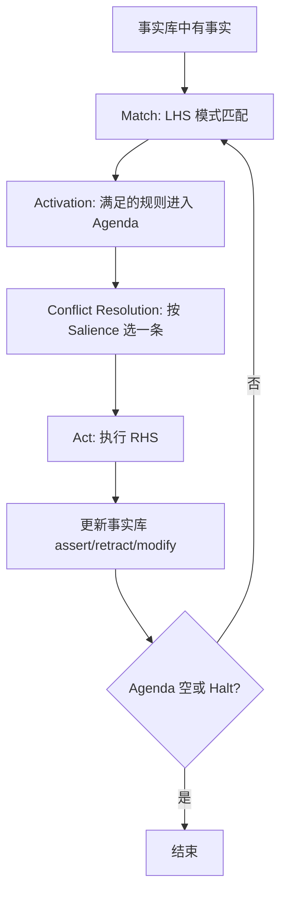
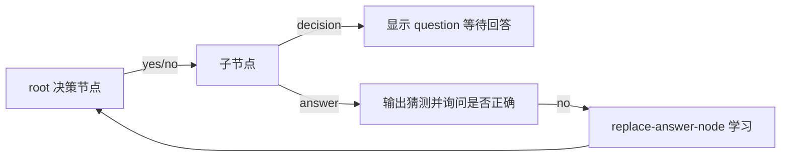

# 课件 03 — CLIPS 产生式系统 学习指南

> **课件**：`03CLIPS.pdf`｜NotebookLM `课件03-CLIPS`  
> **原则**：按课件原序、按知识点分块、**课件板块无遗漏**  
> **课堂**：Week 15 深入；Week 14 Prolog 作反向推理对比  
> **期末**：开卷英文试卷；**猜动物示例程序为考核内容**  
> **术语**：**中文（English）**

---

## 课件内容覆盖索引

| 课件原序 | 课件板块 | Slide | 本指南 |
|----------|----------|-------|--------|
| 1 | CLIPS 简介与基础概念 | 7–8 | Part A · 块 A.1–A.4 |
| 2 | 事实与模板 Facts & deftemplate | 8–15 | Part B · 块 B.1–B.3 |
| 3 | 规则与运行 Rule & run | 16–17 | Part C · 块 C.1–C.2 |
| 4 | 构造操作与辅助函数 | 17–18 | Part C · 块 C.3–C.4 |
| 5 | 变量与模式匹配基础 | 18–20 | Part C · 块 C.5–C.6 |
| 6 | 高级字段约束 | 21–26 | Part C · 块 C.7–C.10 |
| 7 | 案例分析：猜动物决策树 | 27–32 | Part D · 块 D.1–D.3 |
| 8 | 控制模式与模块化 | 33–37 | Part E · 块 E.1–E.3 |
| 9 | 推理引擎原理与 Rete 效率 | 38–48 | Part E · 块 E.4–E.6 |

---

## 0. 本课件在课程中的位置

```
课件01 逻辑/产生式概述 → … → 课件07 Prolog（反向推理）
                                    ↓ 对比
                              课件03 CLIPS（前向推理）← 本文件
```

| 维度 | 说明 |
|------|------|
| 与 Week 指南 | `AI-Week15-学习指南.md` 按课堂叙事；本文件**严格按课件 slide 顺序** |
| 与课件 01 | 课件 01 仅架构图；本课件给出 **CLIPS 可执行语法** |
| 开卷策略 | 书签 **Slide 13**（槽属性）、**Slide 26**（高级模式）、**Slide 31–32**（猜动物） |

（来源：课件03 structure-map、Week 15 记录）

---

## Part A — CLIPS 简介与产生式系统架构（Slide 7–8, 38+）

> **本节叙事线**：CLIPS 是什么 → 三组件分工 → 识别-动作周期 → Agenda 如何排队执行。

> **本节要回答**：前向推理系统由哪三部分组成？一轮推理循环怎么走？

### 块 A.1 CLIPS 背景与定位

**课件要点**：NASA 开发、C Language Integrated Production System；专家系统可执行环境。

- **历史**：1980 年代为航天任务规则推理而设计，后成为教学与工业常用产生式语言。
- **角色**：把课件 01 的「专家系统架构图」落实为可 `run` 的程序。
- **与 Prolog 对比**：CLIPS **前向、数据驱动**；Prolog **反向、目标驱动**（课件 07）。

（来源：课件03 Slide 7、Week 15）

### 块 A.2 符号表示法与原始数据类型

**课件要点**：Lisp 风格前缀表达式；SYMBOL、STRING、INTEGER、FLOAT、FACT-ADDRESS 等。

| 类型 | 示例 | 说明 |
|------|------|------|
| SYMBOL | `red`, `yes` | 无引号标识符 |
| STRING | `"hello"` | 双引号字符串 |
| INTEGER / FLOAT | `42`, `3.14` | 数值 |
| FACT-ADDRESS | `?f` 绑定后 | 指向事实库中某条事实的句柄 |

> **直观理解**：CLIPS 把「世界状态」编码成带类型的符号与数字，规则在这些值上做模式匹配。

（来源：课件03 Slide 7–8）

### 块 A.3 产生式系统三组件

| 组件 | 英文 | 职责 |
|------|------|------|
| 事实库 | Working Memory / Fact List | 存当前世界状态；`deftemplate` 结构化事实 |
| 知识库 | Knowledge Base / Rules | 存 IF-THEN 规则；LHS 条件 + RHS 动作 |
| 推理引擎 | Inference Engine | 驱动匹配与执行；内置 Agenda |

（来源：课件03、Week 15）

### 块 A.4 识别-动作周期与 Agenda



- **Agenda（议程）**：待执行规则实例（Activation）的排队列表。
- **Salience（显著性）**：$[-10000, 10000]$，默认 0；**数值越大越先执行**。
- **动态性**：新事实激活新规则；`retract` 使前提失效的激活项被清除。

> **直观理解**：前向推理是「因寻果」——手上有证据，看哪条规则能点火，点火后产生新证据，直到推不出新结论。

（来源：课件03 Slide 38、Week 15）

---

## Part B — 事实与 deftemplate（Slide 8–15）⭐期末核心

> **承接 Part A**：架构里「工作内存」在 CLIPS 中如何声明与操作？

> **本节要回答**：如何声明事实模板？五种槽约束怎么用？

### 块 B.1 deftemplate 语法

```clips
(deftemplate person
  (slot name)           ; 单字段槽：恰好一个值
  (multislot tags))     ; 多字段槽：零个或多个值
```

- **有序事实 vs 模板事实**：模板事实结构固定，便于模式匹配与约束检查。
- **槽 Slot / 多字段槽 Multislot**：单值 vs 可变长列表。

（来源：课件03 Slide 8–10）

### 块 B.2 五种槽属性（对齐 Slide 13）

| 属性 | 作用 | 示例 |
|------|------|------|
| **type** | 限定类型 SYMBOL/INTEGER/FLOAT… | `(slot age (type INTEGER))` |
| **allowed-values** | 枚举允许取值 | `(slot sex (allowed-values male female))` |
| **range** | 数值上下界 | `(slot score (range 0 100))` |
| **cardinality** | 仅 **multislot**：元素个数 | `(multislot hobby (cardinality 1 3))` |
| **default** | 未赋值时的默认 | `(slot color (default white))` |

> **追问**：期末开卷若考「补全 deftemplate」，优先查 **Slide 13 总结表**。

（来源：课件03 Slide 13）

### 块 B.3 事实操作对比

| 命令 | 作用 | 注意 |
|------|------|------|
| `assert` | 新增事实 | 原事实保留 |
| `retract` | 按事实索引删除 | 需索引号或事实地址 `?f` |
| `modify` | 改已有事实的槽 | 本质是 retract + assert，**索引会变** |
| `deffacts` | 定义初始事实组 | `(reset)` 时自动 assert |

（来源：课件03 Slide 15、Week 15）

---

## Part C — 规则、构造操作与模式匹配（Slide 16–26）⭐期末核心

> **本节叙事线**：写规则 → 运行环境 → 构造管理 → 变量绑定 → 高级约束。

### 块 C.1 defrule 结构

```clips
(defrule rule-name
  ; LHS — 条件（模式）
  (pattern1)
  (pattern2)
  =>
  ; RHS — 动作
  (action1)
  (action2))
```

（来源：课件03 Slide 16）

### 块 C.2 运行控制：run / reset / halt

| 命令 | 作用 |
|------|------|
| `(reset)` | 清空事实库，重新 assert `deffacts` 中的初始事实 |
| `(run)` | 启动推理循环，直至 Agenda 空或 `halt` |
| `(halt)` | RHS 中终止 `run` |
| `(break)` | 调试断点 |

> **直观理解**：`reset` 回到「游戏开局」；`run` 让引擎自动 Match→Act 直到无事可做。

（来源：课件03 Slide 16–17）

### 块 C.3 构造操作与 list- 管理命令（Slide 17）

**课件要点**：显示/打印/删除各类「构造」（construct）；开卷备查。

| 类别 | 常用命令 | 作用 |
|------|----------|------|
| 列出 | `list-deftemplate`, `list-defrule`, `list-deffacts`, `list-defmodule` | 查看已定义模板/规则/初始事实/模块 |
| 删除构造 | `undeffacts`, `undefrule`, `undeftemplate` | 从知识库移除对应定义 |
| 显示 | `(facts)`, `(rules)`, `(agenda)` | 打印当前事实库、规则、议程 |
| 输出 | `(printout t "msg" crlf)` | RHS 中向终端打印；`t` 为标准输出 |
| 文件 | `load`, `save`, `load-facts`, `save-facts` | 加载/保存规则或事实文件 |

```clips
; 示例：RHS 中打印并断言新事实
(printout t "Fire rule!" crlf)
(assert (status active))
```

> **追问**：`undeftemplate` 会连带删除基于该模板的事实吗？——会清除相关事实，开卷时注意与单纯 `retract` 区分。

（来源：课件03 Slide 17、structure 梳理）

### 块 C.4 数学函数与前缀表达式（Slide 18）

**课件要点**：CLIPS 数学运算为 **Lisp 风格前缀式**；可用于 RHS 与 `test` 谓词。

| 运算 | 写法 | 例 |
|------|------|-----|
| 四则 | `+`, `-`, `*`, `/` | `(+ 3 (* 4 5))` → 23 |
| 比较 | `=`, `<>`, `<`, `>`, `<=`, `>=` | `(> ?age 18)` |
| 其他 | `mod`, `div`, `sqrt`, `exp`, `log`, `abs` | `(mod 10 3)` → 1 |

```clips
; RHS 中计算并 assert
(bind ?total (+ ?a ?b))
(assert (sum (value ?total)))

; LHS 中 test 数值判断
(person (age ?a))
(test (>= ?a 65))
```

> **直观理解**：运算符写在最前，参数跟在后面——与 infix 的 `3+4*5` 等价于 `(+ 3 (* 4 5))`。

（来源：课件03 Slide 18、structure 梳理）

### 块 C.5 变量与绑定

| 写法 | 含义 |
|------|------|
| `?x` | 单字段变量，绑定一个值 |
| `$?xs` | 多字段通配，零个或多个 |
| `?f <- (fact ...)` | 事实地址绑定，供 `retract ?f` 使用 |

> **读代码机制**：`?f <-` 绑定的是整条事实的地址，不是某个槽值；只有拿到事实地址，RHS 才能安全地 `retract` 或 `modify` 那条旧事实。

（来源：课件03 Slide 18–20）

### 块 C.6 字段约束符

| 符 | 含义 | 例 |
|----|------|-----|
| `~` | 非 | `hair ~black` |
| `\|` | 或 | `eyes blue \| green` |
| `&` | 与/组合 | `?e&blue\|green` |
| `:` 嵌入谓词 | 模式内直接判断 | `?age&:(> ?age 18)` |

**Slide 22 经典题**：找两个人——第一人蓝/绿眼且非黑发；第二人眼色不同且发色为黑或与第一人相同。

> **格式提醒**：表格中 `|` 写成 `\|` 是 Markdown 转义；CLIPS 代码里看作普通的或约束符 `|`。真实模式通常把变量和约束贴紧写，如 `?eyes&blue|green`。

（来源：课件03 Slide 22、Week 15）

### 块 C.7 逻辑条件元素

| 元素 | 触发条件 | 典型场景 |
|------|----------|----------|
| `and` | 默认，全部满足 | 多模式组合 |
| `or` | 任一满足 | 火灾 **或** 报警 |
| `not` | 不存在某模式 | 今天**没有**人生日 |
| `exists` | 至少一个存在 | **只响一次**警报 |
| `forall` | 第一个模式匹配的**全部**满足后续 | 所有火灾点均已疏散 |

> **直观理解**：`exists` 有 100 条紧急事实也只激活一次；`forall` 漏一个就不 fire。

（来源：课件03 Slide 23–25、Week 15）

### 块 C.8 test 谓词

当需要数值比较或调用函数时在 LHS 插入；`test` 返回非 `FALSE` 才算该条件满足。

```clips
(person (age ?a))
(test (> ?a 18))
```

（来源：课件03 Slide 21–26）

### 块 C.9 Slide 26 高级模式汇总

开卷核心页：单字段 `?`、多字段 `$?`、`~` / `|` / `&` 组合、事实地址 `<-`、`test` 与 `:` 谓词约束的对照表。

> **期末策略**：复杂模式匹配题多出自本页；建议书签旁留白记录常用组合。

（来源：课件03 Slide 26、深采 `ppt03-study-order`）

### 块 C.10 复杂双人匹配逐步解读（Slide 22）

1. 用两个不同变量 `?p1`, `?p2` 匹配两条 `person` 事实。  
2. 第一人：`eyes` 用 `blue|green`，并绑定到 `?eyes1`；`hair` 用 `~black`，并绑定到 `?hair1`。  
3. 第二人：`name` 需 `~?name1`，确保不是同一个人；`eyes` 需 `~?eyes1`，确保眼色不同。  
4. 第二人 `hair` 为 `black|?hair1`：要么黑发，要么与第一人发色相同。  
5. 若不用字段约束，也可用 `test` 写成 `(test (<> ?eyes1 ?eyes2))` 比较两变量。

（来源：课件03 Slide 22、Week 15）

---

## Part D — 猜动物决策树（Slide 27–32）⭐必考

> **本节要回答**：交互式决策树如何用 CLIPS 实现？猜错后如何「学习」？

### 块 D.1 节点模板

```clips
(deftemplate node
  (slot name)
  (slot type)       ; decision 或 answer
  (slot question)   ; 决策节点的问题
  (slot yes-node)   ; 回答 yes 跳转
  (slot no-node)    ; 回答 no 跳转
  (slot answer))    ; 答案节点的动物名
```

（来源：课件03 Slide 27–28）

### 块 D.2 交互流程



1. `current-node` 事实标记当前节点  
2. 决策节点 → 显示问题，读入 `yes`/`no`  
3. `proceed-to-yes/no-branch`：`retract` 旧标记，`assert` 新 `current-node`  
4. 答案节点 → 猜动物；用户说 no → 进入学习  

**这个例子要解释的问题**：CLIPS 并不是直接「调用树遍历函数」，而是每次用户输入都变成事实；事实改变后，下一条规则被匹配、激活并执行。

（来源：课件03 Slide 29–31、Week 15）

### 块 D.3 学习能力：replace-answer-node

猜错时四步：

1. **read/bind**：问正确动物名 `?new-animal`、区分性问题 `?question`  
2. **gensym\***：生成两个不冲突的新节点名  
3. **modify**：把原答案节点改成决策节点，填入问题与 yes/no 分支  
4. **assert**：两个新答案叶子（正确动物 + 原错误动物）  

**追踪示例**（用户刚输入 `(answer yes)`，当前 `(current-node node1)`，`node1.yes-node = node3`）：

1. **Match**：`current-node`、当前 `node`、用户回答 `(answer yes)` 三条 LHS 模式均满足。  
2. **Agenda**：`proceed-to-yes-branch` 规则激活入队；若还有其他激活项，再做冲突消解。  
3. **Conflict Resolution**：按 salience 等策略选中要 fire 的规则。  
4. **Act**：`(retract ?node ?answer)` 删除旧当前节点标记和用户回答；`(assert (current-node node3))` 写入新位置。  
5. **循环**：事实库变化后，围绕 `node3` 重新匹配下一轮规则。  

> **期末追踪题**：给定事实库状态，写出 `proceed-to-yes-branch` 从 Match → Agenda → Act 的步骤。

（来源：课件03 Slide 31–32、Week 15、深采 `ppt03-partD-animal`）

---

## Part E — 控制、模块化与 Rete 效率（Slide 33–48）

> **本节要回答**：如何控制规则优先级与分阶段执行？Rete 为何影响写法？

### 块 E.1 Salience 与控制事实

- **Salience**：数值越大越先执行；勿与「规则书写顺序」混淆。  
- **控制事实**：用特殊事实（如 `(phase detect)`）在 LHS 限制规则仅在特定阶段 fire。  

（来源：课件03 Slide 33–35）

### 块 E.2 defmodule 与 focus

- **defmodule**：分阶段规则集（检测 / 隔离 / 恢复）。  
- **import / export**：模块间共享或隐藏构造。  
- **focus**：切换当前活动模块，仅该模块规则参与匹配。  

```clips
(defmodule DETECTION)
(defmodule RECOVERY (import DETECTION))
(focus DETECTION)
```

（来源：课件03 Slide 33–37）

### 块 E.3 过程性函数 if / while

RHS 中可用过程性控制（非逻辑条件元素）：

```clips
(if (> ?x 0) then
   (assert (positive))
   else
   (assert (non-positive)))
```

> **了解级**：期末较少单独考；与 LHS 的 `and/or/not` 区分——后者参与模式匹配，前者在 Act 阶段执行。

（来源：课件03 Slide 37）

### 块 E.4 识别-动作周期与模式网络（Slide 38–39）

- **Pattern Network（模式网络）**：把单个模式编译成可复用检查节点，共享前提，避免重复匹配。  
- **Join Network（连接网络）**：把多个模式的部分匹配结果组合起来，形成完整规则匹配。  
- **Rete 核心思想**：缓存部分匹配结果，事实增量更新时只传播受影响路径。

> **图多需补**：Slide 38–39 仅简图；理解「规则共享 LHS 前缀可减少重复工作」即可应对概念题。

（来源：课件03 Slide 38–39）

### 块 E.5 模式顺序与部分匹配（Slide 40–43）

课件用 `f-1`, `f-2`… 索引演示：模式顺序不同，中间激活的 Join 节点数量不同。

- 先匹配**更具体、约束更多**的模式，可尽早筛掉不可能组合。  
- 后匹配**泛化、易变**的事实模式。

（来源：课件03 Slide 40–43）

### 块 E.6 规则编写效率准则（Slide 44–45）

| 准则 | 说明 |
|------|------|
| 最具体模式在前 | 减少 Join 中间结果 |
| 易变事实的模式在后 | 降低重复触发 |
| `test` 尽量靠上 | 昂贵判断尽早过滤 |
| 避免过多动态 `assert` | 事实爆炸拖慢 Match |

> **直观理解**：先筛掉大量不可能的组合，再跑昂贵 `test`，否则每加一条事实都要全盘重算。

（来源：课件03 Slide 39–45、深采 `ppt03-partE-rete`）

---

## 易混概念对比

| 概念组 | 易混原因 | 正确区分 |
|--------|----------|----------|
| CLIPS vs Prolog | 同属符号主义 | **前向**数据驱动 vs **反向**目标驱动 |
| assert vs modify | 都改事实库 | assert 新增；modify 改已有（索引变） |
| exists vs forall | 都涉「全体」 | exists 有一个即可且只激活一次；forall 要全部满足 |
| `?` vs `$?` | 都是变量 | 单字段 vs 多字段（可空） |
| 事实库 vs Agenda | 都在引擎内 | 静态数据 vs 待执行规则队列 |
| list- 命令 vs retract | 都「删」 | 前者删**构造定义**；后者删**事实实例** |

（来源：课件03、Week 14–15、深采 `ppt03-mistakes`）

---

## 与周次指南对照（纠偏）

| 原 Week 梳理说法 | PPT 梳理结论 |
|------------------|-------------|
| Week 15 = CLIPS 全部考点 | 课件 33–48（Rete/效率）课堂展开较少，以概念为主 |
| 决策树 = 课件 04 | Week 15 决策树是 **CLIPS 猜动物实现**，不是 ID3 算法 |
| 产生式系统在 Week 1 讲完 | Week 1 仅概述；**架构 + Agenda 在 Week 15 才与 CLIPS 语法贯通** |

---

## 复习优先级

| 优先级 | 内容 | 书签 Slide |
|--------|------|------------|
| **极高** | deftemplate 五属性 | 13 |
| **极高** | 高级模式 `?` `$?` `&\|~` | 26 |
| **极高** | 猜动物与学习规则 | 31–32 |
| **高** | exists/forall、复杂双人匹配 | 23–25, 22 |
| **高** | 规则效率准则 | 39–44 |
| **中** | defmodule、Salience | 33–37 |
| **备查** | 数学函数、list- 管理命令 | 17–18 |

---

## 术语表

| English | 中文 |
|---------|------|
| Production System | 产生式系统 |
| Inference Engine | 推理引擎 |
| Agenda | 议程 |
| Recognize-act cycle | 识别-动作周期 |
| Slot / Multislot | 槽 / 多字段槽 |
| Salience | 显著性 |
| Wildcard | 通配符 |
| Field Constraint | 字段约束 |

---

**raw**：`notebooklm-raw/ppt03/runs/20260619-162141/`｜**结构**：`notebooklm-raw/ppt/runs/20260619-161000/ppt03-structure.answer.md`
