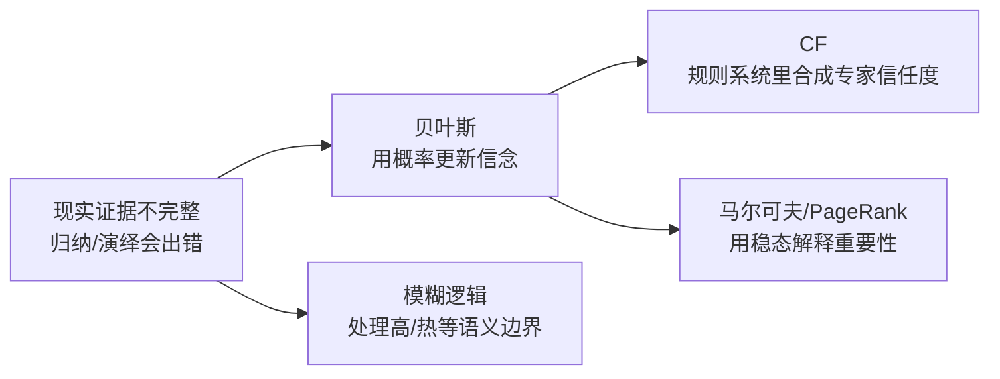
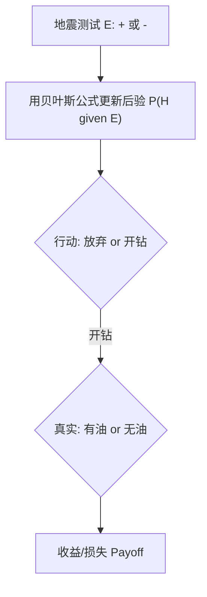

# 课件 05 — Uncertainty 不确定性推理 学习指南

> **课件**：`05Uncertainty.pdf`｜NotebookLM `课件05-Uncertainty`  
> **原则**：按课件原序、按知识点分块、**课件板块无遗漏**  
> **课堂**：Week 5 部分引入；**Week 13 深入**（CF **必考**）  
> **术语**：**中文（English）**

> **期末定位先看这句**：本课件的主线是「不确定时怎么推理」。**CF 确定性因子是计算必考**；贝叶斯框架要能讲清先验、似然、后验与决策；PageRank 和模糊逻辑主要按概念/选择题层级掌握。

> **监修标准**：通用课件学习指南监修标准见 `guides/课件学习指南监修标准.md`。

---

## 课件内容覆盖索引

| 课件原序 | 课件板块 | Slide | 本指南 |
|----------|----------|-------|--------|
| 1 | 不确定性定义与错误类型 | 1 | Part A · 块 A.1 |
| 2 | 归纳与演绎中的错误 | 2–3 | Part A · 块 A.2 |
| 3 | 不确定性逻辑问题 | 4 | Part A · 块 A.3 |
| 4 | 经典概率与假设检验及其缺陷 | 4–6 | Part A · 块 A.4 |
| 5 | 贝叶斯定理与贝叶斯决策 | 6–11 | Part B · 块 B.1–B.3 |
| 6 | 确定性因子理论 CF | 12–18 | Part C · 块 C.0–C.6 |
| 7 | 模糊集合与模糊逻辑 | 19–23 | Part D · 块 D.1–D.3 |
| — | *课件少、课堂补充* | — | Part E · 块 E.1–E.2 |

---

## 0. 课件全景

按课件 05 原始顺序，本课件处理**知识不确定**的三条路径。可以把它理解成三种不同问题：

| Part | 期末优先级 | 你要掌握到什么程度 |
|------|------------|--------------------|
| A 背景 | 中 | 知道不确定性从哪里来，能区分随机/系统误差、归纳/演绎 |
| B 贝叶斯 | 高（概念） | 会解释先验、似然、后验，以及为什么还要看损失 |
| C **CF** | **极高（必考计算）** | 会按证据层、规则层、合成层完整手算 |
| D 模糊 | 中（概念/选择） | 会区分模糊真值与概率 |
| E 马尔可夫/PageRank | 中（概念/选择） | 会说出稳态分布和「重要网页链接更有价值」的直觉 |

> **学习顺序建议**：先读 A/B 建立「概率更新」背景，再把 C 当作考试核心反复练，最后用 D/E 做概念对照。

---

## Part A — 不确定性与误差类型（Slide 1–4）

> **本节要回答**：AI 为什么不能只靠「真/假」逻辑？经典概率又为什么不够方便？

### 块 A.1 不确定性定义

- **不确定性（Uncertainty）**：信息不完整、测量有噪声、专家判断含糊时，系统无法放心地给出 0/1 结论。
- **形式化**：缺乏充分信息，导致无法确定哪个行动最优的状态。

> **直观理解**：医生诊断不是「化验单 = 病名」的查表题。医生要同时考虑：这个病本来多常见、检查阳性有多可靠、误诊和漏诊各有什么代价。

（来源：课件05 Slide 1、Week 13）

### 块 A.2 随机误差与系统误差；归纳与演绎

| 概念 | 大白话 | 形式化 |
|------|--------|--------|
| **随机误差 Random error** | 手抖、偶然波动 | 统计波动导致测量值散布 |
| **系统误差 Systematic error** | 尺子刻度歪了 | 测量系统缺陷导致的定向偏差 |
| **演绎 Deduction** | 从规则推出结论 | 前提与推理规则都真时，结论必真；前提错则结论错 |
| **归纳 Induction** | 从样本总结规律 | 依赖**置信度**，样本不足时可能以偏概全 |

（来源：课件05 Slide 2–3、Week 13）

### 块 A.3 不确定性逻辑问题（Slide 4）

**课件要点**：下面两个例子不是要背故事，而是提醒你：只靠「真/假」逻辑，有时既不能选行动，也不能稳定合成证据。现实推理经常需要额外偏好、证据权重或启发式规则。

- **Buridan's ass（布里丹之驴）**：故事里，一头驴站在两堆完全等距、同样诱人的干草之间；如果它只按「哪堆更好」这个理性规则行动，而两边信息完全对称，就没有任何规则能让它选左或选右。放到不确定性推理里，它说明：**概率或逻辑结论相同并不自动给出行动**，系统还需要额外偏好、随机打破平局、成本差异或损失函数，才能从「一样可能」走到「选哪个」。
- **Defeat cycle（击败循环）**：它描述的是一组证据/规则彼此击败的循环，例如 A 支持 B、B 支持 C、C 又反过来削弱 A。问题不在某一条规则错了，而在**局部看都合理，合在一起却可能来回抵消、无法稳定排序或收敛**。这正是专家系统要引入 CF 合成、优先级、冲突消解等机制的原因：多条不确定规则不能只按普通逻辑链条一路推下去，必须规定「互相支持/反对时怎么合并」。

> **为什么它们重要**：这两个例子都在说明「不确定」不是单纯缺少一个数字。Buridan's ass 强调**决策层**需要偏好/损失；Defeat cycle 强调**推理层**需要合成规则。后面的贝叶斯决策和 CF，正是在补这两类缺口。

（来源：课件05 Slide 4、structure 梳理）

### 块 A.4 经典概率与假设检验的缺陷

| 局限 | 说明 |
|------|------|
| 忽视先验经验 | 只看当前证据时，容易漏掉「这个假设本来多常见」。例如同样是检测阳性，罕见病和常见病的后验判断不应一样；这个「本来多常见」就是先验，不必写成黑话 |
| 未关联决策行动 | 概率高不等于应采取行动（需损失函数） |
| 多证据概率表太大 | 若有 $n$ 个证据 $E_1,\ldots,E_n$，严格贝叶斯往往要估计各种证据组合下的 $P(E_1,\ldots,E_n \mid H)$ 或 $P(H \mid E_1,\ldots,E_n)$；证据一多，组合表项随组合数快速增长，专家很难逐项给出可靠概率 |
| 假设检验僵化 | 硬阈值 0/1 决策无法表达「有点相信」 |

> **承接**：贝叶斯框架（Part B）把「先验经验」正式写进概率更新；CF（Part C）则用更接近专家口头判断的方式处理规则信任度。

（来源：课件05 Slide 4–6、Week 13）

---

## Part B — 贝叶斯决策（Slide 6–11）

> **本节要回答**：看到新证据后，怎样更新假设概率？概率更新完之后，又怎样变成行动选择？

### 块 B.1 贝叶斯公式

$$P(H_i \mid E) = \frac{P(E \mid H_i)\, P(H_i)}{P(E)}$$

| 符号 | 名称 | 含义 |
|------|------|------|
| $P(H_i)$ | 先验 Prior | 见证据前的假设概率 |
| $P(E \mid H_i)$ | 似然 Likelihood | 假设成立时看到证据的概率 |
| $P(H_i \mid E)$ | 后验 Posterior | 见证据后更新的概率 |
| $P(E)$ | 证据概率 | 全概率公式归一化 |

> **公式怎么读**：后验 $\propto$ 似然 $\times$ 先验。$P(E)$ 的作用主要是归一化，让所有假设的后验概率加起来仍然是 1。

**石油勘探例子怎么用公式读**（课件）：

1. 假设 $H$ 是「这块地有油」，$\neg H$ 是「没有油」。
2. 先验 $P(H)$ 表示还没做地震测试前，对「有油」的初始判断；它可能来自地质经验或历史统计。
3. 地震测试结果 $E$ 可以是阳性 `+` 或阴性 `-`。$P(E \mid H)$ 表示「如果真有油，测试显示阳性的概率有多大」；$P(E \mid \neg H)$ 表示「如果没油，测试误报阳性的概率有多大」。
4. 看到测试结果后，用贝叶斯公式把先验更新成 $P(H \mid E)$。这一步只解决「现在多相信有油」，还没有解决「要不要开钻」。

> **要点**：课件用石油例子说明「证据会更新信念」。如果测试阳性但先验很低，后验未必就高到值得开钻；如果测试阴性但先验很高，也未必立刻放弃。贝叶斯的价值正是在先验和证据之间做加权更新。

（来源：课件05 Slide 6–7）

### 块 B.2 损失函数与 Bayes 风险

贝叶斯决策不只问「有多可能」，还要问「选错代价多大」。同样是 60% 的概率，如果错判代价不同，最优行动也可能完全不同：

- **损失函数** $l(\theta, a)$：真实状态 $\theta$ 下采取行动 $a$ 的代价。
- **Bayes 风险** $r(\pi, \delta)$：对先验 $\pi(\theta)$ 加权后的期望损失。
- **原则**：选使 Bayes 风险**最小**的行动。

**农夫例子**（课件）：

- 行动 $a_1$：种耐旱作物；课件给的损失函数是 $l(\theta,a_1)=200-2\theta$。
- 行动 $a_2$：种高产作物；课件给的损失函数是 $l(\theta,a_2)=3000-10\theta$。
- $\theta$ 表示降水量。降水少时，耐旱作物的损失较小；降水足够多时，高产作物收益更大、等价损失更小。

把两条损失式相等可得到粗略分界：

$$200-2\theta = 3000-10\theta \Rightarrow \theta = 350$$

这不是要你背「350」这个数，而是要看懂决策逻辑：若已经非常确定 $\theta>350$，高产作物更划算；若 $\theta<350$，耐旱作物更稳。若 $\theta$ 本身不确定，就不能只看单个降水值，而要用后验分布对不同 $\theta$ 下的损失加权，选择 Bayes 风险最小的行动。

（来源：课件05 Slide 8–9）

### 块 B.3 决策流程图（Slide 8）

1. **观察测试**：先得到地震测试结果 `+` 或 `-`，它改变 $P(H)$，得到 $P(H \mid +)$ 或 $P(H \mid -)$。
2. **选择行动**：行动不是自动由概率推出的，仍要在「放弃」和「开钻」之间比较。
3. **考虑真实状态**：如果开钻，真实世界可能是有油或无油；这两个分支要按后验概率加权。
4. **结算 payoff**：课件图里放弃是固定损失，开钻且有油是高收益，开钻且无油是较大损失。决策者要比较每个行动分支的期望收益/期望损失，而不是只问「有油概率是不是最大」。

> **重难点**：后验概率负责「更新信念」，损失函数负责「选行动」——二者缺一不可。

（来源：课件05 Slide 8、Week 13）

---

## Part C — 确定性因子 CF（Slide 12–18）⭐期末必考

> **本节要回答**：不用精确概率时，规则系统如何量化「有多相信」？

> **考试提醒**：CF 不是「背概念」结束，而是要会算。看到 IF-THEN 规则题，先分清证据可信度 $CF(E,e)$、规则强度 $CF(H,E)$、结论强度 $CF(H,e)$，再进入多规则合成。**大写 $E$ 是某条证据命题，小写 $e$ 是当前已经观测到的事实集合**，这两个符号不能混。

### 块 C.0 先认符号与规则长相

CF 题通常长这样：

$$\text{IF } E_1 \text{ AND } E_2 \text{ THEN } H \quad (CF(H,E)=0.8)$$

这句话包含三件事：前提证据是否可信、规则本身有多强、最后结论 $H$ 被支持到什么程度。

| 符号 | 中文含义 | 考试中怎么读 |
|------|----------|--------------|
| $H$ | 假设 / 结论（Hypothesis） | 要判断的命题，例如「患者有某病」 |
| $E$ | 证据命题（Evidence） | 规则前提中的某个条件，例如「高烧」 |
| $e$ | 当前观测事实集合 | 眼前病人的全部已知事实，例如体温、化验、症状 |
| $CF(E,e)$ | 证据可信度 | 在观测 $e$ 下，证据 $E$ 有多可信 |
| $CF(H,E)$ | 规则强度 | 如果 $E$ 完全成立，专家认为它支持 $H$ 的强度 |
| $CF(H,e)$ | 单条规则推出的结论强度 | 把当前事实 $e$ 代入规则后，得到对 $H$ 的支持/反对程度 |
| $CF_{\text{comb}}$ | 多规则合成结果 | 多条规则都指向 $H$ 时的最终 CF |

（来源：课件05 Slide 12–18、`ppt05-partC-cf-theory`、Week 13）

### 块 C.1 为何引入 CF（MYCIN 动机）

| 经典概率的问题 | CF 的应对 |
|----------------|-----------|
| 专家不愿给精确后验概率 | 只问「证据对假设的支持强度」 |
| 先验很高时无关证据也显「支持」 | MB/MD 度量**增量** |
| 多证据条件概率难以完整列出 | 用 AND/OR/NOT 和多规则合成公式近似处理，不要求专家填完整概率表 |

> **直观理解**：医生常说「这个症状比较支持流感」「这个检查结果有点反对肺炎」，但很难给出完整的 $P(H \mid E_1,E_2,\ldots)$。如果有发烧、咳嗽、白细胞、影像结果等多项证据，严格概率模型不仅要知道每个证据单独出现的概率，还要知道它们在不同疾病假设下**一起出现**的概率；证据越多，组合越多，表就越难填。CF 把这种专家语言变成 $[-1,1]$ 的数值规则，再用启发式公式合成。

（来源：课件05 Slide 12–14、Week 13）

### 块 C.2 MB、MD 与 CF

- **MB（Measure of Belief）**：证据 $E$ 增加对 $H$ 为真的信任。
- **MD（Measure of Disbelief）**：证据 $E$ 增加对 $H$ 为假的信任。
- **CF（Certainty Factor）**：$CF(H,E) = MB(H,E) - MD(H,E)$，取值 $[-1, 1]$。

| CF 值 | 含义 |
|-------|------|
| $+1$ | 证据完全支持 $H$ |
| $0$ | 对 $H$ 既不支持也不反对 |
| $-1$ | 证据完全反对 $H$ |

> **常见误解**：$CF=0$ 不是「假」，而是「当前证据没有净支持」。这点和概率里的 $P(H)=0$ 完全不同。

（来源：课件05 Slide 15–16）

### 块 C.3 前提里的 AND / OR / NOT 怎么算

AND、OR、NOT 不是额外主题，而是**规则前提里的逻辑组合**。例如：

- `IF E1 AND E2 THEN H`：两个证据都要成立。
- `IF E1 OR E2 THEN H`：任一证据成立即可。
- `IF NOT E THEN H`：证据 $E$ 越不可信，$\neg E$ 越可信。

| 前提形式 | CF 公式 | 直觉 |
|----------|---------|------|
| $E_1 \land E_2 \land \cdots$ | $CF(E_1 \land E_2 \land \cdots,e)=\min[CF(E_1,e),CF(E_2,e),\ldots]$ | AND 取最弱一环 |
| $E_1 \lor E_2 \lor \cdots$ | $CF(E_1 \lor E_2 \lor \cdots,e)=\max[CF(E_1,e),CF(E_2,e),\ldots]$ | OR 取最强支持 |
| $\neg E$ | $CF(\neg E,e)=-CF(E,e)$ | 否定把支持方向翻转 |

> **容易错**：AND 在 CF 里不是相乘，OR 也不是相加。这里用的是 MYCIN 风格的启发式合成，不是概率独立事件公式。

（来源：课件05 Slide 17、`ppt05-partC-cf-theory`、Week 13）

### 块 C.4 三层计算框架：先分层，再代公式

**第一层：证据层（Evidence layer）**

这一层只处理 IF 后面的前提。若前提是单个 $E$，直接使用题目给出的 $CF(E,e)$；若前提是 $E_1$ AND $E_2$、$E_1$ OR $E_2$ 或 NOT $E$，先按 C.3 的 min / max / 负号算出整条前提的 $CF(E_{\text{rule}},e)$。

**第二层：规则层（Rule layer）**

这一层把「前提实际有多可信」乘上「专家规则本身有多强」：

$$CF(H,e) = CF(E,e) \times CF(H,E)$$

若前提是组合证据，公式里的 $CF(E,e)$ 指的是组合后的前提可信度。若 $CF(E,e)<0$，课程材料中通常按「该规则不触发」处理；考试题若明确要求负证据继续计算，则按题目说明。

**第三层：合成层（Synthesis layer）**

多条规则都推出同一个 $H$ 时，先把每条规则得到的结果记为 $CF_1, CF_2,\ldots$，再两两合成。

（来源：课件05 Slide 17–18、`ppt05-partC-cf-theory`、Week 13）

### 块 C.5 多条规则合成公式表

$$CF_{\text{comb}}(CF_1, CF_2) =
\begin{cases}
CF_1 + CF_2(1 - CF_1) & \text{两者均为正} \\
\dfrac{CF_1 + CF_2}{1 - \min(\lvert CF_1\rvert, \lvert CF_2\rvert)} & \text{异号} \\
CF_1 + CF_2(1 + CF_1) & \text{两者均为负}
\end{cases}$$

| 情况 | 何时用 | 公式 | 直觉 |
|------|--------|------|------|
| 同正 | $CF_1>0, CF_2>0$ | $CF_{\text{comb}}=CF_1+CF_2(1-CF_1)$ | 两条规则都支持 $H$，但越接近 1 增长越慢 |
| 同负 | $CF_1<0, CF_2<0$ | $CF_{\text{comb}}=CF_1+CF_2(1+CF_1)$ | 两条规则都反对 $H$，向 -1 累积 |
| 异号 | 一正一负 | $CF_{\text{comb}}=\dfrac{CF_1+CF_2}{1-\min(\lvert CF_1\rvert,\lvert CF_2\rvert)}$ | 支持与反对互相抵消，分母做归一化 |

合成满足交换律：$CF_{\text{comb}}(X,Y)=CF_{\text{comb}}(Y,X)$。多于两条规则时，两两合成即可；考试书写时建议先把每条规则的 $CF_i$ 算清楚，再选择同正、同负或异号公式。

（来源：课件05 Slide 18–19、深采 `ppt05-partC-cf-theory`）

### 块 C.6 手算模板与例题 ⭐

**考试 checklist**：

1. 圈出每条规则的前提：单证据、AND、OR 还是 NOT。
2. 先算证据层：得到每条规则自己的 $CF(E_{\text{rule}},e)$。
3. 再算规则层：$CF_i=CF(E_{\text{rule}},e)\times CF(H,E_{\text{rule}})$。
4. 最后算合成层：判断 $CF_i$ 是同正、同负还是异号。
5. 多条规则时两两合成，并写清每一步使用的公式名称。

**已知**：
- $r_1$: IF $E_1$ AND $E_2$ THEN $H$，$CF(H,E_{r1})=0.8$
- $r_2$: IF $E_3$ THEN $H$，$CF(H,E_{r2})=0.6$
- $CF(E_1,e)=0.5$, $CF(E_2,e)=0.9$, $CF(E_3,e)=0.4$

**Step 1** 证据合成：$CF(E_{r1},e)=\min(0.5,0.9)=0.5$

**Step 2** 规则1：$CF_1=0.5\times 0.8=0.4$

**Step 3** 规则2：$CF_2=0.4\times 0.6=0.24$

**Step 4** 合成：两条规则都支持 $H$，用同正公式：

$$CF_{\text{comb}}=0.4+0.24\times(1-0.4)=0.544$$

> **追问**：为何 AND 用 min？——最弱证据拖累整条前提，与「链条最弱一环」直觉一致。

> **考试书写模板**：先写前提组合，再写 $CF_i=CF(E,e)\times CF(H,E)$，最后写明「同正/同负/异号」并代入合成公式。

（来源：深采 `ppt05-partC-cf-numeric`）

---

## Part D — 模糊逻辑（Slide 19–23）

> **本节要回答**：「高」「热」「有点冷」这种边界不清的词，怎样变成可计算的数值？

> **期末定位**：模糊逻辑通常按概念理解。重点不是复杂计算，而是能说清它处理的是**语义模糊**，不是事件随机性。

### 块 D.1 模糊集与隶属度

- **模糊集（Fuzzy set）**：传统集合常是硬切分，例如「身高超过某个阈值才算高」；模糊集允许边界平滑过渡，例如 6 英尺可以「有点算高」，6.5 英尺「更算高」。
- **隶属度函数** $\mu_A(x)\in[0,1]$：$x$ 属于模糊集 $A$ 的程度（**非概率**）。$\mu_A(x)=0$ 表示完全不适用，$\mu_A(x)=1$ 表示完全适用，中间值表示描述词贴切到什么程度。
- **TALL 例**：课件用身高说明「高」没有突然跳变的边界。5.5 英尺的隶属度约 0.125，6 英尺为 0.5，6.5 英尺为 0.875，7 英尺为 1.0。

| 身高 | $\mu_{\text{TALL}}(x)$ | 怎么读 |
|------|------------------------|--------|
| 5.5 ft | 0.125 | 基本不算高，但不是绝对 0 |
| 6 ft | 0.5 | 介于高和不高之间 |
| 6.5 ft | 0.875 | 很大程度上算高 |
| 7 ft | 1.0 | 完全符合「高」 |

**曲线文字版**：横轴身高、纵轴 $\mu$，S 型上升，无硬切分点。

> **直观理解**：概率问的是「这件事会不会发生」；隶属度问的是「这个描述有多贴切」。一个人身高 6 英尺不是以 0.5 的概率属于 TALL，而是「高」这个词对他的适用程度为 0.5。这个人的身高已经确定，模糊的是「高」这个词的边界。

（来源：课件05 Slide 19–20、Week 13）

### 块 D.2 语言算子 Hedges

语言算子（Hedges）是在已有模糊集上加修饰词。先有基础概念 $F$，例如「高」；再用平方、开方、取补表达「非常高」「大概高」「不高」。

| 算子 | 公式 | 效果 | 词汇 | 例子 |
|------|------|------|------|------|
| CON 集中 | $F^2$ | 标准更严 | very | 若 $\mu_{\text{TALL}}(6)=0.5$，则「very tall」为 $0.5^2=0.25$ |
| DIL 扩散 | $F^{0.5}$ | 标准更宽 | more or less | 若 $\mu_{\text{TALL}}(6)=0.5$，则「more or less tall」约为 $0.707$ |
| NOT | $1-F$ | 取补 | not | 若「高」为 0.5，则「不高」也是 0.5 |

> **怎么读 Hedges**：如果 $F$ 表示「高」的隶属度，那么 $F^2$ 表示「very 高」，要求更严格；$F^{0.5}$ 表示「more or less 高」，门槛更宽。

（来源：课件05 Slide 21）

### 块 D.3 模糊 vs 概率；模糊推理

| 维度 | 概率 | 模糊 |
|------|------|------|
| 不确定类型 | 随机性（事件是否发生） | 语义模糊（「高」无硬边界） |
| 数值含义 | 信任度 / 频率 | 真值程度 / 描述贴切程度 |
| 典型问题 | 「明天下雨的概率是多少？」 | 「今天算不算热？」 |
| 推理 | 贝叶斯、条件概率 | AND=min, OR=max, NOT=$1-F$ |

> **常见误解**：模糊逻辑不是「不严谨的概率」。它解决的是语言边界问题，例如「年轻」「热」「相似」，而概率解决的是事件发生与否的不确定性。

**模糊规则怎么用**：

- **AND 取 min**：若「温度热」为 0.8，「湿度高」为 0.6，则「热 AND 湿」取 $\min(0.8,0.6)=0.6$。直觉是两个条件同时成立时，整体不能强过最弱条件。
- **OR 取 max**：若「热」为 0.8，「闷」为 0.4，则「热 OR 闷」取 $\max(0.8,0.4)=0.8$。直觉是任一条件足够贴切即可。
- **NOT 取补**：若「热」为 0.8，则「不热」为 $1-0.8=0.2$。

> **与 CF 的区别**：模糊逻辑的 AND/OR 也用 min/max，但它处理的是语言真值；CF 的 AND/OR 处理的是规则前提证据的可信度。公式长得像，语义不要混。

（来源：课件05 Slide 21–23、Week 13）

---

## Part E — 马尔可夫链与 PageRank（课堂补充）

> **课件 05 对 PageRank 数学较少**；以 Week 13 笔记与本节为准。期末按概念掌握：知道马尔可夫链、稳态分布、PageRank 三者如何串起来即可。

### 块 E.1 离散马尔可夫链

- **马尔可夫性**：下一状态只依赖当前状态，与更早历史无关。白话说，就是「现在已经包含预测下一步所需的信息」。
- **状态向量** $v_t$：第 $t$ 步时，系统落在各状态上的概率分布。例如两类电脑品牌的市场份额，或用户在不同网页上的访问概率。
- **转移矩阵** $M$：记录从一个状态跳到另一个状态的概率。若采用列向量写法，常写作 $v_{t+1}=Mv_t$；若采用行向量写法，常写作 $S_{t+1}=S_tM$。考试看题目矩阵方向，核心都是「当前分布 × 跳转规则 = 下一步分布」。
- **稳态分布** $v^*$：反复更新后不再变化的分布，即 $v^*=Mv^*$（或行向量写法 $S^*=S^*M$）。在满足正则等条件时，最后结果主要由转移矩阵决定，而不是由初始状态决定。

> **直观理解**：把状态想成网页，把概率想成用户点击链接的可能性。一直点下去后，用户长期停留在哪些网页上的比例，就是稳态分布的直觉。

（来源：Week 13、深采 `ppt05-partE-markov`）

### 块 E.2 PageRank 直觉

- **链接投票**：网页之间的链接可以看成投票。被很多页面链接通常更重要；被本身很重要的页面链接，价值更高。所以 PageRank 不是简单数「入链个数」，还看「谁给你链接」。
- **随机游走**：想象一个用户在网页上随机点链接。每一步从当前网页跳到下一个网页，这正好形成马尔可夫链。
- **稳态排名**：长期随机游走后，用户更常停留的网页，在稳态分布里概率更大；这个概率就可作为网页的 Rank。
- **阻尼因子**：真实网页图可能有死胡同（没有外链）或小圈子（用户一直绕不出去）。阻尼因子表示用户多数时候沿链接走，但有一定概率随机跳到任意网页；这样可以避免排名被死胡同或孤立圈子卡住。

若写成常见形式：

$$v_{t+1} = dMv_t + (1-d)\frac{\mathbf{1}}{N}$$

| 符号 | 含义 |
|------|------|
| $v_t$ | 第 $t$ 轮每个网页的 PageRank 分布 |
| $M$ | 链接转移矩阵，描述沿链接跳转的概率 |
| $d$ | 阻尼因子，沿链接继续浏览的比例 |
| $(1-d)\frac{\mathbf{1}}{N}$ | 随机跳转到任意网页的补充项，避免死胡同 |

**课件确认过的马尔可夫小例**：市场只有 $C_1$（联想）与 $C_2$（苹果）两个状态，行向量写法下

$$M=\begin{bmatrix}0.1&0.9\\0.6&0.4\end{bmatrix},\quad S_1=[0.8,0.2]$$

前两步计算为：

$$S_2=S_1M=[0.2,0.8]$$

$$S_3=S_2M=[0.5,0.5]$$

继续迭代会收敛到 $[0.4,0.6]$。放到 PageRank 里理解，就是：不必只看初始访问量，而要看长期按链接跳转后的稳定占比。

> **优先级提醒**：PageRank 在 Week 13 里是概念点，不要抢走 CF 手算的复习时间。会解释「转移矩阵反复迭代到稳态」就抓住主干了。

（来源：Week 13、深采 `ppt05-partE-markov`）

---

## 易混概念对比

| 概念组 | 容易混在哪里 | 一句话区分 |
|--------|--------------|------------|
| 后验 vs CF | 都像是在表达「相信程度」 | 后验是概率更新结果；CF 是规则系统的启发式信任度 |
| MB vs MD | 都参与 CF | MB 是支持增量；MD 是反对增量 |
| 模糊 vs 概率 | 数值都在 $[0,1]$ | 模糊处理语义边界；概率处理事件随机 |
| 模糊 AND/OR vs CF AND/OR | 都用 min/max | 模糊在合成语言真值；CF 在合成规则前提证据可信度 |
| 贝叶斯 vs CF | 都处理不确定性 | 贝叶斯需要完整概率；CF 更专家友好、适合规则系统 |
| PageRank vs 普通投票 | 都像在数链接 | PageRank 看链接来源的重要性，并通过稳态分布迭代出来 |
| 随机误差 vs 系统误差 | 都会让观测不准 | 随机误差是偶然波动；系统误差是定向偏差 |

（来源：深采 `ppt05-mistakes`）

---

## 与周次指南对照

| 说法 | PPT 梳理结论 |
|------|-------------|
| Week 5 讲不确定性 | 主要为 HMM 序列；**CF 在课件 05、Week 13 才系统讲** |
| 马尔可夫链 / PageRank | 课件 05 少，**以 Week 13 笔记 + Part E 为准**；按概念掌握 |
| 模糊逻辑 | 课件有基本定义与算子；重点是区分「真值程度」与概率 |

---

## 复习优先级

| 优先级 | 内容 | 书签 Slide |
|--------|------|------------|
| **极高** | CF 三层计算 + 手算 | 17–19 |
| **高（概念）** | 贝叶斯公式与决策流：先验、似然、后验、损失 | 6–8 |
| **中（概念/选择）** | 模糊隶属度、Hedges、模糊 vs 概率 | 19–21 |
| **中（概念/选择）** | 马尔可夫链、PageRank 稳态、随机游走、阻尼因子直觉 | Week 13 补充 |
| **中** | 归纳/演绎、Buridan/Defeat | 1–4 |

---

## 术语表

| English | 中文 |
|---------|------|
| Uncertainty | 不确定性 |
| Induction / Deduction | 归纳 / 演绎 |
| Bayesian Decision Making | 贝叶斯决策 |
| Loss Function | 损失函数 |
| Certainty Factor (CF) | 确定性因子 |
| MB / MD | 信任增长 / 不信任增长 |
| Fuzzy Set / Membership Function | 模糊集 / 隶属度函数 |
| Fuzzy Logic | 模糊逻辑 |
| Linguistic Hedges | 语言算子 |
| Markov Chain | 马尔可夫链 |
| Steady-state Distribution | 稳态分布 |
| PageRank | 网页排名算法 |
| Damping Factor | 阻尼因子 |

---

**raw**：`notebooklm-raw/ppt05/runs/20260619-162816/`｜**结构**：`notebooklm-raw/ppt/runs/20260619-161000/ppt05-structure.answer.md`
