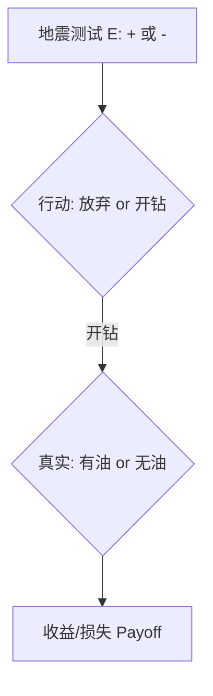

# 课件 05 — Uncertainty 不确定性推理 学习指南

> **课件**：`05Uncertainty.pdf`｜NotebookLM `课件05-Uncertainty`  
> **原则**：按课件原序、按知识点分块、**课件板块无遗漏**  
> **课堂**：Week 5 部分引入；**Week 13 深入**（CF **必考**）  
> **术语**：**中文（English）**

---

## 课件内容覆盖索引

| 课件原序 | 课件板块 | Slide | 本指南 |
|----------|----------|-------|--------|
| 1 | 不确定性定义与错误类型 | 1 | Part A · 块 A.1 |
| 2 | 归纳与演绎中的错误 | 2–3 | Part A · 块 A.2 |
| 3 | 不确定性逻辑问题 | 4 | Part A · 块 A.3 |
| 4 | 经典概率与假设检验及其缺陷 | 4–6 | Part A · 块 A.4 |
| 5 | 贝叶斯定理与贝叶斯决策 | 6–11 | Part B · 块 B.1–B.3 |
| 6 | 确定性因子理论 CF | 12–18 | Part C · 块 C.1–C.5 |
| 7 | 模糊集合与模糊逻辑 | 19–23 | Part D · 块 D.1–D.3 |
| — | *课件少、课堂补充* | — | Part E · 块 E.1–E.2 |

---

## 0. 课件全景

按课件 05 原始顺序，本课件处理**知识不确定**的三条路径：

```
归纳/演绎误差 → 贝叶斯决策 → 确定性因子 CF（规则系统）
                                    ↓
                              模糊逻辑（语义模糊）
```

| Part | 重要度 | 课堂 |
|------|--------|------|
| A 背景 | 中 | W13 |
| B 贝叶斯 | 高 | W13 |
| C **CF** | **必考** | W13 |
| D 模糊 | 中高 | W13 |
| E 马尔可夫/PageRank | 高 | W13 补充 |

---

## Part A — 不确定性与误差类型（Slide 1–4）

> **本节要回答**：AI 为何要专门研究不确定性？经典概率有何局限？

### 块 A.1 不确定性定义

- **不确定性（Uncertainty）**：信息不完整、测量有噪声、专家判断含糊时，无法给出 0/1 结论。
- **形式化**：缺乏充分信息导致无法做出最优决策的状态。

> **直观理解**：医生诊断不是「化验单 = 病名」的简单查表，而要综合先验患病率、检查准确率与治疗方案代价。

（来源：课件05 Slide 1、Week 13）

### 块 A.2 随机误差与系统误差；归纳与演绎

| 概念 | 大白话 | 形式化 |
|------|--------|--------|
| **随机误差 Random error** | 手抖、偶然波动 | 统计波动导致测量值散布 |
| **系统误差 Systematic error** | 尺子刻度歪了 | 测量系统缺陷导致的定向偏差 |
| **演绎 Deduction** | 大前提真则结论必真 | 三段论；前提错则结论错 |
| **归纳 Induction** | 凭经验猜未来 | 依赖**置信度**，可能以偏概全 |

（来源：课件05 Slide 2–3、Week 13）

### 块 A.3 不确定性逻辑问题（Slide 4）

**课件要点**：纯逻辑/概率框架下的经典困境。

- **Buridan's ass（布里丹之驴）**：两堆等距干草，理性主体无法打破对称性做选择——说明**决策需要打破平局的额外信息或偏好**。
- **Defeat cycle（击败循环）**：证据链互相抵消，信任度在循环中无法收敛——启发式推理（如 CF）需专门合成规则避免死循环。

（来源：课件05 Slide 4、structure 梳理）

### 块 A.4 经典概率与假设检验的缺陷

| 局限 | 说明 |
|------|------|
| 忽视先验经验 | 仅看当前证据，未嵌入领域基率 |
| 未关联决策行动 | 概率高不等于应采取行动（需损失函数） |
| 高维条件概率难获取 | 多证据时条件概率爆炸 |
| 假设检验僵化 | 硬阈值 0/1 决策无法表达「有点相信」 |

> **承接**：这些缺陷 motivates 贝叶斯框架（Part B）与 CF 启发式（Part C）。

（来源：课件05 Slide 4–6、Week 13）

---

## Part B — 贝叶斯决策（Slide 6–11）

> **本节要回答**：如何用新证据更新信念并做最优决策？

### 块 B.1 贝叶斯公式

$$P(H_i \mid E) = \frac{P(E \mid H_i)\, P(H_i)}{P(E)}$$

| 符号 | 名称 | 含义 |
|------|------|------|
| $P(H_i)$ | 先验 Prior | 见证据前的假设概率 |
| $P(E \mid H_i)$ | 似然 Likelihood | 假设成立时看到证据的概率 |
| $P(H_i \mid E)$ | 后验 Posterior | 见证据后更新的概率 |
| $P(E)$ | 证据概率 | 全概率公式归一化 |

**石油勘探直觉**：先验 = 地块有油的主观判断；地震测试 +/− = 证据 $E$；后验决定开钻还是放弃。

（来源：课件05 Slide 6–7）

### 块 B.2 损失函数与 Bayes 风险

决策不只问「有多可能」，还要问「选错代价多大」：

- **损失函数** $l(\theta, a)$：真实状态 $\theta$ 下采取行动 $a$ 的代价。
- **Bayes 风险** $r(\pi, \delta)$：对先验 $\pi(\theta)$ 加权后的期望损失。
- **原则**：选使 Bayes 风险**最小**的行动。

**农夫例子**（课件）：种耐旱作物 vs 高产作物，降水量 $\theta$ 不同则损失函数不同。

（来源：课件05 Slide 8–9）

### 块 B.3 决策流程图（Slide 8）



1. 观察测试 → 2. 选行动 → 3. 自然状态（用后验概率）→ 4. 结算 payoff

> **重难点**：后验概率负责「更新信念」，损失函数负责「选行动」——二者缺一不可。

（来源：课件05 Slide 8、Week 13）

---

## Part C — 确定性因子 CF（Slide 12–18）⭐期末必考

> **本节要回答**：不用精确概率时，规则系统如何量化「有多相信」？

### 块 C.1 为何引入 CF（MYCIN 动机）

| 经典概率的问题 | CF 的应对 |
|----------------|-----------|
| 专家不愿给精确后验概率 | 只问「证据对假设的支持强度」 |
| 先验很高时无关证据也显「支持」 | MB/MD 度量**增量** |
| 多证据条件概率爆炸 | 启发式合成公式 |

（来源：课件05 Slide 12–14、Week 13）

### 块 C.2 MB、MD 与 CF

- **MB（Measure of Belief）**：证据 $E$ 增加对 $H$ 为真的信任。
- **MD（Measure of Disbelief）**：证据 $E$ 增加对 $H$ 为假的信任。
- **CF**：$CF(H,E) = MB(H,E) - MD(H,E)$，取值 $[-1, 1]$。

| CF 值 | 含义 |
|-------|------|
| $+1$ | 确定为真 |
| $0$ | 无证据 |
| $-1$ | 确定为假 |

（来源：课件05 Slide 15–16）

### 块 C.3 三层计算框架

```mermaid
flowchart LR
    E1[证据层: AND/OR/NOT 合成 CF(E,e)] --> R[规则层: CF(H,e)=CF(E,e)×CF(H,E)]
    R --> S[合成层: 多规则 CF_COMB]
```

**证据层**（前提组合）：
- AND：$\min[CF(E_1,e), CF(E_2,e)]$
- OR：$\max[CF(E_1,e), CF(E_2,e)]$
- NOT：$-CF(E,e)$

**规则层**（单条 IF-THEN）：
$$CF(H,e) = CF(E,e) \times CF(H,E)$$

（来源：课件05 Slide 17–18、Week 13）

### 块 C.4 多条规则合成 $CF_{COMB}$（Slide 19）

$$CF_{COMB}(CF_1, CF_2) = \begin{cases}
CF_1 + CF_2(1 - CF_1) & \text{两者均为正} \\
\dfrac{CF_1 + CF_2}{1 - \min(|CF_1|, |CF_2|)} & \text{异号} \\
CF_1 + CF_2(1 + CF_1) & \text{两者均为负}
\end{cases}$$

合成满足交换律：$CF_{COMB}(X,Y)=CF_{COMB}(Y,X)$。

（来源：课件05 Slide 19、深采 `ppt05-partC-cf-theory`）

### 块 C.5 完整手算例题 ⭐

**已知**：
- r1: IF $E_1$ AND $E_2$ THEN $H$ ($CF(H,E_{r1})=0.8$)
- r2: IF $E_3$ THEN $H$ ($CF(H,E_{r2})=0.6$)
- $CF(E_1,e)=0.5$, $CF(E_2,e)=0.9$, $CF(E_3,e)=0.4$

**Step 1** 证据合成：$CF(E_{r1},e)=\min(0.5,0.9)=0.5$

**Step 2** 规则1：$CF_1=0.5\times 0.8=0.4$

**Step 3** 规则2：$CF_2=0.4\times 0.6=0.24$

**Step 4** 合成：$CF_{COMB}=0.4+0.24\times(1-0.4)=0.544$

> **追问**：为何 AND 用 min？——最弱证据拖累整条前提，与「链条最弱一环」直觉一致。

（来源：深采 `ppt05-partC-cf-numeric`）

---

## Part D — 模糊逻辑（Slide 19–23）

> **本节要回答**：「高」「热」这种语义含糊的词怎么计算？

### 块 D.1 模糊集与隶属度

- **隶属度函数** $\mu_A(x)\in[0,1]$：$x$ 属于模糊集 $A$ 的程度（**非概率**）。
- **TALL 例**：6 英尺隶属度 0.5——「有点高」；7 英尺为 1.0。

**曲线文字版**：横轴身高、纵轴 $\mu$，S 型上升，无硬切分点。

> **哲学背景（Zadeh）**：经典集合非 0 即 1 的硬边界无法表达自然语言中的渐变概念；模糊集用连续隶属度突破这一限制。

（来源：课件05 Slide 19–20、Week 13）

### 块 D.2 语言算子 Hedges

| 算子 | 公式 | 效果 | 词汇 |
|------|------|------|------|
| CON 集中 | $F^2$ | 标准更严 | very |
| DIL 扩散 | $F^{0.5}$ | 标准更宽 | more or less |
| NOT | $1-F$ | 取补 | not |

（来源：课件05 Slide 21）

### 块 D.3 模糊 vs 概率；模糊推理

| | 概率 | 模糊 |
|--|------|------|
| 不确定类型 | 随机性（事件是否发生） | 语义模糊（「高」无硬边界） |
| 数值含义 | 信任度 / 频率 | 真值程度 |
| 推理 | 贝叶斯 | AND=min, OR=max |

（来源：课件05 Slide 21–23、Week 13）

---

## Part E — 马尔可夫链与 PageRank（课堂补充）

> **课件 05 对 PageRank 数学较少**；以 Week 13 笔记与本节为准。

### 块 E.1 离散马尔可夫链

- **转移矩阵** $M$：$M_{ij}$ = 从状态 $i$ 跳到状态 $j$ 的概率。
- **迭代**：$v_{t+1} = M v_t$，收敛至**稳态分布** $v^*$。
- **马尔可夫性**：下一状态只依赖当前状态，与更早历史无关。

（来源：Week 13、深采 `ppt05-partE-markov`）

### 块 E.2 PageRank 直觉

- **直觉**：被重要页面链接的页面排名高——与特征向量中心性相关。
- **应用**：搜索引擎评估页面质量；随机冲浪模型 + 阻尼因子避免死胡同。

**2 状态小例**：若 $M=\begin{pmatrix}0.9&0.5\\0.1&0.5\end{pmatrix}$，反复乘初始向量直至不变。

（来源：Week 13、深采 `ppt05-partE-markov`）

---

## 易混概念对比

| 概念组 | 区分要点 |
|--------|----------|
| 后验 vs CF | 概率更新 vs 规则信任度 |
| MB vs MD | 支持增量 vs 反对增量 |
| 模糊 vs 概率 | 语义含糊 vs 事件随机 |
| 贝叶斯 vs CF | 需完整概率 vs 启发式、专家友好 |
| 随机误差 vs 系统误差 | 偶然波动 vs 定向偏差 |

（来源：深采 `ppt05-mistakes`）

---

## 与周次指南对照

| 说法 | PPT 梳理结论 |
|------|-------------|
| Week 5 讲不确定性 | 主要为 HMM 序列；**CF 在课件 05、Week 13 才系统讲** |
| 马尔可夫链 | 课件 05 少，**以 Week 13 笔记 + Part E 为准** |

---

## 复习优先级

| 优先级 | 内容 | 书签 Slide |
|--------|------|------------|
| **极高** | CF 三层计算 + 手算 | 17–19 |
| **高** | 贝叶斯公式与决策流 | 6–8 |
| **中高** | 模糊隶属度与 Hedges | 19–21 |
| **中** | 归纳/演绎、Buridan/Defeat | 1–4 |

---

## 术语表

| English | 中文 |
|---------|------|
| Uncertainty | 不确定性 |
| Induction / Deduction | 归纳 / 演绎 |
| Bayesian Decision Making | 贝叶斯决策 |
| Loss Function | 损失函数 |
| Certainty Factor (CF) | 确定性因子 |
| MB / MD | 信任增长 / 不信任增长 |
| Fuzzy Set / Membership Function | 模糊集 / 隶属度函数 |
| Linguistic Hedges | 语言算子 |
| Markov Chain | 马尔可夫链 |

---

**raw**：`notebooklm-raw/ppt05/runs/20260619-162816/`｜**结构**：`notebooklm-raw/ppt/runs/20260619-161000/ppt05-structure.answer.md`
