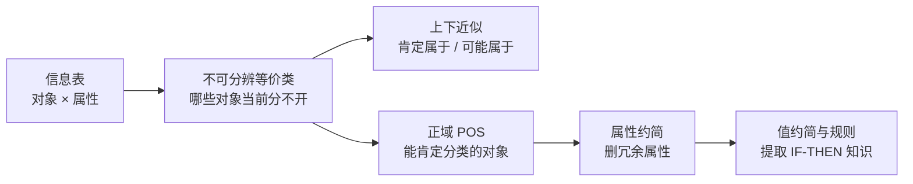
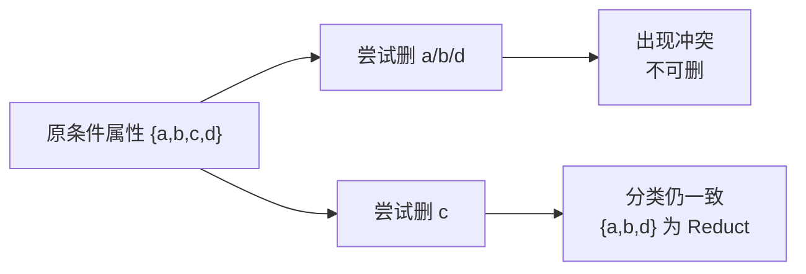

# 课件 06 — Rough Set 学习指南

> **课件**：`06Rough set.pdf`｜NotebookLM `课件06-Rough-Set`  
> **原则**：按课件原序、按知识点分块、**课件板块无遗漏**  
> **课堂**：**开卷自学**（FiCS 未讲授粗糙集算法）  
> **术语**：**中文（English）**

> **期末定位先看这句**：粗糙集是课纲/PPT 自学内容，课堂未深入讲授。若开卷涉及，最可能考你能否按信息表算**上下近似、正域 POS、属性约简 Reduct、属性值约简**；不要把通用离散化算法当作主线背。

---

## 课件内容覆盖索引

| 课件原序 | 课件板块 | Slide | 本指南 |
|----------|----------|-------|--------|
| 1 | 引言与背景（二值/模糊/粗糙对比） | ~1 | Part A · 块 A.0 |
| 2 | 信息系统 Information Table | ~1 | Part B · 块 B.0 |
| 3 | 核心定义（$U$、$R$、划分 $U/R$） | ~2 | Part A · 块 A.1 |
| 4 | 近似算子与隶属函数 | ~2–4 | Part A · 块 A.2–A.3 |
| 5 | 属性依赖与正域 POS | ~4–9 | Part B · 块 B.1–B.2 |
| 6 | 属性约简 Reduct | ~10–13 | Part C · 块 C.1–C.2 |
| 7 | 综合案例（房产价格） | ~13–26 | Part D · 块 D.1–D.4 |
| — | *易混：三种不确定性* | — | 附录 · 块 X.1 |

---

## 0. 课件全景

粗糙集（Rough Set）解决的不是“事件有多随机”，也不是“高/热这类词有多模糊”，而是：**属性不够细时，一些对象在表里看起来一模一样，因此无法被精确分类**。

| Part | 期末优先级 | 你要掌握到什么程度 |
|------|------------|--------------------|
| A 集合近似 | 高（开卷手算） | 会从等价类算下近似、上近似、边界和粗糙隶属度 |
| B 正域 POS | 高（开卷手算） | 会判断哪些不可分辨类完全落入某个决策类 |
| C Reduct / Core | 高（流程题） | 会用“删除后是否冲突 / POS 是否不变”判断冗余属性 |
| D 房产案例 | 中高（开卷定位） | 会解释离散化 → 属性约简 → 值约简 → 规则提取 |
| X 三理论对比 | 中（选择/简答） | 会区分概率、模糊集、粗糙集处理的不确定性来源 |

> **学习顺序建议**：先把“不可分辨等价类”想清楚，再做上下近似和 POS；Reduct 的本质就是检查删掉某个属性后，这些等价类是否仍能支撑同样的分类能力。

---

## Part A — 集合近似理论（Slide ~1–4）⭐⭐

> **本节要回答**：当一个目标集合无法由现有属性精确刻画时，粗糙集怎样给出“肯定属于”和“可能属于”两层边界？

### 块 A.0 引言：为何需要粗糙集

**课件要点**：对比二值逻辑、模糊集、粗糙集处理不确定性的路径。粗糙集的关键假设是：我们手里只有一张信息表，不能先验指定概率，也不预先画隶属函数，只能根据属性值是否相同来分辨对象。

| 理论 | 处理的“不确定” | 大白话 | 核心工具 |
|------|--------------|--------|----------|
| 概率论 | 随机性 Randomness | 事件会不会发生、发生频率/信念是多少 | 概率分布、贝叶斯 |
| 模糊集 | 语义模糊 Vagueness | “高”“热”这类词没有硬边界 | $\mu_A(x) \in [0,1]$ 隶属度 |
| 粗糙集 | 不可分辨 Indiscernibility | 属性太少，两个对象在表里看不出差别 | 等价类、上下近似 |

- **粗糙集特点**：**无需先验概率或人工隶属函数**，仅依赖信息表属性。
- **Pawlak 理论**：处理不完整、不一致数据的知识发现；课件重点不是历史，而是它如何从表格里提取分类规则。

（来源：课件06 Slide 1、ppt06-mistakes）

### 块 A.1 论域、等价关系与划分

**课件要点**：

| 概念 | 英文 | 大白话 | 形式化读法 |
|------|------|--------|------------|
| 论域 $U$ | Universe | 当前研究的全部对象 | 有限非空对象集 |
| 等价关系 $R$ | Equivalence Relation | “按某种属性看起来一样”的关系 | 自反、对称、传递 |
| 等价类 $[x]_R$ | Equivalence Class | 和 $x$ 分不开的一组对象 | 包含 $x$ 的同类对象集合 |
| 划分 $U/R$ | Partition | 把全体对象切成互不重叠的小块 | 由 $R$ 导出的等价类集合 |

信息系统中，若两个对象在属性子集 $B$ 上取值全同，就说它们关于 $B$ **不可分辨（Indiscernible）**。这些等价类就是后面所有计算的“知识砖块”：粗糙集不能把同一块里的对象再拆开判断。

（来源：课件06 Slide 2）

### 块 A.2 下近似 $R_*(X)$ 与上近似 $R^*(X)$

**课件要点**：目标集 $X \subseteq U$ 可能无法由等价类精确表示 → 用近似。

| 概念 | 公式 | 含义 |
|------|------|------|
| 下近似 $R_*(X)$ | $\{x \mid [x]_R \subseteq X\}$ | 等价类**完全落在** $X$ 内 → **肯定属于** |
| 上近似 $R^*(X)$ | $\{x \mid [x]_R \cap X \neq \emptyset\}$ | 等价类**与** $X$ **有交** → **可能属于** |
| 边界域 $BN_R(X)$ | $R^*(X) - R_*(X)$ | 不确定区域 |

**包含关系**：$R_*(X) \subseteq X \subseteq R^*(X)$

> **直观理解（文氏图文字版）**：$U$ 是被方格填满的地图，$X$ 是湖泊。  
> - **下近似** = 完全在湖内的格子（100% 在湖中）  
> - **上近似** = 被湖沾到的所有格子（可能在内）  
> - **边界** = 被岸线切开的格子  

> **重难点**：下近似取「等价类 ⊆ X」的并；上近似取「等价类 ∩ X ≠ ∅」的并——勿与 $X$ 本身混淆。

**手算顺序**：

1. 先列出划分 $U/R$，也就是所有等价类。
2. 对每个等价类逐个判断：是否完全在 $X$ 内？若是，放入下近似。
3. 再判断：是否与 $X$ 有交？若是，放入上近似。
4. 用 $R^*(X)-R_*(X)$ 得边界域。边界非空，说明当前知识下 $X$ 是粗糙的。

（来源：课件06 Slide 2–3）

### 块 A.3 隶属函数 $\mu_X^R(x)$

**课件要点**：

$$\mu_X^R(x) = \frac{\text{card}(X \cap [x]_R)}{\text{card}([x]_R)}$$

| 符号 | 含义 |
|------|------|
| $[x]_R$ | $x$ 所在的不可分辨等价类 |
| $\text{card}([x]_R)$ | 这个等价类里有多少对象 |
| $\text{card}(X \cap [x]_R)$ | 这个等价类里有多少对象同时属于目标集 $X$ |
| $\mu_X^R(x)$ | 在当前知识粒度下，$x$ 所在等价类落入 $X$ 的比例 |

| $\mu_X^R(x)$ | 归属 | 怎么读 |
|--------------|------|--------|
| $= 1$ | $x \in R_*(X)$ | 整个等价类都在 $X$，肯定属于 |
| $\in (0,1)$ | $x \in BN_R(X)$（边界） | 同类对象有的在 $X$、有的不在，无法肯定 |
| $= 0$ | $x \notin R^*(X)$ | 整个等价类都不碰 $X$，肯定不属于 |

- **知识增加**：属性越多 → 划分越细 → 下近似↑、上近似↓、边界↓。

> **与模糊隶属度区别**：这里的 $\mu_X^R(x)$ 不是人工定义“多高算高”的语义函数，而是由等价类中对象计数算出来的比例。它反映的是**当前属性能分辨到什么程度**。

（来源：课件06 Slide 3–4）

---

## Part B — 不可分辨性与正域（Slide ~4–9）⭐

> **本节要回答**：给定条件属性和决策属性，哪些对象能被当前属性集肯定分类？

### 块 B.0 信息系统 Information Table

**课件要点**：对象 × 属性表格；分为**条件属性** $C$ 与**决策属性** $D$（课件部分地方记为 $S$）。

- 行 = 对象 $x_i$；列 = 属性取值。
- 是粗糙集一切计算的**输入格式**。

| 角色 | 在表里是什么 | 作用 |
|------|--------------|------|
| 对象 $x_i$ | 每一行 | 被分类、被比较的样本 |
| 条件属性 $C$ / $R$ | 输入特征列 | 决定对象是否不可分辨 |
| 决策属性 $D$ / $S$ | 标签列 | 要预测或解释的分类结果 |

> **直观理解**：先按条件属性把对象分组，再看每组内部的决策标签是否一致。一组内部若标签一致，就能肯定分类；若标签冲突，就落入不确定区域。

（来源：课件06 Slide 1）

### 块 B.1 不可分辨关系 $IND(R)$

**课件要点**：$IND(R)$ = 在条件属性集 $R$ 下取值完全相同的对象等价关系。

- 划分 $U/IND(R)$ = 当前知识下**不可再分**的最小单元。
- **作用**：决定近似与正域的「分辨率」。

（来源：课件06 Slide 4–8）

### 块 B.2 决策属性与正域 $POS_R(S)$

**课件要点**：$POS_R(S)$ = 所有**完全包含于** $U/S$ 某一决策类的 $IND(R)$ 等价类的并。

- **含义**：凭条件属性 $R$ **能肯定分类**的对象集合。
- **不在 POS** → 边界对象，分类不确定。
- **约简基础**：删属性后若 $POS$ 不变 → 该属性冗余。

**正域怎么判**：

1. 用条件属性 $R$ 得到 $U/IND(R)$。
2. 用决策属性 $S$ 得到 $U/S$。
3. 对每个条件等价类，检查它是否完全包含在某个决策类中。
4. 完全包含的等价类全部并起来，就是 $POS_R(S)$。

**手算例**（课件标准 8 对象表）：

- $U/IND(\{P,Q,W\}) = \{\{x_1,x_5\}, \{x_3,x_4\}, \{x_2,x_8\}, \{x_6\}, \{x_7\}\}$  
- $U/S = \{\{x_1,x_5,x_6\}, \{x_3,x_4\}, \{x_2,x_7\}, \{x_8\}\}$  

逐类检验 $IND$ 等价类是否 ⊆ 某决策类：

| 等价类 | 是否 ⊆ 某决策类 |
|--------|-----------------|
| $\{x_1,x_5\}$ | ✓ ⊆ $\{x_1,x_5,x_6\}$ |
| $\{x_3,x_4\}$ | ✓ |
| $\{x_6\}$ | ✓ |
| $\{x_7\}$ | ✓ ⊆ $\{x_2,x_7\}$ |
| $\{x_2,x_8\}$ | ✗ 跨 $\{x_2,x_7\}$ 与 $\{x_8\}$ |

$$POS_R(S) = \{x_1,x_3,x_4,x_5,x_6,x_7\}$$

- $x_2, x_8$ 在边界，无法凭 $\{P,Q,W\}$ 肯定分类。

（来源：课件06 Slide 25、28–29）

---

## Part C — 知识约简 Reduct（Slide ~10–13）⭐⭐

> **本节要回答**：哪些属性删掉不会损失分类能力，哪些属性是绝对不能删的核心？

### 块 C.1 属性约简判定思路

**课件要点**：在保持分类能力不变前提下删冗余条件属性。

**Reduct（属性约简）**：条件属性的极小子集；用它分类的能力与原条件属性集一致，但再删任意一个属性就会变差。白话说，就是“保留足够解释决策的最少列”。

**三步手算**：

1. **建表**：列出 $U$、条件属性 $C$、决策 $D$。  
2. **逐个删除试探**：删属性 $a$ 后，是否存在「剩余条件相同但决策不同」的行对？
   - 有 → $a$ **不可删**（删则 **Collapse**）  
   - 无 → $a$ **可省** Dispensable  
3. **约简 Reduct**：极小不可再删子集，分类效果与全集一致。

**房产例**：删 **c（面积）** 后 $\{a,b,d\}$ 仍无冲突 → $\{a,b,d\}$ 是合法约简；$a,b,d$ 单独删除均导致冲突 → 不可删。

> **考试写法**：不要只写“c 可删”。要说明：删除 $c$ 后，剩余 $\{a,b,d\}$ 没有产生条件相同而价格不同的冲突；因此分类能力不变，$c$ 对该决策表是冗余属性。

（来源：课件06 Slide 37–45）

### 块 C.2 核 Core

**课件要点**：**Core** = 所有 Reduct 的**交集** = **绝对不能删**的属性集。

| 概念 | 判定 |
|------|------|
| 核属性 | 删掉必冲突 |
| 冗余属性 | 删掉仍一致 |
| 约简 | 删尽所有冗余后的极小集 |

- **实践**：先求 Core，再在 Core 上扩展求最小 Reduct（课件用「尝试删除法」，未讲启发式）。

> **容易混**：Core 不是“随便选一个最小约简”，而是所有约简共同包含的属性。若某属性一删就让表发生 Collapse，它一定在 Core 中。

（来源：课件06 Slide 37–39）

---

## Part D — 决策表与规则发现（Slide ~13–26）

> **本节要回答**：粗糙集怎样从房产原始数据中一步步得到可读的 IF-THEN 规则？

### 块 D.1 离散化 Discretization

**课件要点**：连续/多值数据 → 符号等级，方可建信息表。这里的离散化是案例前处理：先把“面积、价格、地段”等转成有限编码，后面才能按编码比较对象是否不可分辨。

**房产案例分箱**（课件给定）：

| 属性 | 编码 |
|------|------|
| a 地段 | 1/2/3 类路段 |
| b 房型 | 1 单一 / 2 中等 / 3 多样 |
| c 面积 | 1 ≤80 / 2 80–120 / 3 >120 m² |
| d 结构 | 1 一般 / 2 框架 / 3 复式 |
| e 价格（决策） | 1 便宜 / 2 适中 / 3 昂贵 |

- **课件未讲**：等宽、等频、熵分裂、聚类离散化等阈值选择算法。开卷可了解名词，但本 PPT 的可考主线是**使用给定编码继续做约简和规则提取**。

（来源：课件06 Slide 14）

### 块 D.2 属性约简（案例）

**课件要点**：$c$ 可删 → Reduct $\{a,b,d\}$；$a,b,d$ 均属于 Core。

（来源：课件06 Slide 41–45）

### 块 D.3 属性值约简 Value Reduction

**课件要点**：对每条规则 $cond \to decision$，逐值试探删除。属性约简删的是“列”，属性值约简删的是“一条规则里的某个条件项”。

**例 — 规则 $a_1 b_2 d_1 \to e_2$**：

- 删 $d_1$ → 不确定 → $d_1$ **保留**  
- 删 $b_2$ → $a_1 d_1$ 仍全 → $e_2$ → $b_2$ **可删**  
- 删 $a_1$ → $b_2 d_1$ 仍一致 → $a_1$ **可删**  
- 最简例：$a_1 d_1 \to e_2$ 或 $b_2 d_1 \to e_2$

- **核值**：规则中不可或缺的属性值组合。

**手算模板**：

1. 选定一条完整规则，例如 $a_1b_2d_1 \to e_2$。
2. 试删一个条件值，例如删 $b_2$ 得 $a_1d_1 \to e_2$。
3. 回到表中检查所有满足剩余条件的对象，决策是否仍全为 $e_2$。
4. 若仍一致，该值可删；若出现其他决策，该值必须保留。
5. 对每个条件值重复，得到最简规则。

（来源：课件06 Slide 10–15、19–24）

### 块 D.4 规则提取与自然语言

**课件要点**：约简后得符号规则 → 译成自然语言供专家系统使用。

**形式化结果（节选）**：

- **$e_1$ 便宜**：$a_3 d_2$ OR $a_3 d_1$ OR $a_3 b_3$ …  
- **$e_2$ 适中**：$a_1 d_1$ OR $b_2 d_1$ OR $b_1$ …  
- **$e_3$ 昂贵**：$d_3$ OR $a_2 b_3$ OR $a_1 d_2$ …  

- **全流程**：原始数据 → 离散化 → 属性约简 → 值约简 → 规则 → 自然语言。

> **例子服务什么概念**：房产案例不是要背“地段 3 一定便宜”这种现实结论，而是展示粗糙集如何把数据表转换为专家系统可用规则：先删冗余列，再删冗余条件值，最后把符号规则翻译成人能读懂的 IF-THEN。

（来源：课件06 Slide 17–18、25–26）

---

## 附录 X — 三种不确定性对比

### 块 X.1 概率 / 模糊 / 粗糙

| 特性 | 概率 | 模糊 | 粗糙 |
|------|------|------|------|
| 不确定来源 | 事件随机 | 语义边界不清 | 属性有限导致对象不可分辨 |
| 先验 | 常需概率/统计 | 需定义隶属函数 | **仅数据表** |
| 数值含义 | 事件概率或信念 | 描述词适用程度 | 等价类中落入目标集的比例 |
| 应用 | 风险、噪声 | 控制、语言 | 约简、规则挖掘 |

**上下近似易混**：下在内（保守）、上在外（宽松）；精确集当且仅当 $R_* = R^*$。

（来源：ppt06-mistakes.answer.md）

---

## 易混概念对比

| 概念组 | 容易混在哪里 | 一句话区分 |
|--------|--------------|------------|
| 下近似 vs 上近似 | 都由等价类并起来 | 下近似要求整类包含于 $X$；上近似只要求与 $X$ 有交 |
| 上近似 vs 边界域 | 上近似里也有确定对象 | 边界域是 $R^*(X)-R_*(X)$，只保留不确定部分 |
| 粗糙隶属度 vs 模糊隶属度 | 数值都在 $[0,1]$ | 粗糙隶属度由等价类计数得到；模糊隶属度由语义函数定义 |
| POS vs 下近似 | 都表示“肯定” | POS 针对决策分类；下近似针对任意目标集 $X$ |
| Reduct vs Core | 都和删属性有关 | Reduct 是可用的极小属性子集；Core 是所有 Reduct 的交集 |
| 属性约简 vs 属性值约简 | 都在删东西 | 属性约简删整列；属性值约简删单条规则里的条件项 |

---

## 术语表

| English | 中文 |
|---------|------|
| Universe ($U$) | 论域 |
| Equivalence Relation ($R$) | 等价关系 |
| Partition ($U/R$) | 划分 |
| Lower / Upper Approximation | 下近似 / 上近似 |
| Membership Function | 隶属函数 |
| Indiscernibility Relation ($IND$) | 不可分辨关系 |
| Positive Region ($POS$) | 正域 |
| Reduct / Core | 约简 / 核 |
| Discretization | 离散化 |
| Boundary Region | 边界域 |

---

## 复习优先级

| 优先级 | 内容 | 书签 |
|--------|------|------|
| **高（开卷手算）** | 上下近似、边界域、粗糙隶属度 | Part A |
| **高（开卷手算）** | $IND(R)$ 划分、$POS_R(S)$ 判定 | Part B |
| **高（流程题）** | Reduct / Core：删属性是否导致冲突 | Part C |
| **中高（案例）** | 房产案例：离散化、属性约简、值约简、规则提取 | Part D |
| **中（选择/简答）** | 概率 / 模糊 / 粗糙三理论对比 | 附录 X |
| 了解 | 启发式最小 Reduct、离散化算法细节 | 课件未详讲 |

---

**raw**：`notebooklm-raw/ppt06/runs/latest/`｜**结构**：`notebooklm-raw/ppt/runs/20260619-161000/ppt06-structure.answer.md`
