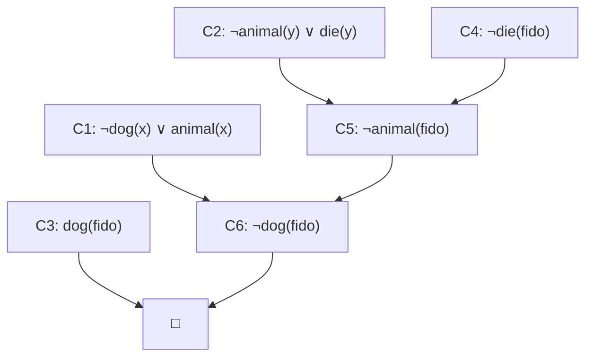

# 课件 07 — Logics and Prolog 学习指南

> **课件**：`07Logics and Prolog.pdf`｜`课件07-Logics-and-Prolog`  
> **原则**：按课件原序、按知识点分块、**课件板块无遗漏**  
> **课堂**：**Week 14 深入**  
> **期末大题**：自然语言 → 逻辑式 → **子句集** → 消解证明  
> **术语警示**：课堂称「DNF」，课件产出 **Clause Form / CNF**——以老师定义为准

> **期末定位先看这句**：本课件是 Week 14 核心。最重要的是能把英文自然语言题翻译成 FOL，再把 $KB \cup \{\neg G\}$ 化为 Clause Form / CNF 子句集，最后用合一与消解推出空子句。Prolog 主要按机制与读代码掌握。

---

## 课件内容覆盖索引

| 课件原序 | 课件板块 | Slide | 本指南 |
|----------|----------|-------|--------|
| 1 | KR 与逻辑基础 Foundation | 1 | Part 1 · 块 1.1 |
| 2 | 命题逻辑 Propositional Logic | 1–2 | Part 1 · 块 1.2 |
| 3 | 一阶逻辑 FOL | 2–4 | Part 1 · 块 1.3–1.4 |
| 4 | 消解反驳 Resolution | 5–14 | Part 2 · 块 2.1–2.5 |
| 5 | 逻辑系统分类 Categories | 15 | Part 2 · 块 2.6 |
| 6 | 霍恩子句 Horn Clauses | 16 | Part 3 · 块 3.1 |
| 7 | Prolog 解释器与语法 | 16–23 | Part 3 · 块 3.2–3.5 |

---

## 0. 课件全景

课件 07 的主线是：**把知识写成逻辑语言，再让机器用符号改写完成证明**。从考试角度看，它不是纯概念章，而是一套流水线。


| Part | 期末优先级 | 你要掌握到什么程度 |
|------|------------|--------------------|
| Part 1 逻辑基础 | 高（大题前置） | 会区分命题逻辑/FOL，量词搭配不写错 |
| Part 2 消解反驳 | **极高（必考大题）** | 会写 9 步子句化、否定目标、合一消解到空子句 |
| Part 3 Prolog | 高（概念/读代码） | 会解释霍恩子句、DFS、回溯、剪枝和递归规则 |
| 与 CLIPS 对照 | 中（选择/简答） | 会区分 Prolog 反向目标驱动与 CLIPS 前向数据驱动 |

> **学习顺序建议**：先练自然语言 → FOL，再背 Clause Form 9 步，最后用 Fido/Socrates 这类小例子反复走消解流程。Prolog 放在最后，理解它如何把霍恩子句工程化。

---

## Part 1 — 逻辑学基础（Slide 1–4）

> **本节要回答**：命题逻辑为什么不够表达 AI 知识？一阶逻辑新增了哪些结构，让机器能处理“所有/存在/个体关系”？

### 块 1.1 逻辑作为知识表示基础

**课件要点**：逻辑是知识表示（Knowledge Representation, KR）的形式化基础；只要语法和推理规则定义清楚，机器就能通过符号改写得到结论。

- **符号主义（Symbolism）**：机器**不必理解语义**，合法符号操作即推理。比如它不需要真的理解 Fido 是狗，只要知道 `dog(fido)` 与规则 `dog(x) -> animal(x)` 可以匹配，就能继续推导。
- **KR 的要求**：能表达事实、规则、对象关系，并支持机械推理。

### 块 1.2 命题逻辑（Propositional Logic）

**课件要点**：命题逻辑把一个完整断言当作不可再拆的命题符号，再用连接词构造复合句。

| 连接词 | 符号 | 什么时候为真 |
|--------|------|--------------|
| 非 Negation | $\neg P$ | $P$ 为假 |
| 与 Conjunction | $P \land Q$ | $P,Q$ 都真 |
| 或 Disjunction | $P \lor Q$ | 至少一个真（含或） |
| 蕴含 Implication | $P \to Q$ | 只有“前真后假”时为假 |
| 等价 Equivalence | $P \leftrightarrow Q$ | 两边真值相同 |

- **真值表（Truth table）**：枚举所有可能解释，判断复合句真假。
- **善意推定 / 最小翻译**：自然语言转逻辑时取最保守读法；尤其 $P \to Q$ 不表示因果，只表示“不能出现 $P$ 真而 $Q$ 假”。

> **命题逻辑局限**：它不能拆出“苏格拉底”“人”“会死”之间的结构，也不能用一个规则表达“所有人都会死”。所以课件很快转向 FOL。

### 块 1.3 一阶谓词逻辑（FOL）

**课件要点**：一阶谓词逻辑（First-Order Logic, FOL）把句子拆成对象、属性、关系和量词。

| 成分 | 英文 | 例 | 怎么读 |
|------|------|-----|--------|
| 常量 | Constant | `fido`, `socrates` | 具体对象 |
| 变量 | Variable | `x`, `y` | 占位对象 |
| 函数 | Function | `mother(x)` | 从对象映射到对象 |
| 谓词 | Predicate | `dog(x)`, `parent(x,y)` | 对象属性或对象间关系 |
| 原子公式 | Atomic formula | `animal(fido)` | 最小可判真假的 FOL 句子 |
| 量词 | Quantifier | $\forall x$, $\exists y$ | 对所有 / 至少存在 |

> **例子怎么服务理解**：`dog(fido)` 不是字符串标签，而是“对象 fido 具有 dog 属性”的原子公式。这样规则 $\forall x(dog(x)\to animal(x))$ 才能通过把 $x$ 替换成 `fido` 来推出 `animal(fido)`。

### 块 1.4 量词搭配 ⭐

| 量词 | 常搭配 | 误配后果 |
|------|--------|----------|
| $\forall$ | $\rightarrow$ | 用 $\land$ →「万物皆人且皆死」 |
| $\exists$ | $\land$ | 用 $\rightarrow$ → 前提假则式子恒真，过弱 |

> **直观理解**：「所有鸟会飞」= $\forall x (bird(x) \to flies(x))$，不是 $\forall x (bird(x) \land flies(x))$。

**翻译 checklist**：

1. 先列谓词：属性用一元谓词，关系用二元/多元谓词。
2. 具体名字写成常量，如 `fido`；泛指对象写成变量，如 $x,y,z$。
3. “所有……”通常写 $\forall x(\text{条件}\to\text{结论})$。
4. “存在……”通常写 $\exists x(\text{条件1}\land\text{条件2})$。
5. 复杂句先用括号定作用域，再考虑是否需要中间变量。

（来源：课件07 Slide 1–4、Week 14）

---

## Part 2 — 消解反驳（Slide 5–16）⭐期末

> **本节要回答**：为什么消解要先否定结论？怎样把 FOL 公式变成子句集，再通过互补文字推出空子句？

### 块 2.1 消解思想（Resolution Refutation）

**课件要点**：消解反驳（Resolution Refutation）用反证法证明 $KB \models G$。它不直接“构造 $G$”，而是把 $KB$ 与 $\neg G$ 放在一起，若推出矛盾，则说明 $G$ 必真。

1. 构造 $S = KB \cup \{\neg G\}$。
2. 把 $S$ 转成子句集（Clause Form / CNF）。
3. 找互补文字，例如 $P(t)$ 与 $\neg P(t)$；变量不同时先合一。
4. 消去互补文字，生成新子句。
5. 得到空子句 $\square$ → $S$ 不可满足 → 原结论 $G$ 为真。

| 术语 | 大白话 |
|------|--------|
| 子句 Clause | 若干文字的析取，例如 $\neg dog(x)\lor animal(x)$ |
| 文字 Literal | 原子公式或其否定，例如 $dog(x)$、$\neg dog(x)$ |
| 合一 Unification | 找替换让两个表达式长成一样 |
| 空子句 $\square$ | 什么都不能满足，表示矛盾 |

### 块 2.2 子句集转换九步

| 步 | 名称 | 要点 |
|----|------|------|
| 1 | 消去蕴含 | $P\to Q \equiv \neg P \lor Q$；$P\leftrightarrow Q$ 先拆成双向蕴含 |
| 2 | 否定内移 | 用德摩根和量词否定律，把 $\neg$ 推到原子公式前 |
| 3 | 变量标准化 | 不同量词辖域里的变量重命名，避免同名冲突 |
| 4 | 前束化 | 量词左移，形成量词前缀 + 矩阵 |
| 5 | Skolem 化 | $\exists$ → Skolem 常量或函数 |
| 6 | 略去 $\forall$ | 剩余变量默认全称量化 |
| 7 | CNF | 用分配律得到“析取式的合取” |
| 8 | 拆分子句 | 每个合取项单独成为一个 Clause |
| 9 | 子句变量再标准化 | 不同子句变量改名，避免错误共享 |

> **Skolem 化最易错**：$\exists y$ 若不在任何 $\forall$ 辖域内，用 Skolem 常量；若在 $\forall x$ 辖域内，用 Skolem 函数 $f(x)$。否则会把“每个人都有一个母亲”误写成“所有人同一个母亲”。

> **术语警示**：课堂有时称“析取范式 DNF”，但消解需要的是课件的 Clause Form / 标准 CNF，也就是“文字析取项的合取”。考试时按老师叫法写，但步骤上按本表做。

（来源：课件07 Slide 9–16）

### 块 2.3 自然语言 → 逻辑式 ⭐

**例题**：「外祖父是母亲的父亲」

$$\forall x \forall z \big( mgf(z,x) \leftrightarrow \exists y\,(mother(y,x) \land father(z,y)) \big)$$

**这条公式怎么读**：

- $x$ 是被描述的人，$z$ 是候选外祖父，$y$ 是中间对象“母亲”。
- $\exists y$ 是必要的，因为外祖父关系需要通过“某个母亲”连接起来。
- $\leftrightarrow$ 表示定义式：$z$ 是 $x$ 的外祖父，当且仅当存在 $y$，$y$ 是 $x$ 的母亲且 $z$ 是 $y$ 的父亲。

**考场翻译模板**：

1. 先写谓词表：`mother(y,x)`、`father(z,y)`、`mgf(z,x)`。
2. 再确定量词：规则对所有 $x,z$ 生效，所以外层 $\forall x\forall z$。
3. 若句子里有“某个中间人/某件物”，引入 $\exists$。
4. 最后检查全称量词是否搭配 $\to$ 或定义式，存在量词内部是否用 $\land$ 连接条件。

### 块 2.4 Fido 消解手算 ⭐

前提：$\forall x(dog(x)\to animal(x))$，$\forall y(animal(y)\to die(y))$，$dog(fido)$。证 $die(fido)$。

子句：

| 编号 | 子句 | 来源 |
|------|------|------|
| C1 | $\neg dog(x)\lor animal(x)$ | 狗都是动物 |
| C2 | $\neg animal(y)\lor die(y)$ | 动物都会死 |
| C3 | $dog(fido)$ | Fido 是狗 |
| C4 | $\neg die(fido)$ | 否定目标 |

消解过程：

1. C2 与 C4：$die(y)$ 和 $\neg die(fido)$ 合一，$\theta=\{fido/y\}$，得 C5：$\neg animal(fido)$。
2. C1 与 C5：$animal(x)$ 和 $\neg animal(fido)$ 合一，$\theta=\{fido/x\}$，得 C6：$\neg dog(fido)$。
3. C3 与 C6：$dog(fido)$ 和 $\neg dog(fido)$ 互补，得 $\square$。

> **考试书写模板**：每一步写“父子句编号 + 互补文字 + 合一替换 + 新子句”。只写 C2+C4→C5 容易丢过程分。

### 块 2.5 消解树与策略

**课件要点**：消解树图；线性/宽度优先等策略。

- **完备**：宽度优先等可保证找到反驳（若存在）。  
- **高效**：线性消解可能不完备但常用。
- **支持集策略**：优先使用由目标否定产生的子句及其后代，减少无关推导。
- **单元优先**：优先用单文字子句，通常更快。



### 块 2.6 逻辑系统分类（Slide 15）

**课件要点**：可判定性、表达力分类。表达力越强，自动推理通常越难。

- **可判定（Decidable）**：存在算法总能在有限时间给出是/否。
- **半可判定（Semi-decidable）**：若命题可证，可能找到证明；若不可证，搜索可能一直跑。
- **FOL**：一般情形下半可判定，原因是量词和函数符号可能引出无限论域。

（来源：课件07 Slide 15、Week 14）

---

## Part 3 — Prolog（Slide 16–23）

> **本节要回答**：Prolog 如何把霍恩子句变成可运行程序？为什么它既是逻辑语言，又受搜索顺序影响？

### 块 3.1 霍恩子句（Horn Clauses）

**课件要点**：霍恩子句（Horn Clause）是至多一个正文字的子句，是 Prolog 能高效执行的逻辑片段。

| 形式 | 逻辑读法 | Prolog |
|------|----------|--------|
| 事实 $a\leftarrow$ | $a$ 为真 | `parent(tom,bob).` |
| 规则 $a \leftarrow b_1\land b_2$ | 若 $b_1,b_2$ 成立，则 $a$ 成立 | `friends(X,Y) :- likes(X,Z), likes(Y,Z).` |
| 目标 $\leftarrow a$ | 试图证明 $a$ | `?- parent(tom,X).` |

> **箭头方向**：Prolog 里 `Head :- Body.` 可读作“Head if Body”。它和数学里的 $Head \leftarrow Body$ 对应，不要按从左到右误读成“Head 推出 Body”。

### 块 3.2 合一（Unification）

合一（Unification）是模式匹配 + 变量绑定，使查询与事实/规则头一致。

**例子**：查询 `parent(tom, X)` 与事实 `parent(tom, bob)` 合一，得到绑定 $X=bob$。若查询与规则头合一成功，规则体会变成新的待证子目标。

> **与消解的关系**：消解证明里合一用于匹配互补文字；Prolog 里合一用于把当前目标归约成更小的子目标。

### 块 3.3 深度优先与回溯

Prolog 采用**从上到下选规则、从左到右解目标**的深度优先搜索：

1. 取当前最左子目标。
2. 从程序顶部找第一个能合一的事实/规则。
3. 若匹配规则，则把规则体压成新的子目标。
4. 若后续失败，回溯到最近选择点，撤销绑定，试下一条规则。

> **容易错**：Prolog 不是“纯逻辑公式集合”那么抽象。规则顺序和目标顺序会影响是否高效，甚至可能导致无限递归。

### 块 3.4 剪枝 `!`

剪枝 `!`（Cut）表示：走到这里后，承诺当前路径，放弃此前选择点的其他备选。

| 好处 | 风险 |
|------|------|
| 减少无谓回溯，提高效率 | 可能剪掉本应探索的解 |

> **怎么记**：Cut 是控制搜索的操作，不是新逻辑事实。它改变 Prolog 的过程性行为，所以读代码时要特别看它放在哪个子目标之后。

### 块 3.5 递归与列表（骑士巡游等）

```prolog
predecessor(P,C) :- parent(P,C).
predecessor(P,S) :- parent(P,C), predecessor(C,S).
```

第一行是**基础情形**：父母直接是前辈。第二行是**递归情形**：若 $P$ 是 $C$ 的父母，且 $C$ 是 $S$ 的前辈，则 $P$ 也是 $S$ 的前辈。

> **递归顺序提醒**：通常先写能立即终止的基础规则，再写递归规则；否则深度优先搜索可能先陷入递归分支。

（来源：课件07 Slide 16–23）

---

## 与 CLIPS 对照

| 维度 | Prolog | CLIPS |
|------|--------|-------|
| 推理方向 | 反向目标驱动 | 前向数据驱动 |
| 出发点 | 查询目标 | 已知事实 |
| 理论基础 | 霍恩子句 + 消解思想 | 产生式系统 |
| 控制机制 | DFS + 回溯 + Cut | Match → Agenda → Fire |
| 课堂 | Week 14 | Week 15 |

---

## 易混概念对比

| 概念组 | 容易混在哪里 | 一句话区分 |
|--------|--------------|------------|
| 命题逻辑 vs FOL | 都用连接词 | 命题逻辑不拆对象；FOL 有项、谓词、量词 |
| $\forall$ vs $\exists$ | 都是量词 | $\forall$ 常配 $\to$ 写规则；$\exists$ 常配 $\land$ 写存在对象 |
| Clause Form / CNF vs 课堂 DNF | 叫法冲突 | 消解实际需要“文字析取项的合取” |
| Skolem 常量 vs 函数 | 都替换 $\exists$ | 依赖外层 $\forall$ 时用函数，不依赖时用常量 |
| 合一 vs 替换 | 都在改变量 | 合一是寻找能让表达式一致的替换 |
| 空子句 vs 空目标 | 都表示结束 | 消解中空子句是矛盾；Prolog 中目标归约为空是证明成功 |
| 线性消解 vs 宽度优先 | 都是策略 | 线性更高效但可能不完备；宽度优先更稳但开销大 |

---

## 术语表

| English | 中文 |
|---------|------|
| Knowledge Representation (KR) | 知识表示 |
| Propositional Logic | 命题逻辑 |
| First-Order Logic (FOL) | 一阶谓词逻辑 |
| Resolution Refutation | 消解反驳 |
| Clause Form | 子句形式 |
| Unification | 合一 |
| Skolemization | Skolem 化 |
| Horn Clause | 霍恩子句 |
| Backtracking | 回溯 |
| Cut | 剪枝 |

---

## 复习优先级

| 优先级 | 内容 | Slide |
|--------|------|-------|
| **极高（必考大题）** | 自然语言翻译 → FOL → 加入 $\neg G$ | 课堂 + 课件 |
| **极高（必考大题）** | 九步转换 + Clause Form / CNF 子句集 | 9–16 |
| **极高（必考大题）** | 合一 + 消解手算到 $\square$ | 5–14 |
| **高（概念/读代码）** | Prolog、霍恩子句、DFS、回溯、Cut | 16–23 |
| **中（选择/简答）** | 逻辑系统分类、可判定/半可判定 | 15 |
| **中（对照）** | Prolog vs CLIPS | Week 14–15 |

---

**raw**：`notebooklm-raw/ppt07/runs/latest/`
