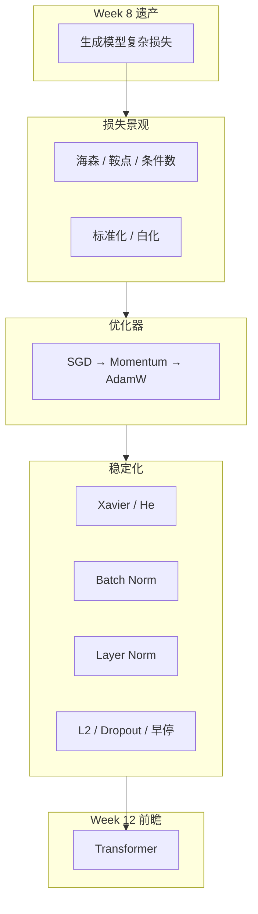
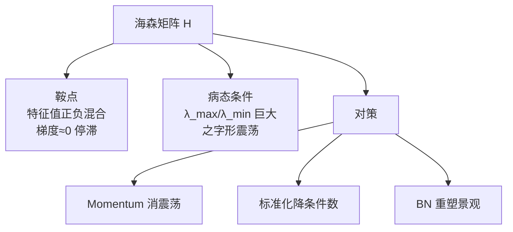
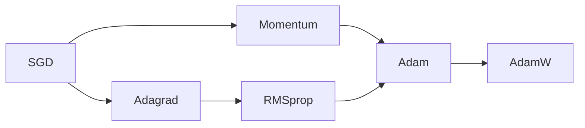

# Week 10 学习指南：神经网络优化技术

> **课程**：人工智能（H）CS30057h.01  
> **覆盖周次**：Week 10（2026-05-11）  
> **主要来源**：Week 10 课程记录、课件 09 Deep Learning、花书第 4/8 章  
> **生成方式**：NotebookLM 分层问答 → Agent 审核整合  
> **生成日期**：2026-06-16  
> **原始数据**：`notebooklm-raw/week10/runs/latest/`（16/16 batch）  
> **术语格式**：术语表及正文**首次出现**时，专业名词采用 **中文（English）**；英文缩写采用 **缩写（English full form，中文）**，便于对照英文试卷。

---

## 0. 术语表

| 术语 | 大白话解释 | 生活类比 |
|------|-----------|----------|
| 🔗 **损失景观（Loss landscape）** | 参数空间中损失函数的地形 | 下山时脚下的山坡起伏 |
| 🔗 **海森矩阵（Hessian matrix）** | 损失对参数的二阶导数矩阵，刻画曲率 | 山坡的弯曲程度：碗底还是马鞍 |
| 🔗 **条件数（Condition number）** | 海森最大/最小特征值之比，越大越病态 | 峡谷越窄越长，条件数越高 |
| 🔗 **鞍点（Saddle point）** | 某些方向谷底、某些方向山顶的临界点 | 山口：前后下坡、左右上坡 |
| 🔗 **SGD（Stochastic Gradient Descent，随机梯度下降）** | 用小批量梯度估计更新参数 | 不全班考也不单人考，抽一组人估方向 |
| 🔗 **动量法（Momentum）** | 累积历史梯度的指数加权平均 | 曲棍球滑行：惯性冲过平坦区 |
| 🔗 **Adagrad 算法** | 按历史梯度平方累积自适应缩小学习率 | 常走的路减速，少走的路保持大步 |
| 🔗 **RMSprop 算法** | 用指数移动平均替代 Adagrad 全历史累积 | 只记近期路况，不忘太早的事 |
| 🔗 **Adam（Adaptive Moment Estimation，自适应矩估计）** | 动量 + RMSprop + 偏差修正 | 既看惯性又看路况，还修正冷启动 |
| 🔗 **AdamW（Adam with decoupled Weight decay，解耦权重衰减的 Adam）** | 权重衰减与梯度更新解耦的 Adam | 罚款不跟步长打折，该罚多少罚多少 |
| 🔗 **Xavier（Glorot initialization，Glorot 初始化）** | 为 Sigmoid/Tanh 保持方差稳定的初始化 | 给饱和激活合适的起跑力度 |
| 🔗 **He（Kaiming initialization，Kaiming 初始化）** | 为 ReLU 补偿「砍半」方差的初始化 | ReLU 丢一半信号，初始权重大一点补回来 |
| 🔗 **Batch Norm（Batch Normalization，批量归一化）** | 按 mini-batch 对每个特征维归一化 | 全班同一科成绩统一标准分 |
| 🔗 **Layer Norm（Layer Normalization，层归一化）** | 对单个样本的所有特征维归一化 | 每个学生自己的各科成绩统一标准分 |
| 🔗 **ICS（Internal Covariate Shift，内部协变量偏移）** | 层间输入分布漂移 | 上游改规则，下游措手不及 |
| 🔗 **权重衰减（Weight decay）** | L2 正则：惩罚大权重 | 限制模型「用力过猛」 |
| 🔗 **Dropout（随机失活）** | 训练时随机置零神经元 | 每次考试随机蒙住几个专家 |
| 🔗 **早停（Early stopping）** | 验证集不再改善时停止训练 | 尝到最高分就交卷 |
| 🔗 **EWMA（Exponentially Weighted Moving Average，指数加权移动平均）** | 只记近期梯度统计 | RMSprop/Adam 的基础 |

---

## 1. 知识地图（L0）

### 1.1 在整门课中的位置

Week 10 处于 **「深度模型 → 可训练工程」** 阶段，负责：

1. 将神经网络训练从「艺术」系统化：优化器、初始化、归一化、正则化、超参
2. 为 Week 8 生成模型（VAE/GAN/扩散）提供收敛与稳定性工具箱
3. 为 Week 12 Transformer 奠定 AdamW、Layer Norm、Dropout 等工程基础

> **课纲注**：课纲原定 Week 10 为「符号主义/专家系统」，**实际授课为优化综述**；符号主义推后至 Week 15，以课堂为准。

（来源：Week 10 记录、`w10-study-order`）

### 1.2 学习路径：从哪出发 → 要到哪去



（来源：Week 10 记录、`w10-bridge-w8`、`w10-bridge-w12`）

### 1.3 Week 8 → Week 10 的逻辑衔接

| 转折 | Week 8 挑战 | Week 10 工具 |
|------|------------|-------------|
| VAE 训练 | ELBO 非凸、需采样可导 | Adam、学习率衰减 |
| GAN 博弈 | 训练不稳定、模式坍缩 | BN、标签平滑、Adam |
| 深层编解码 | 梯度消失/爆炸 | He/Xavier 初始化 |
| 过拟合训练集 | Shortcut / 记忆样本 | Dropout、权重衰减、早停 |
| 重参数化 | 需端到端梯度优化 | SGD 及其自适应变体 |

（来源：`w10-bridge-w8`、`w8-bridge-w10`）

### 1.4 核心子主题清单

**极高优先级**
- 优化器演进：SGD → Momentum → Adagrad → RMSprop → Adam → AdamW
- Adam vs AdamW：权重衰减解耦
- Batch Norm 原理与训练/推理差异
- Layer Norm vs BN；Transformer 为何用 LN

**高优先级**
- 海森矩阵、鞍点、病态条件数
- Xavier / He 初始化公式与适用激活
- L2 / Dropout / 早停机制

**了解即可**
- 白化 vs 标准化
- 矩阵正交化初始化（RNN 进阶）

---

## 2. 核心知识

### 2.1 损失景观（Loss landscape）全景：为何优化这么难

> **本节叙事线**：
>
> ```
> A. 损失曲面长什么样？  →  海森矩阵刻画曲率
>         ↓
> B. 两种噩梦地形       →  鞍点停滞 + 病态峡谷震荡
>         ↓
> C. 能否重塑地形？     →  标准化 / 白化 / BN
>         ↓
> D. 优化器如何应对？   →  SGD → AdamW 演进
>         ↓
> E. 还有哪些稳定器？   →  初始化 / 归一化 / 正则化
> ```

#### A. 优化全景：学完本节你能做什么

| 能力 | 检验方式 |
|------|---------|
| 解释条件数大为何收敛慢 | 面试：「峡谷」之字形 |
| 区分鞍点与局部极小 | 看海森特征值正负 |
| 选对初始化 | ReLU 用 He，Sigmoid 用 Xavier |
| 解释 BN 训练/推理差异 | 推理用 running mean/var |
| 说明 Transformer 用 LN 的理由 | 小 batch + 变长序列 |

**自检问题**：读完本节你应该能回答——「为什么深层网络不能全零初始化？为什么 GAN 需要 BN？AdamW 比 Adam 好在哪里？」

（来源：`w10-hessian-geometry`、`w10-preprocessing`）

---

#### B. 海森矩阵与损失曲面几何

> **本节要回答**：梯度告诉我们山坡有多陡，那二阶信息告诉我们什么？

**直觉**（来源：`w10-hessian-geometry`）：

- **梯度（一阶）**：山坡倾斜方向与陡度
- **海森矩阵（二阶）**：山坡**弯曲程度**（曲率），由特征值刻画

> **背景：海森矩阵与特征值**
>
> **海森矩阵** $H$：损失 $L$ 对参数 $\theta$ 的**二阶偏导**方阵，$H_{ij}=\dfrac{\partial^2 L}{\partial \theta_i \partial \theta_j}$。一维时就是二阶导 $L''$；多维时把「各方向的弯曲」打包成矩阵。
>
> **特征值 $\lambda$ 是什么？** 对对称矩阵 $H$，存在特殊方向（**特征向量**）$v$，沿该方向只看曲率、不与其他方向「搅在一起」：
> $$Hv=\lambda v$$
> - $\lambda>0$：沿 $v$ 方向**向上弯**（像碗底）
> - $\lambda<0$：沿 $v$ 方向**向下弯**（像碗口）
> - $|\lambda|$ 大：该方向弯得**陡**；$|\lambda|$ 小：该方向**平**
>
> **和梯度怎么配合？** 梯度 $\nabla L$ 告诉你「往哪走下坡」；海森特征值告诉你「这个方向是谷底、山顶还是马鞍，有多陡」。梯度 $\approx 0$ 时，单靠梯度分不清极小还是鞍点——要看特征值**正负**。
>
> **条件数**：$\lambda_{\max}/\lambda_{\min}$（同号时）。两方向一个极陡、一个极平 → 等高线呈狭长椭圆 → SGD 之字形（见下「病态峡谷」）。

| 特征值符号 | 几何含义 |
|-----------|---------|
| 全正 | 谷底（局部极小） |
| 全负 | 山顶（局部极大） |
| 有正有负 | **鞍点**——高维「山口」 |
| 绝对值悬殊 | **病态峡谷**——条件数极大 |



**鞍点**：梯度为 0 但非极小；高维中比局部极小更常见；SGD 在平坦区进展极慢。

**病态峡谷**：侧壁陡峭（大特征值方向）→ 更新震荡；谷底延伸方向平缓（小特征值）→ 进展慢；被迫用小学习率，整体收敛极慢。

> **追问：BN 和标准化如何改善条件数？**
>
> 线性层的海森与输入协方差相关。标准化使各维尺度一致，白化更进一步使协方差 ≈ 单位阵，把狭长椭圆谷变成更接近圆形的碗。BN 在层内动态做类似事，允许更大学习率、更快收敛。白化理论最优但计算贵；标准化是实用折中。

（来源：`w10-hessian-geometry`、`w10-preprocessing`、`w10-batch-norm`）

**B 节小结** → 追问：「知道了地形难走，优化器怎么改进 SGD？」

---

### 2.2 优化器演进：SGD（Stochastic Gradient Descent，随机梯度下降）→ AdamW

> **本节叙事线**：C. SGD 局限 → D. Momentum / 自适应学习率 → E. Adam 集大成 → F. AdamW 解耦正则

#### C. 优化算法总览表

| 算法 | 演进核心逻辑 | 解决的核心问题 |
|------|------------|--------------|
| **SGD** | Mini-batch 平均梯度 | 全量梯度计算太贵 |
| **Momentum** | 指数加权累积历史梯度 | 峡谷震荡、方向不稳定 |
| **Adagrad** | 学习率 ÷ 历史梯度平方和的根 | 参数尺度差异大 |
| **RMSprop** | 梯度平方用 EWMA 替代全累积 | Adagrad 后期学习率过快衰减 |
| **Adam** | 一阶矩 + 二阶矩 + 偏差修正 | 动量 + 自适应 + 冷启动修正 |
| **AdamW** | 权重衰减与梯度更新解耦 | Adam 中正则化被自适应率扭曲 |

（来源：`w10-optimizer-evolution`、花书第 8 章）



#### D. SGD 与 Momentum

> **SGD 是什么？**
>
> **结论**：**随机梯度下降**——不用全体训练样本算梯度，每次只抽一个 **mini-batch**，用其平均梯度更新参数。Week 3 的 BP 算出 $\partial L/\partial\theta$；SGD 决定「用哪批数据、怎么迈步」。
>
> | 方式 | 每步用什么梯度 | 特点 |
> |------|--------------|------|
> | **全批量 GD** | 整个训练集 | 方向准，但每步太贵 |
> | **SGD** | 一个 mini-batch（如 32/128 条） | 快、有噪声，可在线学习 |
> | **纯随机**（单样本） | 1 条样本 | 最噪，少用 |
>
> **更新公式**（与 Week 3 一致，只是 $g_t$ 来自 mini-batch）：
> $$\theta_{t+1} = \theta_t - \eta\, g_t,\quad g_t = \frac{1}{|B|}\sum_{(x,y)\in B}\nabla_\theta L(x,y)$$
>
> $\eta$=学习率，$B$=当前小批量。噪声带来随机性，有助逃离鞍点，但也引发下面三大局限。

**SGD 三大局限**（来源：`w10-sgd-momentum`）：

1. **病态峡谷**：梯度在陡壁间震荡，长轴方向进展慢
2. **噪声随机游走**：训练后期学习率未衰减时，在极小值附近游荡
3. **平坦区/局部陷阱**：梯度微弱处缺乏动力

**Momentum 机制**：

$$v_t = \rho v_{t-1} + g_t,\qquad \theta_{t+1} = \theta_t - \eta v_t$$

| 符号 | 含义 | 典型取值 / 说明 |
|------|------|----------------|
| $\theta_t$ | 第 $t$ 步的模型参数（权重、偏置等） | — |
| $g_t$ | 第 $t$ 步 mini-batch 上的梯度，$g_t=\nabla_\theta L$ | 与 SGD 相同 |
| $v_t$ | **速度**（动量项）：历史梯度的指数加权和 | 初值常 $v_0=0$ |
| $\rho$ | **动量系数**（摩擦/记忆强度） | 常用 $0.9$；越大越「记得久」 |
| $\eta$ | **学习率**（步长） | 与 SGD 相同超参 |

> **两式怎么读？** 先算「带惯性的更新方向」$v_t$：新梯度 $g_t$ 加上旧速度的 $\rho$ 倍；再沿 $v_t$ 走长度 $\eta$。$\rho=0$ 退化为普通 SGD；$\rho\to 1$ 惯性极大，震荡减弱但可能冲过头。

| 效果 | 机制 |
|------|------|
| **缓解震荡** | 峡谷壁间正负梯度相互抵消 |
| **加速收敛** | 一致方向梯度累积叠加 |
| **跨越障碍** | 惯性冲过平坦区或小陷阱 |

> **直观理解：曲棍球在冰面滑行**
>
> 下坡时越滚越快（一致梯度方向加速）；左右反弹时动量抵消（震荡减弱）；遇到小坑可能靠惯性冲过去。

#### E. 自适应学习率：Adagrad → RMSprop → Adam

**Adagrad**：每参数独立学习率 $\eta / \sqrt{\sum g^2}$；稀疏特征大步、频繁特征小步。缺陷：分母单调增 → 后期学习率过小停滞。

**RMSprop**：用 EWMA（Exponentially Weighted Moving Average，指数加权移动平均）（$\rho \approx 0.9$）替代全历史累积，「遗忘」早期梯度。

**Adam**（来源：`w10-adaptive`）：

> **结论**：Adam = **Momentum（方向）** + **RMSprop（步长）** + **偏差修正（冷启动）**。对每个参数维护两个指数滑动平均 $m_t,v_t$，再更新 $\theta$。

**「矩」是什么？** 统计里**矩**≈「平均意义上的形状」：一阶矩 ≈ 均值，二阶矩 ≈ 方差（平方的均值）。Adam 用它们估计「梯度通常多大、往哪偏」。

| 量 | 递推（逐元素） | 作用 | 类比 |
|----|--------------|------|------|
| **一阶矩** $m_t$ | $m_t \leftarrow \beta_1 m_{t-1} + (1-\beta_1) g_t$ | 平滑梯度方向 | Momentum 的速度 |
| **二阶矩** $v_t$ | $v_t \leftarrow \beta_2 v_{t-1} + (1-\beta_2) g_t^2$ | 记录梯度幅度 | RMSprop 的分母 |

> **符号注意**：此处 $v_t$ 是**梯度平方的 EWMA**，不是 §D Momentum 里的「速度」；Adam 用 $m_t$ 承担动量角色。

**更新**（用修正后的 $\hat m_t,\hat v_t$）：
$$\theta_{t+1} \leftarrow \theta_t - \eta \frac{\hat m_t}{\sqrt{\hat v_t}+\epsilon}$$

| 符号 | 含义 | 典型值 |
|------|------|--------|
| $g_t$ | 当前 mini-batch 梯度 | — |
| $\beta_1$ | 一阶矩衰减（动量） | $0.9$ |
| $\beta_2$ | 二阶矩衰减（步长缩放） | $0.999$ |
| $\epsilon$ | 防除零小常数 | $10^{-8}$ |

**偏差修正是什么？** $m_0=v_0=0$ 时，训练头几步 $m_t,v_t$ 会**系统性偏小**（大量质量还「欠在」初值 0 上）。修正 = 除以「本应收到的累计权重」：

$$\hat m_t = \frac{m_t}{1-\beta_1^t},\qquad \hat v_t = \frac{v_t}{1-\beta_2^t}$$

- $t=1$：$\hat m_1 = m_1/(1-\beta_1)$ 把第一步的低估补回来  
- $t\to\infty$：$1-\beta^t\to 1$，修正消失，$\hat m_t\approx m_t$  

**直觉**：冷启动阶段矩估计「还没热身」，先放大再更新；后期与未修正版几乎相同。

#### F. AdamW：解耦权重衰减

> **本节要回答**：Adam 里加 L2 正则，为什么效果不对？

**L2 正则想干什么？** 在损失里加一项 $\dfrac{\lambda}{2}\|\theta\|^2$，让参数不要太大。等价于每步把 $\theta$ **往 0 缩一点**（权重衰减）。

**SGD 里（正确、直观）**——梯度与衰减分开：

$$\theta_{t+1} = \theta_t - \eta\, g_t - \eta\lambda\,\theta_t = (1-\eta\lambda)\,\theta_t - \eta\, g_t$$

$g_t$ 只管数据拟合；$\lambda\theta_t$ 只管缩小参数——**各干各的**，步长都是 $\eta$。

---

**标准 Adam + L2（有问题）**——把 $\lambda\theta$ **并进梯度**：

$$\tilde g_t = g_t + \lambda\theta_t \quad\text{（增广梯度）}$$

再用 $\tilde g_t$ 算 $m_t,v_t$，并更新：

$$\theta_{t+1} = \theta_t - \eta \frac{\hat m_t}{\sqrt{\hat v_t}+\epsilon}$$

其中 $\hat m_t,\hat v_t$ 来自 $\tilde g_t$，**$\lambda\theta$ 混进了分子和分母**。

**数值直觉**（某个参数 $i$）：

| | 有效「缩小 $\theta_i$」的力 |
|---|---------------------------|
| 你期望 | 每步约 $\propto \lambda\,\theta_i$（与 $\lambda$ 成正比） |
| Adam 实际 | $\lambda\theta_i$ 进入 $\tilde g_i$，再被 $\sqrt{\hat v_i}$ **除** |

- 若该参数历史梯度大 → $\hat v_i$ 大 → 分母大 → **正则被压弱**
- 若该参数梯度小 → $\hat v_i$ 小 → **正则相对变强**

→ 同一 $\lambda$，不同参数上**衰减力度不一致**，且随训练动态变化——这就是「正则化被自适应率扭曲」。

---

**AdamW（解耦）**——矩只估计**数据梯度** $g_t$，衰减**直接减在参数上**：

$$m_t,v_t \text{ 只用 } g_t \text{ 更新（不含 }\lambda\theta\text{）}$$

$$\theta_{t+1} = \theta_t - \eta\Big(\underbrace{\frac{\hat m_t}{\sqrt{\hat v_t}+\epsilon}}_{\text{Adam 自适应步}}+\underbrace{\lambda\,\theta_t}_{\text{权重衰减}}\Big)$$

或等价写成：$\theta_{t+1} = (1-\eta\lambda)\theta_t - \eta\dfrac{\hat m_t}{\sqrt{\hat v_t}+\epsilon}$

**公式里的参数**

| 符号 | 是什么 | 调大 / 调小的效果 |
|------|--------|------------------|
| $\theta_t$ | 当前模型参数（权重等） | — |
| $g_t$ | 数据损失的梯度（不含正则） | — |
| $\eta$ | **学习率**：整体迈步大小 | 大→学得快，可能不稳；小→慢而稳 |
| $\lambda$ | **权重衰减系数**（正则强度） | 大→参数被压向 0 更狠，模型更简单、更防过拟合；过大→欠拟合 |
| $\hat m_t,\hat v_t$ | Adam 修正后的一、二阶矩（见 §E） | — |
| $\epsilon$ | 防除零（如 $10^{-8}$） | 通常固定 |

> **$\lambda$ 是什么？** 控制「每步往 0 缩多少」的**超参数**，与 §2.5 L2 正则同一角色。损失里对应 $\dfrac{\lambda}{2}\|\theta\|^2$；在 AdamW 更新里体现为 $+\lambda\theta_t$ 或因子 $(1-\eta\lambda)$。
>
> - **$\lambda=0$**：无权重衰减，纯 Adam  
> - **$\lambda$ 很小**（如 $10^{-4}\sim10^{-2}$，视任务而定）：轻微约束，Transformer 常用  
> - **物理量**：每步 $\theta$ 额外乘约 $(1-\eta\lambda)$；例如 $\eta=10^{-3},\lambda=0.01$ → 每步先缩约 $0.999\%$
>
> **与 $\eta$ 的区别**：$\eta$ 管「沿梯度走多远」；$\lambda$ 管「不管梯度，单纯把参数往小拉」——AdamW 把两件事**分开写**，所以叫解耦。

| | 标准 Adam + L2 | AdamW |
|---|---------------|-------|
| 进 $m,v$ 的 | $g+\lambda\theta$ | 仅 $g$ |
| $\lambda\theta$ 的位置 | 混在自适应分子里 | **独立项**，不被 $\sqrt{\hat v}$ 除 |
| $\lambda$ 含义 | 随参数、训练阶段变味 | 更接近「全局统一的衰减强度」 |

> **一句话**：AdamW = Adam 的 adaptive 步 + **与 SGD 相同的** $(1-\eta\lambda)\theta$ 收缩，两件事不搅在一起。

> **追问：工程上该用 Adam 还是 SGD？**
>
> - **Adam/AdamW**：开箱即用，收敛快；Transformer、生成模型主流选 AdamW
> - **SGD + Momentum**：需调学习率 schedule，但泛化有时更好；CV 经典配方
> - **内存**：Adam 约为 SGD 的 3 倍（存 $m,v$）
> - **本课程 PJ2 Transformer**：优先 AdamW + 权重衰减

（来源：`w10-adamw`、`w10-mistakes`）

---

### 2.3 初始化与数据预处理

> **承接优化器**：再好的优化器，若初始点在悬崖边或全零对称，也走不远。

#### 初始化在做什么？

> **结论**：训练开始前，给所有权重 $W$、偏置 $b$ 赋**初值** $\theta_0$——还没见过数据、还没做第一次 BP 之前，网络参数不能是「空的」。

| 阶段 | 在干什么 |
|------|---------|
| **初始化** | 设定 $\theta_0$（一次性的起点） |
| **训练** | SGD/Adam 根据梯度把 $\theta$ 往损失更低处挪 |

**为什么要专门设计？** 深度网络要连乘很多层。初值太差会导致：

| 问题 | 初值太「怪」时发生什么 |
|------|---------------------|
| **对称性** | 全零或全相同 → 同层神经元永远一样 → 等于只有 1 个神经元 |
| **梯度消失** | 权重太小 → 前向信号逐层衰减 → 后面层几乎学不到 |
| **梯度爆炸** | 权重太大 → 激活/梯度逐层放大 → 数值溢出、训练炸掉 |

**Xavier / He 在解决什么？** 不是随便抽个数，而是按层宽 $n_{in},n_{out}$ 和**激活函数**，设定 $W$ 的**初始方差**，使：

- **前向**：每层输出激活的方差大致稳定（信号不越传越弱/越强）
- **反向**：回传梯度的方差大致稳定（BP 能流到浅层）

下面两个目标就是这个意思的形式化；方差公式是「让信号强度守恒」推出来的。

#### 初始化的两个目标

1. **破坏对称性**：不能全零，否则同层神经元学到相同特征
2. **保持信号强度**：前向激活方差稳定 + 反向梯度方差稳定

| 方法 | 适用激活 | 方差公式 | 一句话 |
|------|---------|---------|--------|
| **Xavier** | Sigmoid、Tanh | $\mathrm{Var}(W) = \frac{2}{n_{in} + n_{out}}$ | 近似线性激活，让进、出方差都别漂 |
| **He** | ReLU 及变体 | $\mathrm{Var}(W) = \frac{2}{n_{in}}$ | ReLU 砍一半方差，所以把 $W$ 方差乘 2 |

> **方差公式和「怎么给初值」什么关系？**
>
> **结论**：方差公式定**尺度**（权重该有多「散」）；具体初值 = 按这个尺度**随机抽样**。
>
> ```
> 推导（课内记结论即可）          实现（框架里发生的事）
> ─────────────────────          ─────────────────────
> 要求：每层输出/梯度方差稳定   →   推出 Var(W) = 2/(n_in+n_out) 或 2/n_in
>                                        ↓
>                                 从对应分布里随机抽每个 W_ij
> ```
>
> **具体操作（每一层权重矩阵 $W$，形状 $n_{out}\times n_{in}$）**：
>
> 1. 数清该层 **$n_{in}$**（输入维）、**$n_{out}$**（输出维）
> 2. 看激活用 **Xavier** 还是 **He**，算出 $\mathrm{Var}(W)$
> 3. **随机采样**每个权重（破坏对称性，不能全相同）：
>
> | 分布 | 常用写法 |
> |------|---------|
> | 正态 | $W_{ij} \sim \mathcal{N}\big(0,\;\mathrm{Var}(W)\big)$ |
> | 均匀 | $W_{ij} \sim U\big(-a,\;a\big)$，$a=\sqrt{3\,\mathrm{Var}(W)}$（均匀方差 $=a^2/3$） |
>
> 4. **偏置** $b$ 通常全设 **0**（或 ReLU 用小正数，见下）
>
> **例**：全连接层 512→256，ReLU → He：$\mathrm{Var}(W)=2/512$，则 $W_{ij}\sim\mathcal{N}(0,\,2/512)$，每个元素独立抽一个；$b$ 全 0。PyTorch 里 `nn.Linear(..., bias=True)` 默认 `kaiming_normal_` 做的就是这件事。
>
> **为何只规定方差、不规定具体数？** 只要「典型幅度」对，具体哪个 $W_{ij}$ 是正还是负不重要——随机性已破坏对称；训练会从这组初值出发继续改。

**He 为何更大**：ReLU 将一半输入置零 → 输出方差减半 → 初始化方差需翻倍补偿。

**偏置初始化**：通常 $b=0$；ReLU 网络有时 $b=0.01$ 防死神经元；LSTM 遗忘门 $b=1$ 保留历史。

（来源：`w10-init-xavier-he`、Week 4 ReLU）

> **和 §2.1 海森 / 预处理的关系**：初始化决定**起点**在损失曲面的哪；标准化 / BN 进一步让各层输入尺度合理，优化器才走得动（见下节）。

#### 标准化 vs 白化

| 特性 | 标准化 | 白化 |
|------|--------|------|
| 操作 | 每维零均值、单位方差 | 协方差 → 单位阵，消除相关性 |
| 条件数改善 | 较好 | 理论上最优 |
| 计算成本 | 低，主流 | 高（特征值分解），少用 |

（来源：`w10-preprocessing`）

---

### 2.4 归一化：Batch Norm（Batch Normalization，批量归一化）与 Layer Norm（Layer Normalization，层归一化）

#### Batch Normalization 全景

> **本节要回答**：BN 如何缓解 ICS？训练与推理有何不同？

**ICS（内部协变量偏移）**：前层参数更新 → 后层输入分布变化 → 训练不稳定。

#### BN 在算什么？

> **结论**：BN 把**当前 mini-batch**里、**每个特征维**的激活拉到「均值 0、方差 1」，再用可学习的 $\gamma,\beta$ 微调；训练时用 batch 统计，推理时用训练期积累的 running 均值/方差。

**「每特征维」是什么意思？**

设某层输出张量形状为 $(B, C, \ldots)$——$B$=batch 大小，$C$=通道/特征数。BN **固定 $C$ 里某一个通道**，在 **$B$ 个样本**上算这一维的 $\mu,\sigma$：

| 比喻（见文首术语表） | 技术含义 |
|---------------------|---------|
| 「全班同一科成绩统一标准分」 | 同一特征维，跨 batch 内所有样本归一化 |
| 不是「每个学生各科统一」 | 那是 Layer Norm（按行归一化） |

卷积层里常对 **每个通道** 单独做：在 $B\times H\times W$ 个位置上求该通道的均值和方差。

**四步公式**（对某一特征维，当前 batch 共 $m$ 个标量 $x_1,\ldots,x_m$）：

| 步 | 式子 | 在干什么 |
|----|------|---------|
| 1 | $\mu_B = \frac{1}{m}\sum_{i=1}^{m} x_i$ | batch 内该维均值 |
| 2 | $\sigma_B^2 = \frac{1}{m}\sum_{i=1}^{m}(x_i-\mu_B)^2$ | batch 内该维方差 |
| 3 | $\hat{x}_i = \dfrac{x_i - \mu_B}{\sqrt{\sigma_B^2 + \epsilon}}$ | 标准化（$\epsilon$ 防除零，如 $10^{-5}$） |
| 4 | $y_i = \gamma\,\hat{x}_i + \beta$ | 仿射变换；$\gamma,\beta$ **可学习** |

**为何要 $\gamma,\beta$？** 若只做第 3 步，强行把激活钉在 0 均值、1 方差，可能**削弱表达能力**（后面非线性收到的分布被锁死）。$\gamma,\beta$ 让网络自己决定「要不要、多大程度」保留归一化效果；初始化常取 $\gamma=1,\,\beta=0$，起步≈只做标准化。

**和初始化 / §2.1 的关系**：Xavier/He 管**训练前**权重尺度；BN 在**每一层、每个 step** 动态把激活拉回合理尺度，减轻对初值的苛刻要求，也让优化器敢用更大学习率。

**稳定训练的三重机制**：
1. 降低初始化敏感度
2. 控制激活方差，防梯度消失/爆炸
3. 改善海森条件数，允许更大学习率


**位置建议**：线性层/卷积层**之后**、ReLU**之前**——线性输出更接近高斯；ReLU 后再 BN 会破坏截断语义。

（来源：`w10-batch-norm`）

#### Layer Norm vs Batch Norm

| 比较维度 | Batch Norm | Layer Norm |
|---------|-----------|-----------|
| **归一化对象** | 同一特征跨 batch 所有样本 | 同一样本跨所有特征 |
| **Batch 依赖** | 强依赖；小 batch 统计噪声大 | **不依赖** batch size |
| **变长序列** | 不同位置统计意义混乱 | 每 token 独立归一化 |
| **推理** | 需存 running statistics | 训练/推理行为一致 |
| **主战场** | CNN / 视觉 | RNN / **Transformer** |

> **追问：Transformer 为什么用 LN 不用 BN？**
>
> 1. **变长序列**：padding 位置污染 batch 统计  
> 2. **小 batch**：大模型显存紧，batch 常很小，BN 不稳定  
> 3. **推理简洁**：LN 不需额外全局统计量  
> 4. **梯度稳定**：深层 Attention + FFN 堆叠需要平滑损失景观  
>
> Week 10 讲透 BN 原理，Week 12 Transformer 直接沿用「归一化平滑景观」思想，换成 LN 实现。

（来源：`w10-layer-norm`、`w10-bridge-w12`）

---

### 2.5 正则化与超参数

#### 正则化是什么？

> **结论**：正则化 = **故意不让模型在训练集上「考太满」**，换取**没见过的题（验证/测试）**上更稳——抑制**过拟合**。

| 没有正则 | 有过拟合时 |
|---------|-----------|
| 训练损失很低 | 训练集上几乎记答案 |
| 以为学得很好 | 验证集变差——**泛化差** |

**直观类比**：

- **不做正则**：学生把 1000 道练习题**逐字背下来**（权重很大、很绕），月考换数字就不会
- **做正则**：要求「用更简单的规律解释数据」——宁可练习题错一点，也要抓住通用套路

**常见手段（本讲三种）**：

| 手段 | 白话 |
|------|------|
| **L2 / 权重衰减** | 参数别太大 → 曲线别太弯 |
| **Dropout** | 每次随机少几个神经元 → 不能靠某几个「作弊」 |
| **早停** | 验证集不再进步就停 → 别练到开始背题 |

下面分述机制；与 AdamW 的关系见 §2.2-F（L2 要**解耦**进更新式）。

#### 三大正则化手段

| 方法 | 机制 | 直观理解 |
|------|------|---------|
| **L2 / 权重衰减** | 损失加 $\frac{\lambda}{2}\|W\|^2$，惩罚大权重 | 让拟合曲线更平滑 |
| **Dropout** | 训练时以概率 $p$ 置零神经元 | 每次练不同子网络，集成效果 |
| **早停** | 验证集不再改善时停止 | 在过拟合前交卷 |

**Dropout 防共适应**：神经元不能依赖特定搭档，须学鲁棒特征。推理时恢复全部神经元，Inverted Dropout 训练时除以 $1-p$ 保持期望一致。

**早停与 L2 的数学联系**：限制训练步数 ≈ 限制参数远离初始点，效果类似约束范数。

**超参数要点**（来源：`w10-hyperparams`）：
- **Batch Size ↑ → 学习率可 ↑**：梯度估计方差小，方向更准
- **学习率衰减**：后期梯度噪声占比大，需减小步长防随机游走
- 策略：线性衰减、平台期减半、指数衰减

（来源：`w10-regularization`、`w10-hyperparams`）

---

## 3. 重难点与易错点

| 知识点 | 为什么易错 | 正确理解 | 记忆技巧 |
|--------|-----------|---------|---------|
| **Adam vs SGD** | 以为 Adam 永远更好 | Adam 快；SGD 有时泛化更好 | Adam 开箱即用；SGD 需手艺 |
| **Adam vs AdamW** | 以为只是改名 | AdamW 解耦权重衰减 | W = Weight decay 独立 |
| **BN vs LN** | 以为都是归一化 | 归一化**维度**不同 | BN 按列；LN 按行 |
| **Xavier vs He** | 混用初始化 | 看激活函数选 | 饱和用 Xavier；ReLU 用 He |
| **L2 vs Dropout** | 都防过拟合 | L2 压权重；Dropout 破共适应 | 一个罚力度，一个藏专家 |

### 易错点展开：BN 训练 vs 推理

| 阶段 | $\mu, \sigma$ 来源 | $\gamma, \beta$ |
|------|-------------------|----------------|
| **训练** | 当前 mini-batch 实时计算 | 通过 BP 更新 |
| **推理** | 训练期累积的 running average | 固定为训练终值 |

忘记切换 `model.eval()` → 推理仍用 batch 统计 → 单样本预测不稳定。

### 易错点展开：白化 vs 标准化

| 特性 | 标准化 | 白化 |
|------|--------|------|
| 维度相关性 | 忽略 | 消除 |
| 几何效果 | 椭圆 → 较圆 | 峡谷 → 圆碗（最优） |
| 实用性 | 高效主流 | 计算昂贵 |

（来源：`w10-mistakes`）

---

## 4. 知识串联（L4）

### 4.1 与前后周的衔接

```txt
Week 2                     Week 10                    Week 12
──────                     ───────                    ───────
梯度下降 + 鞍点概念   →    海森刻画 + Momentum   →    Transformer 深层优化
Mini-batch SGD        →    AdamW + LR decay      →    多头注意力 + LN
Week 4 ReLU           →    He 初始化           →    残差 + Dropout
Week 8 VAE/GAN 训练难 →    BN/Adam/正则化        →    PJ2 实战
```

### 4.2 Week 8 生成模型的优化依赖

| Week 8 组件 | Week 10 技术 |
|------------|-------------|
| VAE ELBO 优化 | Adam、学习率衰减 |
| GAN 对抗训练 | BN、标签平滑、Adam |
| 深层编解码器 | He/Xavier 初始化 |
| 防过拟合 | Dropout、权重衰减、早停 |
| 重参数化 + BP | SGD 变体端到端训练 |

（来源：`w10-bridge-w8`）

### 4.3 Week 12 Transformer 前瞻

| Transformer 组件 | Week 10 对应 |
|-----------------|-------------|
| AdamW 优化器 | §2.2 F |
| Layer Normalization | §2.4 |
| Dropout（Attention + FFN） | §2.5 |
| 梯度裁剪 | 按模长裁剪，保方向 |
| 权重初始化 | Xavier/随机，破对称 |

（来源：`w10-bridge-w12`）

### 4.4 推荐学习顺序

**极高**
1. 优化器演进表（SGD → AdamW）
2. AdamW 解耦原理
3. BN 训练/推理差异
4. LN vs BN + Transformer 理由

**高**
5. 海森 / 条件数 / 鞍点直觉
6. Xavier vs He 公式
7. L2 / Dropout / 早停

**了解**
8. 白化 vs 标准化
9. 矩阵正交化（RNN 进阶）

---

## 5. 资料索引

| 类型 | 路径 / 来源 | NotebookLM batch |
|------|------------|-----------------|
| 知识图谱 | `notebooklm-raw/week10/knowledge-graph.md` | — |
| 原始回答 | `notebooklm-raw/week10/runs/latest/*.answer.md` | 16 batch |
| 课程记录 | `2_课程资料/课程总结/week10-周五-AI.pdf` | 笔记-week10-周五-AI |
| 课件 | `3_课件/09Deep learning.pdf` | 课件09-Deep Learning |
| 教材 | 花书第 4 章（曲率）、第 8 章（优化） | 参考书-Deep Learning |

### batch → 章节映射

| batch | 指南位置 |
|-------|---------|
| `L0-positioning` | §1 知识地图 |
| `w10-hessian-geometry` | §2.1 B |
| `w10-preprocessing` | §2.3 |
| `w10-optimizer-evolution` | §2.2 C |
| `w10-sgd-momentum` | §2.2 D |
| `w10-adaptive` / `w10-adamw` | §2.2 E–F |
| `w10-init-xavier-he` | §2.3 |
| `w10-batch-norm` / `w10-layer-norm` | §2.4 |
| `w10-regularization` / `w10-hyperparams` | §2.5 |
| `w10-mistakes` | §3 |
| `w10-bridge-w8` / `w10-bridge-w12` | §4 |

---

## 6. Step 4 补充采集说明

| 候选 batch ID | 主题 | 触发条件 |
|--------------|------|---------|
| `supplement-lr-schedule` | Warmup + Cosine 衰减 | PJ2 训练曲线异常 |
| `supplement-grad-clip` | 梯度裁剪公式与实现 | 追问 RNN/Transformer 爆炸 |
| `supplement-weight-decay` | L2 与 AdamW 数学对比 | 期末推导题 |

采集命令示例：

```bash
python .cursor/skills/ai-course-notebooklm/scripts/nlm-collect.py \
  notebooklm-raw/manifests/week10.json \
  --only supplement-lr-schedule \
  --resume notebooklm-raw/week10/runs/latest
```

---

*本指南由 NotebookLM（AI Notebook `505bdb1c-0034-4e14-89df-0b14bf3fc723`）分层问答生成，Agent 审核整合。规则见 `.cursor/skills/ai-course-notebooklm/SKILL.md`。*
