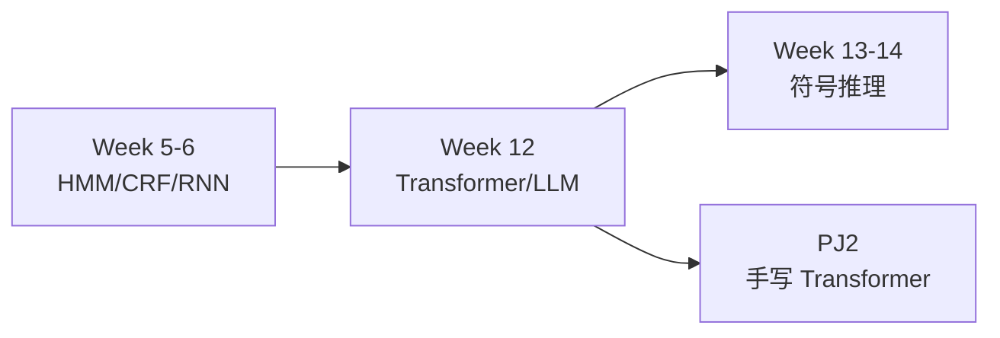
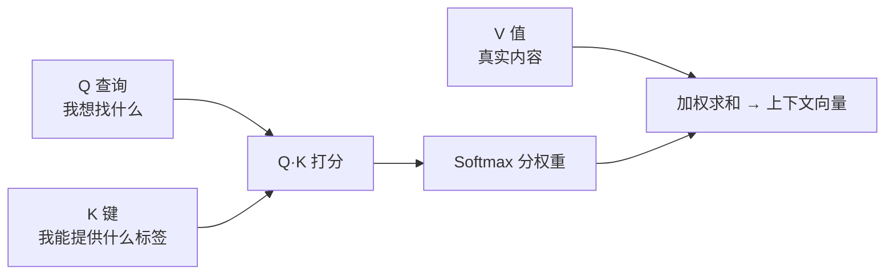
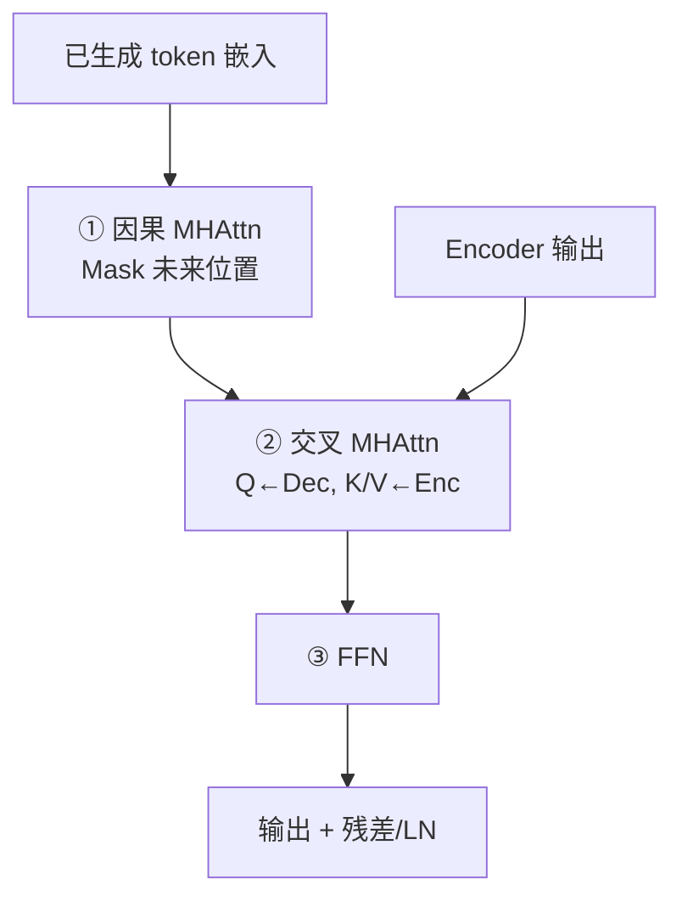
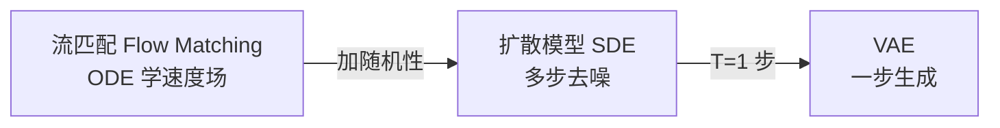

# Week 12 学习指南：Transformer 与大语言模型

> **课程**：人工智能（H）CS30057h.01  
> **覆盖周次**：Week 12（2026-06-09 前后）  
> **主要来源**：Week 12 课程记录、课件 09、AIMA 第 24 章  
> **生成方式**：NotebookLM 分层问答 → Agent 审核整合  
> **生成日期**：2026-06-16  
> **Raw run**：`notebooklm-raw/week12/runs/latest/`（14/14 batch）  
> **术语格式**：术语表及正文**首次出现**时，专业名词采用 **中文（English）**；英文缩写采用 **缩写（English full form，中文）**，便于对照英文试卷。

---

## 0. 术语表

| 术语 | 大白话解释 | 生活类比 |
|------|-----------|----------|
| 🔗 **长程依赖（Long-range dependency）** | 序列中相距很远的词之间仍需建立关联 | 读长篇小说：第一章伏笔在第十章才揭晓 |
| 🔗 **注意力机制（Attention）** | 按相关性从全序列「检索」信息，而非逐步压缩记忆 | 开卷考试：翻到最相关页，而非背整本书 |
| 🔗 **Q / K / V（Query / Key / Value，查询/键/值）** | 检索系统的三角色 | 图书馆：搜索词、书名索引、书内干货 |
| 🔗 **自注意力（Self-Attention）** | 同一序列内部做 Q/K/V 检索 | 读一句话时，每个词去「问」其他词 |
| 🔗 **缩放点积注意力（Scaled Dot-Product Attention）** | $QK^T/\sqrt{d}$ 再 softmax 加权 $V$ | 打分前先除以维度，防止分数爆炸 |
| 🔗 **MHAttn（Multi-Head Attention，多头注意力）** | 多个子空间并行做注意力再拼接 | 多副眼镜同时看同一段文字的不同侧面 |
| 🔗 **因果掩码（Causal Mask）** | 生成时禁止「偷看」未来 token | 写作文：只能根据已写内容续写 |
| 🔗 **交叉注意力（Cross-Attention）** | Q 来自解码器，K/V 来自编码器 | 翻译时：用已译片段去原文里找对应 |
| 🔗 **位置嵌入（Positional embedding）** | 给无位置感的注意力机制注入词序 | 给每页书贴页码，否则顺序全乱 |
| 🔗 **残差连接 + 层归一化（Residual + LayerNorm）** | $x + f(x)$ 后归一化，稳住深层训练 | 高速公路旁修辅路：信息总有直达通道 |
| 🔗 **BERT（Bidirectional Encoder Representations from Transformers，双向编码器表示）** | Encoder-only，双向掩码语言模型 | 完形填空专家：上下文双向理解 |
| 🔗 **GPT（Generative Pre-trained Transformer，生成式预训练 Transformer）** | Decoder-only，自回归预测下一词 | 接龙高手：只看上文往下写 |
| 🔗 **KV cache（Key-Value cache，键值缓存）** | 已算过的 K/V 向量在生成时复用 | 查过的索引卡片不用重抄一遍 |
| 🔗 **零样本（Zero-shot）** | 不改权重，靠提示词完成新任务 | 没练过这题，但会读题干照做 |
| 🔗 **FFN（Feed-Forward Network，前馈网络）** | 逐位置两层线性+ReLU 的非注意力子层 | Transformer 块里的 MLP 部分 |
| 🔗 **MLM（Masked Language Model，掩码语言模型）** | 随机遮词再预测，BERT 预训练目标 | 完形填空式预训练 |
| 🔗 **语义网络 / 框架（Semantic network / Frame）** | 符号主义知识表示：节点+边 / 结构化槽位 | 家谱图 / 填表式人物档案 |

## 1. 知识地图（L0）

### 1.1 在整门课中的位置

Week 12 处于 **「序列建模巅峰 → 符号主义回归」** 的转折节点：

1. 承接 Week 5–6（HMM/CRF/RNN/LSTM）：从「局部马尔可夫」到「全序列并行检索」
2. 奠定 PJ2 Transformer 手写实现的知识基础
3. 在 DL 黑箱反思后，为 Week 13–14 符号推理铺路

（来源：Week 12 记录、课件 09）

> **课纲注**：Week 12 **非期末主战场**；深度生成模型统一视角 **不考**（见 Week 13 考试说明）。

### 1.2 学习路径



### 1.3 核心子主题清单

| 优先级 | 主题 | 期末关联 |
|--------|------|---------|
| **P0** | Q/K/V 直觉 → Scaled Dot-Product | 概念 / PJ2 |
| **P0** | Encoder 双向 vs Decoder 因果+交叉 | 概念 / PJ2 |
| **P0** | T5/BERT/GPT 三范式对比 | 概念选择 |
| **P1** | GPT 胜出四因、零样本 | 概念 |
| **P1** | 语义网络/框架铺垫 | 为 W13 服务 |
| **了解** | VAE/扩散/流匹配统一视角 | **不考** |

---

## 2. 核心知识

### 2.0 Transformer 全景：从 RNN 瓶颈到并行检索（Parallel retrieval）

> **本节叙事线**：
>
> ```
> A. RNN 为何吃力？     →  顺序压缩，长句「转头就忘」
>         ↓
> B. Attention 直觉     →  Q/K/V 图书馆检索，跳过距离限制
>         ↓
> C. 公式与多头         →  softmax(QK^T/√d)V，矩阵并行
>         ↓
> D. Enc/Dec 分工       →  双向理解 vs 因果生成+交叉融合
>         ↓
> E. 预训练范式         →  T5/BERT/GPT，GPT 为何胜出
>         ↓
> F. 符号铺垫           →  DL 黑箱反思，回归可解释知识表示
> ```

> **本节要回答**：Transformer 相对 RNN 到底解决了什么？学完你应该能画出 Enc/Dec 数据流，并解释 BERT 与 GPT 的核心差异。

**模块解决什么问题**：序列建模中的 **长程依赖**——RNN 用固定维向量压缩历史，距离越远信息损失越大；Transformer 用注意力让任意两位置直接「对话」。

**学完能做什么**：

1. 口述 Q/K/V 三步检索并用图书馆类比
2. 写出 Scaled Dot-Product Self-Attention 矩阵公式
3. 对比 Encoder 双向注意力与 Decoder 因果掩码
4. 用 6 行表区分 T5/BERT/GPT
5. 为 PJ2 列出 Encoder/Decoder 必实现组件

（来源：Week 12 记录、课件 09）

---

#### A. 从 Week 5–6 到 Attention：为何需要新架构？

> **承接 Week 5–6**：HMM/CRF 受马尔可夫假设约束，当前状态只看极少数前序；RNN/LSTM 虽能建模序列，但信息须经逐步压缩传递，长序列仍易遗忘。

> **追问：RNN 的「记忆」和 Attention 的「检索」本质差在哪？**
>
> RNN 像**边走边记摘要**：每读一个新词，就把旧摘要和新词揉进一个固定长度的向量——摘要越写越挤，远处细节必然丢失。
>
> Attention 像**带着问题翻全书**：当前位置的 Q 直接去和所有位置的 K 比对，相关度高的 V 多拿一点——**距离不再是障碍**，只受算力（$O(n^2)$）限制。

（来源：Week 12 记录、`w12-bridge-w56`）

---

#### B. Attention 直觉：Q、K、V 各干什么？

> **本节要回答**：不用公式，你能向同学解释「自注意力在检索什么」吗？



| 角色 | 含义 | 类比 |
|------|------|------|
| **Q (Query)** | 当前位置「想查什么」 | 搜索关键词 |
| **K (Key)** | 各位置对外展示的「标签」 | 书名/索引 |
| **V (Value)** | 被检索的「干货内容」 | 书页正文 |

三步策略：**打分** → **分权重** → **加权求和**。核心价值：任意位置可直接关注任意位置，解决长程依赖。

（来源：Week 12 记录、课件 09、`w12-attention-intuition`）

---

#### C. Scaled Dot-Product Self-Attention 公式

> **承接 B 节**：直觉有了，现在落到可实现的五步计算。

**符号表**：

| 符号 | 含义 |
|------|------|
| $x_i$ | 第 $i$ 个词的嵌入向量 |
| $W_q, W_k, W_v$ | 投影权重矩阵 |
| $q_i = W_q x_i$, $k_j = W_k x_j$, $v_j = W_v x_j$ | 投影后的 Q/K/V |
| $d$ | $q, k$ 的维度 |
| $a_{ij}$ | 位置 $i$ 对 $j$ 的注意力权重 |
| $c_i$ | 位置 $i$ 的上下文摘要向量 |

**五步流程**：

1. **线性投影**：$q_i, k_j, v_j$
2. **打分**：$r_{ij} = q_i \cdot k_j$（非对称：$r_{ij} \neq r_{ji}$）
3. **缩放**：除以 $\sqrt{d}$，防止高维点积过大导致 softmax 饱和
4. **归一化**：$a_{ij} = \mathrm{softmax}_j(r_{ij}/\sqrt{d})$
5. **加权求和**：$c_i = \sum_j a_{ij} v_j$

**矩阵形式**：

$$\text{Attention}(Q, K, V) = \mathrm{softmax}\!\left(\frac{QK^T}{\sqrt{d}}\right) V$$

> **直观理解：为什么要除以 $\sqrt{d}$？**
>
> 维度 $d$ 很大时，随机向量的点积方差随 $d$ 增大。不缩放的话 softmax 输入极端 → 梯度几乎为 0（「赢家通吃」过头）。除以 $\sqrt{d}$ 把分数拉回合理范围。

**多头注意力**：把序列切成 $m$ 个子空间，每头独立 $(W_q^{(h)}, W_k^{(h)}, W_v^{(h)})$，并行计算后 **拼接（Concat）** 而非简单求和——保留不同侧面的细粒度特征。GPU 上全程矩阵运算，无 RNN 的顺序瓶颈。

（来源：Week 12 记录、课件 09、`w12-self-attention`）

**C 节小结** → 公式解决了「怎么算」，但 Enc/Dec 用同一公式时「谁能看谁」完全不同——这是下一节的硬边界。

---

#### D. Transformer Encoder 与 Decoder

> **本节要回答**：为什么 BERT 能双向看，GPT 只能看左边？

##### D.1 Encoder 层结构

| 组件 | 作用 |
|------|------|
| **双向 MHAttn** | 输入全给定，每位置融合上下文明 |
| **FFN（Feed-Forward Network，前馈网络）** | 逐位置相同的两层线性+ReLU，进一步非线性变换 |
| **残差 + LayerNorm** | 子层输出 $=\mathrm{LayerNorm}(x + f(x))$，稳梯度、快收敛 |
| **位置嵌入** | 与词嵌入相加，注入顺序信息 |
| **堆叠** | 通常 6+ 层，逐层抽象语义 |

##### D.2 Decoder 层结构



| 子层 | 关键约束 |
|------|---------|
| **因果注意力** | 位置 $i$ 只能 attend 到 $\le i$；训练用 Mask 把未来权重置 $-\infty$ |
| **交叉注意力** | Q 来自 Decoder，K/V 来自 Encoder——生成每个词时「查原文」 |
| **FFN + 残差 + LN** | 与 Encoder 同构 |

**Encoder vs Decoder 对比**：

| 维度 | Encoder | Decoder |
|------|---------|---------|
| 注意力类型 | **双向** Self-Attn | **因果** Self-Attn + **交叉** Attn |
| 核心组件 | MHAttn + FFN | 因果 MHAttn + 交叉 MHAttn + FFN |
| 主要功能 | 提取输入特征 | 逐步生成输出 |
| 代表模型 | BERT | GPT |

**Self-Attn vs Cross-Attn**：

| 维度 | Self-Attention | Cross-Attention |
|------|----------------|-----------------|
| Q/K/V 来源 | 同一序列 | Q←当前序列，K/V←另一序列 |
| 位置 | Enc 各层；Dec 第一层 | 仅 Dec 第二层 |
| 目的 | 句内依赖 | 跨序列对齐（如翻译） |

（来源：Week 12 记录、课件 09、`w12-transformer-encoder`、`w12-transformer-decoder`）

**D 节小结** → 结构定了，预训练时「遮词还是猜下一个」决定你练出 BERT 还是 GPT。

---

#### E. 预训练范式：T5/BERT/GPT

> **本节要回答**：三种架构分别擅长什么任务？为何 GPT 成为主流？

| 特性 | **T5 / BART** | **BERT** | **GPT** |
|------|--------------|----------|---------|
| 架构 | Encoder-Decoder | Encoder-only | Decoder-only |
| 注意力 | Enc 双向 + Dec 因果+交叉 | 全双向 | 全因果 |
| 预训练任务 | T5 随机掩码生成；BART 加噪复原 | 掩码语言模型 (MLM) | 下一词预测 (NTP) |
| 擅长任务 | Seq2seq：翻译、摘要 | 理解：分类、标注、抽取 | 生成：对话、问答、推理 |
| 计算特性 | 较重 | 推理常需全量重算 | **KV 缓存**，生成极快 |
| 当前地位 | 逐渐非主流 | 领域理解仍有用 | **当代 LLM 基座** |

**GPT 胜出四因**（来源：`w12-gpt-wins`）：

1. **KV 缓存**：因果注意力下已处理 token 的 K/V 可复用，解码加速
2. **任务性能**：同等数据规模下综合优于 BERT/T5
3. **范式一致**：预训练「给定上文预测下文」≈ 下游生成逻辑 → 提示工程即可迁移
4. **零样本**：海量预训练后，改提示词即可处理未见任务，无需微调

> **追问：BERT 双向明明「看得更多」，为什么生成任务反而输给 GPT？**
>
> 生成必须**从左到右**——你不能在写第 5 个字时偷看第 10 个字。BERT 的双向是**理解特权**（输入已全给定），不是**生成特权**。硬拿 Encoder 做自回归，要么泄露未来信息，要么牺牲并行效率。GPT 从架构上就服从生成因果律，且预训练目标与下游形式一致。

（来源：Week 12 记录、`w12-pretrain-paradigms`、`w12-gpt-wins`）

---

#### F. 生成模型统一视角（了解即可，期末不考）

> **课纲注**：深度生成模型章节 **不作为期末考核内容**。

Week 12 将 VAE、扩散、流匹配置于「从简单分布 $P$ 变换到数据分布 $Q$」的统一视角：



- **VAE**：一步从隐空间采样解码
- **扩散**：多步去噪，每步近似简单 VAE
- **流匹配**：学确定性向量场，扩散的简化版

关系：**流匹配 + 随机性 → 扩散；扩散步数 → 1 → VAE**。

（来源：Week 12 记录、`w12-gen-unified`）

---

#### G. 符号主义铺垫：从 DL 黑箱到 Week 13

> **本节要回答**：学完 Transformer 巅峰，课程为何突然讲语义网络？

Week 12 末尾引入符号主义知识表示，为 Week 13–14 做铺垫：

| 表示法 | 核心思想 | 推理方式 |
|--------|---------|---------|
| **语义网络** | 节点=概念，边=关系（is-a 等） | 图上搜索/扩散 |
| **框架 (Frame)** | 结构化槽位+默认值，可嵌套 | 类比推理 |

**DL vs 符号主义转折**：

| 维度 | Week 12 DL | Week 13+ 符号主义 |
|------|-----------|------------------|
| 可解释性 | 黑箱隐状态 | 显性 IF-THEN 推理链 |
| 样本效率 | 需海量数据 | 注入规则即可 |
| 逻辑精准 | 可能「8.11 > 8.2」类错误 | 数值逻辑严谨 |

Week 12 提供符号主义的「骨架」（如何表示知识），Week 13 赋予「灵魂」（不确定性下如何推理）。

（来源：`w12-bridge-symbolic`、`w12-bridge-w13`）

---

### 2.1 PJ2 实践要点

| 组件 | 实现要点 |
|------|---------|
| Self-Attention | Q/K/V 投影 + scaled dot-product |
| Encoder | 双向 MHAttn + FFN + 残差 + LN |
| Decoder | 因果 Mask + Cross-Attn + FFN |
| 工程 | 参数量大，建议 **8GB+ 显存**；可向助教申请 GPU（4090/5090） |
| 限制 | **禁止**直接调用 `transformers`/`sklearn` 等封装，须底层手写 |

（来源：`w12-pj2`、Week 10/12 记录）

---

## 3. 重难点与易错点

### 3.1 五组易混概念

| 组 | 概念 A | 概念 B | 关键区分 |
|----|--------|--------|---------|
| 1 | Encoder | Decoder | 双向 vs 因果+交叉 |
| 2 | Self-Attn | Cross-Attn | Q/K/V 同源 vs Q 来自 Dec、K/V 来自 Enc |
| 3 | BERT | GPT | 双向理解 vs 单向生成；KV 缓存仅 GPT 友好 |
| 4 | 因果 Attn | 双向 Attn | 能否看未来；生成 vs 理解 |
| 5 | VAE | 扩散/流匹配 | 一步 vs 多步；**了解即可，不考** |

### 3.2 高频错误

1. **把 BERT 当生成模型**：MLM 是填空，不是自回归接龙
2. **忘记 $\sqrt{d}$ 缩放**：公式默写时漏除
3. **混淆 Cross-Attn 的 Q 来源**：Q 永远来自 Decoder 当前层
4. **以为 Encoder 也有 Mask**：只有 Decoder 的自注意力需要因果掩码
5. **期末复习生成模型**：VAE/扩散/流匹配 **不考**，时间留给 W13–14

（来源：`w12-mistakes`）

---

## 4. 知识串联（L4）

### 4.1 周次衔接

```txt
Week 5-6              Week 12                 Week 13-14
────────              ───────                 ──────────
HMM 马尔可夫    →    全序列 Attention    →    符号推理+CF
RNN 顺序压缩    →    并行矩阵检索        →    可解释规则系统
CRF 全局解码    →    Transformer+LLM     →    消解/Prolog/CLIPS
```

### 4.2 与 PJ2 的对应

| Week 12 概念 | PJ2 应用 |
|-------------|---------|
| Scaled Dot-Product | 注意力模块核心 |
| Encoder 双向层 | 理解侧 baseline |
| Decoder 因果+交叉 | 生成侧实现 |
| 残差+LN | 训练稳定性 |

### 4.3 推荐学习顺序

**优先级：极高**
1. Q/K/V 直觉 + 图书馆类比
2. Attention 矩阵公式（含 $\sqrt{d}$）
3. Encoder 双向 vs Decoder 因果掩码

**优先级：高**
4. T5/BERT/GPT 六行对比表
5. GPT 胜出四因
6. Self-Attn vs Cross-Attn

**优先级：中**
7. 语义网络/框架铺垫（为 W13 预习）
8. PJ2 组件清单

**可跳过（不考）**
9. VAE/扩散/流匹配统一视角

---

## 5. 资料索引

| 类型 | 路径 | NotebookLM batch |
|------|------|-----------------|
| 知识图谱 | `notebooklm-raw/week12/knowledge-graph.md` | — |
| Raw run | `notebooklm-raw/week12/runs/latest/` | 14/14 |
| 课程记录 | Week 12 周五 AI 笔记 | `L0-positioning` 等 |
| 课件 | `3_课件/09*.pdf` | 课件 09 |
| 教材 | AIMA 4th Ed Ch.24 | 参考书 |

**Batch 速查**：

| batch | 指南章节 |
|-------|---------|
| `w12-attention-intuition` | §2.B |
| `w12-self-attention` | §2.C |
| `w12-transformer-encoder/decoder` | §2.D |
| `w12-pretrain-paradigms` | §2.E |
| `w12-gpt-wins` | §2.E |
| `w12-bridge-symbolic/w13` | §2.G |
| `w12-gen-unified` | §2.F（不考） |
| `w12-pj2` | §2.1 |
| `w12-mistakes` | §3 |

---

## 6. Step 4 补充采集说明

| 缺口 | 建议 batch | 说明 |
|------|-----------|------|
| LSTM 细节截断 | 回查 `week6/runs/latest` | `w12-bridge-w56` 末尾不完整 |
| PJ2 调试经验 | `supplement-pj2-debug` | 可选：梯度/显存排错 |
| 位置编码变体 | `supplement-pos-enc` | 了解 RoPE 等，非课纲必考 |

---

*本指南由 NotebookLM（AI Notebook `505bdb1c-0034-4e14-89df-0b14bf3fc723`）分层问答生成，Agent 审核整合。规则见 `.cursor/skills/ai-course-notebooklm/SKILL.md`。*
