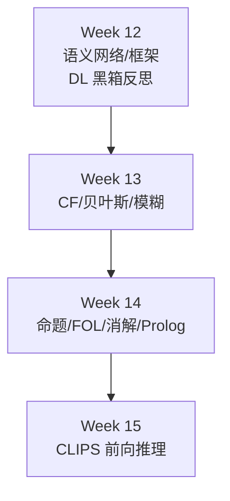
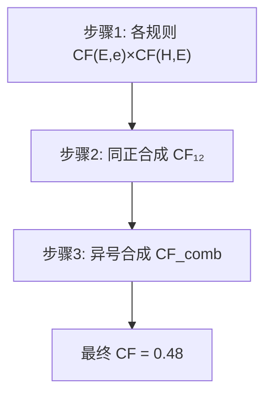
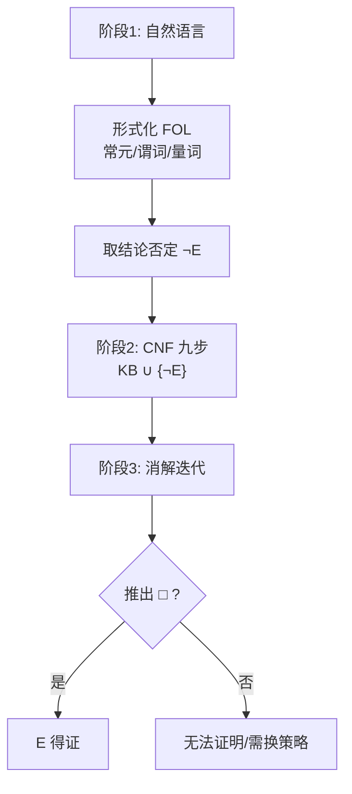

# Week 13–14 学习指南：不确定性推理 + 逻辑/消解

> **课程**：人工智能（H）CS30057h.01  
> **覆盖周次**：Week 13（不确定性推理）+ Week 14（命题/谓词逻辑与消解）  
> **主要来源**：Week 13/14 课程记录、课件 05/07、AIMA、Luger  
> **生成方式**：NotebookLM 分层问答 → Agent 审核整合  
> **生成日期**：2026-06-16  
> **Raw run**：`notebooklm-raw/week13-14/runs/latest/`（19/19 batch）  
> **术语格式**：术语表及正文**首次出现**时，专业名词采用 **中文（English）**；英文缩写采用 **缩写（English full form，中文）**，便于对照英文试卷。

---

## ⚠️ 期末考试须知（章首必读）


| 项         | 内容                                                                  |
| --------- | ------------------------------------------------------------------- |
| **考试形式**  | **开卷**；试卷 **英文**；选择 + 解答                                            |
| **复习范围**  | 内容均在 **课程 PPT** 中；开卷务必熟悉 PPT 定位                                     |
| **★必考 1** | **CF（Certainty Factor，确定性因子）计算题**——公式 + 多规则合成手算                     |
| **★必考 2** | **消解证明大题**——NL → FOL → CNF → Resolution → 空子句（见 §0 缩写释义）            |
| **明确不考**  | **深度生成模型**（VAE（Variational Autoencoder，变分自编码器）/扩散/流匹配等，Week 12 已标注） |
| **概念级**   | PageRank、模糊逻辑（Fuzzy Logic）、贝叶斯框架（Bayesian framework）、Prolog 机制      |


> **备考策略**：CF 手算练到闭卷也能写步骤；消解大题按 **9 步 CNF + 反证法流水线** 做成 checklist，开卷时逐步勾选。

（来源：Week 13/14 记录、`w13-exam-info`）

---

## 0. 术语表


| 术语                                         | 大白话解释                      | 生活类比                     |
| ------------------------------------------ | -------------------------- | ------------------------ |
| 🔗 **CF（Certainty Factor，确定性因子）**          | 用 $[-1,1]$ 数值表示对命题的信任程度    | 医生说「八成像是感冒」——不是严格概率      |
| 🔗 **$CF(E,e)$（证据可信度）**                    | 观测事实 $e$ 下，证据 $E$ 有多可信     | 体温计读数让你多相信「发烧」           |
| 🔗 **$CF(H,E)$（规则强度）**                     | 若 $E$ 肯定成立，规则推 $H$ 的强度     | 专家写的规则置信度 0.7            |
| 🔗 **$CF(H,e)$（结论强度）**                     | 单条规则推出的结论强度                | $CF(E,e) \times CF(H,E)$ |
| 🔗 **$CF_{comb}$（多规则合成）**                  | 多条规则指向同一 $H$ 时的合成          | 两个医生意见怎么合并               |
| 🔗 **贝叶斯后验（Bayesian posterior）**           | 先验 × 似然 → 证据更新后的信念         | 收到新化验单后更新诊断              |
| 🔗 **MAP（Maximum A Posteriori，最大后验估计）**    | 最大后验 ≈ 损失 + 权重平方惩罚         | 「偏好简单模型」的数学版             |
| 🔗 **L2 正则（L2 regularization，L2 正则化）**     | 等价于高斯先验的参数惩罚项              | 限制权重大小                   |
| 🔗 **马尔可夫性（Markov property）**              | 下一状态只依赖当前，与更早历史无关          | 下棋：只关心当前局面               |
| 🔗 **PageRank（网页排名算法）**                    | 网页图上随机游走的稳态分布 = 质量分        | 被名站链接的网页更「重要」            |
| 🔗 **隶属度 $\mu(x)$（membership degree）**     | 元素属于模糊集合的程度 $[0,1]$        | 「比较高」不是非 0 即 1           |
| 🔗 **命题逻辑（Propositional Logic）**           | 原子命题 + 连接词，无个体/量词          | 只能写 $P$、$Q$，不能说「所有人」     |
| 🔗 **FOL（First-Order Logic，一阶谓词逻辑）**       | 常元/变元/谓词/量词，可表达个体关系        | 「所有人都会死，苏格拉底是人」          |
| 🔗 **霍恩子句（Horn clause）**                   | 至多一个正文字的子句；Prolog 的基础      | `A :- B, C.`             |
| 🔗 **CNF（Conjunctive Normal Form，合取范式）**   | 子句的合取，每子句是文字的析取            | 消解算法的输入格式                |
| 🔗 **Skolem 化（Skolemization）**             | 用 Skolem 常元/函数消去 $\exists$ | 「存在某人」→ 给个具体代表           |
| 🔗 **合一（Unification）**                     | 找替换使两表达式相同                 | 把规则里的 $x$ 换成 `socrates`  |
| 🔗 **消解（Resolution）**                      | 互补文字消去，产生新子句               | 反证法：假设否定，推出矛盾            |
| 🔗 **空子句 $\square$（empty clause）**         | 消解成功标志：矛盾                  | 证明原命题必真                  |
| 🔗 **CWA（Closed World Assumption，封闭世界假设）** | 未知=假                       | Prolog 否定即失败             |
| 🔗 **OWA（Open World Assumption，开放世界假设）**   | 未知=未知                      | 知识图谱默认                   |


---

## 1. 知识地图（L0）

### 1.1 在整门课中的位置

Week 13–14 是 **符号主义推理（Symbolic reasoning）** 核心，承接 Week 12 知识表示（Knowledge representation）铺垫，通向 Week 15 CLIPS：




### 1.2 Week 13 → Week 14 逻辑衔接


| 转折           | Week 13    | Week 14                         |
| ------------ | ---------- | ------------------------------- |
| 不确定性 → 确定性逻辑 | CF 量化规则强度  | 命题逻辑 / FOL 形式化                  |
| 启发式 → 严格证明   | MYCIN 风格代数 | Resolution（消解）反证法               |
| 铺垫 → 工具      | 产生式规则的不确定性 | Prolog 霍恩子句 + Backward chaining |


### 1.3 核心子主题与期末权重


| 优先级     | 主题                              | 期末        |
| ------- | ------------------------------- | --------- |
| **★★★** | CF 公式 + 多规则手算                   | **必考计算**  |
| **★★★** | CNF 9 步 + Resolution 流水线        | **必考大题**  |
| **★★**  | 命题逻辑（Propositional Logic）连接词/局限 | 基础        |
| **★★**  | 一阶谓词逻辑（FOL）量词/合一/三段论            | 大题前置      |
| **★**   | 贝叶斯（Bayesian）、L2=高斯先验           | 概念        |
| **★**   | PageRank、模糊逻辑（Fuzzy Logic）      | 概念/选择     |
| **★**   | Prolog 反向推理（Backward chaining）  | 概念；W15 对照 |


---

## 2. 核心知识

### 2.0 模块全景：符号主义「知识 + 推理」

> **本节叙事线**：
>
> ```
> A. 为何回归符号？     →  DL 黑箱 vs 可解释/样本效率
>         ↓
> B. 不确定性怎么办？   →  贝叶斯框架 → CF 手算（★必考）
>         ↓
> C. 逻辑语言           →  命题逻辑 → FOL（大题前置）
>         ↓
> D. 机器怎么证明？     →  CNF 9 步 → 消解 → 空子句（★必考大题）
>         ↓
> E. Prolog 工程化      →  霍恩子句 + 反向推理 → Week 15 CLIPS 对照
> ```

> **本节要回答**：符号主义相对 DL 的优势是什么？期末两道必考题分别考什么能力？

**学完能做什么**：

1. **闭卷**完成 CF 三规则合成手算（含同正、异号公式）
2. **开卷**按 checklist 完成 NL→FOL→CNF→消解证明
3. 区分 $CF(E,e)$ 与 $CF(H,E)$，正确用 min/max 组合证据
4. 写出三段论 FOL 形式并用 UI 实例化
5. 解释 Prolog 与 CLIPS 的推理方向差异

---

### 2.1 Week 13：不确定性推理

#### A. 符号主义（Symbolism）vs 深度学习（Deep Learning）

> **承接 Week 12**：Transformer 代表连接主义巅峰，但黑箱、需大数据、逻辑易错（如 8.11 > 8.2）。


| 维度   | 符号主义              | 深度学习        |
| ---- | ----------------- | ----------- |
| 可解释性 | 白盒，IF-THEN 推理链可追溯 | 黑箱，权重难解释    |
| 样本效率 | 注入规则即可            | 需海量标注数据     |
| 知识注入 | 显式规则/公理           | 隐式学在权重里     |
| 逻辑精准 | 严谨数值/因果逻辑         | 模式匹配，可能逻辑错误 |
| 模块化  | 改单条规则副作用小         | 微调可能全局漂移    |


（来源：Week 13 记录、`w13-symbolic-vs-dl`）

---

#### B. 贝叶斯推理框架（Bayesian inference framework）（概念）

> **本节要回答**：先验、似然、后验各代表什么？L2 正则和贝叶斯有何联系？

**核心流程**：先验 $P(H)$ → 观测似然 $P(E \mid H)$ → 后验 $P(H \mid E) = \frac{P(E \mid H)P(H)}{P(E)}$ → 结合损失函数做决策（期望效用最大 / 期望损失最小）。

> **符号都是什么？（先记这张表）**
>
>
> | 符号           | 英文                  | 含义                                       | 医学诊断例           |
> | ------------ | ------------------- | ---------------------------------------- | --------------- |
> | **$H$**      | **H**ypothesis      | **假设**——你想判断真假的命题                        | 「患者得了流感」        |
> | **$E$**      | **E**vidence        | **证据**——能帮你更新信念的观测/事件                    | 「体温 39°C」「化验阳性」 |
> | **$P(H)$**   | Prior               | **先验**：还没看到 $E$ 之前，对 $H$ 的信心             | 流感季节前，人群中 5% 患病 |
> | **$P(E \mid H)$** | Likelihood          | **似然**：若 $H$ 成立，出现证据 $E$ 有多常见            | 真患流感时，高烧概率 0.8  |
> | **$P(H \mid E)$** | Posterior           | **后验**：看到 $E$ 之后，$H$ 成立的概率               | 高烧后，患流感概率升到 0.6 |
> | **$P(E)$**   | Evidence / marginal | **证据概率**（归一化常数）：$P(E)=\sum_H P(E \mid H)P(H)$ | 不管病因，出现高烧的总概率   |
>
>
> **和后面 CF 里的 $e$ 怎么区分？**
>
> - **贝叶斯**常用大写 **$E$**：把证据当作一个**事件/命题**（如「化验阳性」），直接写进 $P(E \mid H)$。
> - **CF（MYCIN）**常用小写 **$e$**：表示当前**全部观测事实的集合**（体温、咳嗽、化验……）；单条证据命题仍用大写 **$E$**，$CF(E,e)$ =「在观测 $e$ 下，证据 $E$ 有多可信」。
> - 同一诊断任务里可对应：$H$=结论，$E$=某条症状/检验，$e$=病人此刻所有已知信息。
>
> **公式怎么读？** 后验 ∝ 似然 × 先验；$P(E)$ 只是让后验归一化成概率。流程四步：**先验定基调 → 新证据用似然修正 → 得后验 → 选期望损失最小的行动**（治/不治、检/不检）。

> **追问：CF 和贝叶斯都是「不确定」，为何课程两套都讲？**
>
> **贝叶斯**遵循概率公理，$P(H)+P(\neg H)=1$，适合有统计数据的场景；**CF** 是 MYCIN 的启发式代数，区分「信任增长 MB（Measure of Belief，信任度）」与「不信任增长 MD（Measure of Disbelief，不信任度）」，允许 $CF=0$（既不信也不反信），更贴近专家直觉但**非严格概率**。期末 **必考 CF 手算**，贝叶斯侧重概念（含 L2 联系）。

**L2 正则 = 高斯先验**：

$$\log P(w \mid Data) = \log P(Data \mid w) + \log P(w)$$

当 $P(w)$ 为零均值高斯，$\log P(w)$ 含 $-\|w\|^2$ 项 → 等价于损失函数加 $\lambda\|w\|^2$。**L2 正则的本质：对参数施加零均值高斯先验，偏好简单模型。**

> **「先验」「高斯」「零均值」都是什么？**
>
> | 名词 | 大白话 | 在本节指什么 |
> |------|--------|-------------|
> | **先验 $P(w)$** | 看数据**之前**，你对参数 $w$ 的「主观信念」 | 训练开始前，权重**更可能接近 0**，不太相信会特别大 |
> | **高斯分布**（Gaussian，正态分布） | 钟形曲线；由**均值** $\mu$ 和**方差** $\sigma^2$ 决定 | 一维：$P(w)\propto \exp\big(-\frac{(w-\mu)^2}{2\sigma^2}\big)$ |
> | **零均值高斯** | 钟形曲线**中心在 0**（$\mu=0$） | 最相信 $w\approx 0$；$\|w\|$ 越大先验越低 |
>
> **为什么叫「先验」？** 上式里 $\log P(Data \mid w)$ 是数据似然（拟合好不好），$\log P(w)$ 是**还没拟合数据时**对 $w$ 的偏好——和诊断里的先验 $P(H)$ 同一角色，只是对象从「假设 $H$」换成「参数 $w$」。
>
> **零均值高斯 → L2 怎么对上？** 设每个权重独立、$\mu=0$：
> $$\log P(w) = \text{常数} - \frac{1}{2\sigma^2}\sum_i w_i^2 = \text{常数} - \frac{1}{2\sigma^2}\|w\|^2$$
> 最大化 $\log P(w \mid Data)$ = 最大化 $\log P(Data \mid w) + \log P(w)$ ↔ 最小化损失时多加一项 $\dfrac{1}{2\sigma^2}\|w\|^2$，即 Week 10 的 **L2 正则** $\lambda\|w\|^2$（$\lambda$ 与 $\sigma^2$ 成反比：先验越「紧」，惩罚越强）。
>
> **直观**：零均值高斯先验 = 「权重默认应在 0 附近，别为了迎合训练集噪声长得太大」→ 曲线更平滑、更简单 → 防过拟合。与 §2.1-B 中 $P(H)$ 先验、Week 10 AdamW 的 $\lambda$ 权重衰减是同一思想的两种写法。

（来源：课件 05、`w13-bayes-framework`）

**CF vs 贝叶斯对比**：


| 维度     | 确定性因子 CF  | 贝叶斯概率     |
| ------ | --------- | --------- |
| 理论基础   | 专家启发式代数   | 概率公理      |
| 不确定性类型 | 信任/不信任可分离 | 概率分布      |
| 规则独立性  | 相对独立，易加规则 | 条件独立假设难满足 |
| 期末     | **★必考手算** | 概念（L2 联系） |


---

#### C. CF（Certainty Factor，确定性因子）理论（★必考）

> **本节要回答**：$CF(E,e)$ 和 $CF(H,E)$ 分别量化什么？三条合成规则是什么？

##### C.1 两类不确定性


| 符号            | 含义                    | 谁给定      |
| ------------- | --------------------- | -------- |
| **$CF(E,e)$** | 观测 $e$ 下证据 $E$ 的可信度   | 传感器/观测   |
| **$CF(H,E)$** | $E$ 完全成立时，规则推 $H$ 的强度 | 专家写在规则里  |
| **$CF(H,e)$** | 该规则推出的结论强度            | **计算得出** |


**单条规则核心公式**：

$$CF(H,e) = CF(E,e) \times CF(H,E)$$

> **注意**：若 $CF(E,e) < 0$，该规则通常**不触发**。

##### C.2 证据组合（前提内的 AND/OR/NOT）


| 逻辑                                   | 公式                                        |
| ------------------------------------ | ----------------------------------------- |
| **AND** $E_1 \land E_2 \land \cdots$ | $CF = \min[CF(E_1,e), CF(E_2,e), \ldots]$ |
| **OR** $E_1 \lor E_2 \lor \cdots$    | $CF = \max[CF(E_1,e), CF(E_2,e), \ldots]$ |
| **NOT** $\neg E$                     | $CF(\neg E,e) = -CF(E,e)$                 |


> **直观理解：AND 为什么取 min？**
>
> 想象门禁要**同时**刷工卡 AND 通过人脸——整体可信度取决于**最弱的那一环**。OR 取 max 同理：多条出路取**最好**那条。

##### C.3 多规则合成 $CF_{comb}$（★核心）

设两条规则推出同一 $H$ 的强度为 $CF_1, CF_2$：


| 情况                      | 公式                                                          |
| ----------------------- | ----------------------------------------------------------- |
| **同正** $CF_1, CF_2 > 0$ | $CF_{comb} = CF_1 + CF_2(1 - CF_1)$                         |
| **同负** $CF_1, CF_2 < 0$ | $CF_{comb} = CF_1 + CF_2(1 + CF_1)$                         |
| **异号** 一正一负             | $CF_{comb} = \dfrac{CF_1 + CF_2}{1 - \min(|CF_1|, |CF_2|)}$ |


（来源：课件 05 Slide 22–25、Luger p.352、`w13-certainty-factor`）

**C 节小结** → 公式齐全了，下面用完整数值题走一遍考试同款流程。

---

#### D. CF 数值手算完整例题（★期末必考模板）

> **本节要回答**：三道规则、三种符号，怎么一步步合成最终 $CF$？

**场景**：判断生物 $H$ 是否为链球菌，有三条规则：


| 规则    | 形式                          | 规则强度 $CF(H,E)$ |
| ----- | --------------------------- | -------------- |
| $r_1$ | IF $E_1$ AND $E_2$ THEN $H$ | 0.8            |
| $r_2$ | IF $E_3$ THEN $H$           | 0.5            |
| $r_3$ | IF $E_4$ THEN $H$           | **-0.4**（反对证据） |


**观测**：


| 证据    | $CF(E_i, e)$ |
| ----- | ------------ |
| $E_1$ | 0.7          |
| $E_2$ | 0.6          |
| $E_3$ | 0.4          |
| $E_4$ | 0.5          |


---

**步骤一：逐条规则算 $CF_i(H,e)$**

**规则 $r_1$**（AND 前提）：

1. 证据组合：$CF(E_{1 \cap 2}, e) = \min(0.7, 0.6) = \mathbf{0.6}$
2. 结论强度：$CF_1 = 0.6 \times 0.8 = \mathbf{0.48}$

**规则 $r_2$**：

$$CF_2 = 0.4 \times 0.5 = \mathbf{0.2}$$

**规则 $r_3$**（负规则强度）：

$$CF_3 = 0.5 \times (-0.4) = \mathbf{-0.2}$$

---

**步骤二：合成 $CF_1$ 与 $CF_2$（同正）**

$$CF_{12} = CF_1 + CF_2(1 - CF_1) = 0.48 + 0.2 \times (1 - 0.48)$$

$$= 0.48 + 0.2 \times 0.52 = 0.48 + 0.104 = \mathbf{0.584}$$

---

**步骤三：合成 $CF_{12}$ 与 $CF_3$（异号）**

$CF_{12} = 0.584 > 0$，$CF_3 = -0.2 < 0$ → 用异号公式：

$$\text{分母} = 1 - \min(|0.584|, |-0.2|) = 1 - 0.2 = 0.8$$

$$\text{分子} = 0.584 + (-0.2) = 0.384$$

$$CF_{comb} = \frac{0.384}{0.8} = \mathbf{0.48}$$

---

**最终答案**：$H$ 的综合确定性因子为 **0.48**。




> **考试书写 checklist**：
>
> 1. 列出每条规则的 $CF(E,e)$（AND 写 min）
> 2. 算 $CF_i = CF(E,e) \times CF(H,E)$
> 3. 两两合成：先合并同号，再处理异号
> 4. **写清用的公式名称**（同正/同负/异号）
> 5. 最终数值 **boxed 或划线强调**

（来源：Week 13 记录、`w13-cf-numeric`、课件 05）

**D 节小结** → CF 解决「规则有多可信」；PageRank/模糊逻辑是补充概念，了解即可。

---

#### E. 马尔可夫链（Markov chain）与 PageRank（概念）

**马尔可夫性（Markov property）**：下一状态只依赖当前状态，与更早历史无关。

**稳态**：反复 $S_{n+1} = S_n \times T$，状态分布收敛到唯一稳态（正则条件下）。

**PageRank**：

1. 网页 = 节点，超链接 = 有向边
2. 随机冲浪者跳转 → 转移矩阵
3. **稳态分布中各节点概率 = 网页 Rank**

（来源：课件 05、`w13-markov-pagerank`）

---

#### F. 模糊逻辑（Fuzzy Logic）（概念）


| 维度   | 概率论                  | 模糊逻辑                      |
| ---- | -------------------- | ------------------------- |
| 处理对象 | **随机性**（发生频率）        | **模糊性**（词汇边界不清）           |
| 数值含义 | 置信度 Degree of Belief | 真值程度 Degree of Truth      |
| 排中律  | $P(A)+P(\neg A)=1$   | 可同时以不同程度属于 $A$ 和 $\neg A$ |
| 推理运算 | 概率法则                 | AND→min，OR→max            |


（来源：`w13-fuzzy-logic`）

---

### 2.2 Week 14：逻辑与消解

#### G. 命题逻辑（Propositional Logic）

> **本节要回答**：五种连接词的真值条件？命题逻辑为什么不够用？

**五种连接词**：


| 连接词 | 符号                | 为真条件          |
| --- | ----------------- | ------------- |
| 否定  | $\neg$            | $P$ 假         |
| 合取  | $\land$           | 两者都真          |
| 析取  | $\lor$            | 至少一个真（含或）     |
| 蕴含  | $\rightarrow$     | **仅**「前真后假」为假 |
| 等价  | $\leftrightarrow$ | 真值相同          |


**善意推定**：$P$ 为假时，$P \rightarrow Q$ **自动为真**（不管 $Q$）。蕴含不要求因果关系。

**命题逻辑三大局限**：

1. 无法区分个体与集合（不能自动推「苏格拉底会死」）
2. 缺乏量词 $\forall, \exists$
3. 规模化困难（$n$ 个原子命题真值表 $2^n$ 行）

→ 需要 **FOL（First-Order Logic，一阶谓词逻辑）**。

（来源：`w14-propositional`、课件 07）

---

#### H. FOL（First-Order Logic，一阶谓词逻辑）

> **本节要回答**：项、谓词、量词各是什么？三段论怎么用 FOL + UI 推理？

**符号系统**：


| 类别   | 例子                    | 说明          |
| ---- | --------------------- | ----------- |
| 常元   | `socrates`            | 具体个体        |
| 变元   | `x`, `y`              | 占位符         |
| 函元   | `mother(x)`           | 项 → 项的映射    |
| 谓词   | `man(x)`, `mortal(x)` | 属性或关系       |
| 全称量词 | $\forall x$           | 对所有 $x$ 成立  |
| 存在量词 | $\exists x$           | 至少一个 $x$ 成立 |


**三段论示例**：

1. $\forall x(man(x) \rightarrow mortal(x))$ （规则）
2. $man(socrates)$ （事实）
3. **UI（Universal Instantiation，全称例化）**：将 $x$ 替换为 `socrates` → $man(socrates) \rightarrow mortal(socrates)$
4. **肯定前件** → $mortal(socrates)$

**合一（Unification）**：找替换 $\theta$ 使两表达式形式一致；消解前必须会合一。**出现检查（Occur Check）**：$x$ 不能与含 $x$ 的复杂项合一（如 $x$ vs $f(x)$）。

（来源：`w14-fol`、课件 07）

---

#### I. 消解原理（Resolution）（★必考大题核心）

> **本节要回答**：消解为什么用反证法？空子句 $\square$ 代表什么？

##### I.1 反证法思想

要证 $KB \models E$：

1. 构造 $S = KB \cup \neg E$
2. 将 $S$ 中所有公式化为 **CNF（Conjunctive Normal Form，合取范式）子句集**
3. 反复应用 **Resolution（消解）** 规则
4. 若推出 **空子句 $\square$（empty clause）** → $S$ 不可满足 → $\neg E$ 假 → **$E$ 必真**

> **追问：为什么不直接「证明」$E$，而要证 $\neg E$ 矛盾？**
>
> 消解只擅长处理**文字的析取**——CNF 子句集天然适合找**互补对** $L$ 与 $\neg L$。直接证 $E$ 没有统一的语法操作；反证法把「证真」转化成「证矛盾」，才能用同一套机械规则。

##### I.2 合取范式（CNF）转化九步法（★考试逐步写）


| 步   | 操作                                 | 要点                                                      |
| --- | ---------------------------------- | ------------------------------------------------------- |
| 1   | 消去 $\rightarrow, \leftrightarrow$  | $A \rightarrow B \equiv \neg A \lor B$                  |
| 2   | 否定内移                               | 德摩根律；$\neg\forall x P \equiv \exists x \neg P$          |
| 3   | 变量标准化                              | 不同量词辖域内变元改名，避免冲突                                        |
| 4   | 量词左移（前束化）                          | 所有量词移到最左                                                |
| 5   | Skolem 化（Skolemization）消 $\exists$ | 外层无 $\forall$：用常元；在 $\forall$ 辖域内：用 Skolem 函数           |
| 6   | 略去全称量词                             | 默认所有变元全称量化                                              |
| 7   | 分配律                                | $A \lor (B \land C) \equiv (A \lor B) \land (A \lor C)$ |
| 8   | 拆分为独立子句                            | 每个合取项成一个子句                                              |
| 9   | 子句间变量标准化                           | 各子句变元名互不相同                                              |


##### I.3 消解规则

- **合一（Unification）**：找 MGU（Most General Unifier，最一般合一子） $\theta$ 使 $L_i$ 与 $\neg M_j$ 一致
- **二进制消解**：从 $C_1, C_2$ 消去互补对，余下文字析取并应用 $\theta$
- **因子化**：子句内可合一的文字合并（保证完备性）

**效率策略**（概念）：支持集策略、单元优先、线性消解（高效但可能不完备）。

（来源：`w14-resolution`、课件 07）

---

#### J. 期末大题流水线 Checklist（★必考）

> **本节要回答**：拿到一道自然语言证明题，从哪下笔？




**阶段 1：自然语言 → FOL**

- [ ] 定义谓词（如 $Parent(x,y)$, $Ancestor(x,y)$）
- [ ] 区分常元（具体人名）与变元（$x,y$）
- [ ] 规则用 $\forall$ + $\rightarrow$；事实用 ground atom
- [ ] 待证结论 $E$；准备 $\neg E$

**阶段 2：FOL → CNF 子句集**

- [ ] 步骤 1–9 逐步写（考试给分点！）
- [ ] Skolem 化：看清 $\exists$ 是否在 $\forall$ 辖域内
- [ ] 最终得到子句列表 $C_1, C_2, \ldots$

**阶段 3：消解证明**

- [ ] $S = KB_{CNF} \cup \neg E_{CNF}$
- [ ] 选互补文字对；必要时先合一
- [ ] 记录每步：父子句编号 → 消解式
- [ ] 得到 $\square$ → 证毕

**FOL 形式化模板（苏格拉底三段论）**：


| 自然语言     | FOL                                                        |
| -------- | ---------------------------------------------------------- |
| 所有人都会死   | $\forall x(man(x) \rightarrow mortal(x))$                  |
| 苏格拉底是人   | $man(socrates)$                                            |
| 证：苏格拉底会死 | $E = mortal(socrates)$；加入 $\neg E = \neg mortal(socrates)$ |


**子句化简例**（规则子句）：

$\forall x(man(x) \rightarrow mortal(x))$

→ $\forall x(\neg man(x) \lor mortal(x))$

→ 子句：$\neg man(x), mortal(x)$

事实：$man(socrates)$

否定目标：$\neg mortal(socrates)$

消解：

1. $\neg man(x), mortal(x)$ + $man(socrates)$，合一 $socrates/x$ → $mortal(socrates)$
2. $mortal(socrates)$ + $\neg mortal(socrates)$ → $\square$ ✓

（来源：`w14-exam-pipeline`、Week 14 记录）

> **直观理解：消解像在「找矛盾对」**
>
> 知识库说「要么非人，要么会死」+「苏格拉底是人」→ 推出「苏格拉底会死」。再加入「苏格拉底不会死」→ 两句话正面冲突 → 空子句。空子句 = 「这个世界不可能同时成立」→ 所以「不会死」的假设错了 → 原结论必真。

---

#### K. Prolog：反向推理工程化

**霍恩子句**：每个子句至多一个正文字 → `Head :- Body1, Body2.`

**推理机制**：

1. 用户给出目标 Query
2. 与规则 Head 合一匹配
3. Body 变成新子目标，深度优先 + 回溯
4. 所有子目标清空 → 证明成功

**Prolog vs CLIPS（预习 Week 15）**：


| 维度   | Prolog（Week 14） | CLIPS（Week 15）        |
| ---- | --------------- | --------------------- |
| 推理方向 | **反向**（目标驱动）    | **前向**（数据驱动）          |
| 理论基础 | 消解 + 霍恩子句       | 产生式系统                 |
| 核心循环 | 子目标归约 + 回溯      | Match → Agenda → Fire |
| 效率优化 | Cut `!` 剪枝      | Rete 算法               |
| 典型场景 | 定理证明、关系查询       | 监控诊断、传感器响应            |


（来源：`w14-prolog`、`w1314-bridge-w15`）

---

## 3. 重难点与易错点

### 3.1 CF 手算易错


| 错误                                 | 正确做法                            |
| ---------------------------------- | ------------------------------- |
| AND 用乘积                            | AND 用 **min**                   |
| OR 用求和                             | OR 用 **max**                    |
| 异号公式分母写错                           | 分母 $= 1 - \min(|CF_1|, |CF_2|)$ |
| 忘记 $CF(H,e)=CF(E,e)\times CF(H,E)$ | 先组合证据，再乘规则强度                    |
| 负的 $CF(E,e)$ 仍触发规则                 | $CF(E,e)<0$ 时规则通常不触发            |


### 3.2 消解大题易错


| 错误              | 正确做法                                                  |
| --------------- | ----------------------------------------------------- |
| 忘记否定目标 $\neg E$ | 反证法必须加入结论否定                                           |
| Skolem 函数用错     | $\exists$ 在 $\forall$ 内 → 函数；否则 → 常元                  |
| 子句共享变元名         | 步骤 9 标准化，避免意外合一                                       |
| 蕴含转化错           | $A \rightarrow B \equiv \neg A \lor B$，不是 $A \land B$ |
| 不写 CNF 中间步骤     | 开卷也按步骤写，这是给分点                                         |


### 3.3 五组易混概念

（来源：`w1314-mistakes`）


| 组   | A           | B           |
| --- | ----------- | ----------- |
| 1   | CF 启发式      | 贝叶斯严格概率     |
| 2   | 命题逻辑        | FOL         |
| 3   | CWA（Prolog） | OWA（知识图谱）   |
| 4   | 前向推理 CLIPS  | 后向推理 Prolog |
| 5   | 线性消解（可能不完备） | 单元优先（加速）    |


---

## 4. 知识串联（L4）

### 4.1 全学期符号主义弧线

```txt
Week 1  符号主义概述
  ↓
Week 12 语义网络/框架（知识表示）
  ↓
Week 13 CF + 模糊（不确定性）
  ↓
Week 14 FOL + 消解 + Prolog（反向推理）
  ↓
Week 15 CLIPS 产生式（前向推理）+ 猜动物
```

### 4.2 两条必考题能力对照


| 能力     | CF 计算题          | 消解大题                |
| ------ | --------------- | ------------------- |
| 核心工具   | min/max + 三合成公式 | CNF 9 步 + 消解        |
| 时间分配建议 | 15–20 min       | 30–40 min           |
| 练习方式   | 反复手算直到无错        | 用 PPT 例题做 checklist |
| 开卷技巧   | 公式抄在草稿纸         | PPT 定位 CNF 步骤表      |


### 4.3 推荐学习顺序

**优先级：极高（期末必考）**

1. CF 符号含义 + 三合成公式
2. CF 三规则数值题（本文 §2.1-D）独立重做 3 遍
3. CNF 九步默写
4. 苏格拉底消解完整流程
5. 期末流水线 checklist（§2.2-J）

**优先级：高**
6. 命题连接词真值表 + 局限
7. FOL 量词 + UI + 合一概念
8. Prolog vs CLIPS 对比

**优先级：中**
9. 贝叶斯 + L2 正则联系
10. PageRank 稳态直觉
11. 模糊 vs 概率

---

## 5. 资料索引


| 类型      | 路径                                            | NotebookLM batch |
| ------- | --------------------------------------------- | ---------------- |
| 知识图谱    | `notebooklm-raw/week13-14/knowledge-graph.md` | —                |
| Raw run | `notebooklm-raw/week13-14/runs/latest/`       | 19/19            |
| 课件      | `3_课件/05*.pdf`（不确定性）                          | 课件 05            |
| 课件      | `3_课件/07*.pdf`（逻辑）                            | 课件 07            |
| 教材      | Luger Ch.6/9；AIMA                             | 参考书              |


**Batch 速查**：


| batch                  | 指南章节        | 深度             |
| ---------------------- | ----------- | -------------- |
| `w13-exam-info`        | 章首考试须知      | 完整             |
| `w13-certainty-factor` | §2.1-C      | 完整             |
| `w13-cf-numeric`       | §2.1-D      | **★完整数值**      |
| `w14-propositional`    | §2.2-G      | 完整             |
| `w14-fol`              | §2.2-H      | 完整             |
| `w14-resolution`       | §2.2-I      | **9步+规则**      |
| `w14-exam-pipeline`    | §2.2-J      | **★checklist** |
| `w14-prolog`           | §2.2-K      | 完整             |
| `w1314-mistakes`       | §3          | 5 组表           |
| `w1314-bridge-w15`     | §2.2-K / §4 | 衔接             |


---

## 6. Step 4 补充采集说明


| 缺口        | 建议 batch                     | 说明           |
| --------- | ---------------------------- | ------------ |
| 更多 CNF 例题 | `supplement-cnf-examples`    | 不同 Skolem 场景 |
| 消解完整大题    | `supplement-resolution-full` | 含因子化步骤       |
| GMM/共轭先验  | 已有 `w13-gmm-conjugate`       | 了解即可，非必考     |


---

*本指南由 NotebookLM（AI Notebook `505bdb1c-0034-4e14-89df-0b14bf3fc723`）分层问答生成，Agent 审核整合。规则见 `.cursor/skills/ai-course-notebooklm/SKILL.md`。*