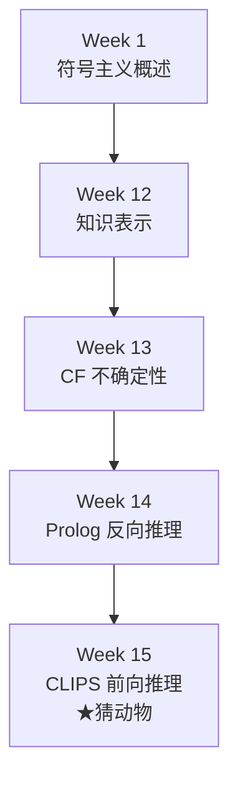
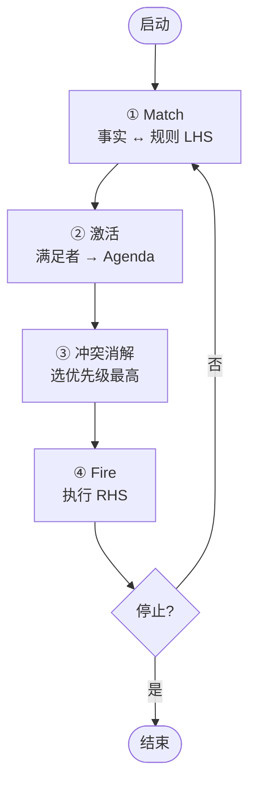
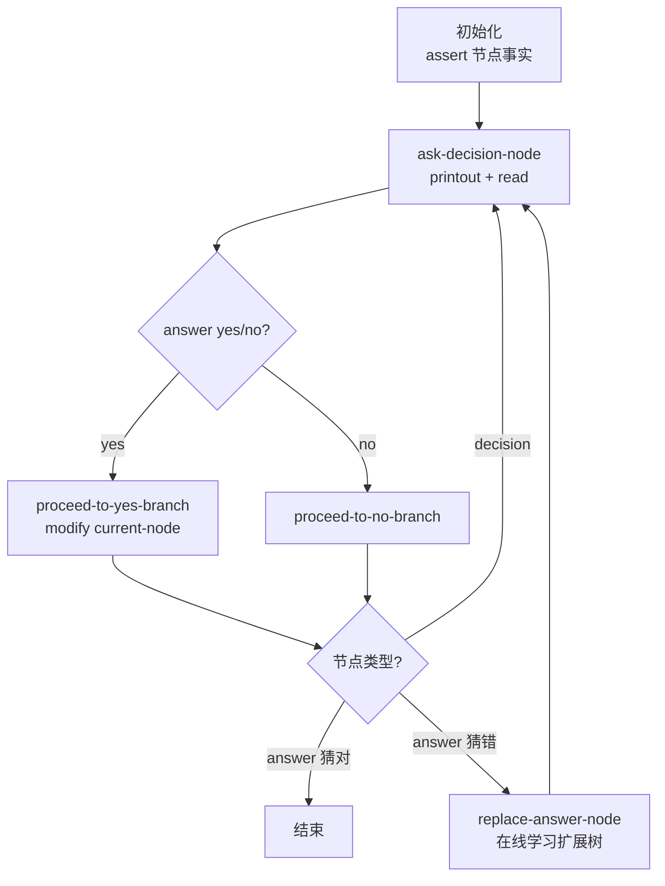
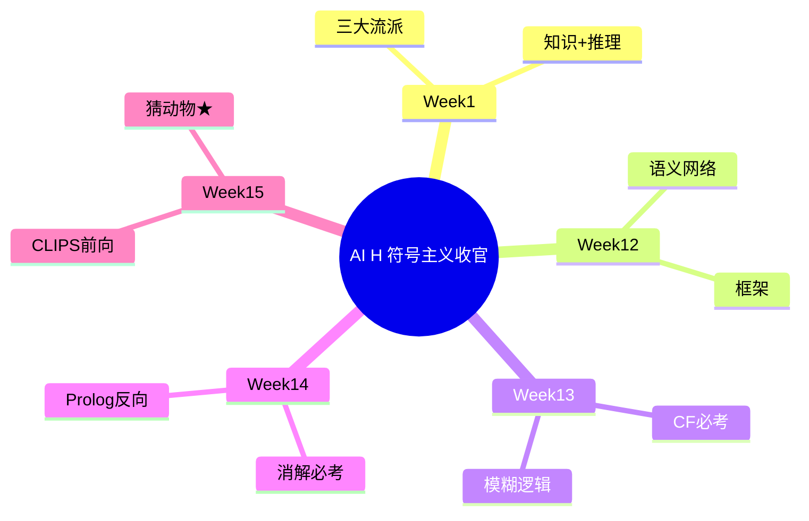

# Week 15 学习指南：前向推理与 CLIPS

> **课程**：人工智能（H）CS30057h.01  
> **覆盖周次**：Week 15（收官周）  
> **主要来源**：Week 15 课程记录、课件 03 CLIPS  
> **生成方式**：NotebookLM 分层问答 → Agent 审核整合  
> **生成日期**：2026-06-16  
> **Raw run**：`notebooklm-raw/week15/runs/latest/`（8/8 batch）

---

## ⚠️ 期末考核重点：CLIPS 猜动物

| 项 | 内容 |
|----|------|
| **考试形式** | **开卷**、**英文试卷**；内容均在 **PPT** |
| **★核心考点** | **猜动物 (Animal Game)** 示例：读代码、理解交互/学习流程、简答产生式机制 |
| **必掌握** | 前向 vs 反向对比、产生式三部件、Recognize-Act 循环、deftemplate/defrule 语法 |
| **不要求** | 实际开发完整专家系统，但须**读懂** PPT 中的 CLIPS 代码 |

> **备考建议**：在本地或在线 CLIPS 环境**跑一遍**猜动物程序，对照本指南 §2.5 逐步跟踪事实库变化。

（来源：Week 15 记录、`L0-positioning`、`w15-animal-game`）

---

## 0. 术语表

| 术语 | 大白话解释 | 生活类比 |
|------|-----------|----------|
| 🔗 **前向推理** | 从已知事实出发，匹配规则推出新事实 | 化验单出来 → 一路推导诊断 |
| 🔗 **反向推理** | 从待证目标出发，反向找条件 | 侦探：死者是他杀 → 查谁有动机 |
| 🔗 **产生式系统** | 事实库 + 规则库 + 推理引擎 | 厨房：食材 + 菜谱 + 厨师 |
| 🔗 **产生式规则** | IF 前提(LHS) THEN 动作(RHS) | 菜谱一条：「若…则…」 |
| 🔗 **事实 (Fact)** | 工作内存中的具体断言 | 黑板上的当前情报 |
| 🔗 **Agenda 议程** | 已激活、待触发的规则队列 | 候补执行名单 |
| 🔗 **激活 (Activation)** | LHS 被满足，规则进入 Agenda | 上榜候补 |
| 🔗 **触发 (Firing)** | 从 Agenda 选中规则执行 RHS | 正式上场干活 |
| 🔗 **冲突消解** | 多规则同时激活时的优先级决策 | 多个候补，选谁先上 |
| 🔗 **Recognize-Act** | 匹配→激活→消解→执行 循环 | 厨师每轮：看食材→选菜→下锅 |
| 🔗 **deftemplate** | 定义事实结构（槽位+约束） | 表格模板：姓名/年龄/性别列 |
| 🔗 **defrule** | 定义产生式规则 | 一条完整菜谱 |
| 🔗 **assert / retract** | 添加 / 撤销事实 | 黑板上写/擦 |
| 🔗 **modify** | 就地修改已有事实 | 改表格某行某列 |
| 🔗 **Rete 算法** | 用网络缓存匹配，事实变才更新 | 快递通知：有货才敲门 |
| 🔗 **?var / $?var** | 单字段 / 多字段模式变量 | 匹配一个格 / 匹配一串格 |

---

## 1. 知识地图（L0）

### 1.1 在整门课中的位置

Week 15 是 **符号主义收官**：把 Week 1 的「知识形式化为规则」落到 CLIPS 工程实现，与 Week 14 Prolog 构成推理双路径。



### 1.2 核心子主题与期末权重

| 优先级 | 主题 | 期末 |
|--------|------|------|
| **★★★** | 猜动物：交互 + 学习 + defrule 流程 | **核心考点** |
| **★★** | 前向 vs 反向完整对比 | 选择/简答 |
| **★★** | 产生式三部件 + Recognize-Act | 简答 |
| **★★** | deftemplate 五约束 + defrule 结构 | 读代码 |
| **★** | 复杂模式 $? / and-or-not-exists | 读代码 |
| **★** | 激活 vs 触发、Rete 直觉 | 易混选择 |

---

## 2. 核心知识

### 2.0 CLIPS 全景：符号主义的数据驱动路径

> **本节叙事线**：
>
> ```
> A. 为何需要前向推理？  →  传感器/新事实驱动的监控诊断
>         ↓
> B. 产生式架构           →  事实库 + 规则库 + 推理引擎 + Agenda
>         ↓
> C. CLIPS 语法           →  deftemplate / defrule / 模式变量
>         ↓
> D. 复杂模式匹配         →  $? / and / or / not / exists
>         ↓
> E. ★猜动物综合应用      →  决策树 + 交互 + 在线学习（期末重点）
> ```

> **本节要回答**：CLIPS 和 Prolog 解决同一类问题，但「出发方向」有何根本不同？

**学完能做什么**：

1. 对比 Prolog 反向与 CLIPS 前向的适用场景
2. 画出 Recognize-Act 循环流程图
3. 读懂猜动物核心 `defrule` 并解释学习时事实库如何变化
4. 写出带槽约束的 `deftemplate` 和简单 `defrule`
5. 区分激活与触发、事实库与知识库

---

#### A. 前向推理 vs 反向推理

> **承接 Week 14**：Prolog 从目标出发反向归约；Week 15 转向从事实出发正向推导。

| 特性 | **前向推理 (CLIPS)** | **反向推理 (Prolog)** |
|------|---------------------|----------------------|
| 代表工具 | CLIPS | Prolog |
| 核心思想 | 从**已知事实**出发，不断推出新事实 | 从**待证目标**出发，反向找条件 |
| 驱动方式 | **数据驱动** | **目标驱动** |
| 理论基础 | 产生式系统 | 消解 + 霍恩子句 |
| 工作循环 | Match → Agenda → Fire | 子目标归约 + 回溯 |
| 效率优化 | **Rete 算法** | **Cut `!`** 剪枝 |
| 典型场景 | 故障监控、传感器实时响应 | 定理证明、关系查询 |
| 比喻 | 科学家：现有材料不断实验 | 侦探：从结论倒查证据 |

**故障监控例子**：

1. 传感器断言 `(pressure high)`
2. 匹配规则 `IF (pressure high) THEN (status warning)`
3. 新事实 `(status warning)` 触发下一规则 `(activate alarm)`

（来源：`w15-forward-vs-backward`、Week 14–15 记录）

> **追问：什么时候选前向、什么时候选反向？**
>
> - **事实不断涌入、结论开放**（监控、诊断）→ **前向**：来一条数据推一条
> - **目标明确、需验证某一命题**（证明、查询「张三的父亲是谁」）→ **反向**：只搜相关规则链
>
> 猜动物看似「有目标（猜动物）」，但实现上是**用户每回答一次就断言新事实、规则匹配驱动流程**——典型前向风格。

---

#### B. 产生式系统架构

> **本节要回答**：三部件各存什么？Agenda 在循环里扮演什么角色？

**三部件**：

| 部件 | 别名 | 职责 |
|------|------|------|
| **事实库** | Working Memory | 当前已知事实，动态增删改 |
| **知识库** | Production Memory | 静态 IF-THEN 规则集合 |
| **推理引擎** | Inference Engine | 匹配、调度、执行 |

**Agenda（议程）**：LHS 被满足的规则**激活**后进入 Agenda；冲突消解按优先级选出一条**触发**。



**Recognize-Act 四步**：

1. **Match**：事实库与所有规则 LHS 模式匹配（Rete 优化此步）
2. **Activate**：匹配成功的规则入 Agenda
3. **Conflict Resolution**：按 salience 等策略选一条
4. **Fire**：执行 RHS（`assert`/`retract`/`modify`/`printout`），更新事实库 → 回到 Match

（来源：`w15-production-system`、课件 03）

**B 节小结** → 架构懂了，CLIPS 语法是把这些部件写成可运行代码。

---

#### C. CLIPS 核心语法

> **本节要回答**：一个事实长什么样？一条规则由哪几部分组成？

##### C.1 四种原始类型

| 类型 | 示例 |
|------|------|
| Integer | `1`, `-3` |
| Float | `1.5`, `9e+1` |
| Symbol | `fire`, `yes`（字母开头，无空格） |
| String | `"Hello"`（双引号） |

**前缀表达式**：`(+)`, `(* 4 5)`, `(+ 3 (* 4 5))`

##### C.2 deftemplate：事实模板 + 五约束

```clips
(deftemplate person
   (slot name (type SYMBOL))
   (slot age (type INTEGER) (range 0 150))
   (slot sex (allowed-values male female))
   (slot status (default normal))
   (multislot tags (cardinality 1 5)))
```

| 约束 | 作用 |
|------|------|
| **type** | 限制槽值类型 |
| **allowed-values** | 离散枚举 |
| **range** | 数值范围 |
| **cardinality** | multislot 元素个数 |
| **default** | 缺省值 |

##### C.3 defrule：规则结构

```clips
(defrule fire-emergency
   (emergency (type fire))    ; LHS：模式匹配
   =>
   (assert (response (action activate-sprinkler)))  ; RHS：动作
   (printout t "Fire!" crlf))
```

| 部分 | 符号 | 含义 |
|------|------|------|
| 规则名 | `defrule <name>` | 唯一标识 |
| LHS | `(pattern)*` | 前提条件 |
| 箭头 | `=>` | 分隔条件与动作 |
| RHS | `(action)*` | assert/retract/modify/printout 等 |

##### C.4 模式变量与约束符

| 符号 | 含义 | 示例 |
|------|------|------|
| `?var` | 单字段变量 | `(person (name ?n))` |
| `$?var` | 多字段（0 个或多个） | `(person (children $?kids))` |
| `&` | 连接约束（AND） | `?c&brown\|black` |
| `\|` | 析取（OR） | `hair brown\|black` |
| `~` | 否定（NOT） | `hair ~black` |

（来源：`w15-clips-syntax`、课件 03）

---

#### D. 复杂模式匹配

> **本节要回答**：如何在一条规则里写 AND/OR/NOT/存在性检查？

| 元素 | 含义 | 典型用途 |
|------|------|---------|
| **and** | 显式合取（多模式默认即 AND） | 嵌套条件 |
| **or** | 任一模式满足即可 | 合并相似规则 |
| **not** | 事实库中**不存在**匹配模式 | 「没有更大的数」 |
| **exists** | 至少存在一个匹配（只触发一次） | 有紧急情况就报警 |
| **forall** | 所有匹配第一个模式的，都满足后续模式 | 所有火灾点都已疏散 |

**眼/发色经典查询**（读代码考点）：

```clips
(defrule complex-eye-hair-match
   (person (name ?name1)
           (eyes ?eyes1 & blue | green)
           (hair ?hair1 & ~black))
   (person (name ?name2 & ~?name1)
           (eyes ?eyes2 & ~?eyes1)
           (hair ?hair2 & black | ?hair1))
   =>
   (printout t ?name1 " 与 " ?name2 " 匹配成功。" crlf))
```

解读：第一人蓝/绿眼且非黑发；第二人不同名、不同眼色、黑发或与第一人同色。

（来源：`w15-complex-pattern`）

---

#### E. ★猜动物系统：期末核心（必读）

> **本节要回答**：猜动物如何用不到 10 条规则实现问答 + 猜错学习？

##### E.1 设计思路

把**决策树**映射到事实库，而非硬编码在过程式逻辑里：



**deftemplate node**（核心数据结构）：

```clips
(deftemplate node
   (slot name)
   (slot type)          ; decision 或 answer
   (slot question)      ; 决策节点的问题
   (slot yes-node)      ; 回答 yes 指向的子节点
   (slot no-node)       ; 回答 no 指向的子节点
   (slot answer))       ; 答案节点的动物名
```

辅以 `(current-node ?name)` 追踪当前位置。

##### E.2 关键 defrule 分工

| 规则 | 触发条件 | RHS 动作 |
|------|---------|---------|
| `ask-decision-node-question` | 当前是 decision 节点，尚无 answer | `printout` 提问；`(read)` 读入；`assert (answer ...)` |
| `proceed-to-yes-branch` | 有 `answer yes` + current-node | `retract` 旧节点；`assert` yes 子节点为 current |
| `proceed-to-no-branch` | 有 `answer no` + current-node | 同上，走 no 分支 |
| `bad-answer` | 非法输入 | `retract` 错误 answer，重新提问 |
| `replace-answer-node` | 到达 answer 节点且用户说 no | 交互获取正确动物+区分问题；`modify` 原节点为 decision；`assert` 两个新 answer 子节点 |

##### E.3 在线学习流程（考试高频）

用户否定系统猜测时：

1. 询问**正确动物名** $A_{new}$
2. 询问能区分 $A_{new}$ 与系统猜错的**是/否问题** $Q$
3. **`modify`** 原 answer 节点 → decision 节点，填入 $Q$ 和分支 ID
4. **`assert`** 两个新 answer 叶子：一个 $A_{new}$，一个原错误猜测
5. 用 **`gensym*`** 生成唯一节点名

> **直观理解：学习 = 改事实，不是改代码**
>
> 深度学习要重新训练权重；猜动物**只 modify/assert 事实**，树结构存在事实库里。这就是符号主义 **样本效率 = 1**：错一次、教一次，立刻学会。

> **追问：为什么用 `(current-node ?name)` 而不是全局变量？**
>
> CLIPS 是**声明式**：规则通过**匹配事实模式**触发，不用显式控制流。`current-node` 事实就是「程序计数器」——改它等于跳转节点，规则自动重新匹配下一轮该问什么。

##### E.4 为何是考试重点？

1. **综合性**：deftemplate + defrule + assert/retract/modify + read/printout + 循环
2. **体现符号主义**：可解释、一步学习、推理链可查
3. **课纲明确**：教师鼓励课后运行，PPT 内容直接考核
4. **与产生式循环对应**：每次用户回答 → 新事实 → Match → Fire → 下一问

（来源：`w15-animal-game`、Week 15 记录、课件 03）

**E 节小结** → 期末若出 CLIPS 题，**优先在 PPT 定位猜动物代码**，对照上表逐规则解释。

---

### 2.1 与 Week 13–14 的衔接

| Week | 贡献 | 在 CLIPS 中的体现 |
|------|------|------------------|
| **Week 13 CF** | 规则可信度量化 | 可嵌入产生式规则强度（MYCIN 传统） |
| **Week 14 Prolog** | 反向推理、消解 | 与 CLIPS 前向形成互补双路径 |
| **Week 15 CLIPS** | 产生式落地 | 事实库+规则库+引擎完整闭环 |

符号主义统一公式：**知识表示 + 推理机 = 智能**；CLIPS 是其中**数据驱动**分支的工程范本。

（来源：`w15-bridge`）

---

## 3. 重难点与易错点

### 3.1 四组易混概念

| 组 | 易混点 | 正确区分 | 记忆 |
|----|--------|---------|------|
| 1 | 事实库 vs 知识库 | 事实=动态情报；规则=静态秘籍 | 事实变，规则不变 |
| 2 | 激活 vs 触发 | 激活=入 Agenda；触发=执行 RHS | 上榜 vs 上场 |
| 3 | 规则搜事实 vs 事实搜规则 | 朴素法前者；**Rete 后者** | 快递通知 vs 警察查户口 |
| 4 | 模式网络 vs 连接网络 | 单事实内约束 vs 跨事实变量绑定 | 自己长相 vs 邻居配对 |

### 3.2 猜动物读代码易错

| 错误 | 正确理解 |
|------|---------|
| 以为学习要改 defrule | 学习只 **modify/assert 事实** |
| 混淆 node type | `decision` 有 question；`answer` 有 answer 槽 |
| 忘记 retract current-node | 跳转分支前撤销旧 current-node |
| `read` 返回值 | 需 assert 为 `(answer yes)` 等形式供下条规则匹配 |
| bad-answer 作用 | 保证只有 yes/no 有效，否则重新提问 |

### 3.3 CLIPS vs Prolog 考场速记

| 一句话 | CLIPS | Prolog |
|--------|-------|--------|
| 方向 | 事实 → 结论 | 目标 → 条件 |
| 结构 | 产生式 + Agenda | 霍恩子句 + 回溯 |
| 例子 | 猜动物、故障监控 | 三段论证明、家谱查询 |

（来源：`w15-mistakes`）

---

## 4. 知识串联（L4）

### 4.1 全学期收官图



### 4.2 期末三轮复习建议

| 轮次 | 内容 | 时间 |
|------|------|------|
| **第一轮** | Week 13–14：CF 手算 + 消解 checklist | 50% |
| **第二轮** | Week 15：猜动物代码逐规则读 + 前向/反向表 | 30% |
| **第三轮** | 翻 PPT 定位 + 易混表速记 | 20% |

### 4.3 推荐学习顺序

**优先级：极高（期末）**
1. 猜动物完整流程图 + 关键 defrule
2. 前向 vs 反向对比表
3. Recognize-Act 四步
4. 激活 vs 触发

**优先级：高**
5. deftemplate 五约束 + defrule 结构
6. assert / retract / modify 区别
7. `?` vs `$?` 模式变量

**优先级：中**
8. 复杂模式 and/or/not/exists
9. Rete 算法直觉
10. CF 与产生式规则的关系（跨周）

---

## 5. 资料索引

| 类型 | 路径 | NotebookLM batch |
|------|------|-----------------|
| 知识图谱 | `notebooklm-raw/week15/knowledge-graph.md` | — |
| Raw run | `notebooklm-raw/week15/runs/latest/` | 8/8 |
| 课件 | `3_课件/03CLIPS.pdf` | 课件 03 |
| 教材 | Luger Ch.6 | 参考书 |

**Batch 速查**：

| batch | 指南章节 | 深度 |
|-------|---------|------|
| `L0-positioning` | 章首 + §1 | 期末信息 |
| `w15-forward-vs-backward` | §2.A | **完整对比表** |
| `w15-production-system` | §2.B | Recognize-Act |
| `w15-clips-syntax` | §2.C | 语法表+示例 |
| `w15-complex-pattern` | §2.D | 眼/发色规则 |
| `w15-animal-game` | §2.E ★ | **期末核心** |
| `w15-mistakes` | §3 | 4 组表 |
| `w15-bridge` | §2.1 / §4 | 全学期衔接 |

---

## 6. Step 4 补充采集说明

| 缺口 | 建议 batch | 说明 |
|------|-----------|------|
| 猜动物完整源码 walkthrough | `supplement-animal-line-by-line` | 逐行注释 PPT 代码 |
| salience 冲突消解例题 | `supplement-salience` | 多条规则同激活时 |
| Rete 图示 | 课件 03 已有 | 概念级即可 |

---

*本指南由 NotebookLM（AI Notebook `505bdb1c-0034-4e14-89df-0b14bf3fc723`）分层问答生成，Agent 审核整合。规则见 `.cursor/skills/ai-course-notebooklm/SKILL.md`。*
