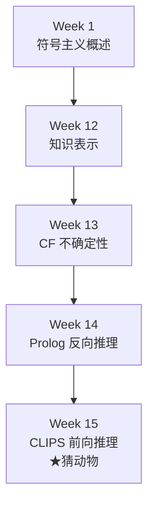
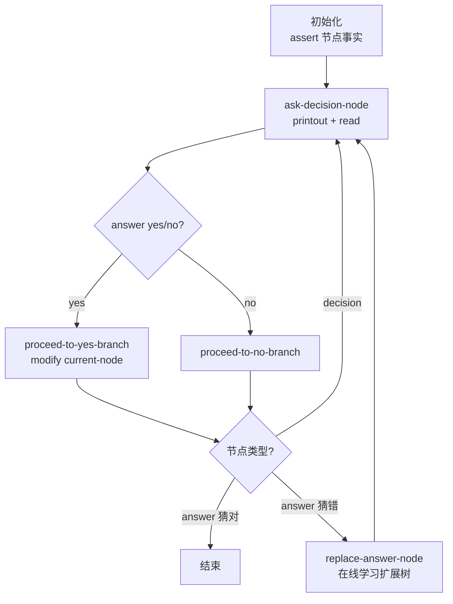
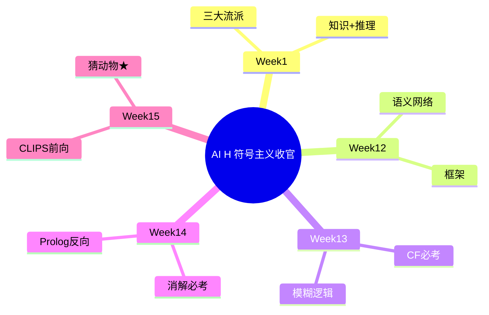

# Week 15 学习指南：前向推理与 CLIPS

> **课程**：人工智能（H）CS30057h.01  
> **覆盖周次**：Week 15（收官周）  
> **主要来源**：Week 15 课程记录、课件 03 CLIPS  
> **生成方式**：NotebookLM 分层问答 → Agent 审核整合  
> **生成日期**：2026-06-16  
> **Raw run**：`notebooklm-raw/week15/runs/latest/`（8/8 batch）  
> **术语格式**：术语表及正文**首次出现**时，专业名词采用 **中文（English）**；英文缩写采用 **缩写（English full form，中文）**，便于对照英文试卷。

---

## ⚠️ 期末考核重点：CLIPS 猜动物

| 项 | 内容 |
|----|------|
| **考试形式** | **开卷**、**英文试卷**；内容均在 **PPT** |
| **★核心考点** | **猜动物（Animal Game）** 示例：读代码、理解交互/学习流程、简答产生式机制 |
| **必掌握** | 前向 vs 反向对比、产生式三部件、识别-执行循环（Recognize-Act）、deftemplate/defrule 语法 |
| **不要求** | 实际开发完整专家系统，但须**读懂** PPT 中的 CLIPS 代码 |

> **备考建议**：在本地或在线 CLIPS 环境**跑一遍**猜动物程序，对照本指南 §2.5 逐步跟踪事实库变化。

（来源：Week 15 记录、`L0-positioning`、`w15-animal-game`）

---

## 0. 术语表

| 术语 | 大白话解释 | 生活类比 |
|------|-----------|----------|
| 🔗 **前向推理（Forward chaining）** | 从已知事实出发，匹配规则推出新事实 | 化验单出来 → 一路推导诊断 |
| 🔗 **反向推理（Backward chaining）** | 从待证目标出发，反向找条件 | 侦探：死者是他杀 → 查谁有动机 |
| 🔗 **产生式系统（Production system）** | 事实库 + 规则库 + 推理引擎 | 厨房：食材 + 菜谱 + 厨师 |
| 🔗 **产生式规则（Production rule）** | IF 前提 THEN 动作 | 菜谱一条：「若…则…」 |
| 🔗 **LHS（Left-Hand Side，规则前提/左侧）** | 模式匹配条件 | 菜谱的「若…」部分 |
| 🔗 **RHS（Right-Hand Side，规则动作/右侧）** | 触发后执行的动作 | 菜谱的「则…」部分 |
| 🔗 **事实（Fact）** | 工作内存中的具体断言 | 黑板上的当前情报 |
| 🔗 **议程（Agenda）** | 已激活、待触发的规则队列 | 候补执行名单 |
| 🔗 **激活（Activation）** | LHS 被满足，规则进入 Agenda | 上榜候补 |
| 🔗 **触发（Firing）** | 从 Agenda 选中规则执行 RHS | 正式上场干活 |
| 🔗 **冲突消解（Conflict resolution）** | 多规则同时激活时的优先级决策 | 多个候补，选谁先上 |
| 🔗 **识别-执行循环（Recognize-Act cycle）** | 匹配→激活→消解→执行 循环 | 厨师每轮：看食材→选菜→下锅 |
| 🔗 **事实模板（deftemplate）** | 定义事实结构（槽位+约束） | 表格模板：姓名/年龄/性别列 |
| 🔗 **规则定义（defrule）** | 定义产生式规则 | 一条完整菜谱 |
| 🔗 **assert / retract（添加/撤销事实）** | 添加 / 撤销事实 | 黑板上写/擦 |
| 🔗 **modify（修改事实）** | 就地修改已有事实 | 改表格某行某列 |
| 🔗 **Rete 算法（Rete algorithm）** | 用网络缓存匹配，事实变才更新 | 快递通知：有货才敲门 |
| 🔗 **?var / $?var（模式变量，Pattern variable）** | 单字段 / 多字段模式变量 | 匹配一个格 / 匹配一串格 |
| 🔗 **CLIPS（C Language Integrated Production System，C 语言集成产生式系统）** | NASA 开发的产生式系统语言 | 把规则写成可运行代码 |

---

## 1. 知识地图（L0）

### 1.1 在整门课中的位置

Week 15 是 **符号主义（Symbolism）收官**：把 Week 1 的「知识形式化为规则」落到 CLIPS 工程实现，与 Week 14 Prolog **反向推理（Backward chaining）** 构成推理双路径。



### 1.2 核心子主题与期末权重

| 优先级 | 主题 | 期末 |
|--------|------|------|
| **★★★** | 猜动物：交互 + 学习 + defrule 流程 | **核心考点** |
| **★★** | 前向 vs 反向完整对比 | 选择/简答 |
| **★★** | 产生式三部件 + 识别-执行循环（Recognize-Act） | 简答 |
| **★★** | 事实模板（deftemplate）五约束 + 规则定义（defrule）结构 | 读代码 |
| **★** | 复杂模式 $? / and-or-not-exists | 读代码 |
| **★** | 激活 vs 触发、Rete 直觉 | 易混选择 |

---

## 2. 核心知识

### 2.0 CLIPS（C Language Integrated Production System，C 语言集成产生式系统）全景：符号主义的数据驱动路径

> **本节叙事线**：
>
> ```
> A. 为何需要前向推理？  →  传感器/新事实驱动的监控诊断
>         ↓
> B. 产生式架构           →  事实库 + 规则库 + 推理引擎 + Agenda
>         ↓
> C. CLIPS 语法           →  deftemplate / defrule / 模式变量
>         ↓
> D. 复杂模式匹配         →  $? / and / or / not / exists
>         ↓
> E. ★猜动物综合应用      →  决策树 + 交互 + 在线学习（期末重点）
> ```

> **本节要回答**：CLIPS 和 Prolog 解决同一类问题，但「出发方向」有何根本不同？

**学完能做什么**：

1. 对比 Prolog 反向与 CLIPS 前向的适用场景
2. 画出 Recognize-Act 循环流程图
3. 读懂猜动物核心 `defrule` 并解释学习时事实库如何变化
4. 写出带槽约束的 `deftemplate` 和简单 `defrule`
5. 区分激活与触发、事实库与知识库

---

#### A. 前向推理（Forward chaining）vs 反向推理（Backward chaining）

> **承接 Week 14**：Prolog 从目标出发反向归约；Week 15 转向从事实出发 **前向推理（Forward chaining）** 正向推导。

| 特性 | **前向推理（Forward chaining, CLIPS）** | **反向推理（Backward chaining, Prolog）** |
|------|---------------------|----------------------|
| 代表工具 | CLIPS | Prolog |
| 核心思想 | 从**已知事实**出发，不断推出新事实 | 从**待证目标**出发，反向找条件 |
| 驱动方式 | **数据驱动** | **目标驱动** |
| 理论基础 | 产生式系统（Production system） | 消解（Resolution）+ 霍恩子句（Horn clause） |
| 工作循环 | Match → Agenda → Fire | 子目标归约 + 回溯（Backtracking） |
| 效率优化 | **Rete 算法（Rete algorithm）** | **Cut `!`（剪枝）** |
| 典型场景 | 故障监控、传感器实时响应 | 定理证明、关系查询 |
| 比喻 | 科学家：现有材料不断实验 | 侦探：从结论倒查证据 |

**故障监控例子**：

1. 传感器断言 `(pressure high)`
2. 匹配规则 `IF (pressure high) THEN (status warning)`
3. 新事实 `(status warning)` 触发下一规则 `(activate alarm)`

（来源：`w15-forward-vs-backward`、Week 14–15 记录）

> **追问：什么时候选前向、什么时候选反向？**
>
> - **事实不断涌入、结论开放**（监控、诊断）→ **前向**：来一条数据推一条
> - **目标明确、需验证某一命题**（证明、查询「张三的父亲是谁」）→ **反向**：只搜相关规则链
>
> 猜动物看似「有目标（猜动物）」，但实现上是**用户每回答一次就断言新事实、规则匹配驱动流程**——典型前向风格。

---

#### B. 产生式系统架构（Production system architecture）

> **本节要回答**：三部件各存什么？Agenda 在循环里扮演什么角色？

**三部件**：

| 部件 | 别名 | 职责 |
|------|------|------|
| **事实库（Fact base / Working Memory）** | Working Memory | 当前已知事实，动态增删改 |
| **知识库（Rule base / Production Memory）** | Production Memory | 静态 IF-THEN 规则集合 |
| **推理引擎（Inference Engine）** | Inference Engine | 匹配、调度、执行 |

**议程（Agenda）**：LHS 被满足的规则 **激活（Activation）** 后进入 Agenda； **冲突消解（Conflict resolution）** 按优先级选出一条 **触发（Firing）** 。


**识别-执行循环（Recognize-Act cycle）四步**：

1. **Match（模式匹配）**：事实库与所有规则 LHS 模式匹配（Rete 优化此步）
2. **Activate（激活）**：匹配成功的规则入 Agenda
3. **Conflict Resolution（冲突消解）**：从 Agenda 中按 salience 等策略选下一条要触发的 activation
4. **Fire（触发）**：执行 RHS（`assert`/`retract`/`modify`/`printout`），更新事实库 → 回到 Match

**冲突消解具体在做什么？**

当多条规则的 LHS 同时被当前事实满足时，它们不会立刻全部执行，而是各自形成一个 **激活（Activation）** 进入 **议程（Agenda）**。冲突消解就是在 Agenda 里选出「下一条 fire 的 activation」。这一步不是判断规则真假；真假已经在 Match 阶段确定了。它解决的是：**都能执行时，先执行谁**。

CLIPS 常见排序依据包括：

- **salience（显著性/优先级）**：人工写在规则里的优先级，数值越高越先执行；默认是 `0`。这是考试最容易问的控制手段。
- **规则/事实新旧**：当 salience 相同，系统还会按所选策略考虑 activation 产生的新旧顺序。
- **冲突消解策略（strategy）**：如 depth、breadth、simplicity、complexity 等，用来规定同优先级 activation 的进一步排序。

短例子：同一个事实 `(answer no)` 同时让两条规则入 Agenda，但 salience 决定先后。

```clips
(defrule handle-bad-guess-first
   (declare (salience 20))
   (answer no)
   =>
   (printout t "进入猜错学习流程。" crlf))

(defrule log-negative-answer
   (declare (salience 0))
   (answer no)
   =>
   (printout t "记录一次 no 回答。" crlf))
```

如果事实库里有 `(answer no)`，两条规则都匹配，Agenda 中会出现两个 activation。由于 `handle-bad-guess-first` 的 salience 是 `20`，高于 `log-negative-answer` 的 `0`，它会先 fire。对猜动物程序来说，这种机制可用来保证「处理非法输入」「推进分支」「猜错学习」等控制规则按预期顺序运行，而不是只依赖规则写在文件里的先后。

**小型例子：动物识别产生式系统**

这个例子要解释的问题：产生式系统不是写一段固定流程的 `if-else`，而是把「当前观察」放进事实库，让规则自己被匹配出来。

初始 **事实库（Fact base）** 可以有三条观察：

```clips
(has hair)
(eats meat)
(has tawny-color)
```

**规则库（Rule base）** 放两条 IF-THEN 规则：

```text
IF (has hair) THEN (animal mammal)
IF (animal mammal) AND (eats meat) AND (has tawny-color) THEN (animal tiger)
```

推理引擎如何跑：

1. **Match**：发现事实 `(has hair)` 满足第一条规则 LHS。
2. **Activate**：第一条规则进入 Agenda。
3. **Fire**：执行 RHS，向事实库加入新事实 `(animal mammal)`。
4. **再次 Match**：现在事实库有 `(animal mammal)`、`(eats meat)`、`(has tawny-color)`，第二条规则满足。
5. **再次 Fire**：加入 `(animal tiger)`，系统得到「可能是老虎」这个结论。

这个流程和后面的 **CLIPS 猜动物（Animal Game）** 是同一种机制：用户回答会变成事实，事实变化会激活下一条规则；区别只是猜动物的事实更结构化，用 `node` 模板保存决策树节点。

（来源：`w15-production-system`、课件 03）

**B 节小结** → 架构懂了，CLIPS 语法是把这些部件写成可运行代码。

---

#### C. CLIPS 核心语法

> **本节要回答**：一个事实长什么样？一条规则由哪几部分组成？

##### C.1 四种原始类型

| 类型 | 示例 |
|------|------|
| Integer | `1`, `-3` |
| Float | `1.5`, `9e+1` |
| Symbol | `fire`, `yes`（字母开头，无空格） |
| String | `"Hello"`（双引号） |

**前缀表达式**：`(+)`, `(* 4 5)`, `(+ 3 (* 4 5))`

##### C.2 事实模板（deftemplate）：事实模板 + 五约束

**模板先解决什么问题？** 裸事实如 `(has hair)` 只有一个简单断言；但猜动物的节点、人的资料、诊断记录通常有多个字段。**事实模板（deftemplate）** 就是先声明一种事实的字段结构，让后续事实都按同一格式填写，规则匹配时也能按字段名取值。

基础语法：

```clips
(deftemplate 模板名
   (slot 单值槽名)
   (multislot 多值槽名))
```

- **槽（slot）**：单值字段，一次只能放一个值，如 `(slot age)`、`(slot type)`。
- **多字段槽（multislot）**：可放零个或多个值，适合标签、特征列表，如 `(multislot symptoms)`。
- **`assert`**：向事实库 / 工作内存（Working Memory）添加一个**新事实**；原有事实不会被自动删除。
- **模板事实**：用 `assert` 生成事实时，外层写模板名，里面逐个填写槽名和值。
- **字段对应关系**：`(person (name alice) (age 20))` 中，`person` 对应模板名，`name` / `age` 对应模板里的槽名，`alice` / `20` 是槽值。

最小例子：

```clips
(deftemplate animal-observation
   (slot name)
   (multislot features))

(assert (animal-observation
   (name unknown-1)
   (features hair eats-meat tawny-color)))
```

这里 `deftemplate` 先定义 `animal-observation` 事实应有哪些槽；`assert` 再按这个模板向事实库加入一条具体观察。`name` 是单值槽，只记录一个对象名；`features` 是多字段槽，可以同时记录多个观察特征。下面的五约束是在这个基础上进一步限制「槽里允许放什么」。

```clips
(deftemplate person
   (slot name (type SYMBOL))
   (slot age (type INTEGER) (range 0 150))
   (slot sex (allowed-values male female))
   (slot status (default normal))
   (multislot tags (cardinality 1 5)))
```

| 约束 | 作用 |
|------|------|
| **type** | 限制槽值类型 |
| **allowed-values** | 离散枚举 |
| **range** | 数值范围 |
| **cardinality** | multislot 元素个数 |
| **default** | 缺省值 |

##### C.3 规则定义（defrule）：规则结构

**规则先解决什么问题？** 模板和事实只描述「现在知道什么」；**规则定义（defrule）** 描述「满足哪些模式时，要执行什么动作」。它把产生式规则写成可运行代码：左边匹配事实，右边修改事实库或输出信息。

基础语法：

```clips
(defrule 规则名
   ; LHS：一个或多个事实模式，全部满足才激活
   (模板名 (槽名 ?变量))
   =>
   ; RHS：规则触发后执行的动作
   (assert (新事实 ...))
   (printout t "message" crlf))
```

- **LHS（Left-Hand Side，规则前提）**：`=>` 前的模式匹配区；可以写事实模式、变量绑定、字段约束，也可以写逻辑条件元素，如 `and` / `or` / `not` / `exists` / `forall` / `test`。多行模式默认是 AND。
- **`=>`**：把前提和动作分开，读作「如果左边满足，则执行右边」。CLIPS 规则**不是**用分号 `;` 分隔左右两边；`;` 通常表示注释开头，或在文档说明里作自然语言分隔。
- **RHS（Right-Hand Side，规则动作）**：`=>` 后的动作区；可以写规则触发后要执行的动作，如 `assert` 新事实、`retract` 删除事实、`modify` 修改事实、`printout` 输出、`bind` 绑定局部变量等。其中 `bind` 是常见动作，课件中更多用于辅助理解 RHS 可执行计算。
- **变量 `?x`**：在 LHS 中第一次出现时绑定匹配到的值；同一条规则里再次出现同名变量，必须是同一个值；RHS 可以直接使用这个绑定值。

```clips
(defrule fire-emergency
   (emergency (type fire))    ; LHS：模式匹配
   =>
   (assert (response (action activate-sprinkler)))  ; RHS：动作
   (printout t "Fire!" crlf))
```

带变量绑定的小例子：

```clips
(deftemplate animal-observation
   (slot name)
   (multislot features))

(defrule identify-mammal-by-hair
   (animal-observation
      (name ?n)
      (features $?before hair $?after))
   =>
   (assert (animal (name ?n) (class mammal)))
   (printout t ?n " is a mammal." crlf))
```

解读：LHS 在 `animal-observation` 事实中寻找包含 `hair` 的 `features`；`?n` 绑定对象名，`$?before` 和 `$?after` 吸收 `hair` 前后的任意多个特征。规则触发后，RHS 用同一个 `?n` 断言该对象是哺乳动物。

| 部分 | 符号 | 含义 |
|------|------|------|
| 规则名 | `defrule <name>` | 唯一标识 |
| LHS | `(pattern)*` | 前提条件（Left-Hand Side，规则前提） |
| 箭头 | `=>` | 分隔条件与动作 |
| RHS | `(action)*` | assert/retract/modify/printout 等（Right-Hand Side，规则动作） |

##### C.4 模式变量与约束符

| 符号 | 含义 | 示例 |
|------|------|------|
| `?var` | 单字段变量 | `(person (name ?n))` |
| `$?var` | 多字段（0 个或多个） | `(person (children $?kids))` |
| `&` | 连接约束（AND / 附加约束） | `?c&brown\|black` |
| `\|` | 析取（OR） | `hair brown\|black` |
| `~` | 否定（NOT） | `hair ~black` |

**读懂 `?c&brown|black`**：`?c` 是单字段变量，先把槽值绑定到变量；`&` 表示这个变量还必须同时满足后面的附加约束；`|` 表示「或」。因此 `?c&brown|black` 的意思是：把某个槽值绑定到 `?c`，并要求它只能是 `brown` 或 `black`。这不是普通数学表达式，而是 CLIPS 的**模式约束**。

放进真实模式时通常写在某个槽里：

```clips
(person (hair ?c&brown|black))
```

（来源：`w15-clips-syntax`、课件 03）

---

#### D. 复杂模式匹配

> **本节要回答**：如何在 LHS 中用多槽、变量绑定和约束符筛选事实？

先分清两层语法：

1. **规则层逻辑条件元素（conditional elements）**：写在 LHS 里，用来组织多个事实模式之间的关系，如多条模式默认 AND、显式 `or`、`not`、`exists`、`forall`。
2. **槽内字段约束（field constraints）**：写在某个槽值位置，用 `?x`、`$?x`、`&`、`|`、`~` 约束这个槽里能匹配什么值。

#### D.1 规则层：多个事实模式如何组合？

**默认 AND：多行模式天然都要满足。** 不写 `and` 时，LHS 中连续列出的多个模式就是合取：必须同时匹配，规则才进入 Agenda。

```clips
(defrule identify-tiger
   (has hair)
   (eats meat)
   (has tawny-color)
   =>
   (assert (animal tiger)))
```

读法：事实库里必须同时有 `(has hair)`、`(eats meat)`、`(has tawny-color)`，这条规则才会激活。这里不需要额外写 `(and ...)`。

**显式 `or`：几组选项满足任一组即可。**

```clips
(defrule identify-carnivore
   (or (eats meat)
       (has pointed-teeth))
   =>
   (assert (diet carnivore)))
```

读法：只要事实库里有 `(eats meat)` 或 `(has pointed-teeth)` 之一，就可以推出肉食性。

**`not`：要求某个事实不存在。**

```clips
(defrule not-bird-if-no-eggs
   (animal-observation (name ?n))
   (not (animal-observation (name ?n) (reproduction lays-eggs)))
   =>
   (assert (not-bird ?n)))
```

读法：已经观察到对象 `?n`，但事实库中找不到“它产卵”的记录，才触发这条规则。`not` 检查的是**工作内存中没有匹配事实**，不是把某个槽值自动改成假。

**`exists`：只关心至少存在一个匹配。**

```clips
(defrule some-danger-observed
   (exists (dangerous-animal (name ?n)))
   =>
   (assert (warning dangerous-animal-exists)))
```

读法：只要至少有一个 `dangerous-animal` 事实，就发出一次警告；它强调“存在即可”，不关心具体有多少条。

**`forall`：每个匹配对象都要满足后续条件。**

```clips
(defrule all-questions-answered
   (forall (question (id ?id))
           (answered (id ?id)))
   =>
   (assert (dialog complete)))
```

读法：对每个 `question`，都能找到同 id 的 `answered`，才说明问答完成。期末通常读懂含义即可，不要求手写复杂 `forall`。

#### D.2 槽内：一个字段如何写复杂约束？

下面这些符号不是规则层的 `and/or/not`，而是**写在槽值里的约束**：

| 写法 | 作用 | 读法 |
|------|------|------|
| `?x` | 单字段变量 | 绑定一个值 |
| `$?x` | 多字段变量 | 在 `multislot` 中吸收一段值 |
| `&` | 附加约束 | 变量绑定后还必须满足后面的限制 |
| `|` | 槽内“或” | 这个槽值可为 A 或 B |
| `~` | 槽内“非” | 这个槽值不能是某值 |

**贴近猜动物的复杂 LHS 示例**：

```clips
(deftemplate animal-observation
   (slot name)
   (slot color)
   (slot reproduction)
   (multislot features))

(defrule likely-carnivore-mammal
   (animal-observation
      (name ?n)
      (color ?c&tawny|golden)
      (reproduction ?r&~lays-eggs)
      (features $?before hair $?middle eats-meat $?after))
   =>
   (assert (animal-candidate (name ?n) (class mammal) (diet carnivore))))
```

逐行看 LHS 如何筛选事实：

1. `(name ?n)` 是**变量绑定**：把被观察对象的名字绑定到 `?n`，RHS 可以继续用同一个名字断言候选动物。
2. `(color ?c&tawny|golden)` 是**单槽 + 连接约束**：颜色先绑定到 `?c`，并且必须是 `tawny` 或 `golden`，体现 `&` 与 `|` 的组合。
3. `(reproduction ?r&~lays-eggs)` 是**否定约束**：把繁殖方式绑定到 `?r`，同时要求它不能是 `lays-eggs`。这就是 `~` 在单字段槽上的典型用法。
4. `(features $?before hair $?middle eats-meat $?after)` 是 **multislot / `$?` 多字段匹配**：`features` 可以有任意多个值；`$?before` 吸收 `hair` 前的特征，`$?middle` 吸收 `hair` 和 `eats-meat` 之间的特征，`$?after` 吸收后面的特征。因此只要列表中按顺序出现 `hair` 和 `eats-meat`，不管中间夹了多少特征，都能匹配。

若事实库中有：

```clips
(animal-observation
   (name unknown-1)
   (color tawny)
   (reproduction live-birth)
   (features young hair strong-legs eats-meat fast))
```

这条事实会匹配：颜色 `tawny` 满足 `tawny|golden`；繁殖方式 `live-birth` 满足 `~lays-eggs`；`features` 中按顺序出现 `hair` 和 `eats-meat`。因此规则进入 Agenda。若另一条事实的 `(reproduction lays-eggs)`，即使也有 `hair` 和 `eats-meat`，`~lays-eggs` 也会失败，规则不会激活。

**课件眼/发色经典查询怎么定位？** 它不是猜动物主线，而是用 `person` 事实展示同一套槽内约束：`?eyes1&blue|green` 表示眼色必须是蓝或绿；`?hair1&~black` 表示发色不能是黑；多个 `person` 模式并列表示必须找到两个人同时满足条件。读懂这种写法即可，不必把场景背下来。

> **备考定位**：复杂模式匹配多服务于读代码、选择和简答。真正的主线仍是猜动物：`current-node`、`node`、`answer` 这些事实如何让 `ask`、`proceed`、`replace-answer-node` 等规则依次进入 Agenda 并 fire。

（来源：`w15-complex-pattern`）

---

#### E. ★猜动物系统：期末核心（必读）

> **本节要回答**：猜动物如何用不到 10 条规则实现问答 + 猜错学习？

**猜动物系统是什么？** 它是一个小型专家系统：系统心里有一棵“动物分类问答树”，通过连续问用户 yes/no 问题来缩小范围，最后猜一个动物。如果猜错，用户告诉它正确动物和一个能区分两者的新问题，系统就把这条新知识写进事实库，下次就能猜对。

**一次交互大概长这样**：

```text
系统：它有毛吗？
用户：yes
系统：它吃肉吗？
用户：yes
系统：我猜是老虎，对吗？
用户：no
系统：正确答案是什么？
用户：豹子
系统：请给一个能区分豹子和老虎的问题。
用户：它身上有斑点吗？
系统：学会了：以后问到这里，会先问「它身上有斑点吗？」
```

**核心特质**：

| 特质 | 含义 | 在 CLIPS 中怎么体现 |
|------|------|------------------|
| **前向推理** | 从已有事实和用户回答出发，触发下一条规则 | `(answer yes)` 进入事实库后，分支规则被激活 |
| **可解释** | 每一步为什么问、为什么跳分支都能追踪 | 当前节点、问题、分支都存在事实里 |
| **在线学习** | 猜错一次，就向树中加入一个新问题和新动物 | `modify` 原节点 + `assert` 新 answer 节点 |
| **规则少、事实多** | 程序逻辑不写死具体动物，动物知识存在事实库 | `defrule` 负责流程，`node` 事实负责知识 |

> **为什么它适合考试？** 它把 Week 15 的核心概念全串起来：`deftemplate` 定义树节点，`defrule` 控制问答流程，`assert/retract/modify` 改事实库，Agenda 决定规则触发顺序。读懂它，就基本读懂了 CLIPS 前向推理。

##### E.1 设计思路

先理解「猜动物」的核心数据结构：它其实是一棵**二叉决策树**。

> **决策树是什么？**  
> 每个内部节点问一个 yes/no 问题；用户回答 yes 就走 yes 分支，回答 no 就走 no 分支；走到叶子节点时，叶子里存的是系统最终猜测的动物。
>
> 例如：
>
> ```text
>          「它有毛吗？」        ← question 节点
>            /      \
>        yes/        \no
>        「老虎」     「鲨鱼」    ← answer 节点
> ```

所以程序不是把问答流程写死在 `if/else` 里，而是把这棵树的每个节点都存成一个 CLIPS 事实。规则只负责：读取当前位置 → 提问或猜测 → 根据用户回答跳到下一个节点。

| 概念 | 在猜动物里指什么 | CLIPS 表示 |
|------|----------------|------------|
| **node** | 决策树中的一个节点 | 一条 `(node ...)` 模板事实 |
| **decision node** | 问问题的内部节点 | `(type decision)`，带 `question`、`yes-node`、`no-node` |
| **answer node** | 存动物答案的叶子节点 | `(type answer)`，带 `answer` 槽 |
| **question** | 系统向用户提出的 yes/no 问题 | 如「它有毛吗？」 |
| **answer** | 一词多义：既可指用户回答 `yes/no`，也可指叶子节点中的动物名 | 用户输入常作为 `(answer yes)` / `(answer no)`；动物名存在 node 的 `answer` 槽 |
| **branch** | 从问题节点走向子节点的边 | `yes-node` / `no-node` 指向两个子节点名字 |
| **current-node** | 当前走到树的哪个节点 | `(current-node <node-name>)` 像程序计数器 |

把**决策树**映射到事实库，而非硬编码在过程式逻辑里：



**deftemplate node**（核心数据结构）：

```clips
(deftemplate node
   (slot name)
   (slot type)          ; decision 或 answer
   (slot question)      ; 决策节点的问题
   (slot yes-node)      ; 回答 yes 指向的子节点
   (slot no-node)       ; 回答 no 指向的子节点
   (slot answer))       ; 答案节点的动物名
```

一条决策节点事实大概长这样：

```clips
(node (name has-hair)
      (type decision)
      (question "Does it have hair?")
      (yes-node tiger)
      (no-node shark))
```

一条答案节点事实大概长这样：

```clips
(node (name tiger)
      (type answer)
      (answer "tiger"))
```

辅以 `(current-node ?name)` 追踪当前位置。例如 `(current-node has-hair)` 表示当前应该处理名为 `has-hair` 的节点；如果用户回答 yes，规则会把当前位置改成 `tiger`。

##### E.2 关键 defrule 分工

这些规则不是各做各的，而是围绕同一个循环工作：**看 current-node → 若是问题节点就提问 → 用户回答 yes/no → 跳分支 → 若到答案节点就猜测 → 猜错则学习**。

| 规则 | 它在流程中负责什么 | 触发条件 | RHS 动作 |
|------|------------------|---------|---------|
| `ask-decision-node-question` | 当前节点是问题节点时，向用户提问 | `(current-node ?n)` 指向一个 `(type decision)` 的 `node`，且当前还没有用户回答事实 | `printout` 打印 `question`；`(read)` 读入用户输入；`assert (answer yes/no)` |
| `proceed-to-yes-branch` | 用户回答 yes 后，沿 yes 分支跳转 | 当前节点是 decision，且事实库里有 `(answer yes)` | `retract` 旧的 `current-node` 和 `answer`；`assert` 新的 `(current-node <yes-node>)` |
| `proceed-to-no-branch` | 用户回答 no 后，沿 no 分支跳转 | 当前节点是 decision，且事实库里有 `(answer no)` | 同上，只是把当前位置改成 `<no-node>` |
| `bad-answer` | 用户输入不是 yes/no 时，清掉错误输入 | 有不合法的 `(answer ?x)` | `retract` 错误 answer，重新让提问规则触发 |
| `replace-answer-node` | 系统猜错时，把叶子节点改造成新问题节点 | 当前节点是 answer 节点，系统猜测被用户否定 | 询问正确动物和区分问题；`modify` 原 answer 节点为 decision；`assert` 两个新 answer 子节点 |

> **这里的 `(answer yes/no)` 是谁的回答？**  
> 是**用户对当前问题或当前猜测的回答**。如果 current-node 是 decision 节点，`answer yes/no` 用来决定走哪个 branch；如果 current-node 是 answer 节点，`answer yes` 表示系统猜对，`answer no` 表示系统猜错，需要进入学习流程。

##### E.3 在线学习流程（考试高频）

用户否定系统猜测时：

1. 询问**正确动物名** $A_{new}$
2. 询问能区分 $A_{new}$ 与系统猜错的**是/否问题** $Q$
3. **`modify`** 原 answer 节点 → decision 节点，填入 $Q$ 和分支 ID
4. **`assert`** 两个新 answer 叶子：一个 $A_{new}$，一个原错误猜测
5. 用 **`gensym*`** 生成唯一节点名

**为什么要这样改？** 因为系统原来走到这个叶子时，只会猜一个旧动物；现在用户告诉它「这里其实有两个可能：旧动物和新动物」，还给了一个能区分它们的 yes/no 问题。于是最自然的修法就是：

```text
修改前：

    [answer: 老虎]        ← 系统只能猜老虎，所以猜错豹子

用户提供：
    正确动物：豹子
    区分问题：它身上有斑点吗？
    对豹子的答案：yes

修改后：

    [decision: 它身上有斑点吗？]
          / yes                    \ no
 [answer: 豹子]              [answer: 老虎]
```

也就是说，**原来的错误叶子没有被简单删除**，而是被改造成一个新的问题节点；新问题的两个分支分别挂上「新正确动物」和「原错误猜测」。这样下次再走到这里时，系统会先问区分问题，而不是直接猜老虎。

> **为什么这就是学习？**  
> 学到的不是一堆参数，而是一条新分类规则：在这条路径下，如果用户回答「有斑点」就猜豹子，否则仍猜老虎。原有知识被保留，新知识被插入到树里。

> **直观理解：学习 = 改事实，不是改代码**
>
> 深度学习要重新训练权重；猜动物**只 modify/assert 事实**，树结构存在事实库里。这就是符号主义 **样本效率 = 1**：错一次、教一次，立刻学会。

> **追问：为什么用 `(current-node ?name)` 而不是全局变量？**
>
> CLIPS 是**声明式**：规则通过**匹配事实模式**触发，不用显式控制流。`current-node` 事实就是「程序计数器」——改它等于跳转节点，规则自动重新匹配下一轮该问什么。

##### E.4 为何是考试重点？

1. **综合性**：deftemplate + defrule + assert/retract/modify + read/printout + 循环
2. **体现符号主义**：可解释、一步学习、推理链可查
3. **课纲明确**：教师鼓励课后运行，PPT 内容直接考核
4. **与产生式循环对应**：每次用户回答 → 新事实 → Match → Fire → 下一问

（来源：`w15-animal-game`、Week 15 记录、课件 03）

**E 节小结** → 期末若出 CLIPS 题，**优先在 PPT 定位猜动物代码**，对照上表逐规则解释。

---

### 2.1 与 Week 13–14 的衔接

| Week | 贡献 | 在 CLIPS 中的体现 |
|------|------|------------------|
| **Week 13 CF** | 规则可信度量化 | 可嵌入产生式规则强度（MYCIN 传统） |
| **Week 14 Prolog** | 反向推理、消解 | 与 CLIPS 前向形成互补双路径 |
| **Week 15 CLIPS** | 产生式落地 | 事实库+规则库+引擎完整闭环 |

符号主义统一公式：**知识表示 + 推理机 = 智能**；CLIPS 是其中**数据驱动**分支的工程范本。

（来源：`w15-bridge`）

---

## 3. 重难点与易错点

### 3.1 四组易混概念

| 组 | 易混点 | 正确区分 | 记忆 |
|----|--------|---------|------|
| 1 | 事实库 vs 知识库 | 事实=动态情报；规则=静态秘籍 | 事实变，规则不变 |
| 2 | 激活 vs 触发 | 激活=入 Agenda；触发=执行 RHS | 上榜 vs 上场 |
| 3 | 规则搜事实 vs 事实搜规则 | 朴素法前者；**Rete 后者** | 快递通知 vs 警察查户口 |
| 4 | 模式网络 vs 连接网络 | 单事实内约束 vs 跨事实变量绑定 | 自己长相 vs 邻居配对 |

### 3.2 猜动物读代码易错

| 错误 | 正确理解 |
|------|---------|
| 以为学习要改 defrule | 学习只 **modify/assert 事实** |
| 混淆 node type | `decision` 有 question；`answer` 有 answer 槽 |
| 忘记 retract current-node | 跳转分支前撤销旧 current-node |
| `read` 返回值 | 需 assert 为 `(answer yes)` 等形式供下条规则匹配 |
| bad-answer 作用 | 保证只有 yes/no 有效，否则重新提问 |

### 3.3 CLIPS vs Prolog 考场速记

| 一句话 | CLIPS | Prolog |
|--------|-------|--------|
| 方向 | 事实 → 结论 | 目标 → 条件 |
| 结构 | 产生式 + Agenda | 霍恩子句 + 回溯 |
| 例子 | 猜动物、故障监控 | 三段论证明、家谱查询 |

（来源：`w15-mistakes`）

---

## 4. 知识串联（L4）

### 4.1 全学期收官图



### 4.2 期末三轮复习建议

| 轮次 | 内容 | 时间 |
|------|------|------|
| **第一轮** | Week 13–14：CF 手算 + 消解 checklist | 50% |
| **第二轮** | Week 15：猜动物代码逐规则读 + 前向/反向表 | 30% |
| **第三轮** | 翻 PPT 定位 + 易混表速记 | 20% |

### 4.3 推荐学习顺序

**优先级：极高（期末）**
1. 猜动物完整流程图 + 关键 defrule
2. 前向 vs 反向对比表
3. Recognize-Act 四步
4. 激活 vs 触发

**优先级：高**
5. deftemplate 五约束 + defrule 结构
6. assert / retract / modify 区别
7. `?` vs `$?` 模式变量

**优先级：中**
8. 复杂模式 and/or/not/exists
9. Rete 算法直觉
10. CF 与产生式规则的关系（跨周）

---

## 5. 资料索引

| 类型 | 路径 | NotebookLM batch |
|------|------|-----------------|
| 知识图谱 | `notebooklm-raw/week15/knowledge-graph.md` | — |
| Raw run | `notebooklm-raw/week15/runs/latest/` | 8/8 |
| 课件 | `3_课件/03CLIPS.pdf` | 课件 03 |
| 教材 | Luger Ch.6 | 参考书 |

**Batch 速查**：

| batch | 指南章节 | 深度 |
|-------|---------|------|
| `L0-positioning` | 章首 + §1 | 期末信息 |
| `w15-forward-vs-backward` | §2.A | **完整对比表** |
| `w15-production-system` | §2.B | Recognize-Act |
| `w15-clips-syntax` | §2.C | 语法表+示例 |
| `w15-complex-pattern` | §2.D | 眼/发色规则 |
| `w15-animal-game` | §2.E ★ | **期末核心** |
| `w15-mistakes` | §3 | 4 组表 |
| `w15-bridge` | §2.1 / §4 | 全学期衔接 |

---

## 6. Step 4 补充采集说明

| 缺口 | 建议 batch | 说明 |
|------|-----------|------|
| 猜动物完整源码 walkthrough | `supplement-animal-line-by-line` | 逐行注释 PPT 代码 |
| salience 冲突消解例题 | `supplement-salience` | 多条规则同激活时 |
| Rete 图示 | 课件 03 已有 | 概念级即可 |

---

*本指南由 NotebookLM（AI Notebook `505bdb1c-0034-4e14-89df-0b14bf3fc723`）分层问答生成，Agent 审核整合。规则见 `.cursor/skills/ai-course-notebooklm/SKILL.md`。*
