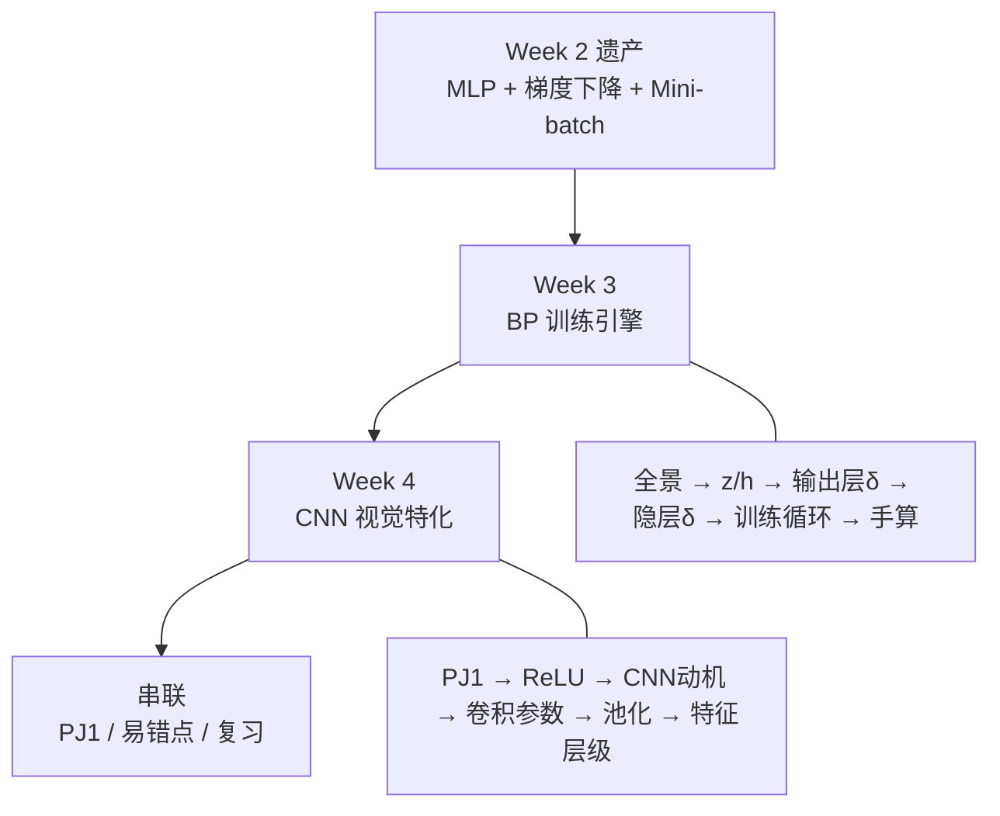
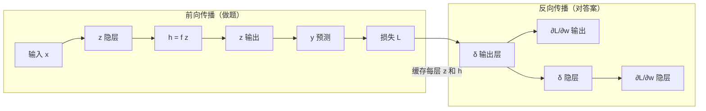
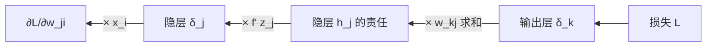

# Week 3–4 学习指南：反向传播 + CNN + PJ1

> **课程**：人工智能（H）CS30057h.01  
> **覆盖周次**：Week 3（2026-03-04）+ Week 4（2026-03-05）  
> **原始采集**：`notebooklm-raw/week3-4/runs/20260610-150251/`（20 批单问单答）  
> **知识图谱**：`notebooklm-raw/week3-4/knowledge-graph.md`（整合前置，含 raw 映射）  
> **Skill**：`.cursor/skills/ai-course-notebooklm/SKILL.md`  
> **生成日期**：2026-06-10（v2：叙事重构；v2.1：补 mermaid）

---

## 0. 术语表

| 术语 | 大白话 | 生活类比 |
|------|--------|----------|
| 🔗 **净输入 $z$** | 神经元收到的加权总和，还没过激活函数 | 原材料 |
| 🔗 **激活值 $h$** | $h = f(z)$，真正传给下一层的信号 | 加工后的产品 |
| 🔗 **误差项 $\delta$** | $\partial L / \partial z$，这个神经元对总误差有多敏感 | 「谁该为这次错误负责」 |
| 🔗 **反向传播 BP** | 从输出端往回，用链式法则把误差分摊到每一层权重 | 从最后一道题倒推，找出每一步错在哪 |
| 🔗 **前向传播** | 数据从输入层一路算到输出和损失 | 学生做题：从第一问写到最后一问 |
| 🔗 **Softmax** | 把各节点的原始分数变成概率分布 | 把卷面总分拆成「每题得分占比」 |
| 🔗 **交叉熵** | 分类常用损失，预测分布离真实标签越远罚得越狠 | 猜错类别时「罚得更重」 |
| 🔗 **感受野** | 卷积核一次能看到的图像区域 | 放大镜的视野范围 |
| 🔗 **权重共享** | 同一个卷积核扫遍整张图 | 拿着同一张「猫耳朵模板」到处比划 |
| 🔗 **特征图** | 某一种卷积核扫描后得到的一张二维平面 | 某种特征的「投影」 |
| 🔗 **最大池化** | 在每个小窗口里只留最大值，顺便缩小尺寸 | 每个小区选一名「尖子生」代表全班 |

---

## 1. 知识地图（L0）

### 1.1 从 Week 2 走来：我们卡在哪？

Week 2 结束时，你已经有了 MLP 的**结构**（隐层 + 可微激活），也有了**优化方向**（梯度下降、Mini-batch）。但还缺一件最关键的事：

> **多层网络里，每一层的权重梯度到底怎么算？**

Week 2 的 Delta 规则只适用于单层感知机。一旦加了隐层，输出层的误差无法直接传到隐层——中间隔着非线性激活函数，不能靠「一眼看出谁错了」来调权重。Week 3 的 **反向传播（Backpropagation, BP）** 就是专门解决这个问题的算法。

Week 4 则回答下一个自然追问：MLP 能处理图像，但**代价太大、也太笨**——于是引入 **CNN**，用「局部看 + 共享模板」高效提取视觉特征。

（来源：Week 3/4 课程记录、课件 08/09）

### 1.2 两周各解决什么？

| 周次 | 你带着什么问题来 | 学完后你应该能 |
|------|----------------|--------------|
| **Week 3** | MLP 结构有了，怎么训练？ | 手推 BP 公式、写 NumPy `backward`、跑通训练循环 |
| **Week 4** | 图像数据怎么高效处理？ | 解释 CNN 为何优于全连接、设卷积参数、理解 PJ1 Part 2 |

### 1.3 叙事线总览



### 1.4 与 Week 1–2 的一句话衔接

Week 2 用 XOR 证明「单层不够 + 阶跃不可微」→ Week 3 用隐层 + 可微激活 + BP 破局；Week 2 的全连接 MLP 面对图像会参数爆炸 → Week 4 用 CNN 做结构特化。（详见 §4.1）

---

## 2. 核心知识

---

### 2.1 Week 3：反向传播与训练

> **本节叙事线**（先建立问题链，再逐个击破）：
>
> ```
> 起点：Week 2 给了你 MLP 和梯度下降，但隐层梯度不会算
>     ↓
> A. BP 全景       →  先搞清楚「我要学什么」：前向 + 反向各干什么
>     ↓
> B. 梯度下降基础   →  为什么更新方向是 −η∇L？（Week 2 的延伸）
>     ↓
> C. z 与 h        →  写代码和推公式都必须区分的「原材料 vs 产品」
>     ↓
> D. 回归输出层 BP  →  最简单的情形：MSE + 恒等激活
>     ↓
> E. 分类输出层 BP  →  最难的推导：Softmax + 交叉熵（结果竟与回归同形！）
>     ↓
> F. 隐层 δ 传递   →  BP 的核心：误差怎么一层层往回传
>     ↓
> G. 训练循环      →  把公式变成能跑的工程流程
>     ↓
> H. 手算验证      →  用数字走一遍，确认你真的懂了
> ```

#### A. 反向传播全景：学 Week 3 到底在学什么？

> **本节要回答**：在碰任何公式之前，先建立 BP 的整体图景——它解决什么问题、分几步走、和 Week 2 的梯度下降什么关系。

**Week 2 留给你的缺口**

想象一个三层网络：输入 → 隐层 → 输出。前向传播时，数据从左往右流，最终算出预测值 $y$ 和损失 $L$。Week 2 的梯度下降告诉你：要减小 $L$，得知道 $\partial L / \partial w$——每个权重该往哪个方向调、调多少。

对**输出层**权重，这事不难：损失直接依赖输出，链式法则一层就能搞定。但对**隐层**权重，损失和它们之间隔着好几层非线性变换——你不能凭直觉说「隐层第 3 个神经元该背多少锅」。BP 就是一套系统化的链式法则，把输出端的误差**反向**传回每一层。

**BP 的两趟车**

| 阶段 | 方向 | 做什么 | 产出 |
|------|------|--------|------|
| **前向传播** | 输入 → 输出 | 逐层算 $z$、$h$，得到预测和损失 | 预测值、损失 $L$；**必须缓存每层的 $z$ 和 $h$** |
| **反向传播** | 输出 → 输入 | 从输出层算 $\delta$，逐层往前传，最后算 $\partial L / \partial w$ | 每个权重的梯度 |

用一句话概括：**前向是「做题」，反向是「对答案」——从最后一道题开始，逐题追溯哪里扣的分，一直追溯到第一题。**



**和 Week 2 梯度下降的关系**

Week 2 说：沿 $-\eta \nabla L$ 方向走。Week 3 的 BP 并不改变这个原则——它只是高效算出多层网络里 $\nabla L$ 的每一个分量。没有 BP，你要么手写每一层的导数（噩梦），要么用数值差分（慢到不可用）。

**学完 A 节，你应该能回答：**
- BP 解决的核心问题是什么？（隐层梯度怎么算）
- 前向和反向各干什么？
- BP 和梯度下降是什么关系？（BP 是算梯度的引擎，梯度下降是用梯度更新的规则）

**A 节小结** → 全景清楚了。接下来先补 Week 2 留下的数学地基（梯度下降为何如此），再进入 BP 的具体推导。

---

#### B. 梯度下降的泰勒基础

> **承接 A 节**：BP 算出了梯度，但「为什么要沿梯度反方向走」？这来自 Week 2 的泰勒展开，这里快速回顾并加深直觉。

**直觉：浓雾下山**

梯度下降就像**浓雾中下山**：你看不见整座山，只能感受脚下哪边最陡，然后往**最陡的下坡方向**迈一小步。迈太大，可能跨过谷底摔到对面山坡——这就是学习率太大的后果。

**数学：一阶泰勒展开**

在参数 $\theta$ 附近：

$$L(\theta + \Delta\theta) \approx L(\theta) + \nabla L(\theta)^T \Delta\theta$$

要让右边第二项为负（损失下降），取 $\Delta\theta = -\eta \nabla L$，代入得：

$$L(\theta + \Delta\theta) \approx L(\theta) - \eta \|\nabla L\|^2$$

$\|\nabla L\|^2 \geq 0$，所以只要 $\eta > 0$，理论上损失会下降。

> **追问：既然公式保证下降，为什么学习率还不能太大？**
>
> 因为泰勒展开只是**线性近似**，忽略了二阶及更高阶项。步长太大时，你走出了「线性近似还准确」的局部范围，高阶项会捣乱——损失不降反升、来回震荡，这叫**病态条件（ill-conditioning）**。
>
> 一句话：**梯度下降只在「脚下这一小片」可靠，所以必须小步迭代，不能一步跳到底。**

（来源：Week 3 记录、课件 08）

**B 节小结** → 知道「往哪走」了。进 BP 之前，先统一符号——$z$ 和 $h$ 不分开，后面所有推导都会糊成一团。

---

#### C. 净输入 $z$ vs 激活值 $h$

> **本节要回答**：每个神经元内部到底算了两次什么？为什么写 PJ1 代码时必须两个都存？

**一个神经元里发生的事**

信息过每个神经元，固定分两拍：

1. **线性组合** → 得到净输入 $z_j = \sum_i w_{ji} x_i + b_j$（原材料：所有上游信号的加权总和）
2. **非线性变换** → 得到激活值 $h_j = f(z_j)$（产品：真正传给下一层的信号）

| | 净输入 $z$ | 激活值 $h$ |
|--|-----------|-----------|
| 公式 | $z = \sum wx + b$ | $h = f(z)$ |
| 角色 | 进入激活函数之前的「总刺激」 | 向外广播的「最终输出」 |
| BP 为何需要 | $\delta = \partial L / \partial z$，且 $f'(z)$ 以 $z$ 为自变量 | 算 $\partial L / \partial w = \delta \cdot h_{\text{上游}}$ 时作乘数 |

> **追问：只存 $h$ 不存 $z$ 会怎样？**
>
> 反向传播要算 $f'(z)$，而 Sigmoid 的导数是 $h(1-h)$——看起来只依赖 $h$。但 ReLU 的导数依赖 $z$ 的正负；更一般地，**链式法则的拆分点就在 $z$ 上**。PJ1 要求你显式缓存每层的 `z` 和 `activation`，这不是形式主义，而是 BP 能跑通的前提。

**回归输出层的特殊选择：恒等激活**

PJ1 的回归任务（拟合 $\sin(x)$）要求输出层用**恒等激活** $y = z$。原因很简单：Sigmoid/Tanh 会把输出「挤压」到有限区间（如 $[0,1]$ 或 $[-1,1]$），而 $\sin(x)$ 的值域需要模型能输出任意实数。恒等激活让输出层保留线性组合的原始结果。

（来源：Week 3 记录、课件 08、PJ1 文档）

**C 节小结** → 符号统一了。从最简单的情形入手：回归任务的输出层 BP。

---

#### D. 回归任务的 BP（MSE + 恒等激活）

> **承接 C 节**：先攻最简堡垒——输出层直接连损失，激活是恒等函数。搞懂这个，分类只是换损失和激活。

**设定**

- 损失：$L = \frac{1}{2}\sum_k (y_k - t_k)^2$（系数 $\frac{1}{2}$ 让求导时平方项的 2 消掉）
- 输出：$y_k = z_k$（恒等激活，$f'(z_k) = 1$）

**第一步：输出层误差项 $\delta_k$**

$$\delta_k = \frac{\partial L}{\partial z_k} = \underbrace{\frac{\partial L}{\partial y_k}}_{y_k - t_k} \cdot \underbrace{\frac{\partial y_k}{\partial z_k}}_{1} = \mathbf{y_k - t_k}$$

物理意义：预测比目标高多少，$\delta$ 就是正多少；低了就是负的。**这就是「预测减真实」。**

**第二步：权重梯度 $\frac{\partial L}{\partial w_{kj}}$**

$$w_{kj}\text{ 只通过 } z_k \text{ 影响 } L \quad \Rightarrow \quad \frac{\partial L}{\partial w_{kj}} = \delta_k \cdot h_j$$

| 因子 | 含义 |
|------|------|
| $\delta_k$ | 这个输出神经元该背多少责任 |
| $h_j$ | 上游隐层神经元 $j$ 传下来的信号有多强——**信号越强，这个连接的权重对误差影响越大** |

这和 Week 2 Delta 规则 $\Delta w_i = \eta(d-y)x_i$ 是同一逻辑：$(d-y)$ 对应 $\delta_k$，$x_i$ 对应 $h_j$。

**代码直觉**（PJ1 Part 1）：

```python
delta_output = output - target          # 回归：δ = y - t
grad_W = delta_output @ hidden.T        # ∂L/∂w = δ · h
```

（来源：Week 3 记录、课件 08）

**D 节小结** → 输出层搞定了。但分类任务用 Softmax + 交叉熵，$\delta$ 还能这么简单吗？令人惊讶的是——能，而且形式一模一样。这是 Week 3 最难的推导，值得单独攻坚。

---

#### E. Softmax + 交叉熵的 BP

> **本节要回答**：分类时损失和激活都变了，为什么输出层 $\delta_k$ 还是 $y_k - t_k$？

**设定**

- 损失：$L = -\sum_i t_i \ln y_i$（交叉熵）
- 输出：$y_i = e^{a_i} / \sum_s e^{a_s}$（Softmax，$a_k$ 是 logit/净输入）
- 标签：One-hot（正确类 $t_k=1$，其余为 0）

**推导概要**（完整步骤见 raw `w3-bp-softmax-ce.answer.md`）

目标：$\frac{\partial L}{\partial a_k}$。链式法则要求对所有输出 $y_i$ 求和（因为 Softmax 让每个 $a_k$ 影响所有 $y_i$）：

$$\frac{\partial L}{\partial a_k} = \sum_i \frac{\partial L}{\partial y_i} \cdot \frac{\partial y_i}{\partial a_k}$$

关键分岔——Softmax 对自身输入的导数要分 $i=k$ 和 $i \neq k$：

- $i = k$：$\frac{\partial y_k}{\partial a_k} = y_k(1 - y_k)$
- $i \neq k$：$\frac{\partial y_i}{\partial a_k} = -y_i y_k$

代入、化简（中间利用 $\sum_i t_i = 1$），最终：

$$\frac{\partial L}{\partial a_k} = \mathbf{y_k - t_k}$$

> **直观理解：为什么指数和对数能「对冲」成这么简洁的形式？**
>
> Softmax 里的 $e^{a}$ 求导还是 $e^{a}$；交叉熵里的 $\ln y$ 求导是 $1/y$。两者配对时，$y$ 和 $1/y$ 恰好消掉，只剩 $y_k - t_k$。这是神经网络设计中「锁与钥匙」式的搭配——不是巧合，而是刻意选择让梯度形式尽可能简洁。

**统一性：一套代码处理回归和分类**

| 任务 | 损失 | 输出激活 | 输出层 $\delta$ |
|------|------|---------|----------------|
| 回归 | MSE | 恒等 | $y_k - t_k$ |
| 分类 | 交叉熵 | Softmax | $y_k - t_k$ |

PJ1 的 `backward` 里，输出层可以共用同一段逻辑——这是 BP 工程实现中最大的便利之一。

（来源：Week 3 记录、课件 08）

**E 节小结** → 输出层 $\delta$ 无论回归还是分类，都是「预测减真实」。但隐层不直接接触损失——它的 $\delta$ 怎么来？

---

#### F. 隐层误差反向传递

> **本节要回答**：隐层神经元的 $\delta_j$ 如何从后一层「接」过来？这是 BP 的灵魂公式。

**核心公式**

$$\delta_j = f'(z_j) \sum_k \delta_k \, w_{kj}$$

**逐项拆解**

| 部分 | 含义 |
|------|------|
| $\sum_k \delta_k w_{kj}$ | 后一层每个神经元 $k$ 把自己的误差 $\delta_k$，按连接权重 $w_{kj}$ 反向分摊给隐层节点 $j$ |
| $f'(z_j)$ | 激活函数在 $z_j$ 处的导数——如果 $z_j$ 落在 Sigmoid 饱和区（$f' \approx 0$），信号在这里被「掐断」 |

> **中层主管类比**
>
> 隐层节点 $j$ 像一位中层主管——不直接面对客户（损失函数），但管理着一群下属（后一层节点 $k$）。他的「过失」$\delta_j$ 取决于：
> 1. 每个下属犯了多少错（$\delta_k$）
> 2. 他给每个下属分配了多少权重（$w_{kj}$）
> 3. 他自己还能不能「发声」（$f'(z_j)$）——如果处于饱和区，再严重的下属错误也传不到他这里（**梯度消失的雏形**）

**推导路径**（链式法则）

$$\delta_j = \frac{\partial L}{\partial z_j} = \underbrace{\frac{\partial L}{\partial h_j}}_{\sum_k \delta_k w_{kj}} \cdot \underbrace{\frac{\partial h_j}{\partial z_j}}_{f'(z_j)}$$



隐层权重梯度（与输出层同形）：

$$\frac{\partial L}{\partial w_{ji}} = \delta_j \cdot x_i$$

（来源：Week 3 记录、课件 08）

**F 节小结** → 公式齐了。接下来把它们装进一个能反复执行的工程流程。

---

#### G. 标准训练循环

> **本节要回答**：BP 不是做一次就完——一个 iteration 里具体按什么顺序操作？

**五步循环**（每个 iteration 重复）

```
1. 梯度清零     →  防止上一轮梯度残留（PJ1 / PyTorch 的 zero_grad）
2. Mini-batch 采样 →  随机抽一小批样本（Week 2 的 Mini-batch SGD）
3. 前向传播     →  算 z、h、预测值、损失 L
4. 反向传播     →  从输出层往回算 δ，再算所有 ∂L/∂w
5. 参数更新     →  θ ← θ − η∇L
```

**早停（Early Stopping）**

训练时同时监控**验证集**（不参与训练的数据）：

- 训练集损失持续下降，但验证集损失开始上升 → 模型在「背答案」（过拟合）
- 此时**停止训练**，取验证集表现最好的那组权重作为最终模型

PJ1 和 Part 2 的 CNN 都依赖这个循环。区别只是 Part 1 用 NumPy 手写 BP，Part 2 用 PyTorch 的 `loss.backward()` 自动求导。

（来源：Week 3 记录、课件 08）

---

#### H. BP 手算数值例子

> **本节要回答**：用具体数字走一遍前向 + 反向，验证公式不是空中楼阁。

**网络结构**：2 输入 → 1 隐层（Sigmoid）→ 1 输出（恒等）

| 量 | 值 |
|----|-----|
| 输入 | $x_1=0.5,\; x_2=-0.2$，目标 $t=0.4$ |
| 隐层权重/偏置 | $w_{11}=0.1,\; w_{12}=0.2,\; b^{(1)}=-0.1$ |
| 输出层权重/偏置 | $w_{21}=0.3,\; b^{(2)}=-0.1$ |

**前向**

1. $z_h = 0.5 \times 0.1 + (-0.2) \times 0.2 + (-0.1) = -0.09$
2. $h = \text{Sigmoid}(-0.09) \approx 0.4775$
3. $z_o = 0.4775 \times 0.3 + (-0.1) = 0.04325$，$y = 0.04325$
4. $L = \frac{1}{2}(0.04325 - 0.4)^2 \approx 0.0636$

**反向**

1. $\delta_o = y - t = -0.35675$
2. $\partial L / \partial w_{21} = \delta_o \cdot h \approx -0.1703$
3. $f'(z_h) = h(1-h) \approx 0.2495$
4. $\delta_h = 0.2495 \times (-0.35675 \times 0.3) \approx -0.0267$
5. $\partial L / \partial w_{11} = \delta_h \cdot x_1 \approx -0.0134$

**更新**（$\eta = 0.1$）：$w_{21} \to 0.317$，$w_{11} \to 0.101$

> **追问：$\delta_o$ 是负的，说明什么？**
>
> 预测值 $y \approx 0.043$ 远低于目标 $0.4$——模型「猜低了」。负的 $\delta_o$ 乘以正的 $h$，梯度为负，更新后 $w_{21}$ 增大，下次预测会往高处走。公式和直觉一致。

（来源：Week 3 记录、课件 08、PJ1 文档）

**Week 3 总结** → 你现在能训练多层网络了。但拿全连接 MLP 直接处理 28×28 的汉字图片？参数爆炸、空间结构全丢。Week 4 的 CNN 来解决这个问题。

---

### 2.2 Week 4：深度学习进阶与 CNN

> **本节叙事线**：
>
> ```
> 起点：BP 能训练 MLP 了，但图像任务暴露两个致命问题
>     ↓
> I. PJ1 全景      →  先知道项目考什么，学习才有方向
>     ↓
> J. 梯度消失/ReLU  →  深层网络为什么难训？怎么破？
>     ↓
> K. CNN 全景      →  为什么需要卷积？解决「看哪里」和「怎么看」
>     ↓
> L. 卷积参数      →  核大小、步长、填充怎么决定输出尺寸
>     ↓
> M. 最大池化      →  下采样 + 平移不变性 + 赢者通吃梯度
>     ↓
> N. 特征层级      →  从边缘到语义的逐级抽象
> ```

#### I. PJ1 任务全景

> **本节要回答**：Project 1 考什么？Week 3–4 的知识怎么落到代码里？

| 部分 | 权重 | 核心要求 | 对应本周知识 |
|------|------|---------|-------------|
| **Part 1** | 60% | NumPy 手写 BP：回归 $\sin(x)$ + 12 类汉字分类 | Week 3 全部 |
| **Part 2** | 40% | PyTorch 搭建 CNN 做汉字分类 | Week 4 CNN |
| **Bonus** | +10 / +5 | 防过拟合（Dropout 等）/ 不用 PyTorch 手写 CNN | Week 4 进阶 |

**面试重点**：助教可能让你闭卷推 $\delta$ 公式，或白板画 CNN 特征图尺寸变化。公式推导比调参重要。

（来源：Project 1 文档、Week 4 记录）

---

#### J. 梯度消失、ReLU 与 ResNet

> **承接 I 节**：PJ1 Part 2 要用深层 CNN。深层网络训练的第一个拦路虎是——梯度传不回去。

**Sigmoid 的「传话游戏」**

Sigmoid 导数 $f' = f(1-f)$，最大值仅 **0.25**。反向传播时，每过一层乘一次 $\leq 0.25$ 的数——10 层之后梯度衰减到 $0.25^{10} \approx 10^{-6}$，浅层权重几乎收不到更新信号。这叫**梯度消失**。

> 类比：一排人传话，每人把声音降到四分之一以下，传到第十个人时已细不可闻。

**ReLU：正区间导数为 1**

$f(x) = \max(0, x)$，在 $x > 0$ 时 $f'(x) = 1$。连乘链条里乘以 1 不改变梯度大小——信号可以无损传回浅层。现代 CNN 默认用 ReLU 而非 Sigmoid，这是核心原因之一。

**ResNet 残差连接：梯度高速公路**

传统网络像一节一节拼接的管道，任何一节堵塞信号就断了。ResNet 在每层旁边加「跨层短路」：$y = x + F(x)$，求导时 $\frac{\partial y}{\partial x} = 1 + F'(x)$——即使 $F'(x) \approx 0$，常数 1 保证梯度仍能流过。这让训练上百层网络成为可能。

（来源：Week 4 记录、课件 08/09）

**J 节小结** → 深层网络能训了。但为什么图像不直接用 MLP？

---

#### K. CNN 设计动机：为什么需要卷积？

> **本节要回答**：全连接网络处理图像有什么根本缺陷？CNN 的两招「局部连接 + 权重共享」各解决什么？

**全连接的两个致命问题**

| 问题 | 具体表现 | 生活类比 |
|------|---------|---------|
| **参数爆炸** | 1000×1000 图像 × 1000 隐层神经元 = **10 亿**权重 | 每像素都连一个独立评委，成本不可承受 |
| **空间信息丢失** | 展平成一维向量，像素邻居关系被切断 | 把拼图拆散装进长筒，再也看不出形状 |

**CNN 的两招**

| 机制 | 做什么 | 解决什么 | 类比 |
|------|--------|---------|------|
| **局部连接** | 每个神经元只看一小块区域（感受野） | 参数暴减 + 尊重局部相关性 | 拿放大镜读报，一次只看几个字 |
| **权重共享** | 同一个卷积核扫遍全图 | 不用为每个位置学独立模板 | 同一张「猫耳朵检测器」到处比划 |

**两个重要性质**

- **平移等变性**（卷积层）：物体在图中移动，特征图的响应位置跟着移动——「如影随形」
- **平移不变性**（池化层配合）：物体微小位移后，池化输出基本不变——「稳如泰山」


（来源：Week 4 记录、课件 09）

**K 节小结** → 知道为什么了。接下来是工程细节：卷积的参数怎么设。

---

#### L. 卷积参数与输出尺寸

**输出尺寸公式**

$$O = \left\lfloor \frac{I - K + 2P}{S} \right\rfloor + 1$$

| 参数 | 含义 | 直觉 |
|------|------|------|
| $I$ | 输入边长 | 原图多大 |
| $K$ | 卷积核大小 | 放大镜多大 |
| $S$ | 步长 | 每次跳几格——越大扫得越快，输出越小 |
| $P$ | 填充 | 边缘补零——保护边缘信息、控制输出尺寸 |
| 输出通道数 | = 卷积核个数 | 每个核提取一种特征（横线、竖线、圆弧…） |

> **追问：$P = \frac{K-1}{2}$ 且 $S=1$ 时输出尺寸不变？**
>
> 这叫 **same padding**。PJ1 / PyTorch 里 `padding=1` 配 `kernel_size=3` 就是这种情况——特征图空间尺寸保持不变，方便堆叠多层。

（来源：Week 4 记录、课件 09）

---

#### M. 最大池化

**做什么**

在每个 $2 \times 2$（或其他大小）窗口里取最大值，输出缩小为原来的 $1/2$（典型配置）。

**三个作用**

1. **下采样降维**——减少后续计算量和过拟合风险
2. **平移不变性**——只关心「这个特征在不在」，不关心精确坐标
3. **特征选择**——保留局部最强烈的信号（「逻辑或」语义）

**反向传播：赢者通吃**

池化层没有可学习参数，但梯度仍要传回去：

- 前向时记录每个窗口最大值的位置
- 反向时梯度**只传给那个最大值位置**，其余置零

对比平均池化：梯度均分给窗口内所有位置。最大池化在保留边缘/纹理方面通常效果更好。

（来源：Week 4 记录、课件 09）

---

#### N. 特征层级（了解即可）

CNN 越深，提取的特征越抽象：

```
浅层：边缘、线条、颜色块
  ↓
中层：纹理、角点、局部结构
  ↓
深层：语义（「这是一个字」「这是眼睛」）
```

经典范例：LeNet-5（卷积 → 池化 → 卷积 → 池化 → 全连接 → 输出）。PJ1 Part 2 的 CNN 是这个思路的现代版。

（来源：Week 4 记录、课件 09）

**Week 4 总结** → 你现在有了训练引擎（Week 3）和视觉特征提取器（Week 4）。接下来把它们和 PJ1、前几周知识串起来。

---

## 3. 重难点与易错点

| 易混组 | 为什么容易错 | 正确理解 | 记忆 |
|--------|------------|---------|------|
| $z$ vs $h$ | 都是神经元内部的一个数，代码里常只存一个 | $z$ 是加权总和；$h = f(z)$ 是激活后产品。BP 必须存 $z$ 来算 $f'(z)$ | 原材料 vs 产品 |
| $\delta$ vs $\partial L/\partial w$ | 都在 backward 里出现 | $\delta$ 是对净输入的敏感度（责任）；梯度 = $\delta \times$ 输入（动作） | 谁负责 vs 怎么改 |
| 平移等变 vs 不变 | 名字像，都和位移有关 | 等变=卷积层，物体动响应跟着动；不变=池化层，微小位移输出不变 | 如影随形 vs 稳如泰山 |
| 通道 vs 特征图 | 多层网络里输入输出角色互换 | 通道是数据的「厚度」（RGB=3）；特征图是某个核扫描后的二维平面 | 厚度 vs 投影 |
| 最大池化梯度 | 以为没参数就没梯度 | 赢者通吃：只传给前向时最大值那个位置 | 尖子生背锅 |

（来源：Week 3/4 记录、课件 08/09、PJ1 文档）

---

## 4. 知识串联（L4）

### 4.1 Week 1–2 → Week 3–4

| 转折 | 前几周铺垫 | 本周解决 |
|------|-----------|---------|
| 单层 → 多层 | XOR 证明单层不够；阶跃不可微 | 隐层 + 可微激活 + BP |
| 优化理论 → 可执行算法 | 泰勒梯度下降、Mini-batch | BP = 梯度下降在复合函数上的高效实现 |
| Sigmoid 可微 → 深层瓶颈 | Sigmoid 导数 $\leq 0.25$ | ReLU（正区导数=1）+ ResNet 残差 |
| 全连接 MLP → 视觉特化 | 参数爆炸、空间信息丢失 | CNN 局部连接 + 权重共享 |
| 小规模 → 大规模训练 | Mini-batch SGD | PJ1 处理 7433 张汉字图的标准工程流程 |

### 4.2 知识点 → PJ1 映射

| 知识点 | PJ1 落点 |
|--------|---------|
| BP 推导、$\delta$ 层级传递 | Part 1 `backward` 核心 |
| MSE + 恒等激活 | Part 1 回归 $\sin(x)$，误差 $< 0.01$ |
| Softmax + 交叉熵 | Part 1 12 类汉字分类 |
| 训练循环、梯度清零、早停 | Part 1 & 2 通用 |
| CNN 局部连接/权重共享 | Part 2 理论面试 |
| 卷积参数、输出尺寸公式 | Part 2 网络搭建 |
| ReLU、Dropout、数据增强 | Part 2 优化 / Bonus +10 |
| 手写卷积/池化 | Bonus +5 |

### 4.3 复习优先级

| 优先级 | 内容 | 理由 |
|--------|------|------|
| **极高** | BP 推导与 $\delta$；训练五步循环 | Part 1 占 60%；面试必考 |
| **高** | CNN 动机与卷积参数；ReLU/梯度消失 | Part 2 理论基础 |
| **中** | 池化、特征层级、DL 历史 | 理解加分；Bonus 需要池化梯度 |
| **了解** | Hopfield/RBM 预训练史 | 宏观视野，PJ1 不直接考 |

---

## 5. 资料索引

| 类型 | 路径 |
|------|------|
| 课程记录 | `week3-周五-AI.md`、`week4-周五-AI.md` |
| 课件 | `08Connectionist.pdf`、`09Deep learning.pdf` |
| Project | `4_Lab/Project1/`、`5_Project/PJ1-知识点学习指南.md` |
| 知识图谱 | `notebooklm-raw/week3-4/knowledge-graph.md` |
| 原始回答 | `notebooklm-raw/week3-4/runs/20260610-150251/` |

---

## 6. 学习后补充（Step 4）

阅读过程中若有仍不懂的点，可追加 `supplement-<主题>` batch 向 NotebookLM 追问，例如：

- 「请用更直观的方式解释 Softmax+CE 化简为 $y_k - t_k$ 的每一步」
- 「请给 $3 \times 3$ 卷积、padding=1、stride=1 的完整手算例子」

追加后运行：`python .cursor/skills/ai-course-notebooklm/scripts/nlm-collect.py notebooklm-raw/manifests/week3-4.json --only supplement-xxx`

---

*整合自 NotebookLM 20 批单问采集；v2 按 Week 1–2 叙事标准重构。欢迎标注仍不直观的小节，迭代追问块。*
