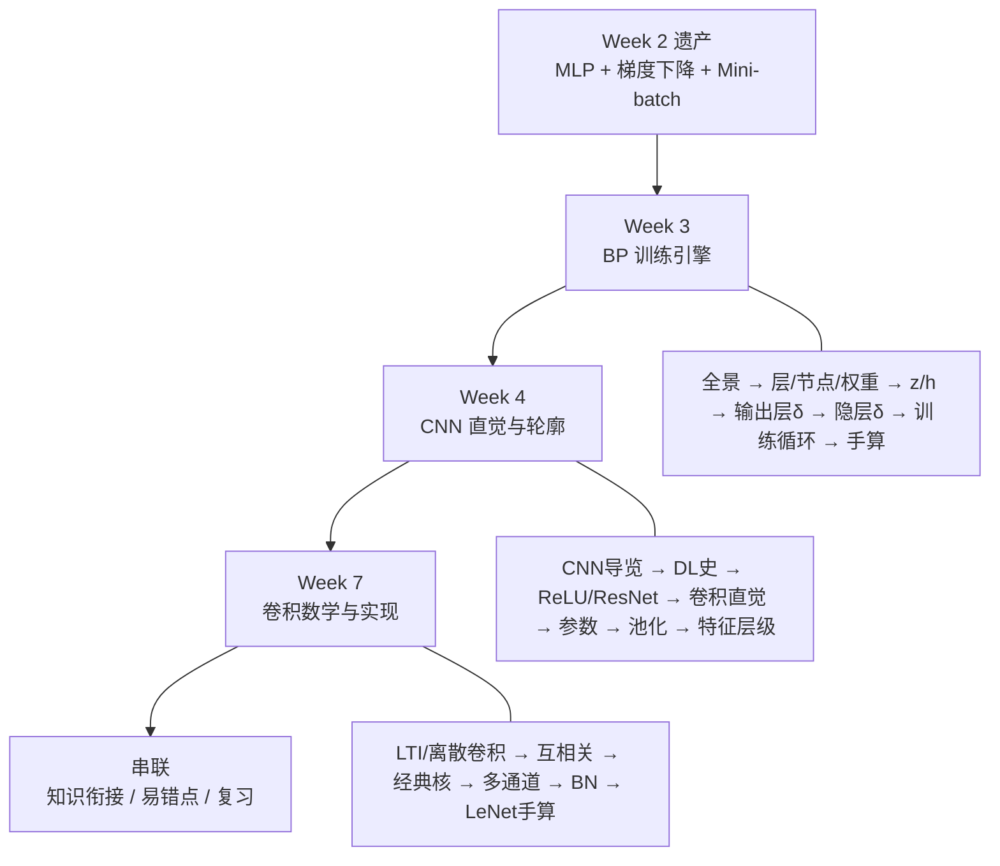
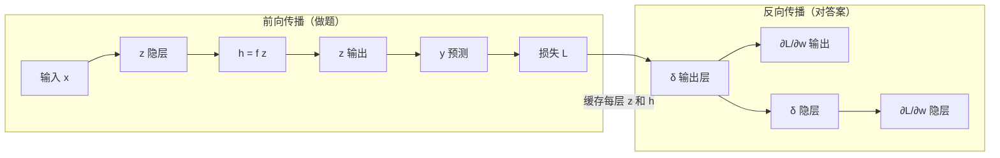
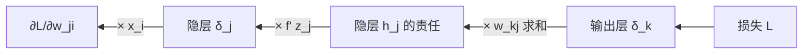
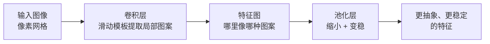

# Week 3–4–7 学习指南：反向传播 + CNN（含 Week 7 递进）

> **课程**：人工智能（H）CS30057h.01  
> **覆盖周次**：Week 3（2026-03-04）+ Week 4（2026-03-05）+ **Week 7（2026-04-17，CNN 数学与实现深化）**  
> **原始采集**：Week 3–4 `notebooklm-raw/week3-4/runs/20260610-150251/`（20 批）；Week 7 `notebooklm-raw/week7/runs/20260612-015756/`（13 批）  
> **知识图谱**：`notebooklm-raw/week3-4/knowledge-graph.md`、`notebooklm-raw/week7/knowledge-graph.md`  
> **Skill**：`.cursor/skills/ai-course-notebooklm/SKILL.md`  
> **生成日期**：2026-06-10（v2：叙事重构；v2.1：补 mermaid）  
> **术语格式**：术语表及正文**首次出现**时，专业名词采用 **中文（English）**；英文缩写采用 **缩写（English full form，中文）**，便于对照英文试卷。

---

## 0. 术语表

| 术语 | 大白话 | 生活类比 |
|------|--------|----------|
| 🔗 **净输入 $z$（net input）** | 神经元收到的加权总和，还没过激活函数 | 原材料 |
| 🔗 **激活值 $h$（activation）** | $h = f(z)$，真正传给下一层的信号 | 加工后的产品 |
| 🔗 **误差项 $\delta$（error term）** | $\partial L / \partial z$，这个神经元对总误差有多敏感 | 「谁该为这次错误负责」 |
| 🔗 **BP（Backpropagation，反向传播）** | 从输出端往回，用链式法则把误差分摊到每一层权重 | 从最后一道题倒推，找出每一步错在哪 |
| 🔗 **前向传播（Forward propagation）** | 数据从输入层一路算到输出和损失 | 学生做题：从第一问写到最后一问 |
| 🔗 **Softmax（归一化指数函数）** | 把各节点的原始分数变成概率分布 | 把卷面总分拆成「每题得分占比」 |
| 🔗 **交叉熵（Cross-entropy）** | 分类常用损失，预测分布离真实标签越远罚得越狠 | 猜错类别时「罚得更重」 |
| 🔗 **感受野（Receptive field）** | 卷积核一次能看到的图像区域 | 放大镜的视野范围 |
| 🔗 **权重共享（Weight sharing）** | 同一个卷积核扫遍整张图 | 拿着同一张「猫耳朵模板」到处比划 |
| 🔗 **特征图（Feature map）** | 某一种卷积核扫描后得到的一张二维平面 | 某种特征的「投影」 |
| 🔗 **最大池化（Max pooling）** | 在每个小窗口里只留最大值，顺便缩小尺寸 | 每个小区选一名「尖子生」代表全班 |
| 🔗 **互相关（Cross-correlation）** | CNN 实现里核不翻转的滑动点积（PyTorch `conv2d`） | 模板直接盖上去比对，不镜像翻转 |
| 🔗 **Batch Norm（Batch Normalization，批量归一化）** | 按 batch 归一化特征，再学缩放/平移 | 每层楼先做「标准化体检」再激活 |
| 🔗 **MSE（Mean Squared Error，均方误差）** | 回归常用损失 | Part 1 $\sin(x)$ 任务 |
| 🔗 **Hopfield 网络（Hopfield network）** | 用能量函数刻画网络状态，收敛到能量极小实现联想记忆 | 有噪声的地址簿：模糊输入也能「联想」到完整图案 |
| 🔗 **RBM（Restricted Boltzmann Machine，受限玻尔兹曼机）** | 层内无连接、层间全连接的随机神经网络，可逐层无监督训练 | 一层一层「解锁」深层特征 |
| 🔗 **DBN（Deep Belief Network，深度信念网络）** | 多层 RBM 堆叠而成的深度生成模型 | RBM 搭成的「深层脚手架」 |
| 🔗 **逐层预训练（Layer-wise pre-training）** | 2006–2012 主流：先无监督学各层特征再微调全网络 | 先搭骨架再精修；现多被端到端 BP 取代 |
| 🔗 **ReLU（Rectified Linear Unit，修正线性单元）** | $\max(0,x)$，正区间导数为 1 | 缓解 Sigmoid 梯度消失 |
| 🔗 **ResNet（Residual Network，残差网络）** | 残差连接 $y=x+F(x)$ | 梯度高速公路，可训极深网络 |
| 🔗 **LTI（Linear Time-Invariant，线性时不变）** | 线性 + 时不变，输出=输入卷积冲激响应 | 离散卷积公式的系统论来源 |

---

## 1. 知识地图（L0）

### 1.1 从 Week 2 走来：我们卡在哪？

Week 2 结束时，你已经有了 MLP 的**结构**（隐层 + 可微激活），也有了**优化方向**（梯度下降、Mini-batch）。但还缺一件最关键的事：

> **多层网络里，每一层的权重梯度到底怎么算？**

Week 2 的 Delta 规则只适用于单层感知机。一旦加了隐层，输出层的误差无法直接传到隐层——中间隔着非线性激活函数，不能靠「一眼看出谁错了」来调权重。Week 3 的 **BP（Backpropagation，反向传播）** 就是专门解决这个问题的算法。

Week 4 则回答下一个自然追问：MLP 能处理图像，但**代价太大、也太笨**——于是引入 **CNN**，用「局部看 + 共享模板」高效提取视觉特征。

Week 7 **不是新开一条线**，而是 Week 4 CNN 的**递进深化**：把 K–N 节的直觉落到离散卷积公式、互相关与 CNN 实现的对应关系、多通道参数量、LeNet-5 手算等细节上。

（来源：Week 3/4/7 课程记录、课件 08/09）

### 1.2 各周各解决什么？

| 周次 | 你带着什么问题来 | 学完后你应该能 |
|------|----------------|--------------|
| **Week 3** | MLP 结构有了，怎么训练？ | 手推 BP 公式、写 `backward`、跑通训练循环 |
| **Week 4** | 图像数据怎么高效处理？深层网络怎么训得动？ | 复述 Hopfield→RBM→预训练脉络；解释卷积与 CNN 动机、ReLU/ResNet |
| **Week 7** | Week 4 的卷积「直觉」够写代码/推公式吗？ | 离散卷积 vs 互相关、多通道参数量、经典卷积核、LeNet 尺寸手算 |

### 1.3 叙事线总览



### 1.4 与 Week 1–2 的一句话衔接

Week 2 用 XOR 证明「单层不够 + 阶跃不可微」→ Week 3 用隐层 + 可微激活 + BP 破局；Week 2 的全连接 MLP 面对图像会参数爆炸 → Week 4 用 CNN 做结构特化 → Week 7 把卷积落到数学公式与实现细节。（详见 §4.1）

---

## 2. 核心知识

---

### 2.1 Week 3：反向传播（Backpropagation）与训练

> **本节叙事线**（先建立问题链，再逐个击破）：
>
> ```
> 起点：Week 2 给了你 MLP 和梯度下降，但隐层梯度不会算
>     ↓
> A. BP 全景       →  先搞清楚「我要学什么」：前向 + 反向各干什么
>     ↓
> B. 梯度下降基础   →  为什么更新方向是 −η∇L？（Week 2 的延伸）
>     ↓
> B′. 层·节点·权重  →  网络结构先导：谁算数、谁连谁、参数在哪
>     ↓
> C. z 与 h        →  写代码和推公式都必须区分的「原材料 vs 产品」
>     ↓
> D. 回归输出层 BP  →  最简单的情形：MSE（Mean Squared Error，均方误差）+ 恒等激活
>     ↓
> E. 分类输出层 BP  →  最难的推导：Softmax + 交叉熵（结果竟与回归同形！）
>     ↓
> F. 隐层 δ 传递   →  BP 的核心：误差怎么一层层往回传
>     ↓
> G. 训练循环      →  把公式变成能跑的工程流程
>     ↓
> H. 手算验证      →  用数字走一遍，确认你真的懂了
> ```

#### A. 反向传播全景：学 Week 3 到底在学什么？

> **本节要回答**：在碰任何公式之前，先建立 BP 的整体图景——它解决什么问题、分几步走、和 Week 2 的梯度下降什么关系。

**Week 2 留给你的缺口**

想象一个三层网络：输入 → 隐层 → 输出。前向传播时，数据从左往右流，最终算出预测值 $y$ 和损失 $L$。Week 2 的梯度下降告诉你：要减小 $L$，得知道 $\partial L / \partial w$——每个权重该往哪个方向调、调多少。

对**输出层**权重，这事不难：损失直接依赖输出，链式法则一层就能搞定。但对**隐层**权重，损失和它们之间隔着好几层非线性变换——你不能凭直觉说「隐层第 3 个神经元该背多少锅」。BP 就是一套系统化的链式法则，把输出端的误差**反向**传回每一层。

**BP 的两趟车**

| 阶段 | 方向 | 做什么 | 产出 |
|------|------|--------|------|
| **前向传播** | 输入 → 输出 | 逐层算 $z$、$h$，得到预测和损失 | 预测值、损失 $L$；**必须缓存每层的 $z$ 和 $h$** |
| **反向传播** | 输出 → 输入 | 从输出层算 $\delta$，逐层往前传，最后算 $\partial L / \partial w$ | 每个权重的梯度 |

用一句话概括：**前向是「做题」，反向是「对答案」——从最后一道题开始，逐题追溯哪里扣的分，一直追溯到第一题。**



**和 Week 2 梯度下降的关系**

Week 2 说：沿 $-\eta \nabla L$ 方向走。Week 3 的 BP 并不改变这个原则——它只是高效算出多层网络里 $\nabla L$ 的每一个分量。没有 BP，你要么手写每一层的导数（噩梦），要么用数值差分（慢到不可用）。

**学完 A 节，你应该能回答：**
- BP 解决的核心问题是什么？（隐层梯度怎么算）
- 前向和反向各干什么？
- BP 和梯度下降是什么关系？（BP 是算梯度的引擎，梯度下降是用梯度更新的规则）

**A 节小结** → 全景清楚了。接下来先补 Week 2 留下的数学地基（梯度下降为何如此），再进入 BP 的具体推导。

---

#### B. 梯度下降的泰勒基础

> **承接 A 节**：BP 算出了梯度，但「为什么要沿梯度反方向走」？这来自 Week 2 的泰勒展开，这里快速回顾并加深直觉。

**直觉：浓雾下山**

梯度下降就像**浓雾中下山**：你看不见整座山，只能感受脚下哪边最陡，然后往**最陡的下坡方向**迈一小步。迈太大，可能跨过谷底摔到对面山坡——这就是学习率太大的后果。

**数学：一阶泰勒展开**

在参数 $\theta$ 附近：

$$L(\theta + \Delta\theta) \approx L(\theta) + \nabla L(\theta)^T \Delta\theta$$

要让右边第二项为负（损失下降），取 $\Delta\theta = -\eta \nabla L$，代入得：

$$L(\theta + \Delta\theta) \approx L(\theta) - \eta \|\nabla L\|^2$$

$\|\nabla L\|^2 \geq 0$，所以只要 $\eta > 0$，理论上损失会下降。

> **追问：既然公式保证下降，为什么学习率还不能太大？**
>
> 因为泰勒展开只是**线性近似**，忽略了二阶及更高阶项。步长太大时，你走出了「线性近似还准确」的局部范围，高阶项会捣乱——损失不降反升、来回震荡，这叫**病态条件（ill-conditioning）**。
>
> 一句话：**梯度下降只在「脚下这一小片」可靠，所以必须小步迭代，不能一步跳到底。**

（来源：Week 3 记录、课件 08）

**B 节小结** → 知道「往哪走」了。进 BP 公式之前，先把 Week 2 MLP 的「层、节点、权重」三者关系钉死——否则后面的 $w_{kj}$、$\delta$、矩阵 $W$ 会各说各话。

---

#### B′. 先导：层·节点·权重

> **本节要回答**：Week 2 你已会画 MLP（全连接 + 隐层）；进 BP 推导前，先把**层、节点、权重**在结构上的分工搞清楚——谁负责计算、谁负责连接、参数到底挂在哪。

**三层图景：网络 = 层堆叠**

| 概念 | 是什么 | 在全连接 MLP 里 |
|------|--------|----------------|
| **层（layer）** | 同一「深度」的一组节点，一起接收上一层信号、一起产出给下一层 | 输入层 → 隐层 → 输出层，自左向右堆叠 |
| **节点（node / neuron）** | 层里的一个计算单元：收上游信号 → 算 $z$ → 过 $f$ 得 $h$ | 隐层有 $N$ 个节点，输出层有 $M$ 个节点…… |
| **权重（weight）** | 挂在**相邻两层之间**的连接上的可学习标量 | **只存在于层边界**；同层两个节点在全连接 MLP 里**不直连** |

用 ASCII 看「层边界才有权重」：

```
  输入层 L=0          隐层 L=1              输出层 L=2
  (不计可训练参数)     (n 个节点)             (m 个节点)

    x₁ ──w──► h₁ ──w──► y₁
    x₂ ──w──► h₂ ──w──► y₂        ← 同层 h₁、h₂ 之间无连线
    x₃ ──w──► h₃ ──w──► y₃
         ╲  ╱    ╲  ╱
    权重矩阵 W^(0→1)   权重矩阵 W^(1→2)
    大小 n_in × n      大小 m × n
```

前向时：数据在**层与层之间**流动（$h^{(L)}$ 作下一层的输入）；反向时：梯度也沿**同一条层间连接**往回传。BP 的 $\partial L/\partial w$ 永远针对某条「前层节点 $j$ → 后层节点 $k$」的边，而不是某个节点「内部」的参数。

**节点 vs 权重：各管什么**

| | **节点** | **权重** |
|--|---------|---------|
| 干什么 | 做计算：$z = \sum w x + b$，再 $h = f(z)$ | 调节**连接强度**：前层信号 $h_j$ 对后层 $z_k$ 贡献多少 |
| 在哪 | 层**里面** | 层**边界**（两条相邻层之间） |
| 符号 | 下标 $j$、$k$ 标记「第几个节点」 | $w_{kj}$：**从**前层节点 $j$ **指向**后层节点 $k$（先目标 $k$，后来源 $j$） |

后层节点 $k$ 的净输入：

$$z_k = \sum_j w_{kj}\, h_j + b_k$$

这与后面 D 节的权重梯度**完全同构**：

$$\frac{\partial L}{\partial w_{kj}} = \delta_k \cdot h_j$$

读法：后层误差 $\delta_k$（「$k$ 该背多少锅」）× 前层信号 $h_j$（「$j$ 当时说了多大声」）= 这条连接该调多少。下标 $kj$ 的方向与箭头一致，后面读 BP 公式时不容易反。

**参数量：数清层边界**

从层 $L$ 到层 $L{+}1$，设前层 $n$ 个节点、后层 $m$ 个节点：

| 参数 | 数量 | 说明 |
|------|------|------|
| 权重 | $n \times m$ | 每条「$j \to k$」边一个 $w_{kj}$ |
| 偏置 | $m$ | 后层每个节点一个 $b_k$ |
| **小计** | $nm + m$ | 常写作 $m(n{+}1)$ |

**输入层通常不计为可训练层**——它只是把原始特征 $x$ 原样送出，可训练参数从「输入→隐层」那块权重矩阵开始算。Week 2 说「3 层网络」时，往往指 **1 隐层 + 1 输出层**（输入层另算、不数进「深度」）。

**矩阵视角：一行 = 后层一个节点**

$$W^{(L \to L+1)} \in \mathbb{R}^{m \times n}$$

- **每一行**对应后层**一个**节点 $k$ 的入边权重 $(w_{k1}, w_{k2}, \ldots, w_{kn})$
- **每一列**对应前层节点 $j$ 的**出边**权重 $(w_{1j}, w_{2j}, \ldots, w_{mj})$

前向可写成 $\mathbf{z}^{(L+1)} = W^{(L \to L+1)} \mathbf{h}^{(L)} + \mathbf{b}$，再逐元素过 $f$ 得 $\mathbf{h}^{(L+1)}$。PJ1 里 `forward` 按层循环，正是在重复「矩阵乘 + 激活」——与 Week 2 MLP 的全连接定义一致，只是把标量 $w_{kj}$ 收成矩阵 $W$。

> **追问：「3 层网络」到底数哪几层？权重算谁家的？**
>
> 1. **口语 vs 计数**：文献常说「3-layer net」= 输入 + **1 隐层** + 输出；谈**深度（depth）**时通常只数**可训练隐藏/输出层的堆叠次数**，输入层另计。
> 2. **权重不属于某一层**：$W^{(1\to2)}$ 是隐层与输出层**之间**的参数，既不能说「只属于隐层」，也不能说「只属于输出层」——它属于**层边界**。
> 3. **深度 vs 宽度**：**深度** = 堆了多少层可训练变换；**宽度** = 某一层的节点数（如隐层 128 维 = 宽度 128）。

**与 Week 1–2、后续 BP 的衔接**

| 你已学过（Week 2） | 本节钉死的结构 | 接下来（C→D→F） |
|-------------------|---------------|----------------|
| MLP 全连接、隐层打破 XOR | 权重只在层间；$w_{kj}$ 方向 $j \to k$ | C 节：节点内部 $z$ vs $h$ |
| 深度 / 宽度、激活 $f$ 注入非线性 | 矩阵 $W$ 一行对应后层一节点 | D 节：$\partial L/\partial w_{kj} = \delta_k h_j$ |
| 参数对称性（交换隐层节点） | 同层节点无直连，对称来自层间权重排列 | F 节：$\delta_j = f'(z_j)\sum_k \delta_k w_{kj}$ 沿层边界往回传 |

（来源：Week 2 MLP 结构、Week 3 记录、课件 08）

**B′ 节小结** → 层是「站成一排的节点」，权重是「层与层之间的旋钮」，节点负责 $z \to h$。符号统一之前，结构图景先立住；下一节进入**单个节点内部**的两步计算。

---

#### C. 净输入 $z$ vs 激活值 $h$

> **承接 B′ 节**：结构清楚了——权重在层边界、节点在层内。本节 zoom in：**一个节点内部**到底算了两次什么？为什么写 PJ1 代码时必须 $z$ 和 $h$ 都存？

**一个神经元里发生的事**

信息过每个神经元，固定分两拍：

1. **线性组合** → 得到净输入 $z_j = \sum_i w_{ji} x_i + b_j$（原材料：所有上游信号的加权总和）
2. **非线性变换** → 得到激活值 $h_j = f(z_j)$（产品：真正传给下一层的信号）

| | 净输入 $z$ | 激活值 $h$ |
|--|-----------|-----------|
| 公式 | $z = \sum wx + b$ | $h = f(z)$ |
| 角色 | 进入激活函数之前的「总刺激」 | 向外广播的「最终输出」 |
| BP 为何需要 | 定义 $\delta = \partial L / \partial z$（见下） | 算 $\partial L / \partial w$ 时，上游信号 $h_{\text{上游}}$ 作乘数 |

**$\delta$ 是什么？公式从哪来？**

$\delta$ **不是凭空猜的**，而是人为选定的一个记号，定义为：

$$\delta \;:=\; \frac{\partial L}{\partial z}$$

即：**损失 $L$ 对该神经元净输入 $z$ 的偏导数**——$z$ 动一点点，$L$ 会变多少。术语表里把它比作「谁该为这次错误负责」，就是这个意思。

为什么偏偏对 $z$ 求导，不对 $h$？因为计算图在 $z$ 处天然分成两段：

$$L \;\leftarrow\; \cdots \;\leftarrow\; \mathbf{z} \xrightarrow{f} \mathbf{h} \;\rightarrow\; \cdots$$

链式法则的**拆分点**就在 $z$ 上：$\frac{\partial L}{\partial z} = \frac{\partial L}{\partial h} \cdot \frac{\partial h}{\partial z}$，其中 $\frac{\partial h}{\partial z} = f'(z)$ 必须以 $z$ 为自变量。所以 $\delta$ 挂在 $z$ 上；而 $h$ 的角色是**把误差继续往前传时的「上游输入信号」**（后面 D 节会看到 $\partial L/\partial w = \delta \cdot h_{\text{上游}}$）。

> **追问：只存 $h$ 不存 $z$ 会怎样？**
>
> 反向传播要算 $f'(z)$，而 Sigmoid 的导数是 $h(1-h)$——看起来只依赖 $h$。但 ReLU 的导数依赖 $z$ 的正负；更一般地，**链式法则的拆分点就在 $z$ 上**。PJ1 要求你显式缓存每层的 `z` 和 `activation`，这不是形式主义，而是 BP 能跑通的前提。

**回归输出层的特殊选择：恒等激活**

PJ1 的回归任务（拟合 $\sin(x)$）要求输出层用**恒等激活** $y = z$。原因很简单：Sigmoid/Tanh 会把输出「挤压」到有限区间（如 $[0,1]$ 或 $[-1,1]$），而 $\sin(x)$ 的值域需要模型能输出任意实数。恒等激活让输出层保留线性组合的原始结果。

（来源：Week 3 记录、课件 08、PJ1 文档）

**C 节小结** → 符号统一了。从最简单的情形入手：回归任务的输出层 BP。

---

#### D. 回归任务的 BP（MSE（Mean Squared Error，均方误差）+ 恒等激活）

> **承接 C 节**：先攻最简堡垒——输出层直接连损失，激活是恒等函数。搞懂这个，分类只是换损失和激活。

**设定**（三层网络：隐层 $j$ → 输出层 $k$）

| 符号 | 含义 |
|------|------|
| $k$ | 输出层第 $k$ 个神经元（下标遍历输出层） |
| $j$ | 隐层第 $j$ 个神经元（下标遍历隐层） |
| $y_k$ | 输出层第 $k$ 个神经元的预测值（本任务 $y_k = z_k$） |
| $t_k$ | 第 $k$ 个输出维度的**目标值**（回归时就是真实函数值，如 $\sin(x)$ 在样本点的取值） |
| $h_j$ | 隐层第 $j$ 个神经元的激活值，作为输出层的输入 |
| $w_{kj}$ | 从隐层节点 $j$ **指向**输出层节点 $k$ 的连接权重（**先写下标 $k$ = 目标，后写下标 $j$ = 来源**） |
| $z_k$ | 输出层第 $k$ 个神经元的净输入：$z_k = \sum_j w_{kj} h_j + b_k$ |

- 损失：$L = \frac{1}{2}\sum_k (y_k - t_k)^2$（系数 $\frac{1}{2}$ 让求导时平方项的 2 消掉）
- 输出：$y_k = z_k$（恒等激活，$f'(z_k) = 1$）

**第一步：输出层误差项 $\delta_k$**

$$\delta_k = \frac{\partial L}{\partial z_k} = \underbrace{\frac{\partial L}{\partial y_k}}_{y_k - t_k} \cdot \underbrace{\frac{\partial y_k}{\partial z_k}}_{1} = \mathbf{y_k - t_k}$$

物理意义：预测比目标高多少，$\delta$ 就是正多少；低了就是负的。**这就是「预测减真实」。**

**第二步：权重梯度 $\frac{\partial L}{\partial w_{kj}}$——怎么推出来的？**

权重 $w_{kj}$ 只出现在 $z_k$ 的求和里（$z_k = \sum_j w_{kj} h_j + b_k$），不直接出现在 $L$ 里，所以 $L$ 对 $w_{kj}$ 的影响**必须经过** $z_k$。链式法则：

$$\frac{\partial L}{\partial w_{kj}} = \underbrace{\frac{\partial L}{\partial z_k}}_{\delta_k} \cdot \underbrace{\frac{\partial z_k}{\partial w_{kj}}}_{h_j}$$

第二项怎么来的？对 $z_k = w_{k1}h_1 + w_{k2}h_2 + \cdots + w_{kj}h_j + \cdots + b_k$ 关于 $w_{kj}$ 求偏导，只有含 $w_{kj}$ 那一项留下，其余权重与 $w_{kj}$ 无关：

$$\frac{\partial z_k}{\partial w_{kj}} = h_j$$

合并即得：

$$\frac{\partial L}{\partial w_{kj}} = \delta_k \cdot h_j$$

| 因子 | 含义 |
|------|------|
| $\delta_k$ | 输出神经元 $k$ 该背多少责任（$z_k$ 动一点，$L$ 变多少） |
| $h_j$ | 隐层神经元 $j$ 传给 $k$ 的信号强度——**$h_j$ 越大，调 $w_{kj}$ 对 $z_k$（进而对 $L$）的影响越大** |

这和 Week 2 Delta 规则 $\Delta w_i = \eta(d-y)x_i$ 是同一逻辑：$(d-y)$ 对应 $\delta_k$，$x_i$ 对应 $h_j$。

**代码直觉**（PJ1 Part 1）：

```python
delta_output = output - target          # 回归：δ = y - t
grad_W = delta_output @ hidden.T        # ∂L/∂w = δ · h
```

（来源：Week 3 记录、课件 08）

**D 节小结** → 输出层搞定了。但分类任务用 Softmax + 交叉熵，$\delta$ 还能这么简单吗？令人惊讶的是——能，而且形式一模一样。这是 Week 3 最难的推导，值得单独攻坚。

---

#### E. Softmax + 交叉熵的 BP

> **本节要回答**：分类时损失和激活都变了，为什么输出层 $\delta_k$ 还是 $y_k - t_k$？

**设定**

| 符号 | 含义 |
|------|------|
| $C$ | 类别总数（如 10 类手写数字则 $C=10$） |
| $a_k$ | 第 $k$ 类的 **logit**（净输入 $z_k$，Softmax 之前的原始分数） |
| $y_i$ | 模型预测「样本属于类 $i$」的概率，$0 \leq y_i \leq 1$，$\sum_i y_i = 1$ |
| $t_i$ | **标签（ground truth）**：训练集告诉我们的正确答案，对类 $i$ 的「真实分布」 |

- 损失：$L = -\sum_i t_i \ln y_i$（交叉熵）
- 输出：$y_i = e^{a_i} / \sum_s e^{a_s}$（Softmax，$a_k$ 是 logit/净输入）
- 标签：**One-hot 编码**——多分类时，每个训练样本只属于一个正确类。把答案写成一个长度为 $C$ 的向量：正确那一维 $t_k=1$，其余 $t_i=0$。例如真实类别是「猫」（第 3 类），则 $t = [0,0,1,0,\ldots]$。这里的「标签」就是**数据集给的正确答案**，不是模型输出。

> **追问：交叉熵为什么长这样？是为了配合 Softmax 吗？**
>
> 是的，这是**刻意配对**的设计，有两层动机：
>
> 1. **概率解释**：若把 $y_i$ 当作模型对类 $i$ 的预测概率，$t_i$ 当作真实分布，$-\sum_i t_i \ln y_i$ 衡量的是「预测分布离真实分布有多远」。One-hot 时只剩一项 $-\ln y_{\text{正确类}}$——猜得越自信且越对，损失越小；猜错类则 $y_{\text{正确类}}$ 小，$-\ln y$ 惩罚很大。
> 2. **梯度简洁**：Softmax 含 $e^a$，交叉熵含 $\ln y$，求导时 $y$ 与 $1/y$ 相互抵消，最终 $\partial L/\partial a_k = y_k - t_k$，与回归 MSE 的 $\delta$ 形式统一。若换别的损失配 Softmax，梯度会复杂得多。
>
> 一句话：**交叉熵 + Softmax = 多分类的「锁与钥匙」**，既符合概率意义，又让 BP 实现简单。

**推导概要**（完整步骤见 raw `w3-bp-softmax-ce.answer.md`）

目标：$\frac{\partial L}{\partial a_k}$。链式法则要求对所有输出 $y_i$ 求和（因为 Softmax 让每个 $a_k$ 影响所有 $y_i$）：

$$\frac{\partial L}{\partial a_k} = \sum_i \frac{\partial L}{\partial y_i} \cdot \frac{\partial y_i}{\partial a_k}$$

关键分岔——Softmax 对自身输入的导数要分 $i=k$ 和 $i \neq k$：

- $i = k$：$\frac{\partial y_k}{\partial a_k} = y_k(1 - y_k)$
- $i \neq k$：$\frac{\partial y_i}{\partial a_k} = -y_i y_k$

代入、化简（中间利用 $\sum_i t_i = 1$），最终：

$$\frac{\partial L}{\partial a_k} = \mathbf{y_k - t_k}$$

> **直观理解：为什么指数和对数能「对冲」成这么简洁的形式？**
>
> Softmax 里的 $e^{a}$ 求导还是 $e^{a}$；交叉熵里的 $\ln y$ 求导是 $1/y$。两者配对时，$y$ 和 $1/y$ 恰好消掉，只剩 $y_k - t_k$。这是神经网络设计中「锁与钥匙」式的搭配——不是巧合，而是刻意选择让梯度形式尽可能简洁。

**统一性：一套代码处理回归和分类**

| 任务 | 损失 | 输出激活 | 输出层 $\delta$ |
|------|------|---------|----------------|
| 回归 | MSE | 恒等 | $y_k - t_k$ |
| 分类 | 交叉熵 | Softmax | $y_k - t_k$ |

PJ1 的 `backward` 里，输出层可以共用同一段逻辑——这是 BP 工程实现中最大的便利之一。

> **追问：输出层用 Softmax，隐层是否也要用 Softmax？**
>
> **隐层确实需要激活函数**——若没有非线性，多层线性变换等价于单层（矩阵连乘仍是线性），加再多隐层也学不出复杂边界（Week 1–2 XOR 的教训）。
>
> 但**隐层通常不用 Softmax**，原因有三：
>
> 1. **职责不同**：Softmax 专为**输出层多分类**设计——把 logits 变成**和为 1 的概率分布** $\sum_i y_i = 1$，供交叉熵损失衡量「猜对了吗」。隐层不需要输出概率，只需做**特征变换**。
> 2. **梯度配套**：Softmax + 交叉熵配对时，输出层梯度才化简为 $\partial L/\partial a_k = y_k - t_k$。隐层不直接接损失，用的是 $f'(z_j)$（见 F 节），与 Softmax 无关。
> 3. **各神经元独立**：隐层常用 **Sigmoid / Tanh**（Week 1–2）或 **ReLU**（Week 4）——每个神经元独立做非线性变换，互不「抢概率」；若在隐层用 Softmax，同一层神经元被强制**竞争归一化**（一个变大、其余必变小），表达受限，梯度结构也不同，**不是常规做法**。
>
> 一句话：**输出层 Softmax + 隐层 Sigmoid/ReLU/Tanh** 是标准组合——Softmax 管「最终选哪一类」，隐层激活管「中间怎么提特征」。

（来源：Week 3 记录、课件 08）

**E 节小结** → 输出层 $\delta$ 无论回归还是分类，都是「预测减真实」。但隐层不直接接触损失——它的 $\delta$ 怎么来？

---

#### F. 隐层误差反向传递

> **本节要回答**：隐层神经元的 $\delta_j$ 如何从后一层「接」过来？这是 BP 的灵魂公式。

**下标约定（读 $w_{kj}$ 前先对齐）**

以「隐层 $j$ → 输出层 $k$」两层为例：

```
隐层节点 j  ──w_{kj}──►  输出层节点 k
   h_j  ──────────────►  进入 z_k 的求和项
```

| 写法 | 读法 | 记忆 |
|------|------|------|
| $w_{kj}$ | 从 **$j$（源）** 到 **$k$（目标）** 的权重 | **下标顺序：先目标 $k$，后来源 $j$**（箭头指向谁，谁在前） |
| $z_k = \sum_j w_{kj} h_j + b_k$ | 输出层 $k$ 把**所有**隐层 $h_j$ 加权求和 | 对 $j$ 求和 = 汇聚所有上游输入 |
| $\delta_k = \partial L / \partial z_k$ | 输出层第 $k$ 个神经元的误差项 | 已在 D/E 节算好，反向传播时**从后往前**用 |

反向看 $w_{kj}$：后一层节点 $k$ 感受到误差 $\delta_k$，会沿连接 $w_{kj}$ **倒查**「隐层节点 $j$ 贡献了多少」——所以公式里出现的是 $\delta_k$ 乘 $w_{kj}$，对**所有**后层 $k$ 求和。

**核心公式**

$$\delta_j = f'(z_j) \sum_k \delta_k \, w_{kj}$$

**逐项拆解**

| 部分 | 含义 |
|------|------|
| $\sum_k \delta_k w_{kj}$ | 输出层每个神经元 $k$ 把自己的误差 $\delta_k$，乘以连接权重 $w_{kj}$，**加总**后回传给隐层节点 $j$——$w_{kj}$ 越大，说明 $j$ 对 $k$ 的影响越大，$k$ 的过错也更多「算在 $j$ 头上」 |
| $f'(z_j)$ | 隐层节点 $j$ 自身激活函数在 $z_j$ 处的导数——若 $z_j$ 落在 Sigmoid 饱和区（$f' \approx 0$），来自后层的信号在这里被「掐断」 |

> **中层主管类比**
>
> 隐层节点 $j$ 像一位中层主管——不直接面对客户（损失函数），但管理着一群下属（后一层节点 $k$）。他的「过失」$\delta_j$ 取决于：
> 1. 每个下属犯了多少错（$\delta_k$）
> 2. 他给每个下属分配了多少权重（$w_{kj}$）
> 3. 他自己还能不能「发声」（$f'(z_j)$）——如果处于饱和区，再严重的下属错误也传不到他这里（**梯度消失的雏形**）

**推导路径**（链式法则，分两步看）

**第一步**：$z_j$ 只通过本层的 $h_j$ 影响 $L$，所以先拆成两段：

$$\delta_j = \frac{\partial L}{\partial z_j} = \frac{\partial L}{\partial h_j} \cdot \frac{\partial h_j}{\partial z_j}$$

其中 $\frac{\partial h_j}{\partial z_j} = f'(z_j)$（因为 $h_j = f(z_j)$），这就是公式末尾的 $f'(z_j)$。

**第二步**：$h_j$ 不直接连 $L$，而是连到**后一层每一个** $z_k$。隐层节点 $j$ 的输出 $h_j$ 进入每个 $z_k$ 的求和：

$$z_k = \sum_{j'} w_{kj'} h_{j'} + b_k \quad\Rightarrow\quad \frac{\partial z_k}{\partial h_j} = w_{kj}$$

（只有 $j'=j$ 那一项含 $h_j$，偏导留下系数 $w_{kj}$。）

$L$ 经多条路径依赖 $h_j$（每条路径对应一个后层 $k$），多变量链式法则要对所有 $k$ **求和**：

$$\frac{\partial L}{\partial h_j} = \sum_k \frac{\partial L}{\partial z_k} \cdot \frac{\partial z_k}{\partial h_j} = \sum_k \delta_k \, w_{kj}$$

这就是 $\frac{\partial L}{\partial h_j} = \sum_k \delta_k w_{kj}$ 的来源——**不是记出来的，而是「$h_j$ 扇出到所有 $k$，每条路径贡献 $\delta_k w_{kj}$」**。

**合并**：

$$\delta_j = \frac{\partial L}{\partial z_j} = \underbrace{\frac{\partial L}{\partial h_j}}_{\sum_k \delta_k w_{kj}} \cdot \underbrace{\frac{\partial h_j}{\partial z_j}}_{f'(z_j)}$$

> **数值直觉（tiny 例子）**
>
> 设隐层只有节点 $j$，输出层有 $k=1,2$ 两个节点。前向时 $h_j$ 同时喂给两者：$z_1 = w_{1j} h_j + \cdots$，$z_2 = w_{2j} h_j + \cdots$。反向时：若 $k=1$ 的 $\delta_1$ 很大且 $w_{1j}$ 也大，说明 $j$ 对输出 1 影响很大，要承担更多责任；$k=2$ 同理。$\delta_j$ 收到的「问责单」就是 $\delta_1 w_{1j} + \delta_2 w_{2j}$，再乘上本层 $f'(z_j)$。



隐层权重梯度（与输出层同形）：

$$\frac{\partial L}{\partial w_{ji}} = \delta_j \cdot x_i$$

（来源：Week 3 记录、课件 08）

**F 节小结** → 公式齐了。接下来把它们装进一个能反复执行的工程流程。

---

#### G. 标准训练循环

> **本节要回答**：BP 不是做一次就完——一个 iteration 里具体按什么顺序操作？

**五步循环**（每个 iteration 重复）

```
1. 梯度清零     →  防止上一轮梯度残留（PJ1 / PyTorch 的 zero_grad）
2. Mini-batch 采样 →  随机抽一小批样本（Week 2 的 Mini-batch SGD）
3. 前向传播     →  算 z、h、预测值、损失 L
4. 反向传播     →  从输出层往回算 δ，再算所有 ∂L/∂w
5. 参数更新     →  θ ← θ − η∇L
```

**早停（Early Stopping）**

训练时同时监控**验证集**（不参与训练的数据）：

- 训练集损失持续下降，但验证集损失开始上升 → 模型在「背答案」（过拟合）
- 此时**停止训练**，取验证集表现最好的那组权重作为最终模型

PJ1 和 Part 2 的 CNN 都依赖这个循环。区别只是 Part 1 用 NumPy 手写 BP，Part 2 用 PyTorch 的 `loss.backward()` 自动求导。

（来源：Week 3 记录、课件 08）

---

#### H. BP 手算数值例子

> **本节要回答**：用具体数字走一遍前向 + 反向，验证公式不是空中楼阁。

**网络结构**：2 输入 → 1 隐层（Sigmoid）→ 1 输出（恒等）

| 量 | 值 |
|----|-----|
| 输入 | $x_1=0.5,\; x_2=-0.2$，目标 $t=0.4$ |
| 隐层权重/偏置 | $w_{11}=0.1,\; w_{12}=0.2,\; b^{(1)}=-0.1$ |
| 输出层权重/偏置 | $w_{21}=0.3,\; b^{(2)}=-0.1$ |

**前向**

1. $z_h = 0.5 \times 0.1 + (-0.2) \times 0.2 + (-0.1) = -0.09$
2. $h = \text{Sigmoid}(-0.09) \approx 0.4775$
3. $z_o = 0.4775 \times 0.3 + (-0.1) = 0.04325$，$y = 0.04325$
4. $L = \frac{1}{2}(0.04325 - 0.4)^2 \approx 0.0636$

**反向**

1. $\delta_o = y - t = -0.35675$
2. $\partial L / \partial w_{21} = \delta_o \cdot h \approx -0.1703$
3. $f'(z_h) = h(1-h) \approx 0.2495$
4. $\delta_h = 0.2495 \times (-0.35675 \times 0.3) \approx -0.0267$
5. $\partial L / \partial w_{11} = \delta_h \cdot x_1 \approx -0.0134$

**更新**（$\eta = 0.1$）：$w_{21} \to 0.317$，$w_{11} \to 0.101$

> **追问：$\delta_o$ 是负的，说明什么？**
>
> 预测值 $y \approx 0.043$ 远低于目标 $0.4$——模型「猜低了」。负的 $\delta_o$ 乘以正的 $h$，梯度为负，更新后 $w_{21}$ 增大，下次预测会往高处走。公式和直觉一致。

（来源：Week 3 记录、课件 08、PJ1 文档）

**Week 3 总结** → 你现在能训练多层网络了。但拿全连接 MLP 直接处理 28×28 的汉字图片？参数爆炸、空间结构全丢。Week 4 的 CNN 来解决这个问题。

---

### 2.2 Week 4：深度学习进阶与 CNN（Convolutional Neural Network，卷积神经网络）

> **本节叙事线**（按授课顺序与知识依赖排列）：
>
> ```
> 起点：Week 3 能训练多层网络了——图像任务引出两个新问题
>     ↓
> 导览（本节开头）  →  先建立 CNN / 卷积的整体图景，再进细节
>     ↓
> I. 深度学习历史   →  Hopfield → RBM/DBN → 逐层预训练（已过时）
>     ↓
> J. 梯度消失/ReLU  →  堆深网络前，先解决「梯度传不回去」
>     ↓
> K. 卷积与 CNN 动机 →  卷积是什么 → 为何图像需要 CNN
>     ↓
> L. 卷积参数      →  核、步长、填充、通道
>     ↓
> M. 最大池化      →  下采样 + 平移不变性
>     ↓
> N. 特征层级      →  从边缘到语义的逐级抽象
> ```

#### 导览：CNN 与卷积——先建立整体图景

> **本节要回答**：在碰「局部连接」「权重共享」之前，先知道 CNN 是什么、卷积在干什么。

**Week 4 在课程中的位置**

Week 3 解决了「多层网络怎么训练」。Week 4 沿两条线推进，最后汇合到 CNN：

| 线索 | 问题 | 本节对应 |
|------|------|---------|
| **历史脉络** | 深层网络一度训不动，学界怎么破局？ | I 节 Hopfield / RBM / 预训练 |
| **深层网络** | 层数一多，Sigmoid 梯度消失，怎么训得动？ | J 节 ReLU / ResNet |
| **视觉数据** | 图像是二维网格，全连接 MLP 为何不合适？ | K–N 节 CNN |

两条线汇在一起：**现代 CNN = 可训的深层网络 + 针对图像结构的卷积运算**。

**图像对网络来说是什么？**

一张灰度图可以看成一张**数字表格**：每个像素是一个灰度值（0=黑，255=白）。彩色图则是三张表叠在一起（R/G/B 三个通道）。28×28 的汉字图 = 28×28 个数字——没有「行/列」概念的话，和 784 个独立特征没区别；但**相邻像素往往相关**（笔画是连成片的），这是图像和普通表格数据的关键差别。

**CNN 是什么？（一句话）**

**卷积神经网络（CNN）** = 专门处理「有空间结构」的数据（图像、语音谱图等）的神经网络。它的核心运算不是「每个像素连一个权重」，而是用**卷积**在图上滑动小窗口，自动提取局部图案（边缘、角点、笔画片段……），再逐层组合成更抽象的特征。

**卷积是什么？（生活类比，细节见 K 节）**

把卷积想成**拿一块小模板在整张图上滑动比对**：

1. **模板**（卷积核）：一小块数字矩阵，比如 3×3，代表「我要找的图案」（竖线、横线、某个拐角）
2. **滑动**：把模板对准图像的每一个可放下的位置
3. **点积**：模板与当前窗口内的像素**逐格相乘再求和**，得到一个数——**越像模板，这个数越大**
4. **输出**：所有位置算完后得到一张新的「响应图」（特征图）——图上亮的区域 = 「这里像我要找的图案」

所以卷积的作用不是「压缩图像」，而是**检测局部模式**：同一张「边缘检测器」扫遍全图，不必为每个位置单独学一套参数。

**CNN 的典型流水线（先记轮廓）**

```
输入图像  →  [卷积：找局部图案]  →  [池化：缩小、变稳]  →  [再卷积…]  →  全连接  →  分类
```

后面 I–N 节会把这个轮廓填满：I 节交代 Hopfield→预训练脉络，J 节解决「能堆多深」，K 节讲清卷积与 CNN 动机，L/M 节讲参数与池化，N 节讲层越深特征越抽象。**Week 7（§2.3）** 在此基础上补数学定义、互相关、多通道与 LeNet 手算。

（来源：Week 4 记录、课件 09）

---

#### I. 深度学习历史（Deep learning history）

> **承接导览「历史脉络」线索**：深层网络并非一开始就能端到端训练——学界先靠联想记忆与无监督预训练「破冰」，再靠激活与架构革新解决梯度问题（→ J 节）。

**Hopfield 网络（Hopfield network）**

引入**能量函数**刻画网络状态；迭代更新使能量下降，网络收敛到能量极小点，从而实现**联想记忆**——带噪输入也能「回忆」到完整模式。

**RBM（Restricted Boltzmann Machine，受限玻尔兹曼机）→ DBN（Deep Belief Network，深度信念网络）**

Hinton 2006 用 **RBM** 逐层**无监督预训练**，再堆成 **DBN**，打破「深层网络不可训」僵局——每层先学特征表示，再微调全网络。

**逐层预训练（Layer-wise pre-training）**（2006–2012 主流范式，**已过时**）

先无监督学各层特征、再监督微调；现多被**端到端 BP（Backpropagation，反向传播）** + 大规模标注数据 / GPU 取代。期末以了解宏观脉络即可，实现细节非重点。

**与 J 节的衔接**

预训练解决「能训深网」的第一波；更深网络仍受 **Sigmoid 饱和 → 梯度消失** 制约——**ReLU** 与 **ResNet（Residual Network，残差网络）** 残差 $y=x+F(x)$ 提供梯度「高速公路」，详见下节。

（来源：Week 4 记录、课件 08/09、`w4-dl-history`；对齐 `guides/AI课程-14周内容梳理.md` Week 4）

---

#### J. 梯度消失、ReLU（Rectified Linear Unit，修正线性单元）与 ResNet（Residual Network，残差网络）

> **承接导览**：要讲 CNN，通常要堆多层。深层网络训练的第一个拦路虎是——梯度传不回去。

**Sigmoid 的「传话游戏」**

Sigmoid 导数 $f' = f(1-f)$，最大值仅 **0.25**。反向传播时，每过一层乘一次 $\leq 0.25$ 的数——10 层之后梯度衰减到 $0.25^{10} \approx 10^{-6}$，浅层权重几乎收不到更新信号。这叫**梯度消失**。

> 类比：一排人传话，每人把声音降到四分之一以下，传到第十个人时已细不可闻。

**ReLU（Rectified Linear Unit，修正线性单元）：正区间导数为 1**

$f(x) = \max(0, x)$，在 $x > 0$ 时 $f'(x) = 1$。连乘链条里乘以 1 不改变梯度大小——信号可以无损传回浅层。现代 CNN 默认用 ReLU 而非 Sigmoid，这是核心原因之一。

**ResNet（Residual Network，残差网络）残差连接：梯度高速公路**

传统网络像一节一节拼接的管道，任何一节堵塞信号就断了。ResNet 在每层旁边加「跨层短路」：$y = x + F(x)$，求导时 $\frac{\partial y}{\partial x} = 1 + F'(x)$——即使 $F'(x) \approx 0$，常数 1 保证梯度仍能流过。这让训练上百层网络成为可能。

（来源：Week 4 记录、课件 08/09）

**J 节小结** → 深层网络能训了。接下来专门处理图像：先弄懂卷积在做什么，再谈为什么需要 CNN。

---

#### K. 卷积是什么？CNN 为何取代全连接？

> **本节要回答**：① 卷积运算本身是什么、起什么作用；② 全连接处理图像有何缺陷；③ CNN 如何用卷积解决这些问题。

**第一步：卷积在做什么（动手直觉）**

仍用 3×3 小例子。输入是一块 5×5 的灰度图（数字是像素亮度），卷积核是一块 3×3 的模板：

```
输入（片段）          卷积核（竖线检测器）      在某一位置的计算
┌─────────┐          ┌───┐
│ 0  1  0 │          │-1 │     窗口内对应格相乘再求和：
│ 0  1  0 │    ×     │ 2 │  →  0×(-1)+1×0+0×1 + … = 一个标量
│ 0  1  0 │          │-1 │     （具体数值见 L 节手算例子）
└─────────┘          └───┘
```

操作步骤：

1. 把 3×3 核**盖**在图像左上角
2. 重叠区域**逐格相乘，全部加起来** → 得到输出特征图上的**一个点**
3. 核向**右、向下**滑动（步长默认每次移 1 格），重复步骤 2
4. 扫完整张图 → 得到一张比原图略小的**新图**（特征图）

**卷积起什么作用？** 每个卷积核是一个**可学习的图案探测器**。训练前核里的数是随机的；训练后，某个核可能专门对「横笔画」敏感，另一个对「圆弧」敏感。一层里放多个核，就同时提取多种局部特征。

| 概念 | 大白话 |
|------|--------|
| **卷积核 / 滤波器** | 那块在图上滑动的小模板（权重矩阵） |
| **特征图** | 卷积扫完后的输出图——每个点 = 「该位置与模板的匹配程度」 |
| **通道** | 输入/输出的「厚度」：灰度 1 通道，RGB 3 通道；每个核产生一张特征图 |

**第二步：全连接 MLP 处理图像的两个致命问题**

弄懂卷积后，再看为什么图像不直接用 Week 3 的全连接 MLP：

| 问题 | 具体表现 | 生活类比 |
|------|---------|---------|
| **参数爆炸** | 1000×1000 图像展平后，若连 1000 个隐层神经元 → **10 亿**权重 | 每个像素各配一个独立评委，成本不可承受 |
| **空间信息丢失** | 展平成一维向量，像素邻居关系被切断 | 把拼图拆散装进长筒，再也看不出形状 |

卷积的滑动窗口天然**只看局部、保留位置关系**，且**同一个核扫遍全图**——正好对症。

**第三步：CNN = 用卷积层组织起来的网络**

CNN 不是新算法，而是把上面的卷积运算叠成层，再接池化、全连接、Softmax 等。两个工程实现上的关键词：

| 机制 | 与卷积的关系 | 解决什么 |
|------|-------------|---------|
| **局部连接** | 每个输出点只依赖一小块输入（感受野） | 参数暴减 + 尊重「相邻像素相关」 |
| **权重共享** | 同一卷积核在全图共享参数 | 同一图案在图任何位置都用同一套探测器 |

**两个重要性质**（先知道名字，M 节池化会呼应）

- **平移等变性**（卷积层）：物体在图中移动，特征图亮斑的位置跟着移动
- **平移不变性**（池化层配合）：物体微小位移后，池化输出基本不变



（来源：Week 4 记录、课件 09）

**K 节小结** → 卷积 = 滑动模板做点积；CNN = 多层卷积 + 池化处理图像。接下来是工程细节：核大小、步长、填充怎么设。

---

#### L. 卷积参数与输出尺寸

**输出尺寸公式**

$$O = \left\lfloor \frac{I - K + 2P}{S} \right\rfloor + 1$$

| 参数 | 含义 | 直觉 |
|------|------|------|
| $I$ | 输入边长 | 原图多大 |
| $K$ | 卷积核大小 | 放大镜多大 |
| $S$ | 步长 | 每次跳几格——越大扫得越快，输出越小 |
| $P$ | 填充 | 边缘补零——保护边缘信息、控制输出尺寸 |
| 输出通道数 | = 卷积核个数 | 每个核提取一种特征（横线、竖线、圆弧…） |

> **追问：$P = \frac{K-1}{2}$ 且 $S=1$ 时输出尺寸不变？**
>
> 这叫 **same padding**。PyTorch 里 `padding=1` 配 `kernel_size=3` 就是这种情况——特征图空间尺寸保持不变，方便堆叠多层。

（来源：Week 4 记录、课件 09）

---

#### M. 最大池化

**做什么**

在每个 $2 \times 2$（或其他大小）窗口里取最大值，输出缩小为原来的 $1/2$（典型配置）。

**三个作用**

1. **下采样降维**——减少后续计算量和过拟合风险
2. **平移不变性**——只关心「这个特征在不在」，不关心精确坐标
3. **特征选择**——保留局部最强烈的信号（「逻辑或」语义）

**反向传播：赢者通吃**

池化层没有可学习参数，但梯度仍要传回去：

- 前向时记录每个窗口最大值的位置
- 反向时梯度**只传给那个最大值位置**，其余置零

对比平均池化：梯度均分给窗口内所有位置。最大池化在保留边缘/纹理方面通常效果更好。

（来源：Week 4 记录、课件 09）

---

#### N. 特征层级（了解即可）

CNN 越深，提取的特征越抽象：

```
浅层：边缘、线条、颜色块
  ↓
中层：纹理、角点、局部结构
  ↓
深层：语义（「这是一个字」「这是眼睛」）
```

经典范例：LeNet-5（卷积 → 池化 → 卷积 → 池化 → 全连接 → 输出）——现代 CNN 仍是这一骨架的延伸。

（来源：Week 4 记录、课件 09）

**N 节小结** → Week 4 给了 CNN 的「地图」。Week 7 把同一张地图上的等高线标清楚。

---

### 2.3 Week 7：卷积数学原理与 CNN 实现深化

> **本节叙事线**（Week 4 的递进，按知识依赖排列）：
>
> ```
> 起点：Week 4 已懂「卷积 = 滑动模板做点积」，但公式、代码、课本名词对不上
>     ↓
> O. 递进导览     →  Week 4 与 Week 7 各回答什么
>     ↓
> P. 离散卷积/LTI →  课本 y[n]=Σx[m]h[n-m] 从哪来；花书/课件对照；一维手算
>     ↓
> Q. 互相关       →  CNN 实际算什么、为何一般不翻转核
>     ↓
> R. 经典核与填充 →  边缘/模糊/锐化；填充为何能保尺寸、照顾边缘
>     ↓
> S. 多通道卷积   →  C_in/C_out、参数量怎么数
>     ↓
> T. ReLU + BN    →  Sigmoid 非零中心；Batch Norm 稳住训练
>     ↓
> U. 池化 + LeNet →  实现细节；32×32 经 5×5 卷积为何得 28
> ```

#### O. 递进导览：Week 4 与 Week 7 的分工

| 层次 | Week 4（§2.2） | Week 7（本节） |
|------|----------------|----------------|
| **目标** | 建立 CNN 整体图景，能解释「为什么」 | 对齐数学定义与工程实现，能**手算尺寸、数参数** |
| **卷积** | 滑动模板、点积、特征图（直觉） | 离散卷积公式、LTI、互相关 vs 卷积 |
| **参数** | $K,S,P$ 与输出尺寸公式 | 填充 $(K-1)/2$ 的推导；多通道参数量 |
| **池化** | 最大池化作用与 BP「赢者通吃」 | 池化常无填充、步长=核大小；等变 vs 局部不变 |
| **范例** | LeNet-5 骨架一句话 | LeNet $32\to28\to14$ 逐步手算 |

**Week 7 在整条课线中的位置**（`L0-positioning`）

- **相对 Week 4**：从「生物视觉启发 + 权重共享动机」进到「信号处理数学 + 尺寸/参数量可算」。
- **相对 Week 8+**：卷积编码是 VAE 等**编码器-解码器**的基础；卷积的**局部窗口**局限，也为后续 **Transformer 全局注意力** 埋下动机。

**Week 4 概念在 Week 7 如何被深化**（`w7-w47-bridge`）

| Week 4 直觉 | Week 7 深化 |
|-------------|-------------|
| 局部连接 | LTI + 填充理论；感受野随层数扩大（$S=1$ 线性增，$S>1$ 更快） |
| 权重共享 | **平移等变性**的严格表述；多通道三维核 + 参数量公式 |
| 池化降维 | **局部平移不变性**；池化是无填充、$S=K$ 的强先验（有时牺牲精确位置） |

> **学习顺序建议**：先读完 §2.2 的 K–N，再读 §2.3。复习时可按 raw `w7-study-order`：**极高** LeNet 尺寸、多通道参数量、Sigmoid/ReLU/BN；**高** 等变/不变、填充；**中** LTI/经典核。

（来源：Week 7 记录、课件 08/09、花书第 9 章；raw：`L0-positioning`、`w7-w47-bridge`、`w7-study-order`）

---

#### P. 离散卷积与 LTI：课本公式从哪来

> **本节要回答**：Week 4 K 节「滑动点积」在课本里叫什么？$y[n]=\sum x[m]h[n-m]$ 从哪条定义推来？和 PyTorch `conv2d` 差在哪一步？  
> **读完应能**：用生活类比解释 LTI；手算一维离散卷积；对照花书 / 课件 / 框架的符号约定。

Week 4 K 节教的是：**模板在图上滑动，重叠格逐格相乘再求和**。在信号处理里，这套操作有严格名字——**离散卷积（discrete convolution）**；在深度学习工程里，同一套滑动点积常被叫作「卷积层」，但底层往往是**互相关（cross-correlation）**（核不翻转）。本节先把**数学卷积 + LTI 背景**讲透；与 CNN 实现的差别留到 §Q 专讲。

##### P.1 课本与课件对照：先对齐「在哪一页」

| 来源 | 位置 | 本节对应主题 |
|------|------|-------------|
| **花书**（Goodfellow, *Deep Learning*） | **第 9 章** Convolutional Networks | **§9.2** 卷积运算定义（无限域求和、多通道）；§9.1 动机；§9.3 池化；§9.4 平移等变/不变先验 |
| **课件 08** Connectionist | 信号处理 / 连接主义背景 | LTI、冲激响应、离散卷积公式 |
| **课件 09** Deep Learning | CNN 实现部分 | 互相关 vs 卷积、填充、经典核、多通道 |
| **Week 7 记录** | `week7-周五-AI.md` | 上表内容的课堂展开与 LeNet 手算 |

花书 §9.2 写二维运算时，索引常带**减号**（数学卷积）；课件 09 与 PyTorch 文档则按**不翻转**的滑动点积讲——**同一物理操作，两种符号习惯**。下表是复习时最该扫一眼的对照：

| 概念 | 花书 / 信号处理（数学卷积） | 课件 09 / PyTorch `conv2d` | 本指南 §P / §Q |
|------|---------------------------|---------------------------|----------------|
| 运算符号 | $*$（卷积） | 口头仍叫 convolution | P 写 $*$；Q 写互相关 $\star$ |
| 一维核索引 | $h[n-m]$（**翻转**） | 对齐即乘 $h[m]$ | P 手算演示翻转；Q 对接 CNN |
| 二维核索引 | $H[u,v]$ 配合 $X[i-u,j-v]$ | $X[i+u,j+v]\cdot H[u,v]$ | 与 K 节滑动窗口一致的是 Q 列 |
| 输出命名 | 特征图 / 激活图 | feature map | 同左 |

> **AIMA** 主线不展开 LTI 推导；若你修过信号处理课，可把 LTI 当作「系统论版预习」，CNN 章节直接读花书第 9 章即可。

##### P.2 LTI 是什么？——三个生活类比

**线性时不变 LTI（Linear Time-Invariant，线性时不变）** 系统 = 满足下面两条的「黑盒处理器」：

| 性质 | 数学说法 | 生活类比 |
|------|---------|---------|
| **线性（Linear）** | 输入的加权和 → 输出等于各自输出的加权和（**叠加原理**） | **回声**：同时喊两声，麦克风录到的是两声分别回声之和，而不是某种诡异的混合规则 |
| **时不变（Time-Invariant）** | 输入整体延迟 $k$，输出也延迟 $k$，波形形状不变 | **滑动平均**：股票 5 日均价算法，周一算和周五算用的是同一套公式，不随「今天是几号」而变 |
| （合起来） | 黑盒规则固定 + 可叠加 | **滤镜**：同一款「复古胶片」滤镜，上午拍和下午拍，对亮度的响应曲线一样；两张图叠在一起处理，等于分别处理再相加 |

音叉是课堂常举的例子：今天敲和明天敲，衰减规律一样（时不变）；敲两下等于分别敲的声音叠加（线性）。

**和 CNN 的桥**：一层卷积 + 固定核、全图共享权重，在**局部窗口内**近似「规则不随位置变」；核参数由 BP 学习，所以是**可训练的局部 LTI 滤波器组**——不是整个网络都严格 LTI（ReLU、池化会破坏全局线性），但「滑动 + 固定模板 + 线性加权求和」这一步，就是信号处理里卷积的原型。

##### P.3 从「敲一下」到卷积公式：冲激响应与叠加

**第一步：冲激响应（impulse response）**

对离散系统输入**单位冲激** $\delta[n]$（只在 $n=0$ 为 1，其余为 0），输出记为 $h[n]$——系统的**冲激响应**。它回答：**「只敲一下，系统怎么回应？」**

**第二步：任意输入 = 许多 shifted 冲激的叠加**

任意序列 $x[m]$ 可写成：

$$x[n] = \sum_m x[m]\,\delta[n-m]$$

大白话：每个位置 $m$ 上的数值 $x[m]$，相当于在 $m$ 处敲强度为 $x[m]$ 的一下。

**第三步：LTI + 线性 → 输出是各冲激响应的加权和**

- 在 $m$ 处敲一下 → 输出是 $x[m]\cdot h[n-m]$（时不变：响应形状为 $h$，整体平移到 $n$ 附近；线性：强度乘 $x[m]$）
- 所有 $m$ 叠加：

$$\boxed{y[n] = \sum_m x[m]\,h[n-m] = (x * h)[n]}$$

这就是**一维离散卷积**的定义。符号 $*$ 专指**数学卷积**（核参与 $n-m$ 索引，即翻转）。

```mermaid
flowchart TB
    subgraph step1["① 单位冲激 δ[n]"]
        I[敲一下系统]
        I --> H[测得冲激响应 h[n]]
    end
    subgraph step2["② 任意输入 x[m]"]
        X[每个 m 看作强度 x[m] 的冲激]
    end
    subgraph step3["③ LTI 叠加"]
        S[各 m 的响应 x[m]·h[n−m] 相加]
        S --> Y[输出 y[n] = Σ x[m]h[n−m]]
    end
    step1 --> step2 --> step3
```

##### P.4 离散卷积：滑动、对齐、乘、加（衔接 K 节）

把上式想成**模板在序列上滑动**（与 K 节图像滑动同一套动作，只是轴从「行/列」变成「时间/位置 $n$」）：

1. 把核 $h$ **翻转**后盖在 $x$ 上（公式里的 $h[n-m]$ 等价于「用 $m$ 索引时读到翻转核的第 $n-m$ 格」）
2. 重叠位置**逐点相乘**
3. **全部相加** → 得到输出 $y[n]$
4. 核向右移一格，重复 → 得到整条 $y[n]$

**ASCII 示意**（一维，$x=[1,2,3,4]$，$h=[1,1]$ 两点求和；`*` 为对齐相乘再求和的位置）：

```
输入 x:     1   2   3   4
            ┌───┬───┐
n=0:  h→    │ 1 │ 1 │         → y[0] = 1×1 = 1
            └───┴───┘
                ┌───┬───┐
n=1:  h→        │ 1 │ 1 │     → y[1] = 1×1 + 2×1 = 3
                └───┴───┘
                    ┌───┬───┐
n=2:  h→            │ 1 │ 1 │ → y[2] = 2×1 + 3×1 = 5
                    └───┴───┘
                        ┌───┬───┐
n=3:  h→                │ 1 │ 1 │ → y[3] = 3×1 + 4×1 = 7
                        └───┴───┘

输出 y:   1   3   5   7     （相邻两数之和，即「滑动求和」）
```

二维图像只是把「滑动方向」扩成行 + 列；K 节 3×3 核在 5×5 图上扫，就是同一逻辑。

##### P.5 公式层：符号表、连续 vs 离散、二维推广

**一维离散卷积（本课程 / Week 7 / 课件 08 主线）**

$$y[n] = (x * h)[n] = \sum_{m} x[m]\,h[n-m]$$

| 符号 | 含义 |
|------|------|
| $x[m]$ | **输入信号**（一维序列；图像则是 $X[i,j]$ 二维网格） |
| $h[m]$ | **卷积核 / 冲激响应 / 滤波器**（系统对单位冲激的响应；CNN 里为可学习权重） |
| $y[n]$ | **输出**；在 CNN 里也叫**特征图（feature map）** 的一个位置 |
| $h[n-m]$ | 核相对 $n$ **翻转并平移**；与「不翻转直接对齐」的互相关差在这一步 |
| $\sum_m$ | 对核覆盖的所有 $m$ 求和；有限长信号时实际只有有限个 $m$ 非零 |

**连续卷积**（花书推导有时从此出发，再离散化；**本课 PPT 与手算以离散式为准**）：

$$(x * h)(t) = \int_{-\infty}^{\infty} x(\tau)\,h(t-\tau)\,d\tau$$

把积分换成求和、$t\to n$、$\tau\to m$，即得离散式——**减号 $t-\tau$ / $n-m$ 一脉相承**。

**二维数学卷积**（花书 §9.2；空间维 $u,v$，输出位置 $i,j$）：

$$Y[i,j] = \sum_{u}\sum_{v} X[i-u,\, j-v]\,H[u,v]$$

| CNN 特化 | 说明 |
|---------|------|
| **局部连接** | 求和只在 $K\times K$ 邻域内（核尺寸远小于图） |
| **权重共享** | 同一 $H[u,v]$ 在全图 $(i,j)$ 复用 |
| **多通道** | 输入 $X$ 有 $C_{in}$ 层；核为 $K\times K\times C_{in}$；各通道分别做二维运算再**相加** → 得到该核的 1 张特征图 |
| **多核** | $C_{out}$ 个独立核 → $C_{out}$ 张特征图（详见 §S） |

与 PyTorch：`nn.Conv2d` 文档称 convolution，实现为**互相关**（不翻转 $H$）；详见 §Q。

##### P.6 手算例：一维离散卷积（含「翻转」）

**设定**：$x=[1,\,2,\,3]$，$h=[1,\,-1]$（简单差分：当前减前一格）。按 $y[n]=\sum_m x[m]h[n-m]$：

| $n$ | 参与求和的项 | 计算 | $y[n]$ |
|-----|-------------|------|--------|
| 0 | $m=0$ | $x[0]h[0]=1\times1$ | **1** |
| 1 | $m=0,1$ | $x[0]h[1]+x[1]h[0]=1\times(-1)+2\times1$ | **1** |
| 2 | $m=1,2$ | $x[1]h[1]+x[2]h[0]=2\times(-1)+3\times1$ | **1** |
| 3 | $m=2$ | $x[2]h[1]=3\times(-1)$ | **−3** |

输出 $y=[1,1,1,-3]$。中间三个 1 表示「平滑段差分为 0」；末尾 **−3** 表示在序列末端检测到「$3$ 后面没有下一格」的突变——有限长信号边界效应，与图像边缘需 **填充（padding）** 同理（§R）。

**若做互相关（不翻转）**：同一 $h=[1,-1]$ 直接对齐，$n=1$ 处为 $x[0]\cdot1+x[1]\cdot(-1)=1-2=-1$，与上表 $y[1]=1$ **不同**。CNN 学的是哪一种？§Q 答。

##### P.7 为何核要翻转？（公式里为何是 $h[n-m]$）

1. **从 LTI 推导自然出现**：「$m$ 时刻的输入」影响「$n$ 时刻的输出」，中间隔了 $n-m$ 步 → 索引是 $h[n-m]$，不是 $h[m]$。
2. **交换律 / 结合律**：$x*h=h*x$，多层 LTI 级联可随意分组——信号处理证明里常用。
3. **因果系统直觉**：对因果系统，只有 $m\le n$ 有贡献；$n-m\ge0$ 表示「过去了多久」。

深度学习里核**可学习**，翻转与否常等价；**读花书 §9.2 认减号；写 PyTorch 认不翻转**——§Q 展开。

##### P.8 易混点与追问

| 易混点 | 澄清 |
|--------|------|
| **卷积 $*$ vs 互相关 $\star$** | 数学卷积**翻转**核；PyTorch `conv2d` 与 K 节手算**不翻转**。性能上可等价，**名词要对约定**（§Q）。 |
| **LTI vs CNN 整网** | 单层「线性卷积」是 LTI；加 ReLU / 池化后整体**非线性**，不再全局 LTI。说「CNN 用卷积思想」指局部滑动 + 共享模板，不是整网 LTI。 |
| **局部连接 vs LTI** | LTI 常对**整段**信号定义；CNN 用**有限窗口** $K\times K$ 是工程先验（参数省、邻域相关）。窗口内仍是对 patch 做同一套滑动加权求和。 |
| **冲激响应 vs 可学习核** | 信号处理：$h$ 由系统固定；CNN：$h$ 初值随机，**BP 更新**——同一公式，不同语义。 |
| **连续 vs 离散** | 考纲与 PPT 手算走**离散**式；读花书见积分式时，记住「求和版」即本课主线。 |

> **追问：既然 CNN 不严格 LTI，为何还要学 LTI？**  
> 因为 $y[n]=\sum x[m]h[n-m]$ 解释了「滑动点积」在课本里的**正式名字**、减号从哪来、以及为何信号处理与花书 §9.2 与 PyTorch 文档「同名不同索引」。面试时先声明约定，再写公式，比死记 `conv2d` 接口更稳。

**P 节小结** → 离散卷积 = LTI 系统的标准输出形式；K 节滑动点积 = 同一几何动作。下一节 §Q 专门对齐 **CNN / PyTorch 的互相关** 与数学卷积差在哪一步。

（来源：Week 7 记录、课件 08/09、花书第 9 章 §9.2；raw：`w7-lti-discrete-conv`、`w7-cross-correlation`）

---

#### Q. CNN 里的互相关：和数学卷积差在哪

§P 已给出数学卷积（翻转核）与 LTI 推导；本节只聚焦 **CNN 工程里实际算什么**。深度学习框架（PyTorch、TensorFlow）里的 `conv2d`，以及 Week 4 K 节教的「核不翻转、直接对齐相乘求和」，严格说是**互相关（cross-correlation）**：

$$Y[i,j] = \sum_{u,v} X[i+u,\, j+v] \cdot H[u,v] \quad\text{（核不翻转）}$$

| | 数学卷积 | CNN 互相关 |
|--|---------|-----------|
| 核是否翻转 | 翻转 $h[n-m]$ | **不翻转**，对齐即乘 |
| 深度学习里 | 课本定义 | **实际实现** |
| 能否互换 | 核学得对称时差别小 | 权重由 BP **学习**，学出翻转核或原核等价，性能无差别 |
| 为何不翻转 | 理论推导要交换律 | 实现更直接、少一步索引翻转；与激活复合后交换律本就不成立 |

> **追问：为什么要区分？**
>
> 读花书/信号处理文献时「卷积」常指翻转版；PyTorch `conv2d` 和 Week 4 K 节手算都是**不翻转的互相关**。面试时先声明约定即可。

（来源：Week 7 记录、课件 09；raw：`w7-cross-correlation`）

---

#### R. 经典卷积核与填充再深化

**手工设计的核（理解用，CNN 里核是可学习的）**

课程记录中的三类 $3\times3$ 示例（`w7-classic-kernels`）：

| 类型 | 矩阵 | 直觉 |
|------|------|------|
| **边缘检测** | $\begin{bmatrix}-1&-1&-1\\-1&8&-1\\-1&-1&-1\end{bmatrix}$ | 中心权重大、周围为负；平坦区抵消为 0，边缘处正负无法抵消 → 亮响应 |
| **模糊** | $\frac{1}{9}\begin{bmatrix}1&\cdots&1\\ \vdots & \ddots & \vdots \\ 1&\cdots&1\end{bmatrix}$ | 邻域**平均**，突变被抹平 |
| **锐化** | $\begin{bmatrix}0&-1&0\\-1&5&-1\\0&-1&0\end{bmatrix}$ | 恒等 + 拉普拉斯差异：增强中心与周围的对比 |

CNN 不手写这些数，但说明：**卷积核 = 可学习的局部模板匹配器**。

**填充（Padding）再深化**

Week 4 L 节给了 $O=\lfloor(I-K+2P)/S\rfloor+1$；Week 7 补两个「为什么」和 **same padding** 推导：

1. **保尺寸**：无填充时每层缩小，深度受限。令 $S=1$ 且 $O=I$，得 $P=(K-1)/2$（$K$ 为奇数时 $P$ 为整数，可四周对称补零）。
2. **边缘公平**：无填充时角落像素参与卷积次数少于中心。补零后边缘也能落到核的「中心位置」。

**算例**：$32\times32$ 输入，$K=5$，$S=1$ → $P=(5-1)/2=2$，输出 $32-5+2\times2+1=32$。

> **追问：为何常用奇数 $K$（3、5、7）？** 有明确中心锚点，且 $(K-1)/2$ 为整数，便于对称填充。

（来源：Week 7 记录、课件 09；raw：`w7-classic-kernels`、`w7-padding`）

---

#### S. 多通道卷积与参数量

灰度 $C_{in}=1$；RGB $C_{in}=3$。每个卷积核是 **$K\times K\times C_{in}$ 的三维张量**，通道数必须与输入一致。

**计算一个输出点**（产生一张特征图上的一个像素）：

1. 核的每个通道与输入对应通道做**互相关**（滑动点积）
2. 各通道结果**逐像素相加**
3. 加上该核的**一个偏置** $b$

$C_{out}$ 个核 → $C_{out}$ 张特征图（输出通道数 = 核个数）。

**参数量**

$$\text{Params} = C_{out} \cdot (C_{in} \cdot K^2 + 1)$$

| 符号 | 含义 |
|------|------|
| $C_{in}\cdot K^2$ | 一个核在所有输入通道上的权重 |
| $+1$ | 每个输出通道一个偏置 |
| $C_{out}$ | 独立卷积核的个数 |

**课程数值例**（`w7-multichannel`）：RGB 输入 $C_{in}=3$，$K=5$，要 $C_{out}=64$ 种特征：

- 单核：$3\times5\times5+1=76$ 参数
- 整层：$64\times76=4864$ 参数

若用全连接接 $32\times32\times3$ 输入、64 神经元：$32\times32\times3\times64=196{,}608$——**共享 + 局部** 差距悬殊。

（来源：Week 7 记录、课件 09；raw：`w7-multichannel`）

---

#### T. ReLU + Batch Norm（深化 J 节）

Week 4 J 节讲了 ReLU 缓解**饱和区梯度消失**。Week 7 补充 Sigmoid 的另一缺陷与 BN 的角色。

**Sigmoid 非零中心 →「之字形」更新**

Sigmoid 输出 $\in(0,1)$，均值 $\approx 0.5$。下一层输入恒正时，同层所有权重的梯度方向**同号**（全加或全减），优化路径呈**之字形**，收敛变慢。

**ReLU 缓解了啥、没缓解啥**

- ✅ 正区间 $f'=1$，减轻饱和区梯度消失；计算快
- ⚠️ 输出仍 $\geq 0$，**本质上仍非零中心**

**Batch Normalization（BN）**

对每个 mini-batch：**减均值、除标准差**，再学缩放 $\gamma$ 和平移 $\beta$。在 CNN 里对**每个通道**整张特征图共用一个均值/方差。

- 把激活拉回**零中心**，补上 ReLU 没解决的问题
- 允许更大学习率、减轻初始化敏感；附带轻微正则化

常见栈：**Conv → BN → ReLU**（Week 10 再从优化角度展开 BN/Dropout）。

（来源：Week 7 记录、课件 08/09；raw：`w7-relu-bn`）

---

#### U. 池化再深化与 LeNet-5 手算

**池化层的实现惯例**（深化 M 节）

| 维度 | 卷积层 | 池化层 |
|------|--------|--------|
| 填充 | 常用，保尺寸、照顾边缘 | **一般无填充**（降维目标） |
| 步长 | 常为 1，或 >1 下采样 | **常 $S=K$**（如 $2\times2$ 核 $S=2$），窗口不重叠 |
| 平移特性 | **等变**：物体动，响应跟着动 | **局部不变**：窗口内小移，max 往往不变 |
| 主流选择 | 可学习权重提特征 | **最大池化**：保留最强响应，语义像「逻辑或」 |

**LeNet-5 尺寸手算链**（`w7-lenet-numeric`）

| 步骤 | 配置 | 计算 | 输出 |
|------|------|------|------|
| 输入 | — | — | $32\times32\times1$ |
| Conv | $K=5,S=1,P=0$ | $(32-5)/1+1=28$ | $28\times28\times6$（LeNet 首层 6 核） |
| Pool | $K=2,S=2$ | $(28-2)/2+1=14$ | $14\times14\times6$ |

无填充简化式：$O = I - K + 1$（当 $S=1,P=0$）。

**互相关 tiny 手算**（`w7-conv-numeric`，验证 Q 节）

输入 $X=\begin{bmatrix}1&2&3\\4&5&6\\7&8&9\end{bmatrix}$，核 $K=\begin{bmatrix}1&0\\2&1\end{bmatrix}$，$S=1,P=0$ → 输出 $2\times2$：

$$Y = \begin{bmatrix}14 & 18 \\ 26 & 30\end{bmatrix}$$

左上角：$1{\times}1+2{\times}0+4{\times}2+5{\times}1=14$（核**不翻转**，直接对齐相乘求和）。

典型 LeNet 骨架：

```
32×32  →  Conv5×5 → 28×28×6  →  Pool2×2 → 14×14×6  →  …  →  FC → 分类
```

（来源：Week 7 记录、课件 09；raw：`w7-pooling-detail`、`w7-lenet-numeric`、`w7-conv-numeric`）

**Week 7 / CNN 模块总结** → Week 3 训练引擎 + Week 4 CNN 直觉 + Week 7 数学/实现闭环。与前后周串联见 §4。

---

## 3. 重难点与易错点

| 易混组 | 为什么容易错 | 正确理解 | 记忆 |
|--------|------------|---------|------|
| $z$ vs $h$ | 都是神经元内部的一个数，代码里常只存一个 | $z$ 是加权总和；$h = f(z)$ 是激活后产品。BP 必须存 $z$ 来算 $f'(z)$ | 原材料 vs 产品 |
| $\delta$ vs $\partial L/\partial w$ | 都在 backward 里出现 | $\delta$ 是对净输入的敏感度（责任）；梯度 = $\delta \times$ 输入（动作） | 谁负责 vs 怎么改 |
| 平移等变 vs 不变 | 名字像，都和位移有关 | 等变=卷积层，物体动响应跟着动；不变=池化层，微小位移输出不变 | 如影随形 vs 稳如泰山 |
| 通道 vs 特征图 | 多层网络里输入输出角色互换 | 通道是数据的「厚度」（RGB=3）；特征图是某个核扫描后的二维平面 | 厚度 vs 投影 |
| 卷积 vs 互相关 | 名词都叫 convolution | 课本卷积翻转核；PyTorch `conv2d` 实际是不翻转的互相关 | 读文献先对约定 |
| 平移不变 vs 等变 | 池化「不变」说成全局不变 | 卷积等变；池化是**局部**平移近似不变 | 窗口内小移 vs 全图任意移 |
| 参数量 vs 计算量 | 以为卷积参数少就一定快 | 参数量看 $C_{in},C_{out},K$；FLOPs 还与特征图分辨率、步长有关 | 共享省参数，滑动仍费算力 |
| 填充 vs 步长 | 都影响输出尺寸 | 填充主要为保尺寸、照顾边缘；步长主要为下采样 | 卷积常 padding；池化常 $S=K$ |
| 最大池化梯度 | 以为没参数就没梯度 | 赢者通吃：只传给前向时最大值那个位置 | 尖子生背锅 |

（来源：Week 3/4/7 记录、课件 08/09；raw：`w7-mistakes`）

---

## 4. 知识串联（L4）

### 4.0 Project 1 与本周知识（可选查阅）

课程 Project 1 是 Week 3–4 知识的综合演练，学习时**以授课顺序为主**，需要对照作业时再查下表：

| 部分 | 权重 | 核心要求 | 对应本周知识 |
|------|------|---------|-------------|
| **Part 1** | 60% | NumPy 手写 BP：回归 + 多类分类 | Week 3 全部 |
| **Part 2** | 40% | PyTorch 搭建 CNN 做汉字分类 | Week 4 CNN |
| **Bonus** | +10 / +5 | Dropout 等 / 手写 CNN | Week 4 进阶 |

面试常考：闭卷推 $\delta$ 公式、白板画 CNN 特征图尺寸变化。

（来源：Project 1 文档、Week 4 记录）

### 4.1 Week 1–2 → Week 3–4

| 转折 | 前几周铺垫 | 本周解决 |
|------|-----------|---------|
| 单层 → 多层 | XOR 证明单层不够；阶跃不可微 | 隐层 + 可微激活 + BP |
| 优化理论 → 可执行算法 | 泰勒梯度下降、Mini-batch | BP = 梯度下降在复合函数上的高效实现 |
| Sigmoid 可微 → 深层瓶颈 | Sigmoid 导数 $\leq 0.25$ | ReLU（正区导数=1）+ ResNet 残差 |
| 全连接 MLP → 视觉特化 | 参数爆炸、空间信息丢失 | CNN 局部连接 + 权重共享 |
| Week 4 CNN 直觉 → Week 7 深化 | 会解释卷积、会用 $O$ 公式 | 离散卷积/LTI、互相关、多通道参数量、LeNet 手算 |
| 小规模 → 大规模训练 | Mini-batch SGD | 大规模图像分类的标准工程流程 |

### 4.2 知识点 → Project 1 映射（可选）

| 知识点 | PJ1 落点 |
|--------|---------|
| BP 推导、$\delta$ 层级传递 | Part 1 `backward` 核心 |
| MSE + 恒等激活 | Part 1 回归 $\sin(x)$，误差 $< 0.01$ |
| Softmax + 交叉熵 | Part 1 12 类汉字分类 |
| 训练循环、梯度清零、早停 | Part 1 & 2 通用 |
| CNN 局部连接/权重共享 | Part 2 理论面试 |
| 卷积参数、输出尺寸公式 | Part 2 网络搭建 |
| 互相关、多通道参数量、LeNet 手算 | Week 7 §2.3；Part 2 / 面试 |
| ReLU、BN、Dropout | Week 7 入门 BN；Week 10 深化 |
| 手写卷积/池化 | Bonus +5 |

### 4.3 复习优先级

| 优先级 | 内容 | 理由 |
|--------|------|------|
| **极高** | BP 推导与 $\delta$；训练五步循环 | Week 3 核心 |
| **极高** | LeNet 尺寸手算；多通道参数量；Sigmoid/ReLU/BN | Week 7 核心（raw `w7-study-order`） |
| **高** | 卷积直觉；互相关 vs 卷积；等变/不变；填充 | Week 4–7 CNN 主干 |
| **中** | 经典卷积核、互相关 tiny 手算、LTI 背景 | 加深直觉 |
| **了解** | Hopfield/RBM 史 | 宏观视野 |

---

## 5. 资料索引

| 类型 | 路径 |
|------|------|
| 课程记录 | `week3-周五-AI.md`、`week4-周五-AI.md`、`week7-周五-AI.md` |
| 课件 | `08Connectionist.pdf`、`09Deep learning.pdf` |
| Project | `4_Lab/Project1/`、`5_Project/PJ1-知识点学习指南.md` |
| 知识图谱 | `notebooklm-raw/week3-4/knowledge-graph.md`、`notebooklm-raw/week7/knowledge-graph.md` |
| 原始回答 | `week3-4/runs/20260610-150251/`、`week7/runs/20260612-015756/`（均在 `notebooklm-raw/` 下） |

---

## 6. 学习后补充（Step 4）

阅读过程中若有仍不懂的点，可追加 `supplement-<主题>` batch 向 NotebookLM 追问，例如：

- 「请用更直观的方式解释 Softmax+CE 化简为 $y_k - t_k$ 的每一步」
- 「请给 $3 \times 3$ 卷积、padding=1、stride=1 的完整手算例子」

追加后运行：`python .cursor/skills/ai-course-notebooklm/scripts/nlm-collect.py notebooklm-raw/manifests/week3-4.json --only supplement-xxx`

---

*整合自 NotebookLM 采集（Week 3–4：20 批；Week 7：13 批）；v2.3 据 Week 7 raw 深化 §2.3。欢迎标注仍不直观的小节，迭代追问块。*
