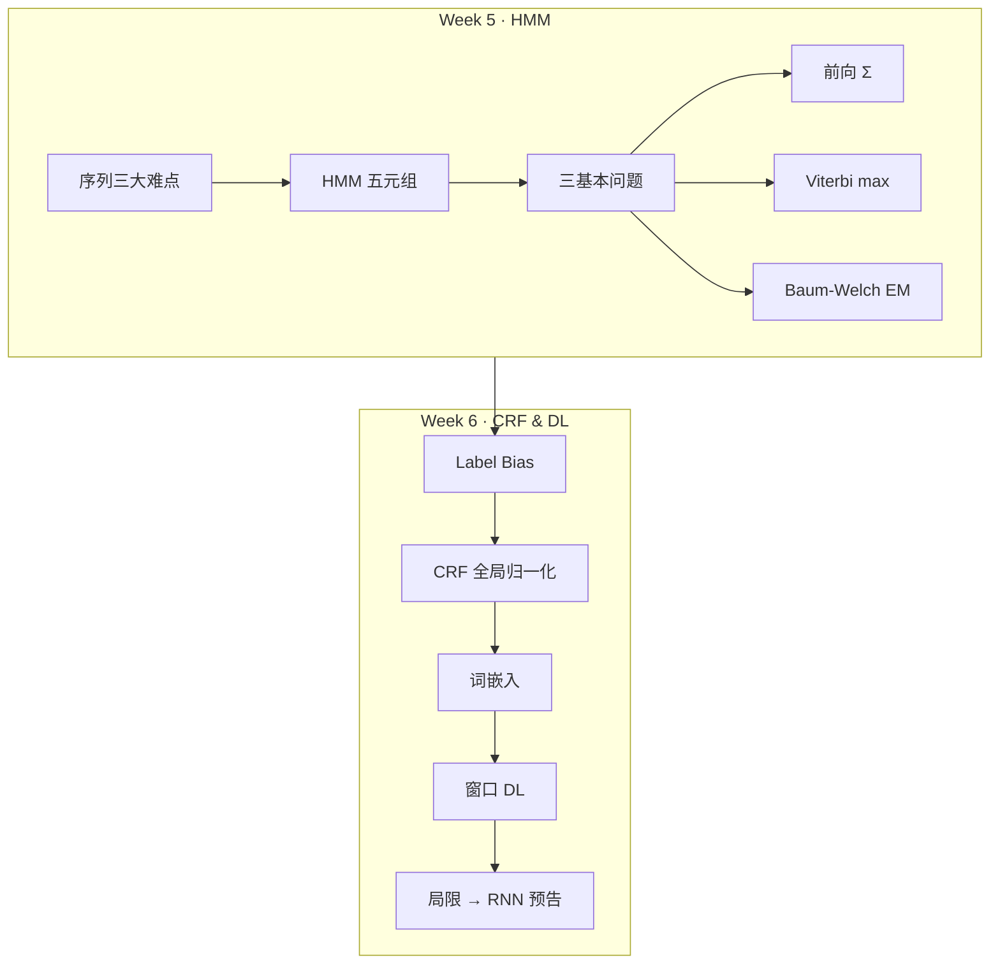
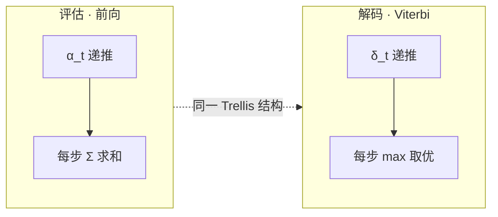

# Week 5–6 学习指南：序列建模（HMM / CRF / 早期 DL）

> **课程**：人工智能（H）CS30057h.01  
> **覆盖周次**：Week 5（HMM）+ Week 6（CRF / 词嵌入 / 窗口 DL）  
> **主要来源**：Week 5/6 课程记录、课件 09 Deep Learning、NotebookLM 分层问答  
> **生成方式**：NotebookLM 分层问答 → 知识图谱 → Agent 叙事整合  
> **生成日期**：2026-06-16  
> **术语格式**：术语表及正文**首次出现**时，专业名词采用 **中文（English）**；英文缩写采用 **缩写（English full form，中文）**，便于对照英文试卷。

---

## 0. 术语表

| 术语 | 大白话解释 | 生活类比 |
|------|-----------|----------|
| 🔗 **序列建模（Sequence modeling）** | 输入/输出随时间排列，前后有关联 | 看电影：不能只看某一帧 |
| 🔗 **隐状态（Hidden state）** | 看不见但决定观测的内部状态 | 地下室警卫猜天气，只能看主管带不带伞 |
| 🔗 **观测（Observation）** | 能直接看到的数据 | 雨伞、汉字、声学信号 |
| 🔗 **马尔可夫性（Markov property）** | 未来只依赖当前，不依赖更早历史 | 明天天气主要看今天，不太看前天 |
| 🔗 **HMM（Hidden Markov Model，隐马尔可夫模型）** | 状态集、观测集、初始分布、转移矩阵、发射矩阵 | 一台「先藏状态、再吐符号」的随机机器 |
| 🔗 **评估问题（Evaluation）** | 给定模型，算观测序列出现概率 $P(O\|\lambda)$ | 「这段话像不像这个模型生成的？」 |
| 🔗 **解码问题（Decoding）** | 给定观测，找最可能的隐状态序列 | 「每个字最可能是什么词性/分词标签？」 |
| 🔗 **学习问题（Learning）** | 只有观测，估计模型参数 | 「没见过隐状态，靠数据反推机器参数」 |
| 🔗 **前向概率 $\alpha_t(i)$（Forward probability）** | 到时刻 $t$、状态 $i$、且已看到 $O_1\ldots O_t$ 的累积概率 | 走到棋盘第 $t$ 列、站在格子 $i$ 的「到达分」 |
| 🔗 **维特比 $\delta_t(i)$（Viterbi）** | 到时刻 $t$、状态 $i$ 的**最优路径**概率 | 只保留冠军路线，不要所有路线平均分 |
| 🔗 **Baum-Welch 算法** | HMM 的 EM（Expectation-Maximization，期望最大化）学习算法 | 看不见隐状态，用「软计数」反复调参 |
| 🔗 **标签偏置（Label bias）** | 局部归一化让模型偏爱「后继分支少」的状态 | 岔路只有一条时，被迫把概率全押上去 |
| 🔗 **CRF（Conditional Random Field，条件随机场）** | 直接建模 $P(Y\|X)$ 的判别式序列模型 | 不研究数据怎么生成，只研究怎么标标签 |
| 🔗 **全局归一化 $Z(X)$（Partition function）** | 对所有可能标签路径统一归一化 | 全国统一划线，不是每家门自己算百分制 |
| 🔗 **特征函数 $\phi_k$（Feature function）** | 衡量「观测+标签组合」是否匹配的打分项 | 人工写的「如果…则加一分」模板 |
| 🔗 **词嵌入（Word embedding）** | 把词映射到低维稠密向量 | 给每个词一张「属性名片」，相近词靠近 |
| 🔗 **窗口模型（Window model）** | 固定窗口拼接词向量 → FC → Softmax | 只看前后几个字，给当前字贴标签 |
| 🔗 **BIES（Begin/Inside/End/Single，分词标签体系）** | 分词标签：B 词首 / I 词中 / E 词尾 / S 单字词 | 给每个汉字标它在词里的位置 |
| 🔗 **LSTM（Long Short-Term Memory，长短期记忆网络）** | 门控机制缓解 RNN 长程依赖 | Week 6 窗口模型之后的主流 RNN |

---

## 1. 知识地图（L0）

### 1.1 在整门课中的位置

Week 5–6 处于 **「从静态分类到序列标注」** 的转折阶段：

1. Week 3–4 已掌握 BP、Softmax、CNN——处理的是**固定尺寸、彼此独立**的样本
2. Week 5 引入 **HMM**：用概率图模型处理**可变长、有依赖**的序列
3. Week 6 引入 **CRF + 早期 DL**：从生成式走向判别式，再从人工特征走向自动表征
4. 为 Week 7+ 的 RNN/LSTM/Transformer 铺路

（来源：Week 5/6 记录、课件 09、`L0-positioning`）

> **课纲注**：NotebookLM 的 L0 定位 batch 将 Label Bias / CRF 写入 Week 5 核心问题；**以 FiCS 课纲为准——Week 5 聚焦 HMM，Week 6 聚焦 CRF 与表征学习**。Label Bias 作为 HMM 局限在 Week 5 末尾铺垫，CRF 解法放在 Week 6。

### 1.2 学习路径：从哪出发 → 要到哪去

```
起点（Week 3-4）                    终点（Week 7+）
─────────────────────────────────────────────────────────
Softmax 单点分类          →    序列每步分类 + 标签依赖
CNN 自动空间特征          →    Embedding 自动语义特征
BP 端到端训练             →    窗口/RNN 端到端序列训练
独立样本 i.i.d.           →    时间轴上的马尔可夫/全局路径
```

（来源：`w56-bridge-w34`、Week 5/6 记录）

### 1.3 Week 5 → Week 6 的逻辑衔接

| 转折 | Week 5 铺垫 | Week 6 深入 |
|------|------------|------------|
| 建模范式 | HMM 生成式 $P(X,Y)$ | CRF 判别式 $P(Y\|X)$ |
| 归一化 | 局部归一化 → Label Bias | 全局归一化 $Z(X)$ 消除偏置 |
| 特征 | 固定转移 + 发射矩阵 | 可定制特征模板 |
| 表征 | 离散观测符号 | 词嵌入分布式表征 |
| 训练 | EM / Baum-Welch | 条件对数似然 + BP |
| 局限 | 一阶马尔可夫、短程 | 窗口固定 → 引出 RNN |

（来源：Week 5/6 记录、课件 09、`w6-hmm-vs-crf`）

### 1.4 核心子主题清单

**Week 5**
- 序列三大难点：可变长、长程依赖、多周期信号
- HMM 五元组 $\lambda=(S,O,\pi,A,B)$ 与生成过程
- 三基本问题：评估 / 解码 / 学习
- 前向算法、后向算法、Viterbi、Baum-Welch
- 手算前向概率（$P(O\|\lambda)=0.132$）

**Week 6**
- HMM 局限：局部归一化与 Label Bias
- 线性链 CRF：特征函数、$Z(X)$、$P(Y\|X)$
- HMM vs CRF 六维对比
- One-hot → Word2Vec 分布式表征
- 窗口模型：拼接 Embedding → FC → Softmax + BP
- 早期 DL 三局限 → RNN/LSTM/Transformer（了解/预告）

---

## 2. 核心知识

### 2.0 模块全景：Week 5–6 要解决什么？

> **本节叙事线**：
>
> ```
> A. 序列和静态分类有何不同？  →  三大难点：长度、记忆、多尺度
>         ↓
> B. HMM 怎么形式化？          →  五元组 + 三问题全景
>         ↓
> C. 三算法怎么算？            →  前向(Σ) / Viterbi(max) / Baum-Welch(EM)
>         ↓
> D. HMM 哪里不够用？          →  Label Bias、特征僵化
>         ↓
> E. CRF 怎么补？              →  P(Y|X) + 全局归一化 + 特征模板
>         ↓
> F. 特征工程太累怎么办？      →  Embedding + 窗口 DL + BP
>         ↓
> G. 窗口还不够？              →  RNN/LSTM/Transformer（预告）
> ```

> **本节要回答**：学完 Week 5–6，你应该能独立完成哪些事？

| 能力 | 检验方式 |
|------|---------|
| 写出 HMM 五元组并解释各矩阵含义 | 闭卷画符号表 |
| 区分评估/解码/学习三问题及对应算法 | 给任务名 → 说算法 |
| 手推前向 $\alpha$ 递推并算 $P(O\|\lambda)$ | 2 状态 3 步手算 |
| 手推 Viterbi $\delta/\psi$ 并回溯最优路径 | tiny 例完整走通 |
| 解释 Label Bias 与全局归一化 | 用自己的话 + 对比表 |
| 描述窗口模型数据流并与 Week 3 BP 对照 | 画结构图 |
| 说明 One-hot 缺陷与 Embedding 直觉 | 面试口头答 |

**内部结构预告**：



**自检问题**（读完 §2 你应该能回答）：
1. 前向算法和 Viterbi 在 Trellis 上差在哪一个运算符？
2. 为什么 Baum-Welch 需要后向概率而不只要前向？
3. CRF 的 $Z(X)$ 在算什么？
4. 窗口模型的损失如何从 Softmax 层传回 Embedding？

（来源：`L0-positioning`、`w56-bridge-w34`、`w56-study-order`）

---

### 2.1 Week 5：HMM（Hidden Markov Model，隐马尔可夫模型）

> **本节叙事线**（先建立问题链，再逐个击破）：
>
> ```
> A. 序列三大难点     →  为什么静态分类套路不够用
> B. 马尔可夫 + HMM   →  隐状态/观测、双重随机过程
> C. 五元组 λ         →  把模型写成可计算的参数
> D. 三基本问题全景   →  评估/解码/学习——一切算法的总纲
> E. 前向算法         →  评估：每步 Σ，O(N²T)
> F. 后向算法         →  为学习铺路：αβ 汇合
> G. Viterbi          →  解码：每步 max + 回溯
> H. Baum-Welch       →  学习：EM 软计数
> I. 数值手算附录     →  把公式走通一遍
> ```

#### A. 序列建模的三大难点

> **本节要回答**：相比 Week 3–4 的静态分类，序列任务难在哪？

**静态分类**像给照片贴标签——输入尺寸固定、样本彼此独立；**序列建模**像看电影——长度不定、前后关联、多种节奏叠加。

| 难点 | 大白话 | 直觉例子 |
|------|--------|---------|
| **可变长度** | 输入/output 长度不固定 | 语音识别：同一句「你好」有人 0.5 秒、有人 2 秒 |
| **长程依赖** | 远处信息影响当前决策 | 「从小学计算机」→ 远处「小」决定「学」的分法 |
| **多周期信号** | 多种时间尺度规律叠加 | 股价：秒级噪声 + 周级趋势 + 年级周期 |

> **直观理解：自动售货机 vs 餐厅点餐**
>
> 静态分类像售货机——只收固定大小硬币；序列建模像点餐——有人只说「来碗面」，有人报一长串菜名，系统都必须听懂。

**A 节小结**（≤3 条）→ 引出追问「有没有统一的概率框架来处理这类序列？」

1. 序列数据**长度可变**，不能用固定维度输入硬套。
2. 标签/状态往往**前后依赖**，独立分类会丢信息。
3. 现实信号常含**多尺度周期**，需要能沿时间递推的模型。

---

#### B. 马尔可夫性与 HMM 直觉

> **承接 A 节**：A 节说明了序列的难；B 节引入一个**可计算**的简化假设——马尔可夫性，并在此基础上搭建 HMM。

> **本节要回答**：什么是马尔可夫性？HMM 里「隐」和「观测」各指什么？

**马尔可夫性（无后效性）**：未来只依赖当前，不依赖更早历史。

$$P(X_t \mid X_0, \ldots, X_{t-1}) = P(X_t \mid X_{t-1})$$

**HMM = 双重随机过程**：
- **隐状态链**（满足马尔可夫性）：看不见的内部状态
- **观测序列**：由隐状态「发射」出来、能看见的符号

**天气–雨伞例子**：

| 角色 | 含义 |
|------|------|
| 隐状态 | 真实天气（晴/雨）——你在地下室看不见 |
| 观测 | 主管是否带伞——你唯一能看到的证据 |
| 转移 | 今天天气 → 明天天气（马尔可夫） |
| 发射 | 某种天气下带伞的概率 |

**POS 标注例子**：隐状态 = 词性（NN/VB/DT）；观测 = 具体单词（"The", "dog", "ran"）。

> **追问：观测序列满足马尔可夫性吗？**
>
> **不满足。** 观测之间没有直接的马尔可夫依赖；是**隐状态**马尔可夫，观测只通过当前隐状态与发射概率 $b_j(k)=P(O_t=k\mid S_t=j)$ 关联。别把「看见的字」当成「马尔可夫链」——链在隐标签上。

（来源：Week 5 记录、课件 09、`w5-markov-hmm-intro`）

---

#### C. HMM 五元组

> **承接 B 节**：B 节建立了直觉；C 节把 HMM **完全参数化**，写成可交给算法的五元组。

> **本节要回答**：$\lambda=(S,O,\pi,A,B)$ 每一项是什么？维度多少？

| 符号 | 名称 | 含义 | 维度 |
|------|------|------|------|
| $S$ | 状态集合 | 所有可能的隐状态 | $N$ 个状态 |
| $O$ | 观测集合 | 所有可能的观测符号 | $M$ 个符号 |
| $\pi$ | 初始分布 | $P(S_1=i)$ | $1\times N$ |
| $A$ | 状态转移矩阵 | $a_{ij}=P(S_{t+1}=j\mid S_t=i)$ | $N\times N$ |
| $B$ | 发射概率矩阵 | $b_j(k)=P(O_t=k\mid S_t=j)$ | $N\times M$ |

**约束**：$A$ 每行和为 1（局部归一化之一）；$B$ 每行和为 1；$\pi$ 所有分量之和为 1。

**生成过程**（给定 $\lambda$，如何「造」一条序列）：

1. 按 $\pi$ 抽 $S_1$
2. 按 $B$ 中 $S_1$ 行发射 $O_1$
3. 按 $A$ 中 $S_t$ 行转移到 $S_{t+1}$
4. 按 $B$ 发射 $O_{t+1}$
5. 重复至长度 $T$

> **直观理解：饮料机**
>
> 机器内部有若干「隐藏档位」（状态），档位之间按 $A$ 跳转，每个档位按 $B$ 吐出不同口味（观测）。你只能尝到饮料，看不见档位——但可以用 HMM 反推最可能的档位序列。

（来源：Week 5 记录、课件 09、`w5-hmm-five-tuple`）

**C 节小结** → 五元组写全了，接下来：**给定 $\lambda$，我们能对观测序列问哪三类问题？**

---

#### D. HMM 三基本问题全景 ★

> **承接 C 节**：参数 $\lambda$ 已就绪。在推**任何**算法公式之前，必须先看清三张「问题地图」——后文前向/Viterbi/Baum-Welch 全是这三问题的具体解法。

> **本节要回答**：评估、解码、学习各自输入什么、输出什么、用什么算法？

| 基本问题 | 输入 | 输出 | 算法 | 实际任务 |
|---------|------|------|------|---------|
| **评估 (Likelihood)** | $\lambda$、观测 $O$ | $P(O\mid\lambda)$ | **前向** / 后向 | 句子像不像该模型？模型对比 |
| **解码 (Decoding)** | $\lambda$、观测 $O$ | 最优隐状态序列 $I^*$ | **Viterbi** | 分词、词性标注、语音识别 |
| **学习 (Learning)** | 观测 $O$（隐状态未知） | 最优 $\lambda$ | **Baum-Welch (EM)** | 从数据估计 $A,B,\pi$ |



> **追问：为什么评估和解码不能混用同一个递推？**
>
> 评估要**边缘化**隐状态——所有可能路径的 probability mass 都要累加（Σ），得到观测的总概率。解码要**寻优**——只保留概率最大的那条路径（max）。数学目标不同：$P(O)=\sum_{\text{paths}} P(O,\text{path})$ vs $\arg\max_{\text{path}} P(\text{path}\mid O)$。

（来源：Week 5 记录、课件 09、`w5-hmm-three-problems`、`w5-viterbi`）

**D 节小结** → 三问题地图已就位；先解**评估**——前向算法。

---

#### E. 前向算法

> **承接 D 节**：评估问题 = 算 $P(O\mid\lambda)$。穷举 $N^T$ 条路径不可行；前向算法用动态规划降到 $O(N^2T)$。

> **本节要回答**：$\alpha_t(i)$ 是什么？初始化、递推、终止公式各是什么？

**定义**：

$$\alpha_t(i) = P(O_1, O_2, \ldots, O_t, X_t=s_i \mid \lambda)$$

**三步**：

1. **初始化**（$t=1$）：
   $$\alpha_1(i) = \pi_i \cdot b_i(O_1)$$

2. **递推**（$t=1,\ldots,T-1$）：
   $$\alpha_{t+1}(j) = \Big[\sum_{i=1}^{N} \alpha_t(i)\cdot a_{ij}\Big]\cdot b_j(O_{t+1})$$

3. **终止**：
   $$P(O\mid\lambda) = \sum_{i=1}^{N} \alpha_T(i)$$

**复杂度**：$T$ 个时间步 × 每层 $N$ 个状态 × 每个状态来自 $N$ 个前驱 → **$O(N^2T)$**。

对比穷举 $O(TN^T)$：前向利用马尔可夫性，**不重复计算**共享子路径。

（来源：Week 5 记录、课件 09、`w5-forward-algo`）

---

#### F. 后向算法

> **承接 E 节**：前向只看「过去→现在」；学习问题还需要「现在→未来」——后向概率 $\beta$。

> **本节要回答**：$\beta_t(i)$ 是什么？它如何与前向汇合？

**定义**：

$$\beta_t(i) = P(O_{t+1}, \ldots, O_T \mid X_t=s_i, \lambda)$$

**初始化**：$\beta_T(i)=1$

**递推**（$t=T-1,\ldots,1$）：

$$\beta_t(i) = \sum_{j=1}^{N} a_{ij}\, b_j(O_{t+1})\, \beta_{t+1}(j)$$

**汇合**：

$$P(O, X_t=i\mid\lambda) = \alpha_t(i)\cdot\beta_t(i)$$

**为何学习需要两者？**
- 仅有前向 = 只用 $t$ 之前的信息（滤波）
- Baum-Welch 的 E 步要算 $\gamma_t(i)=P(X_t=i\mid O,\lambda)$——需要**整条观测**校正当前状态
- 例：语音识别里，后面的音节能帮助判断当前音素

（来源：Week 5 记录、课件 09、`w5-backward-algo`、`w5-baum-welch`）

---

#### G. 维特比算法（Viterbi）

> **承接 E/F 节**：评估用 Σ；解码用 **max**。结构同 Trellis，运算符换成取最大值并记回溯指针。

> **本节要回答**：$\delta_t(i)$ 和 $\psi_t(i)$ 是什么？如何回溯最优路径？

**核心变量**：

| 符号 | 含义 |
|------|------|
| $\delta_t(i)$ | 时刻 $t$ 处于状态 $i$ 的**最优路径**概率 |
| $\psi_t(i)$ | 达到 $\delta_t(i)$ 时，$t-1$ 时刻的最优前驱状态 |

**递推**：

$$\delta_1(i) = \pi_i \cdot b_i(O_1)$$

$$\delta_{t+1}(j) = \max_{1\le i\le N}\big[\delta_t(i)\cdot a_{ij}\big]\cdot b_j(O_{t+1})$$

$$\psi_{t+1}(j) = \arg\max_{1\le i\le N}\big[\delta_t(i)\cdot a_{ij}\big]$$

**终止**：$P^*=\max_i \delta_T(i)$，$\hat{X}_T=\arg\max_i \delta_T(i)$

**回溯**：$\hat{X}_t = \psi_{\hat{X}_{t+1}}(t+1)$，从 $T$ 倒推到 1

**前向 vs Viterbi 对比表**：

| 特性 | 前向算法 | 维特比算法 |
|------|---------|-----------|
| 解决问题 | 评估 $P(O\mid\lambda)$ | 解码 $\arg\max P(I\mid O)$ |
| 每步运算 | **求和 Σ**（边缘化） | **取 max**（寻优） |
| 输出 | 标量概率 | 一条状态序列 + 回溯指针 |
| 物理直觉 | 大合唱：所有路径都贡献 | 淘汰赛：只留冠军 |

**Tiny 手算例**（与 §2.1-I 共用同一 $\lambda$）：

模型：$N=2$，$O=\{v_1,v_2,v_1\}$，$\pi=[0.5,0.5]$，$A=\begin{pmatrix}0.6&0.4\\0.3&0.7\end{pmatrix}$，$B=\begin{pmatrix}0.8&0.2\\0.4&0.6\end{pmatrix}$

| $t$ | $\delta_t(1)$ | $\psi$ | $\delta_t(2)$ | $\psi$ |
|-----|--------------|--------|--------------|--------|
| 1 | $0.5\times0.8=0.4$ | — | $0.5\times0.4=0.2$ | — |
| 2 | $\max(0.24,0.06)\times0.2=0.048$ | 1 | $\max(0.16,0.14)\times0.6=0.096$ | 1 |
| 3 | $0.02304$ | 1 | $\mathbf{0.02688}$ | 2 |

最优终止状态 $s_2$；回溯：$t=3\to s_2$，$\psi_3(2)=2\to t=2$ 为 $s_2$，$\psi_2(2)=1\to t=1$ 为 $s_1$。

**最优路径**：$s_1 \to s_2 \to s_2$，概率 $P^*=0.02688$。

（来源：Week 5 记录、课件 09、`w5-viterbi`；手算例 Agent 自补）

---

#### H. Baum-Welch 算法（EM）

> **承接 G 节**：解码找最优路径；但若**参数未知**，需要学习问题——Baum-Welch = HMM 上的 EM。

> **本节要回答**：E 步和 M 步各算什么？为什么需要 $\gamma$ 和 $\xi$？

**核心直觉：从硬计数到软期望**

- 若隐状态已知：$a_{ij}$ 更新 = 「$i\to j$ 次数」/「从 $i$ 出发次数」——直接数数
- 隐状态未知：用当前 $\lambda$ 算**期望次数**（软计数），再当真实计数更新

**E 步**：用前向-后向算

- $\gamma_t(i) \propto \alpha_t(i)\beta_t(i)$：时刻 $t$ 处于状态 $i$ 的后验期望
- $\xi_t(i,j)$：时刻 $t$ 从 $i$ 转移到 $j$ 的期望

**M 步**（重估参数）：

| 参数 | 更新直觉 |
|------|---------|
| $\hat{\pi}_i = \gamma_1(i)$ | 第一时刻在 $i$ 的期望概率 |
| $\hat{a}_{ij} = \dfrac{\sum_{t}\xi_t(i,j)}{\sum_{t}\gamma_t(i)}$ | 期望转移次数 / 期望出发次数 |
| $\hat{b}_j(k) = \dfrac{\sum_{t:O_t=k}\gamma_t(j)}{\sum_{t}\gamma_t(j)}$ | 在 $j$ 且观测 $k$ 的期望 / 在 $j$ 的期望 |

迭代使 $P(O\mid\lambda)$ 单调不降（局部最优）。Project 手写时注意**对数域**防下溢。

（来源：Week 5 记录、课件 09、`w5-baum-welch`、`w56-project`）

**H 节小结** → Week 5 HMM 三算法闭环完成。HMM 能分词、能语音识别，但有两个结构性痛点——**Label Bias** 和**特征僵化**——这将在 Week 6 引出 CRF。

---

#### I. 附录：前向算法完整数值手算

> **本节要回答**：对给定 tiny 模型，$P(O\mid\lambda)$ 怎么一步步算出来？

**模型**：$S=\{s_1,s_2\}$，$V=\{v_1,v_2\}$，$O=\{v_1,v_2,v_1\}$，$T=3$

$\pi=[0.5,0.5]$，$A=\begin{pmatrix}0.6&0.4\\0.3&0.7\end{pmatrix}$，$B=\begin{pmatrix}0.8&0.2\\0.4&0.6\end{pmatrix}$

**$t=1$**（$O_1=v_1$）：
- $\alpha_1(1)=0.5\times0.8=0.4$
- $\alpha_1(2)=0.5\times0.4=0.2$

**$t=2$**（$O_2=v_2$）：
- $\alpha_2(1)=[0.4\times0.6+0.2\times0.3]\times0.2=0.3\times0.2=0.06$
- $\alpha_2(2)=[0.4\times0.4+0.2\times0.7]\times0.6=0.3\times0.6=0.18$

**$t=3$**（$O_3=v_1$）：
- $\alpha_3(1)=[0.06\times0.6+0.18\times0.3]\times0.8=0.09\times0.8=0.072$
- $\alpha_3(2)=[0.06\times0.4+0.18\times0.7]\times0.4=0.15\times0.4=0.06$

**结果**：

$$P(O\mid\lambda)=\alpha_3(1)+\alpha_3(2)=0.072+0.06=\mathbf{0.132}$$

（来源：Week 5 记录、课件 09、`w5-forward-numeric`）

---

### 2.2 Week 6：CRF（Conditional Random Field，条件随机场）、词嵌入（Word embedding）与早期序列 DL

> **本节叙事线**：
>
> ```
> A. HMM 为何是生成式？     →  P(X,Y) 与局部归一化
> B. Label Bias 直觉        →  分支少的隐状态「被迫」高分
> C. CRF 入门               →  P(Y|X) + 全局 Z(X)
> D. 特征函数               →  模板匹配替代发射矩阵
> E. HMM vs CRF 六维对比    →  一张表收束
> F. 词嵌入                 →  One-hot 的替代
> G. 窗口模型               →  Embedding→FC→Softmax + BP
> H. 早期 DL 局限           →  引出 RNN（了解/预告）
> ```

#### A–B. 全景：从 HMM 局限到 CRF 动机

> **本节要回答**：HMM 为什么是生成模型？Label Bias 怎么来的？

**HMM = 生成模型**：建模联合分布 $P(X,Y\mid\theta)$

- 先按 $\pi,A$ 生成隐状态链 $Y$
- 再按 $B$ 由隐状态发射观测 $X$
- 推断时用贝叶斯：$P(Y\mid X)\propto P(X,Y)$

**局部归一化**：$P(Y,X)$ 分解为连乘的局部条件概率，每个 $P(y_t\mid y_{t-1})$、$P(x_t\mid y_t)$ 各自归一化（行和为 1）。

**Label Bias（标签偏置）直觉**：

> **直观理解：岔路口的「概率预算」**
>
> 每个隐状态出发时，必须把 100% 概率分给所有后继——这是局部归一化的「硬约束」。
> - 若某状态**只有 1 条出路**：100% 必须走那条路，哪怕观测证据很弱，路径分数依然偏高
> - 若某状态**有 10 条出路**：每条只能分到约 10%，证据再强也被稀释
>
> 结果：解码时模型偏爱「后继分支少」的路径——这是**模型结构强加的偏见**，不是数据统计规律。

> **课纲注**：Label Bias 在课件中于 HMM 局限处引出，**CRF 的全局归一化解法属 Week 6 核心**。

（来源：Week 5/6 记录、课件 09、`w6-hmm-generative`、`w6-crf-intro`）

---

#### C. 线性链 CRF 入门

> **承接 B 节**：Label Bias 来自局部归一化；CRF 换思路——**直接建模 $P(Y\mid X)$**，用**全局归一化**。

> **本节要回答**：CRF 的概率公式长什么样？为何叫判别模型？

**核心公式**：

$$P(Y\mid X) = \frac{1}{Z(X)} \exp\Big(\sum_{k} \lambda_k \phi_k(x, y)\Big)$$

| 符号 | 含义 |
|------|------|
| $\phi_k(x,y)$ | 第 $k$ 个特征函数：观测 $x$ 与标签序列 $y$ 的匹配度 |
| $\lambda_k$ | 特征权重（可学习） |
| $Z(X)$ | 配分函数：对所有可能标签路径 $y'$ 的得分求和归一化 |

**判别 vs 生成**：

| | HMM（生成） | CRF（判别） |
|---|-----------|------------|
| 建模对象 | $P(X,Y)$ | $P(Y\mid X)$ |
| 是否建模 $P(X)$ | 是 | 否，专注决策边界 |
| 归一化 | 局部 | 全局 $Z(X)$ |
| 能否生成新 $X$ | 能 | 一般不用于生成 |

**优化目标**：最大化训练数据的**条件对数似然** $\sum \log P(Y\mid X)$。

> **追问：CRF 和 Week 3 的 Softmax 有什么关系？**
>
> Softmax 对**单步**分类做局部归一化；CRF 对**整条标签路径**做全局归一化——分子是某路径的特征得分之和，分母 $Z(X)$ 枚举（或动态规划求）所有路径。可理解为「Softmax 思想在序列路径上的全局版」。

（来源：Week 6 记录、课件 09、`w6-crf-intro`、`w56-bridge-w34`）

---

#### D. CRF 特征函数与 $Z(X)$

> **本节要回答**：$\phi_k(y_{t-1},y_t,X,t)$ 是什么？$Z(X)$ 在干什么？

**特征函数**：衡量「在位置 $t$，标签配置 $(y_{t-1},y_t)$ 与观测 $X$」是否匹配

- 通常是**二值**（0/1）：匹配则 1，否则 0
- 例：「若 $X_t$=『学』且 $y_t$=B，则 $\phi=1$」

**特征分类**：

| 类型 | 关联 |
|------|------|
| **Unigram** | 当前观测 $x_t$ 与当前标签 $y_t$ |
| **Bigram** | 标签转移 $(y_{t-1},y_t)$ + 可选观测上下文 |

**路径得分** = 所有位置、所有触发特征的 $\lambda_k \phi_k$ 之和。

**$Z(X)$ 的作用**：

$$Z(X) = \sum_{Y'} \exp\big(\text{Score}(Y'\mid X)\big)$$

把任意实数得分映射为合法概率（所有路径概率和为 1）。**在整条路径空间归一化**——这正是消除 Label Bias 的关键。

**痛点**：特征模板可任意设计 → 特征空间爆炸（如 5 字窗口组合可达 $8000^5$），人工筛选成本高——这引出 Week 6 的 Embedding。

（来源：Week 6 记录、课件 09、`w6-crf-features`）

---

#### E. HMM vs CRF 完整对比

| 比较维度 | HMM | CRF |
|---------|-----|-----|
| **模型类型** | 生成式 $P(X,Y)$ | 判别式 $P(Y\mid X)$ |
| **归一化** | 局部（每步行和为 1） | 全局 $Z(X)$ |
| **特征来源** | 固定 $A,B$；严格马尔可夫 | 可定制特征模板 |
| **典型优点** | 理论严密；EM 训练快；可生成 | 消除 Label Bias；标注准确率高 |
| **典型缺点** | Label Bias；难捕捉长程依赖 | 特征工程贵；$Z(X)$ 计算复杂 |
| **适用场景** | 早期语音识别；数据少 | 分词、POS、NER（DL 前主流） |

（来源：Week 6 记录、课件 09、`w6-hmm-vs-crf`）

---

#### F. 词嵌入（Word Embedding）

> **承接 D 节**：CRF 靠人工特征模板；Embedding 用**自动学习**的稠密向量替代 One-hot。

> **本节要回答**：One-hot 差在哪？Word2Vec 如何实现分布式表征？

**One-hot 的问题**：

| 问题 | 直觉 |
|------|------|
| 语义孤岛 | 任意两词距离相同——「猫」与「狗」=「猫」与「民主」 |
| 维度灾难 | 词表数万维，极稀疏，难泛化 |
| 无参数共享 | 「猫」→「小猫」等于全新维度，一切重学 |

**分布式表征**：每个词 = 低维稠密向量（如 300 维），维度可解释为潜在属性（动物性、情感…）

- 「猫」「狗」在「动物性」维度都高 → 向量相近 → **泛化**：学会「猫蹲」有助于理解「狗站」
- Word2Vec 直觉：「通过一个词的邻居了解它」——共现多的词被推近
- 神奇性质：$\vec{king}-\vec{man}+\vec{woman}\approx\vec{queen}$

**与 CRF 的关系**：Embedding 向量 = 自动学到的特征；梯度从任务损失一路回传到嵌入层——**端到端**替代手工模板。

现代混合：**BiLSTM-CRF** = 神经网络抽特征 + CRF 全局解码。

（来源：Week 6 记录、课件 09、`w6-word-embedding`）

---

#### G. 窗口模型（早期序列 DL）

> **本节要回答**：窗口模型的数据流是什么？如何用 BP 训练？

**结构**：固定窗口拼接词向量 → 全连接 → Softmax


**例：中文分词「狗蹲在墙角」**

- 标注「蹲」时，窗口可能为「狗 蹲 在」
- 标签集 {B, I, E, S} → 目标如「狗/S 蹲/S 在/S 墙/B 角/E」

**训练（与 Week 3 对照）**：

| 环节 | Week 3 BP | 窗口模型 |
|------|----------|---------|
| 输出层 | Softmax + CE | 同左，每位置一次 |
| 误差项 | $\delta_{out}=y-t$ | 同左 |
| 回传 | 链式法则逐层 | 同左，**直到 Embedding 矩阵** |
| 更新 | $W,b$ | $W,b$ **+ 词向量** |

**代码直觉**：

```python
# 伪代码：窗口模型一步前向
window_ids = [id("狗"), id("蹲"), id("在")]
x = concat([embedding[i] for i in window_ids])  # 拼成长向量
h = relu(W1 @ x + b1)
scores = W2 @ h + b2
probs = softmax(scores)           # 当前字标签分布
loss = cross_entropy(probs, true_label)
loss.backward()                   # 梯度更新 W1,W2,b,embedding
```

（来源：Week 6 记录、课件 09、`w6-window-network`、`w56-bridge-w34`）

---

#### H. 早期 DL 局限与后续预告（了解即可）

> **本节要回答**：窗口模型还差什么？为何需要 RNN？

**三局限**：

1. **标签独立**：每位置单独 Softmax，不显式约束「I 不能跟在 S 后」——CRF 层可补
2. **固定窗口**：窗口外信息完全阻断，长程依赖无能为力
3. **位置不对称**：同词在不同位置用不同权重片段，参数随窗口宽度膨胀

**演进路线（预告，非 Week 6 考试核心）**：


| 阶段 | 解决什么 | 新局限 |
|------|---------|--------|
| RNN | 任意长度 + 参数共享 | 梯度消失，实际记忆短 |
| LSTM | 门控长程记忆 | 串行计算慢 |
| Transformer | 全局注意力 + 并行 | 了解即可，属 Week 7+ |

（来源：Week 6 记录、课件 09、`w6-early-dl-limits`、`w6-to-rnn`）

---

## 3. 重难点与易错点

| 知识点 | 为什么易错 | 正确理解 | 记忆技巧 |
|--------|-----------|---------|---------|
| **评估 vs 解码** | 都用 Trellis、都像动态规划 | 评估算 $P(O\|\lambda)$（像不像）；解码找 $I^*$（是什么） | 评估看总分，解码找冠军路 |
| **前向 Σ vs Viterbi max** | $\alpha$ 与 $\delta$ 公式极像 | 前向边缘化所有路径；Viterbi 只留最优 | 大合唱 vs 淘汰赛 |
| **生成式 vs 判别式** | 都能做标注 | HMM 建模 $P(X,Y)$ 可生成；CRF 直接 $P(Y\|X)$ | 背全书 vs 找不同 |
| **局部 vs 全局归一化** | Label Bias 根因不清 | HMM 每步行和=1 强迫分配；CRF 用 $Z(X)$ 全路径竞争 | 各家自扫门前雪 vs 全国统一划线 |
| **发射概率 vs 特征函数** | 都连观测与标签 | 发射是固定 $P(O_t\|S_t)$；特征可任意上下文模板 | 掷色子 vs 模板匹配 |

#### 易错点展开：前向与 Viterbi 同一步的运算差异

同一条 Trellis 边 $(i\to j)$ 在 $t$ 时刻：

- **前向**：$\alpha_t(i)\cdot a_{ij}$ 对**所有** $i$ **求和**，再乘 $b_j(O_{t+1})$
- **Viterbi**：对所有 $i$ 取 **max**，记录 $\psi$，再乘 $b_j(O_{t+1})$

混用会导致：用 Viterbi 算出的「概率」不是 $P(O)$；用前向的 $\alpha_T$ 最大分量也不等于最优路径。

#### 易错点展开：HMM 的「局部归一化」不止一处

- $A$ 每行和为 1：转移局部归一化
- $B$ 每行和为 1：发射局部归一化

两处叠加 → Label Bias。CRF **不要求**每个位置的中间得分局部和为 1，只在 $Z(X)$ 做一次全局归一化。

（来源：`w56-mistakes`、Week 5/6 记录、课件 09）

---

## 4. 知识串联（L4）

### 4.1 与 Week 3–4 的衔接

| Week 3–4 概念 | Week 5–6 演进 |
|--------------|--------------|
| Week 4 §I 深度学习史（Hopfield→RBM/DBN→逐层预训练→ReLU/ResNet） | 了解宏观脉络即可；Week 6 词嵌入/RNN 属另一演进线 |
| Softmax 多分类 | 序列每步分类；CRF 为路径级 Softmax |
| 交叉熵损失 | 窗口模型每位置 CE |
| BP 链式法则 | 误差回传到 Embedding |
| CNN 自动特征 | 词嵌入自动语义特征 |
| 1-D 卷积（课件提及） | 时间轴滑动，与窗口思想相通 |

（来源：`w56-bridge-w34`、Week 5/6 记录）

### 4.2 与后续 Week 7+ 的衔接

- HMM 一阶马尔可夫 → 长程依赖不足 → **RNN 内部记忆**
- 窗口固定 → **LSTM（Long Short-Term Memory，长短期记忆网络）门控** → **Transformer 注意力**
- Embedding → 大语言模型、跨模态生成的基石

（来源：`w6-to-rnn`、`L0-positioning`）

### 4.3 与 Project 的对应

| 要求 | 对应知识 |
|------|---------|
| 手写 HMM | 五元组、前向、Viterbi、Baum-Welch |
| 手写 CRF | 特征模板、$Z(X)$、全局归一化 |
| DL 对比模型 | 窗口模型或 LSTM；禁止直接调 sklearn CRF / transformers 封装 |
| 中文分词 BIES | 序列标注任务设定 |
| 面试查原理 | EM、Label Bias、BP 到 Embedding |

**严禁**：`sklearn` CRF 接口、现成分词模型封装；可用 `numpy`/自写 PyTorch 层。

（来源：`w56-project`、Week 5/6 记录）

### 4.4 推荐学习顺序

**优先级：极高**
1. BIES 标签体系与序列标注任务化
2. HMM 五元组 + 三基本问题对照表
3. Viterbi 递推 + $\psi$ 回溯（能手写 tiny 例）
4. 前向-后向 $\alpha,\beta$ 递推

**优先级：高**
5. Baum-Welch EM 直觉与 $\gamma,\xi$
6. Label Bias → CRF 全局归一化
7. CRF 特征函数与 $Z(X)$
8. HMM vs CRF 六维对比（能默写）

**优先级：中**
9. 词嵌入 vs One-hot
10. 窗口模型结构 + BP 训练
11. RNN/LSTM/Transformer 演进（了解）

（来源：`w56-study-order`）

---

## 5. 资料索引

| 类型 | 文件 / 路径 | 说明 |
|------|------------|------|
| 课程记录 | 笔记-week05-周五-AI | HMM 三问题、算法 |
| 课程记录 | 笔记-week06-周五-AI | CRF、Embedding、窗口 DL |
| 课件 | 课件 09-Deep Learning | HMM/CRF/序列 DL 主课件 |
| 教材 | 参考书-Deep Learning | 序列建模补充 |
| 教材 | 参考书-AI (Luger) | Viterbi、EM 补充 |
| 知识图谱 | `notebooklm-raw/week5-6/knowledge-graph.md` | 整合前置 |
| 原始问答 | `notebooklm-raw/week5-6/runs/latest/*.answer.md` | 22 批完整 raw |
| 周次索引 | `guides/AI课程-14周内容梳理.md` | 课纲对照 |

---

## 6. Step 4 补充采集说明

| 缺口 | 现状 | 建议 |
|------|------|------|
| Viterbi 独立手算 batch | 无 | 本指南 §2.1-G 已自补 tiny 例 |
| CRF 结构化感知机增量学习 | `w56-study-order` 提及，无独立 batch | 若 Project 需要，可补采「CRF 增量学习」单问 |
| Transformer 细节 | `w6-to-rnn` 延伸至 Transformer | 标为了解/预告，Week 7+ 再专章采集 |
| L0 Label Bias 周次 | 归入 Week 5 叙述 | **以课纲 Week 6 CRF 为准**，本指南已标注 |

---

*本指南由 NotebookLM（AI Notebook `505bdb1c-0034-4e14-89df-0b14bf3fc723`）分层问答生成，经 `knowledge-graph.md` 编排与 Agent 叙事整合。规则见 `.cursor/skills/ai-course-notebooklm/docs/integration-guide.md`。*
