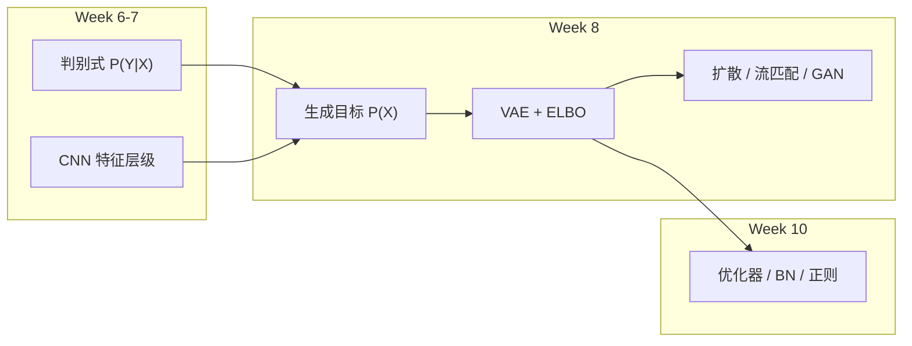
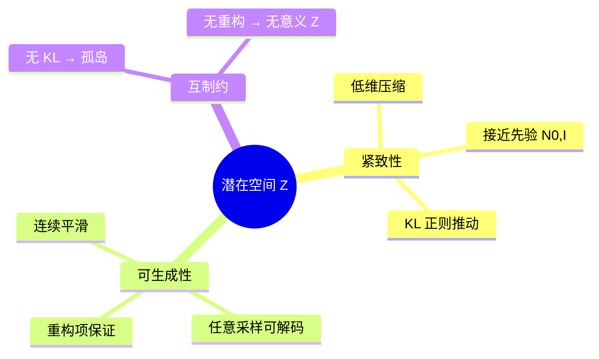
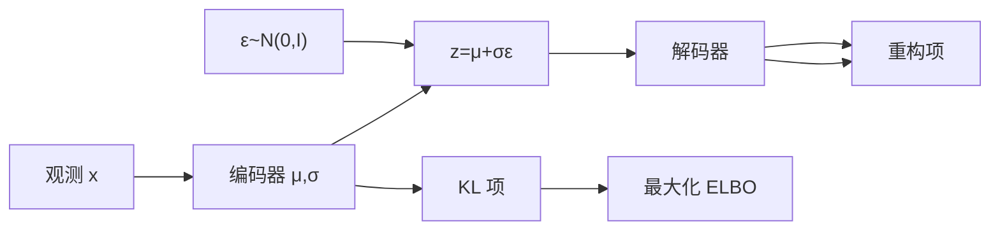

# Week 8 学习指南：深度生成模型

> **课程**：人工智能（H）CS30057h.01  
> **覆盖周次**：Week 8（2026-04-27）  
> **主要来源**：Week 8 课程记录、课件 09 Deep Learning、花书第 20 章  
> **生成方式**：NotebookLM 分层问答 → Agent 审核整合  
> **生成日期**：2026-06-16  
> **原始数据**：`notebooklm-raw/week8/runs/latest/`（13/13 batch）

---

## 0. 术语表

| 术语 | 大白话解释 | 生活类比 |
|------|-----------|----------|
| 🔗 **生成模型** | 学习数据本身分布 $P(X)$，能采样造新样本 | 学画家画风后自己画新画 |
| 🔗 **判别模型** | 学习条件分布 $P(Y\|X)$，做分类/标注 | 鉴定师：只判断真假，不学会造假 |
| 🔗 **潜在空间 $Z$** | 高维数据 $X$ 的低维压缩表征 | 乐谱：几百个音符概括整首曲子 |
| 🔗 **紧致性** | $Z$ 低维、信息密集，受先验约束不散落 | 图书馆按分类码整齐排架，不是每本书独占一格 |
| 🔗 **可生成性** | 从 $Z$ 任意采样都能解码出合理 $X$ | 从乐谱库随机抽一页，仍能演奏出像样的曲子 |
| 🔗 **编码器 $q_\phi(z\|x)$** | 把观测 $x$ 映射为 $z$ 的分布参数 | 压缩软件：把照片压成 zip |
| 🔗 **解码器 $p_\theta(x\|z)$** | 从 $z$ 重建 $x$ | 解压软件：从 zip 还原照片 |
| 🔗 **ELBO** | 对数似然 $\log p(x)$ 的可计算下界，VAE 的训练目标 | 考试估分：算不出真分，但能算一个「至少这么多」的下限 |
| 🔗 **KL 散度** | 衡量两个分布差异的非负指标 | 两幅画的「不像程度」 |
| 🔗 **重参数化** | $z=\mu+\sigma\odot\varepsilon$，把随机采样变成可导变换 | 掷骰子结果不可导，但「底数+倍数×随机数」可导 |
| 🔗 **扩散模型** | 前向加噪、反向学去噪，多步生成 | 把清晰照片逐步糊成噪声，再学会一步步擦回去 |
| 🔗 **流匹配** | 学确定性向量场，沿 ODE 从噪声走到数据 | 导航：规定从 A 到 B 的固定路线，不靠随机拐弯 |
| 🔗 **GAN** | 生成器与判别器对抗博弈 | 造假者 vs 鉴定师，互相逼到极限 |
| 🔗 **模式坍缩** | GAN 生成器只产出少数几种样本 | 造假者只会画同一张脸 |
| 🔗 **对抗样本** | 微小扰动使模型误判（≠ GAN 的「对抗」） | 在停车标志上贴几条胶带，自动驾驶认错 |

---

## 1. 知识地图（L0）

### 1.1 在整门课中的位置

Week 8 处于 **「深度表征 → 生成建模」** 阶段，负责：

1. 从 Week 6–7 的判别式 $P(Y|X)$ 与 CNN 特征提取，转向对数据全分布 $P(X)$ 的建模
2. 以 **VAE + ELBO** 为数学主轴，建立潜在空间 $Z$ 的「紧致性 + 可生成性」双目标
3. 扩展扩散、流匹配、GAN 等范式，为 Week 10 优化技术提供应用场景

> **课纲注**：课纲曾将「知识表示/不确定性」排 Week 8，**实际授课为生成模型**；知识表示推后至 Week 13，以课堂为准。

（来源：Week 8 记录、`w8-study-order`）

### 1.2 学习路径：从哪出发 → 要到哪去



（来源：Week 8 记录、`w8-bridge-w67`、`w8-bridge-w10`）

### 1.3 Week 6–7 → Week 8 的逻辑衔接

| 转折 | Week 6–7 铺垫 | Week 8 深入 |
|------|--------------|------------|
| 建模对象 | CRF 直接建模 $P(Y\|X)$ | 回归对 $P(X)$ 全分布建模 |
| 表征目的 | Embedding 为下游任务服务 | $Z$ 须能压缩 **且** 能重建 |
| 特征方向 | CNN 逐层抽象、丢弃细节 | 解码器逆向「添加」细节 |
| 概率推断 | HMM 用 EM 优化 | VAE 用变分推断 + ELBO（EM 的深度学习泛化） |
| 端到端 | BP 训练嵌入 | 重参数化使采样可 BP |

（来源：`w8-bridge-w67`）

### 1.4 核心子主题清单

**极高优先级**
- 生成模型目标：为何学 $P(X)$；$Z$ 的紧致性与可生成性
- ELBO 分解：重构项 vs KL 正则项
- 重参数化技巧：$z = \mu + \sigma \odot \varepsilon$

**高优先级**
- 编码器-解码器架构；KL 紧致性约束与 Shortcut 问题
- 四模型对比：VAE / 扩散 / 流匹配 / GAN

**了解即可**
- 流匹配与扩散的 ODE/SDE 统一视角
- 对抗样本 vs 对抗训练（安全议题）

---

## 2. 核心知识

### 2.1 生成模型全景：从判别到生成

> **本节叙事线**：
>
> ```
> A. 为何学 P(X)？     →  生成新样本 + 学压缩表征
>         ↓
> B. Z 须满足什么？   →  紧致性 + 可生成性（互相制约）
>         ↓
> C. VAE 怎么形式化？ →  ELBO 分解 + 重参数化
>         ↓
> D. 还有哪些范式？   →  扩散 / 流匹配 / GAN
>         ↓
> E. 何时选哪种？     →  四模型对比表
> ```

#### A. 生成模型的目标

> **本节要回答**：判别模型已经能分类了，为什么还要学 $P(X)$？

**核心动机**（来源：Week 8 记录、课件 09、`w8-generative-goal`）：

1. **恢复数据分布**：从训练数据学底层概率，能采样产生统计上一致的新样本
2. **压缩与表征学习**：建模联合分布 $P(X,Z)$，边缘化 $Z$ 逼近真实 $P(X)$
3. **推断框架**：理解变量关系，为不确定性推理提供基础

与 Week 6 CRF 的对比：CRF 直接建模 $P(Y|X)$，绕开 $P(X)$ 的困难；生成模型把视角放大到数据本身。

> **追问：生成模型和自编码器是一回事吗？**
>
> 普通自编码器只有重构损失，编码器可能为每个训练样本分配孤立坐标（Shortcut）。VAE 在自编码器上加 KL 正则，强制 $Z$ 接近先验，才具备真正的**生成能力**。没有 KL，能重建训练集，但不能从空白区域采样。

**A 节小结**（≤3 条）→ 自然追问：「$Z$ 要满足哪两个性质，才能既压缩又能造新数据？」

---

#### B. 潜在空间 $Z$：紧致性与可生成性

> **承接 A 节**：A 节说生成模型要学 $P(X)$ 并引入 $Z$。B 节要回答——**什么样的 $Z$ 才算「学对了」？**

| 性质 | 定义 | 缺失时的后果 |
|------|------|-------------|
| **紧致性** | $Z$ 低维、信息密集；受先验约束不散落 | 编码器为每个样本分配孤立点 → 空间破碎 |
| **可生成性** | 从 $Z$ 采样能高质量重建 $X$；空间连续平滑 | 孤岛之间采样只得噪声 |

两者**互相制约**：只有紧致性 → 可能过拟合训练点；只有重构 → Shortcut，无泛化生成。KL 项正是为「整理」$Z$ 而设。



（来源：`w8-generative-goal`、`w8-vae-compactness`）

**B 节小结** → 追问：「如何用数学公式同时优化这两个目标？」→ 进入 C 节 ELBO。

---

### 2.2 VAE 与 ELBO：变分推断的核心

> **本节叙事线**：C. 为何直接算 $\log p(x)$ 不可行？ → D. ELBO 如何分解？ → E. 两项各自干什么？

#### C. VAE 全景：学完本节你能做什么

| 能力 | 检验方式 |
|------|---------|
| 写出 ELBO 两项分解 | 闭卷：重构项 + KL 项 |
| 解释每项物理意义 | 面试：「为什么 VAE 图模糊？」 |
| 手推 Jensen 不等式一步 | 理解为何 ELBO 是下界 |
| 说明 KL 缺失的 Shortcut | 对比普通 AE |

**内部结构预告**：



（来源：`w8-vae-elbo`、`w8-reparameterization`）

#### D. 符号表与 ELBO 推导

> **本节要回答**：$\log p(x)$ 为什么难算？ELBO 如何分解成可优化两项？

| 符号 | 含义 |
|------|------|
| $x$ | 观测数据（如图像像素） |
| $z$ | 隐变量 / 潜在表征 |
| $p(z)$ | 先验，通常 $\mathcal{N}(0, I)$ |
| $q_\phi(z\|x)$ | 编码器：近似后验 |
| $p_\theta(x\|z)$ | 解码器：生成分布 |
| $\mathcal{L}(x;\phi,\theta)$ | ELBO，$\log p(x)$ 的下界 |

**推导摘要**（来源：Week 8 记录、花书第 20 章、`w8-vae-elbo`）：

$$\log p(x) = \underbrace{\mathbb{E}_{z \sim q_\phi} \left[\log \frac{p_\theta(x,z)}{q_\phi(z|x)}\right]}_{\text{ELBO}} + \underbrace{D_{KL}(q_\phi(z|x) \| p_\theta(z|x))}_{\ge 0}$$

因 $D_{KL} \ge 0$，最大化 ELBO 等价于间接最大化 $\log p(x)$。代入 $p_\theta(x,z)=p_\theta(x|z)p(z)$：

$$\mathcal{L}(x;\phi,\theta) = \underbrace{\mathbb{E}_{z \sim q_\phi}[\log p_\theta(x|z)]}_{\text{重构项}} - \underbrace{D_{KL}(q_\phi(z|x) \| p(z))}_{\text{KL 正则项}}$$

| 项 | 作用 | 实践对应 |
|----|------|---------|
| **重构项** | 鼓励解码器从 $z$ 恢复 $x$ | 高斯假设 → MSE；二值 → 交叉熵 |
| **KL 项** | 把 $q_\phi$ 拉向先验 $p(z)$，保证 $Z$ 紧致连续 | 防止 Shortcut / 孤岛 |

> **直观理解：ELBO 是两股力的拔河**
>
> - **重构项**说：「$z$ 必须记住 $x$ 长什么样」→ 编码器倾向给每个 $x$ 独特坐标
> - **KL 项**说：「所有 $z$ 必须挤在标准正态附近」→ 强迫空间平滑
> - 训练就是在「记得像」和「排得整齐」之间找平衡；偏重构 → 过拟合；偏 KL → 模糊

**D 节小结** → 追问：「要从 $q_\phi$ 采样 $z$ 算重构项，采样不可导怎么办？」

---

### 2.3 重参数化技巧

> **承接 D 节**：ELBO 需要 $z \sim q_\phi(z|x)$，但「采样」阻断梯度。重参数化把随机性转移到独立噪声 $\varepsilon$ 上。

**核心公式**（来源：`w8-reparameterization`）：

$$z = \mu_\phi(x) + \sigma_\phi(x) \odot \varepsilon, \quad \varepsilon \sim \mathcal{N}(0, I)$$

| 对比 | 直接采样 | 重参数化 |
|------|---------|---------|
| $z$ 与 $\phi$ 的关系 | 随机过程，不可导 | 确定性函数 + 独立噪声 |
| 梯度路径 | 在采样处中断 | 经 $\mu,\sigma$ 回传编码器 |
| 与 Week 3 BP | 不兼容 | 标准 BP 可直接用 |

> **追问：为什么 $\varepsilon$ 不参与求导？**
>
> $\varepsilon$ 从固定分布 $\mathcal{N}(0,I)$ 采样，**不依赖**网络参数 $\phi$。反向传播时，$\partial z/\partial \mu = 1$，$\partial z/\partial \sigma = \varepsilon$（$\varepsilon$ 视为常数）。随机性被「外包」给 $\varepsilon$，计算图对 $\phi$ 完全可微——这正是 Week 10 梯度优化能作用于 VAE 的前提。

（来源：Week 8 记录、课件 09、Week 3 BP）

---

### 2.4 其他生成范式：扩散、流匹配与 GAN

> **本节叙事线**：VAE 一步生成有局限 → 扩散「分而治之」→ 流匹配确定性路径 → GAN 对抗博弈

#### 扩散模型

**前向**：$X_0 \to \cdots \to X_T$（纯高斯噪声），逐步加噪  
**反向**：$X_T \to \cdots \to X_0$，神经网络学每步去噪

> **直观理解：「分而治之」**
>
> VAE 试图从 $z$ **一步**解码整图——对高清复杂分布太难，易模糊。扩散把任务拆成 $T$ 个小步：每步只去掉一点噪声，比一步生成简单得多。每步可看作极简 VAE。

（来源：`w8-diffusion`）

#### 流匹配（了解即可）

- 学**确定性向量场**，沿 ODE 从噪声到数据（非 SDE 随机路径）
- 训练更直接，高保真；多样性可能不如扩散
- 理论统一：流匹配 + 随机 = 扩散；步数 = 1 → VAE

（来源：`w8-flow-matching`）

#### GAN

| 角色 | 目标 |
|------|------|
| **生成器 $G$** | 从噪声 $z$ 造假样本，骗过 $D$ |
| **判别器 $D$** | 区分真/假，输出概率 |

极小极大博弈：$D$ 最大化识别率，$G$ 最小化被识破概率。纳什均衡时 $D(x) \approx 0.5$，$G$ 分布 ≈ 真实分布。

> **追问：GAN 训练为什么不稳定？**
>
> 1. **非凸博弈**：$G$ 和 $D$ 同时更新，损失曲面不是单一目标  
> 2. **模式坍缩**：$G$ 发现骗过 $D$ 的捷径，只产少数模式  
> 3. **梯度消失**：$D$ 太强时 $G$ 梯度趋零  
> 这些正是 Week 10 要解决的优化难题（Adam、BN、标签平滑等）

（来源：`w8-gan`）

---

### 2.5 四模型对比

| 模型 | 优势 | 局限 | 典型应用 |
|------|------|------|---------|
| **VAE** | 数学扎实；$Z$ 平滑可插值 | 图像偏模糊；一步生成难 | 降维、特征提取、简单合成 |
| **扩散** | 质量极高；多样性强 | 多步迭代，生成慢 | 高质量图像/艺术创作 |
| **流匹配** | 训练快；高保真；顶级视频方向 | 多样性略逊扩散 | 医学图像、视频生成 |
| **GAN** | 极其逼真 | 训练不稳定；模式坍缩 | 照片级合成、Deepfake |

**理论统一**（来源：`w8-model-compare`）：

```
流匹配（ODE 确定性路径）
    + 随机因素 → 扩散模型（SDE）
    步数压缩为 1 → VAE
三者本质：把易采样分布（高斯噪声）映射到真实数据分布
```

---

## 3. 重难点与易错点

| 知识点 | 为什么易错 | 正确理解 | 记忆技巧 |
|--------|-----------|---------|---------|
| **ELBO vs KL** | 以为 KL 是独立目标 | KL 是 ELBO 中的一项；ELBO = 重构 − KL | ELBO 是「总分」，KL 是「纪律分」 |
| **VAE vs 普通 AE** | 都有编解码 | VAE 有 KL + 概率解释；AE 无生成保证 | 没 KL = 死记硬背，不能采样 |
| **扩散 vs 流匹配** | 都叫「生成」 | 扩散 SDE 随机；流匹配 ODE 确定 | 扩散像醉汉走路；流匹配像导航 |
| **GAN vs VAE** | 都能造图 | GAN 隐式、对抗；VAE 显式、变分 | GAN 是博弈；VAE 是公式 |
| **对抗样本 vs GAN** | 都有「对抗」二字 | 对抗样本是攻击输入；GAN 是训练机制 | 一个是黑客，一个是教练 |

### 易错点展开：ELBO 与 KL 的关系

| 特性 | ELBO | KL 散度 $D_{KL}$ |
|------|------|-----------------|
| 定义 | $\log p(x)$ 的可处理下界 | 两分布差异的非负度量 |
| 在 VAE 中 | **优化目标**（最大化） | **正则项**（最小化 $q$ 与先验差距） |
| 关系 | $\log p(x) = \text{ELBO} + D_{KL}(q \| p(z|x))$ | 真实后验 $p(z|x)$ 不可算，用 $q$ 近似 |

### 易错点展开：VAE vs 扩散

| 特性 | VAE | 扩散 |
|------|-----|------|
| 生成步长 | **一步**解码 | **多步**去噪 |
| 核心思路 | 编码 → $Z$ → 解码 | 加噪路径 + 学逆过程 |
| 质量 | 易模糊 | 更真实 |
| 理论关联 | 扩散每步 ≈ 极简 VAE | 扩散是 VAE 的多步化扩展 |

（来源：`w8-mistakes`、Week 8 记录）

---

## 4. 知识串联（L4）

### 4.1 与前后周的衔接

```txt
Week 6-7                    Week 8                      Week 10
────────                    ──────                      ───────
P(Y|X) 判别式        →    P(X) 生成式          →    Adam/BN 稳定训练
CNN 特征提取         →    解码器逆向还原        →    初始化防梯度消失
EM 算法              →    变分推断 + ELBO       →    学习率衰减 / 正则
Embedding 任务表征   →    Z 紧致+可生成         →    Dropout 防过拟合
```

- **Week 6–7**：判别与特征提取为生成提供「压缩-还原」直觉
- **Week 10**：VAE/GAN/扩散的训练依赖 Adam、He 初始化、BN、权重衰减等（见 `w8-bridge-w10`）
- **Week 13（前瞻）**：知识表示/不确定性（课纲原定 Week 8 内容）

（来源：`w8-bridge-w67`、`w8-bridge-w10`）

### 4.2 与 Project 的对应

| Week 8 概念 | 工程应用 |
|------------|---------|
| ELBO 两项平衡 | 调节 $\beta$-VAE 中 KL 权重 |
| 重参数化 | PyTorch `rsample()` 实现可导采样 |
| GAN 不稳定 | 需 Week 10 的 Adam、BN、标签平滑 |
| 扩散多步生成 | 推理时需循环 $T$ 次前向 |

### 4.3 推荐学习顺序

**极高**
1. 生成目标 + $Z$ 双性质
2. ELBO 分解与物理意义
3. 重参数化公式与可导性

**高**
4. 四模型对比表
5. KL 缺失的 Shortcut 直觉

**了解**
6. 流匹配 ODE/SDE 统一
7. 对抗样本 vs 对抗训练

---

## 5. 资料索引

| 类型 | 路径 / 来源 | NotebookLM batch |
|------|------------|-----------------|
| 知识图谱 | `notebooklm-raw/week8/knowledge-graph.md` | — |
| 原始回答 | `notebooklm-raw/week8/runs/latest/*.answer.md` | 13 batch |
| 课程记录 | `2_课程资料/课程总结/week8-周五-AI.pdf` | 笔记-week08-周五-AI |
| 课件 | `3_课件/09Deep learning.pdf` | 课件09-Deep Learning |
| 教材 | 花书（Goodfellow）第 20 章 | 参考书-Deep Learning |

### batch → 章节映射

| batch | 指南位置 |
|-------|---------|
| `L0-positioning` | §1 知识地图 |
| `w8-generative-goal` | §2.1 A–B |
| `w8-vae-elbo` | §2.2 D |
| `w8-vae-compactness` | §2.1 B |
| `w8-reparameterization` | §2.3 |
| `w8-diffusion` / `w8-flow-matching` / `w8-gan` | §2.4 |
| `w8-model-compare` | §2.5 |
| `w8-mistakes` | §3 |
| `w8-bridge-w67` / `w8-bridge-w10` | §4 |

---

## 6. Step 4 补充采集说明

以下主题可在 Review 后追加 manifest batch 并回写本指南：

| 候选 batch ID | 主题 | 触发条件 |
|--------------|------|---------|
| `supplement-beta-vae` | $\beta$-VAE 与 KL 权重调节 | 用户追问「如何控制模糊度」 |
| `supplement-dcgan` | DCGAN 架构与 BN 角色 | 需 GAN 工程细节 |
| `supplement-ddpm` | DDPM 损失公式 | 需扩散数学推导 |

采集命令示例：

```bash
python .cursor/skills/ai-course-notebooklm/scripts/nlm-collect.py \
  notebooklm-raw/manifests/week8.json \
  --only supplement-beta-vae \
  --resume notebooklm-raw/week8/runs/latest
```

---

*本指南由 NotebookLM（AI Notebook `505bdb1c-0034-4e14-89df-0b14bf3fc723`）分层问答生成，Agent 审核整合。规则见 `.cursor/skills/ai-course-notebooklm/SKILL.md`。*
