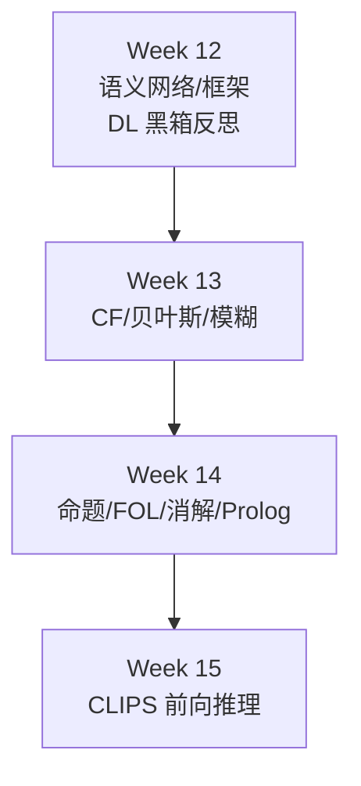
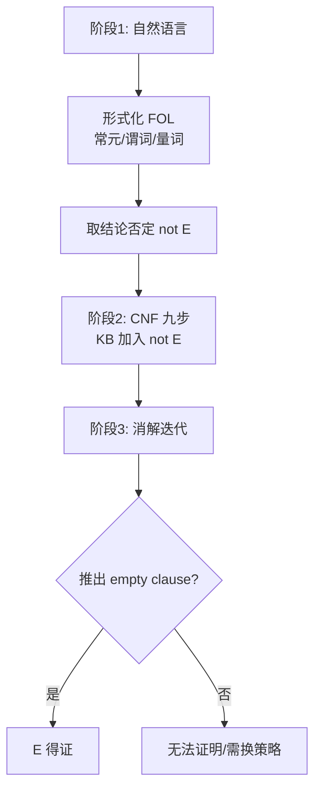

# Week 13–14 学习指南：不确定性推理 + 逻辑/消解

## 期末考试须知（章首必读）

| 项         | 内容                                                                  |
| --------- | ------------------------------------------------------------------- |
| **考试形式**  | **开卷**；试卷 **英文**；选择 + 解答                                            |
| **复习范围**  | 内容均在 **课程 PPT** 中；开卷务必熟悉 PPT 定位                                     |
| **★必考 1** | **CF（Certainty Factor，确定性因子）计算题**——公式 + 多规则合成手算                     |
| **★必考 2** | **消解证明大题**——NL → FOL → CNF → Resolution → 空子句（见 §0 缩写释义）            |
| **明确不考**  | **深度生成模型**（VAE（Variational Autoencoder，变分自编码器）/扩散/流匹配等，Week 12 已标注） |
| **概念级**   | PageRank、模糊逻辑（Fuzzy Logic）、贝叶斯框架（Bayesian framework）、Prolog 机制      |

> **备考策略**：CF 手算练到闭卷也能写步骤；消解大题按 **9 步 CNF + 反证法流水线** 做成 checklist，开卷时逐步勾选。

---

## 0. 术语表

| 术语                                         | 大白话解释                      | 生活类比                     |
| ------------------------------------------ | -------------------------- | ------------------------ |
| **CF（Certainty Factor，确定性因子）**          | 用 $[-1,1]$ 数值表示对命题的信任程度    | 医生说「八成像是感冒」——不是严格概率      |
| **$CF(E,e)$（证据可信度）**                    | 观测事实 $e$ 下，证据 $E$ 有多可信     | 体温计读数让你多相信「发烧」           |
| **$CF(H,E)$（规则强度）**                     | 若 $E$ 肯定成立，规则推 $H$ 的强度     | 专家写的规则置信度 0.7            |
| **$CF(H,e)$（结论强度）**                     | 单条规则推出的结论强度                | $CF(E,e) \times CF(H,E)$ |
| **$CF_{comb}$（多规则合成）**                  | 多条规则指向同一 $H$ 时的合成          | 两个医生意见怎么合并               |
| **贝叶斯后验（Bayesian posterior）**           | 先验 × 似然 → 证据更新后的信念         | 收到新化验单后更新诊断              |
| **MAP（Maximum A Posteriori，最大后验估计）**    | 在看到数据后，选后验概率最大的假设/参数       | 「拟合数据」同时「偏好简单模型」          |
| **L2 正则（L2 regularization，L2 正则化）**     | 等价于高斯先验的参数惩罚项              | 限制权重大小                   |
| **马尔可夫性（Markov property）**              | 下一状态只依赖当前，与更早历史无关          | 下棋：只关心当前局面               |
| **稳态（Stationary distribution）**            | 状态分布反复转移后不再变化              | 网页随机游走最后稳定在某个访问比例        |
| **正则条件（Regularity）**                    | 链足够连通、不会困在周期震荡里            | 随机冲浪者总有机会到达各类网页          |
| **转移矩阵（Transition matrix）**              | 一步从当前状态跳到下个状态的概率表          | 从网页 A 点链接跳到 B/C 的概率表       |
| **PageRank（网页排名算法）**                    | 网页图上随机游走的稳态分布 = 质量分        | 被名站链接的网页更「重要」            |
| **隶属度 $\mu(x)$（membership degree）**     | 元素属于模糊集合的程度 $[0,1]$        | 「比较高」不是非 0 即 1           |
| **命题逻辑（Propositional Logic）**           | 原子命题 + 连接词，无个体/量词          | 只能写 $P$、$Q$，不能说「所有人」     |
| **FOL（First-Order Logic，一阶谓词逻辑）**       | 常元/变元/谓词/量词，可表达个体关系        | 「所有人都会死，苏格拉底是人」          |
| **ground atom（基原子）**                     | 不含变量的原子事实                   | `man(socrates)`          |
| **正文字（positive literal）**                | 没有取反的文字                     | $man(x)$ 是正文字，$\neg man(x)$ 不是 |
| **霍恩子句（Horn clause）**                   | 至多一个正文字的子句；Prolog 的基础      | `A :- B, C.`             |
| **CNF（Conjunctive Normal Form，合取范式）**   | 子句的合取，每子句是文字的析取            | 消解算法的输入格式                |
| **变量标准化（Standardizing apart）**           | 给不同公式/子句的变量改名，避免误当同一个变量    | 两张卷子都写 $x$，先改成 $x_1,x_2$ |
| **前束化（Prenex form）**                    | 把量词统一移到公式最前面               | 先排队量词，再处理内部矩阵            |
| **Skolem 化（Skolemization）**             | 用 Skolem 常元/函数消去 $\exists$ | 「存在某人」→ 给个具体代表           |
| **合一（Unification）**                     | 找替换使两表达式相同                 | 把规则里的 $x$ 换成 `socrates`  |
| **消解（Resolution）**                      | 互补文字消去，产生新子句               | 反证法：假设否定，推出矛盾            |
| **空子句 $\square$（empty clause）**         | 消解成功标志：矛盾                  | 证明原命题必真                  |
| **Backward chaining（反向推理）**              | 从目标倒推需要哪些事实/子目标            | Prolog 先问「要证明什么」          |
| **Cut（剪枝）**                              | Prolog 的 `!`，阻止回溯到某些备选分支   | 做出选择后不再试别的路              |
| **Rete 算法**                               | CLIPS 用来高效匹配大量规则和事实的网络算法    | 只更新受新事实影响的匹配             |
| **CWA（Closed World Assumption，封闭世界假设）** | 未知=假                       | Prolog 否定即失败             |
| **OWA（Open World Assumption，开放世界假设）**   | 未知=未知                      | 知识图谱默认                   |

---

## 1. 叙事线总览

打印版恢复图：这张图保留 Week 13-14 在符号主义链条中的位置，强调从知识表示到 CLIPS 的过渡。



---

## 2. 核心知识

### 2.0 模块全景：符号主义「知识 + 推理」

> **本节叙事线**：
>
> ```
> A. 为何回归符号？     →  DL 黑箱 vs 可解释/样本效率
>         ↓
> B. 不确定性怎么办？   →  贝叶斯框架 → CF 手算（★必考）
>         ↓
> C. 逻辑语言           →  命题逻辑 → FOL（大题前置）
>         ↓
> D. 机器怎么证明？     →  CNF 9 步 → 消解 → 空子句（★必考大题）
>         ↓
> E. Prolog 工程化      →  霍恩子句 + 反向推理 → Week 15 CLIPS 对照
> ```

> **本节要回答**：符号主义相对 DL 的优势是什么？期末两道必考题分别考什么能力？

**学完能做什么**：

1. **闭卷**完成 CF 三规则合成手算（含同正、异号公式）
2. **开卷**按 checklist 完成 NL→FOL→CNF→消解证明
3. 区分 $CF(E,e)$ 与 $CF(H,E)$，正确用 min/max 组合证据
4. 写出三段论 FOL 形式并用 UI 实例化
5. 解释 Prolog 与 CLIPS 的推理方向差异

---

### 2.1 Week 13：不确定性推理

#### A. 符号主义（Symbolism）vs 深度学习（Deep Learning）

> **承接 Week 12**：Transformer 代表连接主义巅峰，但黑箱、需大数据、逻辑易错（如把字符串/模式相似性误当数值比较，可能错判 `8.11 > 8.2` 这类题）。

| 维度   | 符号主义              | 深度学习        |
| ---- | ----------------- | ----------- |
| 可解释性 | 白盒，IF-THEN 推理链可追溯 | 黑箱，权重难解释    |
| 样本效率 | 注入规则即可            | 需海量标注数据     |
| 知识注入 | 显式规则/公理           | 隐式学在权重里     |
| 逻辑精准 | 严谨数值/因果逻辑         | 模式匹配，可能逻辑错误 |
| 模块化  | 改单条规则副作用小         | 微调可能全局漂移    |

---

#### B. 贝叶斯推理框架（Bayesian inference framework）（概念）

> **本节要回答**：先验、似然、后验各代表什么？L2 正则和贝叶斯有何联系？

**核心流程**：先验 $P(H)$ → 观测似然 $P(E \mid H)$ → 后验 $P(H \mid E) = \frac{P(E \mid H)P(H)}{P(E)}$ → 结合损失函数做决策（期望效用最大 / 期望损失最小）。

> **符号都是什么？（先记这张表）**
>
>
> | 符号           | 英文                  | 含义                                       | 医学诊断例           |
> | ------------ | ------------------- | ---------------------------------------- | --------------- |
> | **$H$**      | **H**ypothesis      | **假设**——你想判断真假的命题                        | 「患者得了流感」        |
> | **$E$**      | **E**vidence        | **证据**——能帮你更新信念的观测/事件                    | 「体温 39°C」「化验阳性」 |
> | **$P(H)$**   | Prior               | **先验**：还没看到 $E$ 之前，对 $H$ 的信心             | 示意：流感季节前，人群中 5% 患病 |
> | **$P(E \mid H)$** | Likelihood          | **似然**：若 $H$ 成立，出现证据 $E$ 有多常见            | 示意：真患流感时，高烧概率 0.8  |
> | **$P(H \mid E)$** | Posterior           | **后验**：看到 $E$ 之后，$H$ 成立的概率               | 示意：高烧后，患流感概率升到 0.6 |
> | **$P(E)$**   | Evidence / marginal | **证据概率**（归一化常数）：$P(E)=\sum_H P(E \mid H)P(H)$ | 不管病因，出现高烧的总概率   |
>
>
> **和后面 CF 里的 $e$ 怎么区分？**
>
> - **贝叶斯**常用大写 **$E$**：把证据当作一个**事件/命题**（如「化验阳性」），直接写进 $P(E \mid H)$。
> - **CF（MYCIN）**常用小写 **$e$**：表示当前**全部观测事实的集合**（体温、咳嗽、化验……）；单条证据命题仍用大写 **$E$**，$CF(E,e)$ =「在观测 $e$ 下，证据 $E$ 有多可信」。
> - 同一诊断任务里可对应：$H$=结论，$E$=某条症状/检验，$e$=病人此刻所有已知信息。
>
> **公式怎么读？** 后验 ∝ 似然 × 先验；$P(E)$ 只是让后验归一化成概率。流程四步：**先验定基调 → 新证据用似然修正 → 得后验 → 选期望损失最小的行动**（治/不治、检/不检）。若是 **MAP**，就是在后验分布里挑最大的那个假设/参数；放到机器学习里，常表现为「拟合数据项 + 先验惩罚项」一起优化。

> **追问：CF 和贝叶斯都是「不确定」，为何课程两套都讲？**
>
> **贝叶斯**遵循概率公理，$P(H)+P(\neg H)=1$，适合有统计数据的场景；**CF** 是 MYCIN 的启发式代数，区分「信任增长 MB（Measure of Belief，信任度）」与「不信任增长 MD（Measure of Disbelief，不信任度）」，允许 $CF=0$（既不信也不反信），更贴近专家直觉但**非严格概率**。期末 **必考 CF 手算**，贝叶斯侧重概念（含 L2 联系）。

**L2 正则 = 高斯先验**：

$$\log P(w \mid Data) = \log P(Data \mid w) + \log P(w)$$

当 $P(w)$ 为零均值高斯，$\log P(w)$ 含 $-\lVert w\rVert^2$ 项 → 等价于损失函数加 $\lambda \lVert w\rVert^2$。**L2 正则的本质：对参数施加零均值高斯先验，偏好简单模型。**

> **「先验」「高斯」「零均值」都是什么？**
>
> | 名词 | 大白话 | 在本节指什么 |
> |------|--------|-------------|
> | **先验 $P(w)$** | 看数据**之前**，你对参数 $w$ 的「主观信念」 | 训练开始前，权重**更可能接近 0**，不太相信会特别大 |
> | **高斯分布**（Gaussian，正态分布） | 钟形曲线；由**均值** $\mu$ 和**方差** $\sigma^2$ 决定 | 一维：$P(w)\propto \exp\big(-\frac{(w-\mu)^2}{2\sigma^2}\big)$ |
> | **零均值高斯** | 钟形曲线**中心在 0**（$\mu=0$） | 最相信 $w\approx 0$；$\lVert w\rVert$ 越大先验越低 |
>
> **为什么叫「先验」？** 上式里 $\log P(Data \mid w)$ 是数据似然（拟合好不好），$\log P(w)$ 是**还没拟合数据时**对 $w$ 的偏好——和诊断里的先验 $P(H)$ 同一角色，只是对象从「假设 $H$」换成「参数 $w$」。
>
> **零均值高斯 → L2 怎么对上？** 设每个权重独立、$\mu=0$：
> $$\log P(w) = \text{常数} - \frac{1}{2\sigma^2}\sum_i w_i^2 = \text{常数} - \frac{1}{2\sigma^2}\lVert w\rVert^2$$
> 最大化 $\log P(w \mid Data)$ = 最大化 $\log P(Data \mid w) + \log P(w)$ ↔ 最小化损失时多加一项 $\dfrac{1}{2\sigma^2}\lVert w\rVert^2$，即 Week 10 的 **L2 正则** $\lambda \lVert w\rVert^2$（$\lambda$ 与 $\sigma^2$ 成反比：先验越「紧」，惩罚越强）。
>
> **直观**：零均值高斯先验 = 「权重默认应在 0 附近，别为了迎合训练集噪声长得太大」→ 曲线更平滑、更简单 → 防过拟合。与 §2.1-B 中 $P(H)$ 先验、Week 10 AdamW 的 $\lambda$ 权重衰减是同一思想的两种写法。

**CF vs 贝叶斯对比**：

| 维度     | 确定性因子 CF  | 贝叶斯概率     |
| ------ | --------- | --------- |
| 理论基础   | 专家启发式代数   | 概率公理      |
| 不确定性类型 | 信任/不信任可分离 | 概率分布      |
| 规则独立性  | 相对独立，易加规则 | 条件独立假设难满足 |
| 期末     | **★必考手算** | 概念（L2 联系） |

---

#### C. CF（Certainty Factor，确定性因子）理论（★必考）

> **本节要回答**：$CF(E,e)$ 和 $CF(H,E)$ 分别量化什么？三条合成规则是什么？

##### C.1 两类不确定性

CF 来自 MYCIN 风格专家系统：医生/专家往往能说「这个症状支持某病 0.7」「这个检查结果反对某病 0.4」，却很难给出完整的联合概率表。CF 因此不用纯概率，而把支持强度拆成 **MB（Measure of Belief，信任增长）** 与 **MD（Measure of Disbelief，不信任增长）**，再用 $CF=MB-MD$ 表示净支持。它牺牲严格概率语义，换来考试里可手算、工程里可维护的规则代数。

| 符号            | 含义                    | 谁给定      |
| ------------- | --------------------- | -------- |
| **$CF(E,e)$** | 观测 $e$ 下证据 $E$ 的可信度   | 传感器/观测   |
| **$CF(H,E)$** | $E$ 完全成立时，规则推 $H$ 的强度 | 专家写在规则里  |
| **$CF(H,e)$** | 该规则推出的结论强度            | **计算得出** |

**单条规则核心公式**：

$$CF(H,e) = CF(E,e) \times CF(H,E)$$

> **注意**：若 $CF(E,e) < 0$，该规则通常**不触发**。

##### C.2 证据组合（前提内的 AND/OR/NOT）

| 逻辑                                   | 公式                                        |
| ------------------------------------ | ----------------------------------------- |
| **AND** $E_1 \land E_2 \land \cdots$ | $CF = \min[CF(E_1,e), CF(E_2,e), \ldots]$ |
| **OR** $E_1 \lor E_2 \lor \cdots$    | $CF = \max[CF(E_1,e), CF(E_2,e), \ldots]$ |
| **NOT** $\neg E$                     | $CF(\neg E,e) = -CF(E,e)$                 |

> **直观理解：AND 为什么取 min？**
>
> 想象门禁要**同时**刷工卡 AND 通过人脸——整体可信度取决于**最弱的那一环**。OR 取 max 同理：多条出路取**最好**那条。

##### C.3 多规则合成 $CF_{comb}$（★核心）

设两条规则推出同一 $H$ 的强度为 $CF_1, CF_2$：

| 情况                      | 公式                                                          |
| ----------------------- | ----------------------------------------------------------- |
| **同正** $CF_1, CF_2 > 0$ | $CF_{comb} = CF_1 + CF_2(1 - CF_1)$                         |
| **同负** $CF_1, CF_2 < 0$ | $CF_{comb} = CF_1 + CF_2(1 + CF_1)$                         |
| **异号** 一正一负             | $CF_{comb} = \dfrac{CF_1 + CF_2}{1 - \min(\lvert CF_1\rvert, \lvert CF_2\rvert)}$ |

**C 节小结** → 公式齐全了，下面用完整数值题走一遍考试同款流程。

---

#### D. CF 数值手算完整例题（★期末必考模板）

> **本节要回答**：三道规则、三种符号，怎么一步步合成最终 $CF$？

**场景**：判断生物 $H$ 是否为链球菌，有三条规则：

| 规则    | 形式                          | 规则强度 $CF(H,E)$ |
| ----- | --------------------------- | -------------- |
| $r_1$ | IF $E_1$ AND $E_2$ THEN $H$ | 0.8            |
| $r_2$ | IF $E_3$ THEN $H$           | 0.5            |
| $r_3$ | IF $E_4$ THEN $H$           | **-0.4**（反对证据） |

**观测**：

| 证据    | $CF(E_i, e)$ |
| ----- | ------------ |
| $E_1$ | 0.7          |
| $E_2$ | 0.6          |
| $E_3$ | 0.4          |
| $E_4$ | 0.5          |

---

**步骤一：逐条规则算 $CF_i(H,e)$**

**规则 $r_1$**（AND 前提）：

1. 证据组合：$CF(E_{1 \cap 2}, e) = \min(0.7, 0.6) = \mathbf{0.6}$
2. 结论强度：$CF_1 = 0.6 \times 0.8 = \mathbf{0.48}$

**规则 $r_2$**：

$$CF_2 = 0.4 \times 0.5 = \mathbf{0.2}$$

**规则 $r_3$**（负规则强度）：

$$CF_3 = 0.5 \times (-0.4) = \mathbf{-0.2}$$

---

**步骤二：合成 $CF_1$ 与 $CF_2$（同正）**

$$CF_{12} = CF_1 + CF_2(1 - CF_1) = 0.48 + 0.2 \times (1 - 0.48)$$

$$= 0.48 + 0.2 \times 0.52 = 0.48 + 0.104 = \mathbf{0.584}$$

---

**步骤三：合成 $CF_{12}$ 与 $CF_3$（异号）**

$CF_{12} = 0.584 > 0$，$CF_3 = -0.2 < 0$ → 用异号公式：

$$\text{分母} = 1 - \min(\lvert 0.584\rvert, \lvert -0.2\rvert) = 1 - 0.2 = 0.8$$

$$\text{分子} = 0.584 + (-0.2) = 0.384$$

$$CF_{comb} = \frac{0.384}{0.8} = \mathbf{0.48}$$

---

**最终答案**：$H$ 的综合确定性因子为 **0.48**。

---

**补充：同负合成小例题**

若两条规则都反对同一结论 $H$：

$$CF_1=-0.3,\quad CF_2=-0.5$$

两者同为负，用同负公式：

$$CF_{comb}=CF_1+CF_2(1+CF_1)=-0.3+(-0.5)\times(1-0.3)$$

$$=-0.3-0.35=\mathbf{-0.65}$$

直观：两个反对证据叠加后更反对 $H$，但不会简单相加到低于 $-1$。

> 打印提示：完整版此处为流程图；打印版保留为文字复习线索。
> 步骤1: 各规则 CF(E,e) * CF(H,E) → 步骤2: 同正合成 CF_12 → E,e → H,E → 步骤3: 异号合成最终 CF → 最终 CF = 0.48

> **考试书写 checklist**：
>
> 1. 列出每条规则的 $CF(E,e)$（AND 写 min）
> 2. 算 $CF_i = CF(E,e) \times CF(H,E)$
> 3. 两两合成：先合并同号，再处理异号
> 4. **写清用的公式名称**（同正/同负/异号）
> 5. 最终数值 **boxed 或划线强调**

**D 节小结** → CF 解决「规则有多可信」；PageRank/模糊逻辑是补充概念，了解即可。

---

#### E. 马尔可夫链（Markov chain）与 PageRank（概念）

**马尔可夫性（Markov property）**：下一状态只依赖当前状态，与更早历史无关。

**稳态**：反复 $S_{n+1} = S_n \times T$，状态分布收敛到唯一稳态（正则条件下）。这里 $T$ 是**转移矩阵**，记录「从当前网页跳到下个网页」的概率；**正则条件**可以先按概念理解为图足够连通、不会陷入永久周期，因而反复跳转能稳定下来。

**PageRank**：

1. 网页 = 节点，超链接 = 有向边
2. 随机冲浪者跳转 → 转移矩阵
3. **稳态分布中各节点概率 = 网页 Rank**

---

#### F. 模糊逻辑（Fuzzy Logic）（概念）

| 维度   | 概率论                  | 模糊逻辑                      |
| ---- | -------------------- | ------------------------- |
| 处理对象 | **随机性**（发生频率）        | **模糊性**（词汇边界不清）           |
| 数值含义 | 置信度 Degree of Belief | 真值程度 Degree of Truth      |
| 排中律  | $P(A)+P(\neg A)=1$   | 可同时以不同程度属于 $A$ 和 $\neg A$ |
| 推理运算 | 概率法则                 | AND→min，OR→max            |

---

### 2.2 Week 14：逻辑与消解

#### G. 命题逻辑（Propositional Logic）

> **本节要回答**：五种连接词的真值条件？命题逻辑为什么不够用？

**五种连接词**：

| 连接词 | 符号                | 为真条件          |
| --- | ----------------- | ------------- |
| 否定  | $\neg$            | $P$ 假         |
| 合取  | $\land$           | 两者都真          |
| 析取  | $\lor$            | 至少一个真（含或）     |
| 蕴含  | $\rightarrow$     | 若前件成立，后件必须成立；违反规则的是「前真后假」 |
| 等价  | $\leftrightarrow$ | 真值相同          |

> **为什么需要「蕴含」和「等价」？**
>
> **蕴含** $P\rightarrow Q$ 用来写**规则**：只要条件 $P$ 成立，结论 $Q$ 就必须成立。它对应自然语言里的「如果……那么……」。例如「如果下雨，那么地会湿」写作 $rain \rightarrow wet$。这个规则真正禁止的是：**下雨了，但地不湿**。
>
> **注意区分两件事**：公式 $P\rightarrow Q$ 本身**不声明 $P$ 已经为真**；它只是说「一旦 $P$ 为真，就不允许 $Q$ 为假」。真正用它推出 $Q$ 时，还必须另外知道 $P$ 为真，这就是肯定前件：$P\rightarrow Q,\;P\;\therefore Q$。
>
> **等价** $P\leftrightarrow Q$ 用来写**定义或双向条件**：$P$ 成立当且仅当 $Q$ 成立，两边必须同真同假。它比蕴含更强，因为它包含两个方向：
> $$P\leftrightarrow Q \equiv (P\rightarrow Q)\land(Q\rightarrow P)$$
> 例如「一个数是偶数，当且仅当它能被 2 整除」就是等价关系；不能只说「偶数 → 能被 2 整除」，还要有反方向「能被 2 整除 → 偶数」。

**更准确的理解：空真（vacuous truth）**：在真值表里，$P$ 为假时，$P \rightarrow Q$ 记为真。这不是「善意相信规则成立」，也不是说能推出 $Q$；只是因为蕴含式只承诺「若 $P$ 发生，则 $Q$ 不能失败」。当 $P$ 没发生时，没有出现反例，所以该公式没有被否定。

> **判断真假 vs 使用规则**
>
> - **判断公式真假**：必须考虑 $P$ 真/假、$Q$ 真/假的所有组合；因此会出现 $P$ 为假的行。
> - **用规则推出结论**：必须同时有 $P \rightarrow Q$ 和 $P$，才能推出 $Q$。若只有 $P \rightarrow Q$，或 $P$ 为假，不能推出 $Q$。

**迷你真值例题**：令 $P$=「今天下雨」，$Q$=「地面湿」。若今天没下雨但地面湿，$\neg P$ 为真、$P\land Q$ 为假、$P\lor Q$ 为真；$P\rightarrow Q$ 算作未被违反，因为它只禁止「下雨但地不湿」这一种情况；$P\leftrightarrow Q$ 为假，因为两边真值不同。考试遇到蕴含，优先检查是否出现「前件真、后件假」。

**命题逻辑三大局限**：

1. 无法区分个体与集合（不能自动推「苏格拉底会死」）
2. 缺乏量词 $\forall, \exists$
3. 规模化困难（$n$ 个原子命题真值表 $2^n$ 行）

**为什么这两点会卡住推理？** 命题逻辑把每句话都当成一个不可拆的整体，例如 `AllMenMortal`、`SocratesIsMan`、`SocratesMortal` 在语法上只是三个独立开关。它看不见里面的「人」「苏格拉底」「会死」这些结构，所以不会自动知道「苏格拉底」属于「人」这一类，也不会把「所有人都会死」套到「苏格拉底」身上。要表达「所有」和「某个具体对象」，就需要一阶谓词逻辑里的个体、谓词和量词。

→ 需要 **FOL（First-Order Logic，一阶谓词逻辑）**。

---

#### H. FOL（First-Order Logic，一阶谓词逻辑）

> **本节要回答**：项、谓词、量词各是什么？三段论怎么用 FOL + UI 推理？

**符号系统**：

| 类别   | 例子                    | 说明          |
| ---- | --------------------- | ----------- |
| 常元   | `socrates`            | 具体个体        |
| 变元   | `x`, `y`              | 占位符         |
| 函元   | `mother(x)`           | 项 → 项的映射    |
| 谓词   | `man(x)`, `mortal(x)` | 属性或关系       |
| 全称量词 | $\forall x$           | 对所有 $x$ 成立  |
| 存在量词 | $\exists x$           | 至少一个 $x$ 成立 |

**三段论示例**：

> **三段论在做什么？** 它把「一般规则」套到「具体事实」上，推出一个具体结论。经典形式是：
> 所有人都会死；苏格拉底是人；所以苏格拉底会死。
> 命题逻辑做不到这一步，是因为它不能拆开“所有人”和“苏格拉底”之间的关系；FOL 可以用变量 $x$ 和量词 $\forall$ 表示一般规则，再把 $x$ 替换成具体对象。

1. $\forall x(man(x) \rightarrow mortal(x))$ （规则）
2. $man(socrates)$ （事实）
3. **UI（Universal Instantiation，全称例化）**：将 $x$ 替换为 `socrates`，写成替换 $\theta=\{x/socrates\}$ → $man(socrates) \rightarrow mortal(socrates)$
4. **肯定前件（Modus Ponens）**：若已知 $P\rightarrow Q$，并且已知 $P$ 为真，就可以推出 $Q$。这里 $P$ 是 $man(socrates)$，$Q$ 是 $mortal(socrates)$ → 推出 $mortal(socrates)$

**合一（Unification）**：找替换 $\theta$ 使两表达式形式一致；消解前必须会合一。**出现检查（Occur Check）**：$x$ 不能与含 $x$ 的复杂项合一（如 $x$ vs $f(x)$）。

---

#### I. 消解原理（Resolution）（★必考大题核心）

> **本节要回答**：消解为什么用反证法？空子句 $\square$ 代表什么？

**消解是什么？** 消解是一种把逻辑推理变成**机械化符号操作**的方法。它不靠人读懂句子含义，而是把所有知识改写成 CNF 子句集，然后反复寻找一对互补文字（如 $P$ 和 $\neg P$），把它们抵消，推出新的子句。

**为什么需要消解？** 因为期末大题要做的是**自动推理**：给一组知识 $KB$ 和目标结论 $E$，判断 $KB$ 是否必然推出 $E$。自然语言推理容易凭直觉跳步；消解提供统一流程：先把句子标准化成子句，再用同一种规则不断化简，直到推出矛盾（空子句）为止。

##### I.1 反证法思想

先把符号认清：

| 符号 | 含义 | 白话理解 |
|------|------|---------|
| **$KB$** | Knowledge Base，知识库 | 已知规则和事实的集合，例如「所有人都会死」「苏格拉底是人」 |
| **$E$** | 要证明的结论 | 目标命题，例如「苏格拉底会死」 |
| **$KB \models E$** | $KB$ 逻辑蕴含 $E$ | 只要 $KB$ 全部为真，$E$ 就不可能为假 |
| **$\neg E$** | $E$ 的否定 | 假设目标结论不成立，例如「苏格拉底不会死」 |
| **$\cup$** | 集合并集 | 把两堆公式放到一起 |
| **$S$** | 反证时临时构造的公式集合 | $S = KB \cup \{\neg E\}$，即「已知知识 + 目标的反面」 |
| **CNF 子句集** | 合取范式后的子句集合 | 把复杂公式拆成一堆只含 $\lor$ 的小句子，便于机械消解 |
| **空子句 $\square$** | 不含任何文字的子句 | 表示推出矛盾：没有任何取值能让它成立 |

要证 $KB \models E$：

1. 构造 $S = KB \cup \{\neg E\}$
2. 将 $S$ 中所有公式化为 **CNF（Conjunctive Normal Form，合取范式）子句集**
3. 反复应用 **Resolution（消解）** 规则
4. 若推出 **空子句 $\square$（empty clause）** → $S$ 不可满足 → $\neg E$ 假 → **$E$ 必真**

**CNF 到底是什么？** CNF（Conjunctive Normal Form，合取范式）是一种把逻辑公式整理成固定形状的写法：

$$
(L_{11}\lor L_{12}\lor \cdots)\land(L_{21}\lor L_{22}\lor \cdots)\land\cdots
$$

其中每个 $L$ 是一个**文字（literal）**，也就是原子命题或它的否定，例如 $man(socrates)$、$\neg mortal(socrates)$。每一组用 $\lor$ 连起来的部分叫一个**子句（clause）**；多个子句再用 $\land$ 连起来。

**为什么消解需要 CNF？** 消解只会做一种机械动作：在两个子句中找到互补文字 $P$ 与 $\neg P$，把它们抵消，并合并剩余部分。只有把复杂公式都变成「一堆析取子句」后，机器才知道去哪里找互补对。
例如：

$$
(\neg man(socrates)\lor mortal(socrates)) \land man(socrates)
$$

可以看成两个子句：

1. $\neg man(socrates)\lor mortal(socrates)$
2. $man(socrates)$

二者含有互补对 $\neg man(socrates)$ 与 $man(socrates)$，消掉后得到 $mortal(socrates)$。这就是「把规则变成子句，再机械推出结论」的意义。

> **追问：为什么不直接「证明」$E$，而要证 $\neg E$ 矛盾？**
>
> 消解只擅长处理**文字的析取**——CNF 子句集天然适合找**互补对** $L$ 与 $\neg L$。直接证 $E$ 没有统一的语法操作；反证法把「证真」转化成「证矛盾」，才能用同一套机械规则。

##### I.2 合取范式（CNF）转化九步法（★考试逐步写）

**九步法到底在把什么变成什么？** 它不是在「证明」公式，而是在把任意 FOL 公式整理成消解算法能吃的固定输入。起点通常是带有 $\forall,\exists,\rightarrow,\leftrightarrow,\neg,\land,\lor$ 的复杂句子；终点是**若干子句**，每个子句只是一串文字用 $\lor$ 连起来，多个子句组成集合。中间要完成四件事：消掉 $\rightarrow/\leftrightarrow$，把 $\neg$ 推到原子公式前，处理量词尤其是 $\exists$，最后拆成可编号的子句。

> **一句话记忆**：CNF 转化 = 先把连接词变简单，再把否定放到最里层，再把存在对象命名，最后把公式切成一条条可消解的子句。

| 步   | 操作                                 | 为什么做 / 做完变成什么 |
| --- | ---------------------------------- | ---------------------- |
| 1   | 消去 $\rightarrow, \leftrightarrow$  | 消解只需要 $\neg,\land,\lor$。把 $A\rightarrow B$ 改成 $\neg A\lor B$；把 $A\leftrightarrow B$ 先拆成两个蕴含再改写。 |
| 2   | 否定内移                               | 让否定只贴在原子谓词前，后面才能把文字当作消解单位。用德摩根律和量词否定律，例如 $\neg\forall x P(x)\equiv \exists x\neg P(x)$。 |
| 3   | 变量标准化                              | 同名变量可能只是碰巧重名，先改名避免误绑。做完后，不同量词辖域里的变量名字彼此独立。 |
| 4   | 量词左移（前束化）                          | 把量词统一排到公式最前面，便于判断每个 $\exists$ 依赖哪些外层 $\forall$。做完得到「量词前缀 + 无量词矩阵」。 |
| 5   | Skolem 化（Skolemization）消 $\exists$ | 存在对象要用一个确定名字代替。若 $\exists$ 不在任何 $\forall$ 内，用 Skolem 常元 $c$；若依赖外层 $\forall x$，用 Skolem 函数 $f(x)$。 |
| 6   | 略去全称量词                             | Skolem 化后只剩 $\forall$。子句集默认所有自由变量都全称量化，所以可以不再写 $\forall$。 |
| 7   | 分配律                                | 把公式整理成「合取的合取项，每项内部是析取」。典型变形：$A\lor(B\land C)\equiv(A\lor B)\land(A\lor C)$。 |
| 8   | 拆分为独立子句                            | 顶层 $\land$ 的每一项都拆出来编号成 $C_i$。做完后，消解可以在子句之间寻找互补文字。 |
| 9   | 子句间变量标准化                           | 子句之间的变量默认各自局部使用，必要时再改名成 $x_1,x_2,\ldots$，避免消解时把不同子句的变量误当同一个。 |

**小例子：只看 CNF 关键变化**

完整考试模板见下方 J；这里先用一个小公式展示九步法为什么需要 Skolem 常元和 Skolem 函数：

$$
\exists z\,P(z)\land \forall x\big(P(x)\rightarrow \exists y(Q(y,x)\land R(y))\big)
$$

这类公式可读成：先有某个对象满足 $P$；并且对任意 $x$，如果 $P(x)$ 成立，就存在某个 $y$ 同时满足 $Q(y,x)$ 和 $R(y)$。关键变化如下：

1. **消去蕴含**：
   $$
   \exists z\,P(z)\land \forall x\big(\neg P(x)\lor \exists y(Q(y,x)\land R(y))\big)
   $$
2. **前束化**：把第二部分里的 $\exists y$ 提到量词前缀中：
   $$
   \exists z\,P(z)\land \forall x\exists y\big(\neg P(x)\lor (Q(y,x)\land R(y))\big)
   $$
3. **Skolem 化**：$\exists z$ 不依赖任何全称变量，所以替换成常元 $c$；$\exists y$ 在 $\forall x$ 里面，所以替换成函数 $f(x)$：
   $$
   P(c)\land \forall x\big(\neg P(x)\lor (Q(f(x),x)\land R(f(x)))\big)
   $$
4. **略去全称量词 + 分配律**：
   $$
   P(c)\land(\neg P(x)\lor Q(f(x),x))\land(\neg P(x)\lor R(f(x)))
   $$
5. **拆成子句集**：
   $$
   C_1:P(c)
   $$
   $$
   C_2:\neg P(x_1)\lor Q(f(x_1),x_1)
   $$
   $$
   C_3:\neg P(x_2)\lor R(f(x_2))
   $$

这里 $c$ 表示「某个已存在的具体对象」；$f(x)$ 表示「对每个 $x$，给它配一个可能不同的见证对象」。到这一步就已经是消解可用的子句集了，后续只需要像 I.3 和 J 那样找互补文字并合一。

##### I.3 消解规则

> **这三步本质上在做什么？**
>
> 消解证明不是“看懂句子后推理”，而是在子句里做三件机械工作：
> **先对齐对象**（合一）→ **再抵消一对互相矛盾的文字**（二进制消解）→ **必要时合并同一子句里的重复说法**（因子化）。
> 这样才能把「所有人都会死」这种变量规则，和「苏格拉底是人」这种具体事实接起来。

- **合一（Unification）**：在两个准备消解的互补文字“长得不完全一样”，但可以通过变量替换对齐时使用。它能做两类事：一是把变量规则匹配到具体事实，例如 $Parent(x,alice)$ 对齐 $Parent(bob,alice)$；二是把两个变量表达式对齐，例如 $Parent(x,y)$ 对齐 $Parent(bob,z)$。合一找的是替换 $\theta$，例如 $\theta=\{x/bob\}$，让两边说的是同一个对象。MGU（Most General Unifier，最一般合一子）指“刚好够用、不过度指定”的替换。它不能把谓词名不同或参数个数不同的文字硬凑在一起，例如 $Parent(x,y)$ 与 $Mother(x)$ 不能合一；也不能违反出现检查（Occur Check），即不能让 $x$ 被替换成含自身的项 $f(x)$。
- **二进制消解**：每一步证明的核心动作。输入是两个父子句，从中选择一对互补文字 $L$ 与 $\neg L'$；若二者不完全相同，先用合一找到 $\theta$，再把互补对消去，并把两个父子句剩余文字合并成一个新子句。它不是“随便删掉一正一反”，而是基于逻辑事实：如果两个父子句同时成立，而其中一对互补文字不可能同时为真，那么父子句里剩下的部分必须承担成立责任，所以可以推出新的子句。
- **因子化（Factorization）**：通常是辅助步骤，不是每一步都必须做。它用于同一子句内部出现重复或可合一的同号文字时，先把它们合并成一个更干净的子句。这样可以避免重复项阻碍后续消解，也是在完整一阶消解系统中保证完备性的常见配套规则；考试里理解到“同一子句内部先去重/合并”即可，不必展开更深证明。

**MGU 怎么找的小例子**：

- $Parent(x, alice)$ 与 $Parent(bob, y)$ 可合一，最一般替换是 $\theta=\{x/bob,\ y/alice\}$。代入后两边都变成 $Parent(bob, alice)$。
- $P(x)$ 与 $P(f(x))$ 不能合法合一，因为出现检查会阻止 $x$ 被替换成含自身的 $f(x)$，否则会无限展开。

**二进制消解一步**：

设 $C_1=\neg Parent(x,alice)\lor HasParent(alice)$，$C_2=Parent(bob,alice)$。互补文字为 $\neg Parent(x,alice)$ 与 $Parent(bob,alice)$，MGU 为 $\theta=\{x/bob\}$，消去后得：

$$C_3=HasParent(alice)$$

**因子化一步**：

设 $C=\neg P(x)\lor \neg P(a)\lor Q$。子句内 $\neg P(x)$ 与 $\neg P(a)$ 可合一，$\theta=\{x/a\}$，因子化后得：

$$C'=\neg P(a)\lor Q$$

**在完整证明中如何串起来**：

1. 从子句集中选两个父子句。
2. 在两个父子句中找一对谓词名和参数个数相同、符号相反的候选互补文字。
3. 若互补文字参数没有完全对齐，先做合一，得到 $\theta$。
4. 对两个父子句同时应用 $\theta$，再执行二进制消解，生成一个新子句。
5. 如果新子句内部有重复或可合一的同号文字，必要时做因子化。
6. 把新子句加入子句集，继续选父子句，直到推出空子句 $\square$ 或没有可用消解步。

考试作用：合一负责让「变量版规则」匹配「具体事实」或让两个变量表达式对齐；二进制消解是每一步推导的基本动作；因子化用于合并同一子句内可合一的重复文字，避免重复项干扰后续消解。

**效率策略**（概念）：支持集策略、单元优先、线性消解（高效但可能不完备）。

---

#### J. 期末大题流水线 Checklist（★必考）

> **本节要回答**：拿到一道自然语言证明题，从哪下笔？

打印版恢复图：这是 Week 14 最重要的考试流程图，按它检查 FOL、CNF 和消解证明三阶段。



**阶段 1：自然语言 → FOL**

- [ ] 定义谓词（如 $Parent(x,y)$, $Ancestor(x,y)$）
- [ ] 区分常元（具体人名）与变元（$x,y$）
- [ ] 规则用 $\forall$ + $\rightarrow$；事实用 ground atom
- [ ] 待证结论 $E$；准备 $\neg E$

**阶段 2：FOL → CNF 子句集**

- [ ] 步骤 1–9 逐步写（考试给分点！）
- [ ] Skolem 化：看清 $\exists$ 是否在 $\forall$ 辖域内
- [ ] 最终得到子句列表 $C_1, C_2, \ldots$

**阶段 3：消解证明**

- [ ] $S = KB_{CNF} \cup \neg E_{CNF}$
- [ ] 选互补文字对；必要时先合一
- [ ] 记录每步：父子句编号 → 消解式
- [ ] 得到 $\square$ → 证毕

**FOL 形式化模板（苏格拉底三段论）**：

| 自然语言     | FOL                                                        |
| -------- | ---------------------------------------------------------- |
| 所有人都会死   | $\forall x(man(x) \rightarrow mortal(x))$                  |
| 苏格拉底是人   | $man(socrates)$                                            |
| 证：苏格拉底会死 | $E = mortal(socrates)$；加入 $\neg E = \neg mortal(socrates)$ |

**子句化简例**（规则子句）：

$\forall x(man(x) \rightarrow mortal(x))$

→ $\forall x(\neg man(x) \lor mortal(x))$

→ 子句：$\neg man(x), mortal(x)$

事实：$man(socrates)$

否定目标：$\neg mortal(socrates)$

消解：

1. $\neg man(x), mortal(x)$ + $man(socrates)$，合一 $\theta=\{x/socrates\}$ → $mortal(socrates)$
2. $mortal(socrates)$ + $\neg mortal(socrates)$ → $\square$ ✓

---

**完整模板例题：NL → FOL → CNF 九步 → 多步消解**

> 这是考试书写模板例题，用经典家庭关系谓词练流程；重点是步骤和记号，不要求背故事。

**自然语言题**：

1. 存在一个人。
2. 每个人都有一位母亲，并且那位母亲也是人。
3. 若 $y$ 是 $x$ 的母亲，则 $y$ 是 $x$ 的父母。
4. 证明：存在某个人有父母。

**谓词表**：

- $Person(x)$：$x$ 是人
- $Mother(y,x)$：$y$ 是 $x$ 的母亲
- $Parent(y,x)$：$y$ 是 $x$ 的父母

**阶段 1：自然语言写成 FOL**

$$KB_1:\exists z\,Person(z)$$

$$KB_2:\forall x\big(Person(x)\rightarrow \exists y(Mother(y,x)\land Person(y))\big)$$

$$KB_3:\forall x\forall y\big(Mother(y,x)\rightarrow Parent(y,x)\big)$$

目标：

$$G:\exists u\exists v\,Parent(u,v)$$

反证法加入目标否定：

$$\neg G:\forall u\forall v\,\neg Parent(u,v)$$

**阶段 2：CNF 九步（关键给分步骤）**

| 步 | 结果 |
|----|------|
| 1 消去蕴含 | $KB_2:\forall x(\neg Person(x)\lor \exists y(Mother(y,x)\land Person(y)))$；$KB_3:\forall x\forall y(\neg Mother(y,x)\lor Parent(y,x))$ |
| 2 否定内移 | $\neg G$ 已变为 $\forall u\forall v\neg Parent(u,v)$；其余否定已在原子公式前 |
| 3 变量标准化 | 各公式变量分开看：$z$；$x,y$；$x_3,y_3$；$u,v$，避免同名变量误共享 |
| 4 前束化 | $KB_2:\forall x\exists y(\neg Person(x)\lor (Mother(y,x)\land Person(y)))$；其他公式量词已在最前 |
| 5 Skolem 化 | $KB_1$ 的 $\exists z$ 不依赖全称变量，用 Skolem 常元 $c$；$KB_2$ 的 $\exists y$ 依赖 $\forall x$，用 Skolem 函数 $f(x)$ |
| 6 略去全称量词 | 得到无显式 $\forall$ 的矩阵，剩余变量默认全称量化 |
| 7 分配律 | $\neg Person(x)\lor (Mother(f(x),x)\land Person(f(x)))$ 变为 $(\neg Person(x)\lor Mother(f(x),x))\land(\neg Person(x)\lor Person(f(x)))$ |
| 8 拆分子句 | 每个合取项单独编号成子句 |
| 9 子句变量再标准化 | 不同子句变量改名为 $x_1,x_2,x_3,y_3,u_4,v_4$ |

**最终子句集**：

$$C_1: Person(c)$$

$$C_2: \neg Person(x_1)\lor Mother(f(x_1),x_1)$$

$$C_3: \neg Person(x_2)\lor Person(f(x_2))$$

$$C_4: \neg Mother(y_3,x_3)\lor Parent(y_3,x_3)$$

$$C_5: \neg Parent(u_4,v_4)$$

其中 $C_5$ 来自目标否定 $\neg G$。$C_3$ 本题不必用到，但考试中仍应列出，因为它是 $KB_2$ 分配律后的另一个子句。

**阶段 3：消解证明到空子句**

1. $C_1$ 与 $C_2$：$Person(c)$ 和 $\neg Person(x_1)$ 互补，MGU $\theta_1=\{x_1/c\}$，得
   $$C_6: Mother(f(c),c)$$
2. $C_6$ 与 $C_4$：$Mother(f(c),c)$ 和 $\neg Mother(y_3,x_3)$ 互补，MGU $\theta_2=\{y_3/f(c),\ x_3/c\}$，得
   $$C_7: Parent(f(c),c)$$
3. $C_7$ 与 $C_5$：$Parent(f(c),c)$ 和 $\neg Parent(u_4,v_4)$ 互补，MGU $\theta_3=\{u_4/f(c),\ v_4/c\}$，得
   $$\square$$

结论：$KB\cup\{\neg G\}$ 不可满足，所以 $KB\models G$，即「存在某个人有父母」得证。

> **直观理解：消解像在「找矛盾对」**
>
> 知识库说「要么非人，要么会死」+「苏格拉底是人」→ 推出「苏格拉底会死」。再加入「苏格拉底不会死」→ 两句话正面冲突 → 空子句。空子句 = 「这个世界不可能同时成立」→ 所以「不会死」的假设错了 → 原结论必真。

---

#### K. Prolog：反向推理工程化

**霍恩子句**：每个子句至多一个**正文字**（没有取反的文字）→ `Head :- Body1, Body2.`

**实际例子：**

```prolog
parent(bob, alice).                 % 事实：bob 是 alice 的父母
parent(alice, carol).               % 事实：alice 是 carol 的父母

ancestor(X, Y) :- parent(X, Y).      % 规则1：父母也是祖先
ancestor(X, Y) :- parent(X, Z),
                  ancestor(Z, Y).   % 规则2：父母的祖先也是祖先
```

这里 `ancestor(X,Y) :- parent(X,Y).` 的意思是：

> 要证明 `ancestor(X,Y)`，只需要证明 `parent(X,Y)`。

`Head :- Body1, Body2.` 可以读成：

> Head 成立，如果 Body1 和 Body2 都成立。

所以它就是逻辑规则的程序写法：Head 是要推出的结论，Body 是需要满足的条件。

**Backward chaining（反向推理）**：从用户目标 Query 出发，倒着寻找能推出它的规则，再把规则 Body 变成新的子目标。和 Week 15 CLIPS 的前向数据驱动相反，Prolog 是「目标驱动」。

**反向推理例子：问 `ancestor(bob, carol)` 是否成立**

1. 目标：证明 `ancestor(bob, carol)`。
2. Prolog 先找 Head 能匹配 `ancestor(bob, carol)` 的规则。
3. 规则1要求证明 `parent(bob, carol)`，但事实库里没有，失败。
4. 回溯尝试规则2：要证明 `ancestor(bob, carol)`，需要证明：
   - `parent(bob, Z)`
   - `ancestor(Z, carol)`
5. 事实 `parent(bob, alice)` 让 $Z=alice$。
6. 新目标变成证明 `ancestor(alice, carol)`。
7. 用规则1：只需证明 `parent(alice, carol)`，事实库里有，成功。
8. 所以 `ancestor(bob, carol)` 成立。

**直观**：Prolog 不会从所有事实开始往外扩散，而是先盯着你问的问题；为了证明这个问题，它不断把“大目标”拆成“小目标”，直到小目标能在事实库里找到。

**推理机制**：

1. 用户给出目标 Query
2. 与规则 Head 合一匹配
3. Body 变成新子目标，深度优先 + 回溯
4. 所有子目标清空 → 证明成功

**Prolog vs CLIPS（预习 Week 15）**：

| 维度   | Prolog（Week 14） | CLIPS（Week 15）        |
| ---- | --------------- | --------------------- |
| 推理方向 | **反向**（目标驱动）    | **前向**（数据驱动）          |
| 理论基础 | 消解 + 霍恩子句       | 产生式系统                 |
| 核心循环 | 子目标归约 + 回溯      | Match → Agenda → Fire |
| 效率优化 | Cut `!` 剪枝（承诺当前选择，减少回溯）      | Rete 算法（缓存规则匹配，避免每次全量重算）               |
| 典型场景 | 定理证明、关系查询       | 监控诊断、传感器响应            |

---

## 3. 重难点与易错点

### 3.1 CF 手算易错

| 错误                                 | 正确做法                            |
| ---------------------------------- | ------------------------------- |
| AND 用乘积                            | AND 用 **min**                   |
| OR 用求和                             | OR 用 **max**                    |
| 异号公式分母写错                           | 分母 $= 1 - \min(\lvert CF_1\rvert, \lvert CF_2\rvert)$ |
| 忘记 $CF(H,e)=CF(E,e)\times CF(H,E)$ | 先组合证据，再乘规则强度                    |
| 负的 $CF(E,e)$ 仍触发规则                 | $CF(E,e)<0$ 时规则通常不触发            |

### 3.2 消解大题易错

| 错误              | 正确做法                                                  |
| --------------- | ----------------------------------------------------- |
| 忘记否定目标 $\neg E$ | 反证法必须加入结论否定                                           |
| Skolem 函数用错     | $\exists$ 在 $\forall$ 内 → 函数；否则 → 常元                  |
| 子句共享变元名         | 步骤 9 标准化，避免意外合一                                       |
| 蕴含转化错           | $A \rightarrow B \equiv \neg A \lor B$，不是 $A \land B$ |
| 不写 CNF 中间步骤     | 开卷也按步骤写，这是给分点                                         |

### 3.3 五组易混概念

| 组   | A           | B           |
| --- | ----------- | ----------- |
| 1   | CF 启发式      | 贝叶斯严格概率     |
| 2   | 命题逻辑        | FOL         |
| 3   | CWA（Prolog） | OWA（知识图谱）   |
| 4   | 前向推理 CLIPS  | 后向推理 Prolog |
| 5   | 线性消解（可能不完备） | 单元优先（加速）    |
