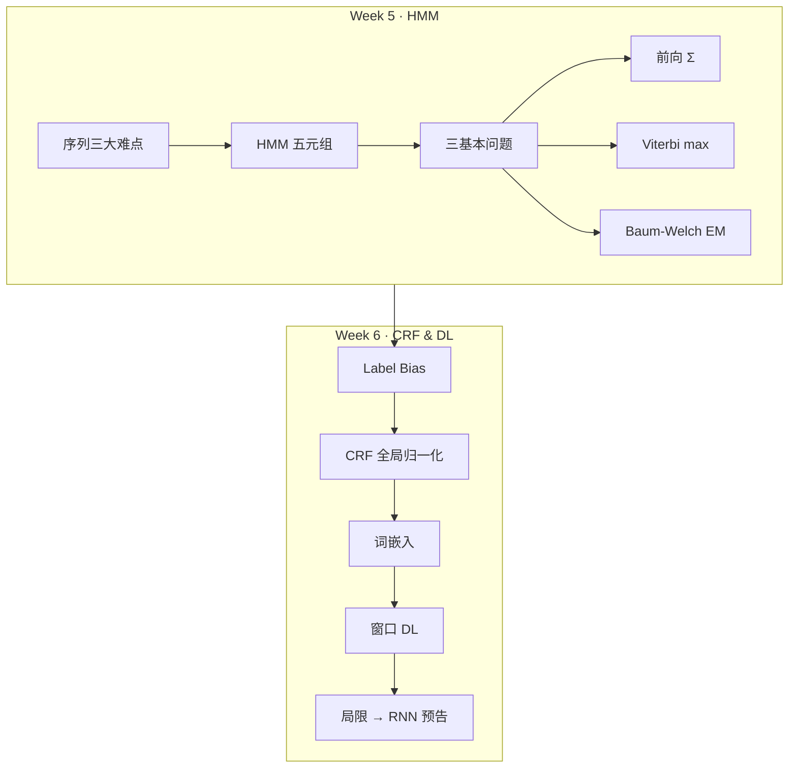

# Week 5–6 学习指南：序列建模（HMM / CRF / 早期 DL）

## 0. 术语表

| 术语                                             | 大白话解释                                        | 生活类比                        |
| ---------------------------------------------- | -------------------------------------------- | --------------------------- |
| **序列建模（Sequence modeling）**                 | 输入/输出随时间排列，前后有关联                             | 看电影：不能只看某一帧                 |
| **隐状态（Hidden state）**                       | 看不见但决定观测的内部状态                                | 地下室警卫猜天气，只能看主管带不带伞          |
| **观测（Observation）**                         | 能直接看到的数据                                     | 雨伞、汉字、声学信号                  |
| **马尔可夫性（Markov property）**                  | 未来只依赖当前，不依赖更早历史                              | 明天天气主要看今天，不太看前天             |
| **HMM（Hidden Markov Model，隐马尔可夫模型）**        | 状态集、观测集、初始分布、转移矩阵、发射矩阵                       | 一台「先藏状态、再吐符号」的随机机器          |
| **评估问题（Evaluation）**                        | 给定模型，算观测序列出现概率 $P(O \mid \lambda)$                | 「这段话像不像这个模型生成的？」            |
| **解码问题（Decoding）**                          | 给定观测，找最可能的隐状态序列                              | 「每个字最可能是什么词性/分词标签？」         |
| **学习问题（Learning）**                          | 只有观测，估计模型参数                                  | 「没见过隐状态，靠数据反推机器参数」          |
| **前向概率 $\alpha_t(i)$（Forward probability）** | 到时刻 $t$、状态 $i$、且已看到 $O_1\ldots O_t$ 的累积概率    | 走到棋盘第 $t$ 列、站在格子 $i$ 的「到达分」 |
| **维特比 $\delta_t(i)$（Viterbi）**              | 到时刻 $t$、状态 $i$ 的**最优路径**概率                   | 只保留冠军路线，不要所有路线平均分           |
| **Baum-Welch 算法**                           | HMM 的 EM（Expectation-Maximization，期望最大化）学习算法 | 看不见隐状态，用「软计数」反复调参           |
| **标签偏置（Label bias）**                        | 每步局部归一化，路径分数局部连乘，缺少全局统一比较              | 每家门自己算百分制，无法公平比总分           |
| **CRF（Conditional Random Field，条件随机场）**     | 直接建模 $P(Y \mid X)$ 的判别式序列模型                       | 不研究数据怎么生成，只研究怎么标标签          |
| **全局归一化 $Z(X)$（Partition function）**        | 对所有可能标签路径统一归一化                               | 全国统一划线，不是每家门自己算百分制          |
| **特征函数 $\phi_k$（Feature function）**         | 衡量「观测+标签组合」是否匹配的打分项                          | 人工写的「如果…则加一分」模板             |
| **词嵌入（Word embedding）**                     | 把词映射到低维稠密向量                                  | 给每个词一张「属性名片」，相近词靠近          |
| **窗口模型（Window model）**                      | 固定窗口拼接词向量 → FC → Softmax                     | 只看前后几个字，给当前字贴标签             |
| **RNN（Recurrent Neural Network，循环神经网络）**   | 按时间步递推隐藏状态，处理任意长序列                         | 传声筒：每步更新「内部记忆」再输出            |
| **BIES（Begin/Inside/End/Single，分词标签体系）**    | 分词标签：B 词首 / I 词中 / E 词尾 / S 单字词              | 给每个汉字标它在词里的位置               |
| **LSTM（Long Short-Term Memory，长短期记忆网络）**    | 门控机制缓解 RNN 长程依赖                              | Week 6 窗口模型之后的主流 RNN        |

> **同一任务，两套说法**（分词 / 序列标注）
>
> | 范式 | 看见的叫 | 要猜的叫 |
> |------|---------|---------|
> | **HMM**（生成式） | **观测** $O_t$ / $X_t$（汉字、声学帧） | **隐状态** $S_t$（分词时常取 BIES） |
> | **CRF / 窗口 DL**（判别式） | **输入** $X$（字序列） | **标签** $Y$（BIES 等） |
>
> 分词里 HMM 隐状态与 CRF 标签往往是**同一套 BIES**；差别在说法——HMM「先藏状态再发射观测」，CRF/DL「给定 $X$ 直接预测 $Y$」。后文 Week 6 起优先用 **输入 / 标签**，Week 5 HMM 保留 **观测 / 隐状态**。

---

## 1. 叙事线总览

```
起点（Week 3-4）                    终点（Week 7+）
─────────────────────────────────────────────────────────
Softmax 单点分类          →    序列每步分类 + 标签依赖
CNN 自动空间特征          →    Embedding 自动语义特征
BP 端到端训练             →    窗口/RNN 端到端序列训练
独立样本 i.i.d.           →    时间轴上的马尔可夫/全局路径
```

---

## 2. 核心知识

### 2.0 模块全景：Week 5–6 要解决什么？

> **本节叙事线**：
>
> ```
> A. 序列和静态分类有何不同？  →  三大难点：长度、记忆、多尺度
>         ↓
> B. HMM 怎么形式化？          →  五元组 + 三问题全景
>         ↓
> C. 三算法怎么算？            →  前向(Σ) / Viterbi(max) / Baum-Welch(EM)
>         ↓
> D. HMM 哪里不够用？          →  Label Bias、特征僵化
>         ↓
> E. CRF 怎么补？              →  P(Y \mid X) + 全局归一化 + 特征模板
>         ↓
> F. 特征工程太累怎么办？      →  Embedding + 窗口 DL + BP
>         ↓
> G. 窗口还不够？              →  RNN/LSTM/Transformer（预告）
> ```

> **本节要回答**：学完 Week 5–6，你应该能独立完成哪些事？

| 能力                                | 检验方式        |
| --------------------------------- | ----------- |
| 写出 HMM 五元组并解释各矩阵含义                | 闭卷画符号表      |
| 区分评估/解码/学习三问题及对应算法                | 给任务名 → 说算法  |
| 手推前向 $\alpha$ 递推并算 $P(O \mid \lambda)$ | 2 状态 3 步手算  |
| 手推 Viterbi $\delta/\psi$ 并回溯最优路径  | tiny 例完整走通  |
| 解释 Label Bias 与全局归一化              | 用自己的话 + 对比表 |
| 描述窗口模型数据流并与 Week 3 BP 对照          | 画结构图        |
| 说明 One-hot 缺陷与 Embedding 直觉       | 面试口头答       |

**内部结构预告**：

打印版恢复图：这张图保留 HMM 到 CRF / 早期 DL 的模块全景，先看它再进入三算法更顺。



**自检问题**（读完 §2 你应该能回答）：

1. 前向算法和 Viterbi 在 Trellis 上差在哪一个运算符？
2. 为什么 Baum-Welch 需要后向概率而不只要前向？
3. CRF 的 $Z(X)$ 在算什么？
4. 窗口模型的损失如何从 Softmax 层传回 Embedding？

---

### 2.1 Week 5：HMM（Hidden Markov Model，隐马尔可夫模型）

> **本节叙事线**（先建立问题链，再逐个击破）：
>
> ```
> A. 序列三大难点     →  为什么静态分类套路不够用
> B. 马尔可夫 + HMM   →  隐状态/观测、双重随机过程
> C. 五元组 λ         →  把模型写成可计算的参数
> D. 三基本问题全景   →  评估/解码/学习——一切算法的总纲
> E. 前向算法         →  评估：每步 Σ，O(N²T)
> F. 后向算法         →  为学习铺路：αβ 汇合
> G. Viterbi          →  解码：每步 max + 回溯
> H. Baum-Welch       →  学习：EM 软计数
> I. 数值手算附录     →  把公式走通一遍
> ```

#### A. 序列建模的三大难点

> **本节要回答**：相比 Week 3–4 的静态分类，序列任务难在哪？

**静态分类**像给照片贴标签——输入尺寸固定、样本彼此独立；**序列建模**像看电影——长度不定、前后关联、多种节奏叠加。

| 难点        | 大白话             | 直觉例子                        |
| --------- | --------------- | --------------------------- |
| **可变长度**  | 输入/output 长度不固定 | 语音识别：同一句「你好」有人 0.5 秒、有人 2 秒 |
| **长程依赖**  | 远处信息影响当前决策      | 「从小学计算机」→ 远处「小」决定「学」的分法     |
| **多周期信号** | 多种时间尺度规律叠加      | 股价：秒级噪声 + 周级趋势 + 年级周期       |

> **直观理解：自动售货机 vs 餐厅点餐**
>
> 静态分类像售货机——只收固定大小硬币；序列建模像点餐——有人只说「来碗面」，有人报一长串菜名，系统都必须听懂。

**A 节小结**（≤3 条）→ 引出追问「有没有统一的概率框架来处理这类序列？」

1. 序列数据**长度可变**，不能用固定维度输入硬套。
2. 标签/状态往往**前后依赖**，独立分类会丢信息。
3. 现实信号常含**多尺度周期**，需要能沿时间递推的模型。

---

#### B. 马尔可夫性与 HMM 直觉

> **承接 A 节**：A 节说明了序列的难；B 节引入一个**可计算**的简化假设——马尔可夫性，并在此基础上搭建 HMM。

> **本节要回答**：什么是马尔可夫性？HMM 里「隐」和「观测」各指什么？

**马尔可夫性（无后效性）**：未来只依赖当前，不依赖更早历史。

$$P(X_t \mid X_0, \ldots, X_{t-1}) = P(X_t \mid X_{t-1})$$

**HMM = 双重随机过程**：

- **隐状态链**（满足马尔可夫性）：看不见的内部状态
- **观测序列**：由隐状态「发射」出来、能看见的符号

**天气–雨伞例子**：

| 角色  | 含义                  |
| --- | ------------------- |
| 隐状态 | 真实天气（晴/雨）——你在地下室看不见 |
| 观测  | 主管是否带伞——你唯一能看到的证据   |
| 转移  | 今天天气 → 明天天气（马尔可夫）   |
| 发射  | 某种天气下带伞的概率          |

**POS 标注例子**：隐状态 = 词性（NN/VB/DT）；观测 = 具体单词（"The", "dog", "ran"）。

> **追问：观测序列满足马尔可夫性吗？**
>
> **不满足。** 观测之间没有直接的马尔可夫依赖；是**隐状态**马尔可夫，观测只通过当前隐状态与发射概率 $b_i(v_j)=P(O_t=v_j\mid S_t=s_i)$ 关联。别把「看见的字」当成「马尔可夫链」——链在隐标签上。

---

#### C. HMM 五元组

> **承接 B 节**：B 节建立了直觉；C 节把 HMM **完全参数化**，写成可交给算法的五元组。

> **本节要回答**：$\lambda=(S,V,\pi,A,B)$ 每一项是什么？维度多少？

| 符号    | 名称     | 含义                                   | 维度          |
| ----- | ------ | ------------------------------------ | ----------- |
| $S$   | 状态集合   | 所有可能的隐状态                             | $N$ 个状态     |
| $V$   | 观测符号集  | 所有可能出现的观测符号（字母表）                     | $M$ 个符号     |
| $\pi$ | 初始分布   | $P(S_1=i)$                           | $1\times N$ |
| $A$   | 状态转移矩阵 | $a_{ij}=P(S_{t+1}=j\mid S_t=i)$      | $N\times N$ |
| $B$   | 发射概率矩阵 | $b_i(v_j)=P(O_t=v_j\mid S_t=s_i)$；固定状态 $s_i$，对观测 $v_j\in V$ 的条件概率 | $N\times M$ |

> **符号区分：$V$ vs $\mathbf{O}$**
>
> - **$V$**（五元组成员）：观测**符号集**——模型能「吐」出哪些符号，如 $V=v_1,v_2$。
> - **$\mathbf{O}=(O_1,\ldots,O_T)$**（三基本问题的输入）：一条具体的观测**序列**——某次实际看到的一串符号，如 $\mathbf{O}=v_1,v_2,v_1$，其中每个 $O_t\in V$。
>
> 课件有时把符号集也记作 $O$，与序列混用同一字母；**本指南五元组用 $V$、序列用 $\mathbf{O}$**，与 §2.1-I 手算例及 Rabiner 惯例一致。

**约束**：$A$ 每行和为 1（局部归一化之一）；$B$ 每行和为 1；$\pi$ 所有分量之和为 1。

> **$A$ 怎么读？（行 = 当前状态，列 = 下一状态）**
>
> $A$ 是 $N\times N$ 矩阵：**行** $i$ = 当前时刻隐状态 $s_i$（$S_t$），**列** $j$ = 下一时刻隐状态 $s_j$（$S_{t+1}$）。条目 $a_{ij}=P(S_{t+1}=j\mid S_t=i)$，手算时可记作 $A[i][j]$（行、列均 1-based）。
>
> $$A=\begin{pmatrix} a_{11} & a_{12} & \cdots \\ a_{21} & a_{22} & \cdots \\ \vdots & \vdots & \ddots \end{pmatrix},\quad a_{ij}=P(s_i \to s_j)$$
>
> - **下标顺序**：$a_{ij}$ 里**第一个**下标 $i$ 对应**行**（从哪出发），**第二个** $j$ 对应**列**（到哪去）。
> - **每行和为 1**：给定**当前**在 $s_i$，下一步落到各个 $s_j$ 的概率分布合法——「站在这个状态，接下来会跳去哪」。
>
> **查表口诀**（前向 / Viterbi / Baum-Welch 通用）：**出发定行，到达定列**。从 $s_i$ 一步转移到 $s_j$ 的因子 $=a_{ij}=A[i][j]$。例：手算例 $A=\begin{pmatrix}0.6&0.4\\0.3&0.7\end{pmatrix}$ 中，$a_{12}=0.4$ 表示 $s_1\to s_2$；Viterbi 递推 $\delta_t(i)\cdot a_{ij}$ 即「$t$ 时刻最优地在 $s_i$」乘「$s_i\to s_j$」。
>
> **常见误读**：把列当成「当前」、行当成「下一时刻」，于是 $s_1\to s_2$ 误查 $A[2][1]=0.3$——错；应查 $A[1][2]=a_{12}=0.4$。

> **$B$ 怎么读？（行 = 状态，列 = 符号）**
>
> $B$ 是 $N\times M$ 矩阵：**行** $i$ = 隐状态 $s_i$，**列** $j$ = 观测符号 $v_j\in V$。每个条目都是**固定状态**下的条件概率：
>
> $$b_i(v_j)=P(O_t=v_j\mid S_t=s_i)$$
>
> 手算时同一量也记作 $B[i][j]$（行、列均 1-based）。例：手算例 $B=\begin{pmatrix}0.8&0.2\\0.4&0.6\end{pmatrix}$ 中，$b_1(v_1)=0.8$、$b_1(v_2)=0.2$（**给定** $s_1$）；$b_2(v_1)=0.4$、$b_2(v_2)=0.6$（**给定** $s_2$）。
>
> $$B=\begin{pmatrix} b_1(v_1) & b_1(v_2) & \cdots \\ b_2(v_1) & b_2(v_2) & \cdots \\ \vdots & \vdots & \ddots \end{pmatrix}$$
>
> - **本质**：每一行 = 固定 $s_i$，在不同观测 $v_j$ 上的条件概率分布。
> - **每行和为 1**：$\sum_{v_j\in V} b_i(v_j)=1$——「藏在这个状态里，会吐出哪个符号」。
> - **不是**「某个观测符号被所有隐状态发射的概率和为 1」；后者相当于按**列**归一化，不是本课 HMM 的 $B$。
>
> **查表口诀**（前向 / Viterbi / Baum-Welch 通用）：**状态定行，观测定列**。时刻 $t$ 观测到 $O_t=v_j$、隐状态为 $s_i$ 时，发射因子 $=b_i(v_j)=B[i][j]$。例：$O_1=v_1$ 时 $\delta_1(i)=\pi_i\cdot b_i(v_1)=\pi_i\cdot B[i][1]$。
>
> **常见误读**：把行当成 $V$、列当成 $S$，于是写 $\delta_1(2)=\pi_2\cdot B[1][2]$——错；$B[1][2]$ 是 $b_1(v_2)$（$s_1$ 下发 $v_2$），而 $\delta_1(2)$ 应取 $B[2][1]=b_2(v_1)$。
>
> **追问：观测一定来自某个状态，为何每列和不必为 1？**
>
> 「一定来自某个状态」说的是**生成顺序**：先**定**隐状态 $S_t=s_i$，再**按该行** $b_i(\cdot)$ 掷出 $O_t$——所以约束加在「已知 $S_t$」这一侧，即**每行**和为 1。
>
> 第 $j$ 列的和 $b_1(v_j)+b_2(v_j)+\cdots$ 是把 $b_i(v_j)=P(O=v_j\mid S=s_i)$ 在**不同条件 $s_i$** 下直接相加。这些不是互斥划分，不能直接加。手算例 $v_1$ 列：$b_1(v_1)+b_2(v_1)=0.8+0.4=1.2\neq 1$。
>
> 若问「看到 $O_t=v_j$ 的总概率」，应对**状态**加权边缘化，而不是对列求和：
> $$P(O_t=v_j)=\sum_{i=1}^{N} P(S_t=s_i)\cdot b_i(v_j)=\sum_i \pi_i\,b_i(v_j)\ \text{（$t=1$）}$$
> 前向算法里 $\alpha_t(j)$ 已含「到 $t$ 时刻、在 $s_j$、且观测吻合」的权重，终止时 $\sum_j \alpha_T(j)=P(\mathbf{O}\mid\lambda)$ 才是整条序列的似然。

**生成过程**（给定 $\lambda$，如何「造」一条序列）：

1. 按 $\pi$ 抽 $S_1$
2. 按 $B$ 中 $S_1$ 行发射 $O_1$
3. 按 $A$ 中 $S_t$ 行转移到 $S_{t+1}$
4. 按 $B$ 发射 $O_{t+1}$
5. 重复至长度 $T$

> **直观理解：饮料机**
>
> 机器内部有若干「隐藏档位」（状态），档位之间按 $A$ 跳转，每个档位按 $B$ 吐出不同口味（观测）。你只能尝到饮料，看不见档位——但可以用 HMM 反推最可能的档位序列。

**C 节小结** → 五元组写全了，接下来：**给定 $\lambda$ 与一条观测序列 $\mathbf{O}$，我们能问哪三类问题？**

---

#### D. HMM 三基本问题全景 ★

> **承接 C 节**：参数 $\lambda$ 已就绪。在推**任何**算法公式之前，必须先看清三张「问题地图」——后文前向/Viterbi/Baum-Welch 全是这三问题的具体解法。

> **本节要回答**：评估、解码、学习各自输入什么、输出什么、用什么算法？

| 基本问题                | 输入                          | 输出                         | 算法                  | 实际任务            |
| ------------------- | --------------------------- | -------------------------- | ------------------- | --------------- |
| **评估 (Likelihood)** | $\lambda$、观测序列 $\mathbf{O}$ | $P(\mathbf{O}\mid\lambda)$ | **前向** / 后向         | 句子像不像该模型？模型对比   |
| **解码 (Decoding)**   | $\lambda$、观测序列 $\mathbf{O}$ | 最优隐状态序列 $I^*$              | **Viterbi**         | 分词、词性标注、语音识别    |
| **学习 (Learning)**   | 观测序列 $\mathbf{O}$（隐状态未知）    | 最优 $\lambda$               | **Baum-Welch (EM)** | 从数据估计 $A,B,\pi$ |

> 上表中的 $\mathbf{O}=(O_1,\ldots,O_T)$ 是**序列**，不是五元组里的符号集 $V$。$P(\mathbf{O}\mid\lambda)$ 中的 $O_t$ 是序列第 $t$ 个符号，必满足 $O_t\in V$。

> 打印提示：完整版此处为流程图；打印版保留为文字复习线索。
> 评估 · 前向 → α_t 递推 → 每步 Σ 求和 → 解码 · Viterbi → δ_t 递推 → 每步 max 取优

> **追问：为什么评估和解码不能混用同一个递推？**
>
> 评估要**边缘化**隐状态——所有可能路径的 probability mass 都要累加（Σ），得到观测的总概率。解码要**寻优**——只保留概率最大的那条路径（max）。数学目标不同：$P(O)=\sum_{\text{paths}} P(O,\text{path})$ vs $\arg\max_{\text{path}} P(\text{path}\mid O)$。

**D 节小结** → 三问题地图已就位；先解**评估**——前向算法。

---

#### E. 前向算法

> **承接 D 节**：评估问题 = 算 $P(O\mid\lambda)$。穷举 $N^T$ 条路径不可行；前向算法用动态规划降到 $O(N^2T)$。

> **本节要回答**：$\alpha_t(i)$ 是什么？初始化、递推、终止公式各是什么？

**符号（与 C 节五元组一致）**：

| 符号 | 含义 |
|------|------|
| $t$ | 时间步，$t=1,\ldots,T$（观测序列长度） |
| $i,\,j$ | **隐状态编号**，$i,j\in\{1,\ldots,N\}$；$s_i$、$s_j$ 表示第 $i$、$j$ 个隐状态 |
| $X_t=s_i$ | 时刻 $t$ 隐状态**恰好**为 $s_i$ |
| $O_t$ | 时刻 $t$ 观测到的符号（$O_t\in V$） |
| $\pi_i$ | 初始分布：$P(X_1=s_i)$ |
| $a_{ij}$ | 转移概率：$P(X_{t+1}=s_j \mid X_t=s_i)$；查 $A$ 第 $i$ 行、第 $j$ 列（§C） |
| $b_i(O_t)$ | 发射概率：$b_i(O_t)=P(O_t\mid S_t=s_i)$；若 $O_t=v_j$ 则 $=b_i(v_j)=B[i][j]$（§C） |

**定义**：

$$\alpha_t(i) = P(O_1, O_2, \ldots, O_t,\; X_t=s_i \mid \lambda)$$

读作：在模型 $\lambda$ 下，**到时刻 $t$ 为止**已看到观测 $O_1,\ldots,O_t$，且**当前**隐状态为 $s_i$ 的联合概率。

**三步**：

1. **初始化**（$t=1$）——只有一步观测，当前状态为 $s_i$：
  $$\alpha_1(i) = \pi_i \cdot b_i(O_1)$$
  $\pi_i$：一开始就在 $s_i$；$b_i(O_1)$：在 $s_i$ 时发出 $O_1$。
2. **递推**（$t=1,\ldots,T-1$）——从**所有**前一状态 $s_i$ 汇总到 $s_j$：
  $$\alpha_{t+1}(j) = \Big[\sum_{i=1}^{N} \alpha_t(i)\cdot a_{ij}\Big]\cdot b_j(O_{t+1})$$
  - 方括号内：$\sum_i$ 对**所有**可能的前驱 $s_i$ 求和（边缘化 $X_t$）
  - $a_{ij}$：$s_i \to s_j$ 的转移；$b_j(O_{t+1})$：在 $s_j$ 发出新观测 $O_{t+1}$
3. **终止**——$t=T$ 时隐状态可在任意 $s_i$，再求和：
  $$P(O\mid\lambda) = \sum_{i=1}^{N} \alpha_T(i)$$

**复杂度**：$T$ 个时间步 × 每层 $N$ 个状态 × 每个状态来自 $N$ 个前驱 → **$O(N^2T)$**。

对比穷举 $O(TN^T)$：前向利用马尔可夫性，**不重复计算**共享子路径。

---

#### F. 后向算法

> **承接 E 节**：前向只看「过去→现在」；学习问题还需要「现在→未来」——后向概率 $\beta$。

> **本节要回答**：$\beta_t(i)$ 是什么？它如何与前向汇合？

**符号（与 E 节前向一致；后向特有项见末行）**：

| 符号 | 含义 |
|------|------|
| $t$ | 时间步，$t=1,\ldots,T$；后向递推从 $T$ **往回**推到 $1$ |
| $i,\,j$ | **隐状态编号**，$i,j\in\{1,\ldots,N\}$；$s_i$、$s_j$ 表示第 $i$、$j$ 个隐状态 |
| $X_t=s_i$ | 时刻 $t$ 隐状态**恰好**为 $s_i$ |
| $O_t$ | 时刻 $t$ 观测到的符号（$O_t\in V$） |
| $O_{t+1}$ | **下一时刻**观测；递推式里固定用「当前步 $t$ 的下一步」观测 |
| $a_{ij}$ | 转移概率：$P(X_{t+1}=s_j \mid X_t=s_i)$（$s_i\to s_j$）；查 $A[i][j]$（§C） |
| $b_j(O_{t+1})$ | **发射概率**：$P(O_{t+1} \mid X_{t+1}=s_j)$——隐状态在 **$t+1$ 时刻为 $s_j$** 时，观测到符号 $O_{t+1}$ 的概率 |
| $\beta_t(i)$ | 后向概率（见下定义）；$\beta_{t+1}(j)$ 为**后继状态** $s_j$ 在 $t+1$ 时刻的值 |

> **$b_j(O_{t+1})$ 怎么读？** 下标 $j$ 标的是**谁发出**：状态 $s_j$；括号里是**发出什么**：时刻 $t+1$ 的观测 $O_{t+1}$。与前向递推里的 $b_j(O_{t+1})$ 是同一个量——前向「走到 $s_j$ 再乘发射」，后向「先到 $s_j$、发出 $O_{t+1}$、再继续往后」。

**定义**：

$$\beta_t(i) = P(O_{t+1}, \ldots, O_T \mid X_t=s_i,\; \lambda)$$

读作：已知 $t$ 时刻隐状态为 $s_i$，**从 $t+1$ 到 $T$** 还将看到观测 $O_{t+1},\ldots,O_T$ 的条件概率（不含 $O_1,\ldots,O_t$）。

**初始化**（$t=T$，后面没有观测了）：

$$\beta_T(i)=1$$

> **直观理解：为什么全是 1？**
>
> 把定义代进去：$t=T$ 时，$\beta_T(i)$ 问的是「$O_{T+1},\ldots,O_T$」——下标从 $T+1$ 到 $T$，**一条观测都没有**，是**空序列**。
>
> 空序列一定会「被观测到」（没有东西可看 = 必然成立），所以
> $$P(\text{（后面没有观测）}\mid X_T=s_i,\lambda)=1$$
> 与 $i$ 无关，故每个状态都是 1。
>
> **递推自检**（$t=T-1$ 时只剩一步未来观测 $O_T$）：
> $$\beta_{T-1}(i)=\sum_j a_{ij}\,b_j(O_T)\,\underbrace{\beta_T(j)}_{=1}=\sum_j a_{ij}\,b_j(O_T)$$
> 这正是「在 $T-1$ 时刻处于 $s_i$，下一步转移到某 $s_j$ 并发出 $O_T$」的概率——若 $\beta_T\neq 1$，这一步就会多乘或少乘因子，递推从终点就错了。
>
> **类比**：前向在 $t=1$ 用 $\pi_i\cdot b_i(O_1)$ 起步；后向在 $t=T$ 用「未来为空 → 概率 1」收尾，对称地作为递推的**边界条件**。

**递推**（$t=T-1,\ldots,1$）——从 $t+1$ 的所有后继 $s_j$ 回传：

$$\beta_t(i) = \sum_{j=1}^{N} a_{ij}\, b_j(O_{t+1})\, \beta_{t+1}(j)$$

- $a_{ij}$：先到 $s_j$；$b_j(O_{t+1})$：在 $s_j$ 发出 $O_{t+1}$；$\beta_{t+1}(j)$：从 $s_j$ 继续看完剩余观测

> **递推为什么长这样？（三步拆）**
>
> **① 对「下一步隐状态」枚举求和**（全概率公式）
> $\beta_t(i)$ 问的是：固定在 $t$ 时刻为 $s_i$，后面观测 $O_{t+1},\ldots,O_T$ 的概率。
> 下一步隐状态 $X_{t+1}$ 可以是 $s_1,\ldots,s_N$ 中任意一个，所以要**对所有 $j$ 求和**，不能只看一条路：
> $$\beta_t(i)=\sum_{j=1}^{N} P(O_{t+1},\ldots,O_T,\; X_{t+1}=s_j \mid X_t=s_i,\lambda)$$
>
> **② 链式法则：先转移，再谈后面观测**
> 每一项拆成「$s_i\to s_j$ 这一步」×「到了 $s_j$ 之后还剩什么」：
> $$P(\cdots)=\underbrace{P(X_{t+1}=s_j\mid X_t=s_i)}_{a_{ij}}\cdot P(O_{t+1},\ldots,O_T\mid X_{t+1}=s_j,\,X_t=s_i,\lambda)$$
> 已知 $X_{t+1}=s_j$ 后，**更前面的** $X_t=s_i$ 不再影响未来（马尔可夫性），第二个因子可写成 $P(O_{t+1},\ldots,O_T\mid X_{t+1}=s_j,\lambda)$。
>
> **③ 把「第一个未来观测」单独拎出来**
> 未来序列 = 「$t+1$ 时刻的观测 $O_{t+1}$」+ 「$t+2$ 以后的观测」：
> $$P(O_{t+1},\ldots,O_T\mid X_{t+1}=s_j)=\underbrace{P(O_{t+1}\mid X_{t+1}=s_j)}_{b_j(O_{t+1})}\cdot\underbrace{P(O_{t+2},\ldots,O_T\mid X_{t+1}=s_j)}_{\beta_{t+1}(j)}$$
> 第二项正是 $\beta$ 在 $t+1$ 的定义（只是下标整体往后挪了一位）。
>
> 三步合起来就是递推式。记忆口诀：**在 $s_i$ 站定 → 对所有后继 $s_j$ 求和 → 每步 = 转移 × 发射 × 更后面的 $\beta$**。
> 和前向对称：前向是「所有前驱 $s_i$ 汇总到 $s_j$」；后向是「从 $s_i$ 扇出到所有后继 $s_j$」。

**汇合**（前向 × 后向 = 整条序列上 $t$ 时刻处于 $s_i$ 的联合概率）：

$$P(O,\; X_t=s_i\mid\lambda) = \alpha_t(i)\cdot\beta_t(i)$$

> **汇合为什么相乘？**
>
> 把整条观测 $O=O_1,\ldots,O_T$ 在时刻 $t$ **切成两半**：
> - $\alpha_t(i)=P(O_1,\ldots,O_t,\;X_t=s_i\mid\lambda)$ —— **过去 + 当前状态**
> - $\beta_t(i)=P(O_{t+1},\ldots,O_T\mid X_t=s_i,\lambda)$ —— **未来**（已知 $t$ 时刻在 $s_i$）
>
> 联合概率 = 「到 $t$ 为止」×「$t$ 之后」（链式法则）：
> $$P(O_1,\ldots,O_T,X_t=s_i\mid\lambda)=\alpha_t(i)\cdot\beta_t(i)$$
> 因为 HMM 有马尔可夫性：一旦知道 $X_t=s_i$，**未来的观测与更早的历史无关**，所以 $\beta_t(i)$ 里不必再写 $O_1,\ldots,O_t$。
>
> 对全部 $i$ 求和 $\sum_i \alpha_t(i)\beta_t(i)$ 可验证等于 $P(O\mid\lambda)$（与前向终止式一致）。

**为何学习需要两者？**

- 仅有前向 = 只用 $t$ 之前的信息（滤波）
- Baum-Welch 的 E 步要算 $\gamma_t(i)=P(X_t=s_i\mid O,\lambda)$——需要**整条观测**校正当前状态
- 例：语音识别里，后面的音节能帮助判断当前音素

---

#### G. 维特比算法（Viterbi）

> **承接 E/F 节**：评估用 Σ；解码用 **max**。结构同 Trellis，运算符换成取最大值并记回溯指针。

> **本节要回答**：$\delta_t(i)$ 和 $\psi_t(i)$ 是什么？如何回溯最优路径？

**核心变量**：

| 符号            | 含义                                 |
| ------------- | ---------------------------------- |
| $\delta_t(i)$ | 时刻 $t$ 处于状态 $i$ 的**最优路径**概率        |
| $\psi_t(i)$   | 达到 $\delta_t(i)$ 时，$t-1$ 时刻的最优前驱状态 |

**递推**：

$$\delta_1(i) = \pi_i \cdot b_i(O_1)$$

$$\delta_{t+1}(j) = \max_{1\le i\le N}\big[\delta_t(i)\cdot a_{ij}\big]\cdot b_j(O_{t+1})$$

$$\psi_{t+1}(j) = \arg\max_{1\le i\le N}\big[\delta_t(i)\cdot a_{ij}\big]$$

**终止**：$P^*=\max_i \delta_T(i)$，$\hat{X}_T=\arg\max_i \delta_T(i)$

**回溯**：$\hat{X}_t = \psi_{t+1}(\hat{X}_{t+1})$，从 $T$ 倒推到 1

**前向 vs Viterbi 对比表**：

| 特性   | 前向算法                 | 维特比算法                    |
| ---- | -------------------- | ------------------------ |
| 解决问题 | 评估 $P(O\mid\lambda)$ | 解码 $\arg\max P(I\mid O)$ |
| 每步运算 | **求和 Σ**（边缘化）        | **取 max**（寻优）            |
| 输出   | 标量概率                 | 一条状态序列 + 回溯指针            |
| 物理直觉 | 大合唱：所有路径都贡献          | 淘汰赛：只留冠军                 |

**Tiny 手算例**（与 §2.1-I 共用同一 $\lambda$）：

模型：$N=2$，$V=\{v_1,v_2\}$，$\mathbf{O}=\{v_1,v_2,v_1\}$，$\pi=[0.5,0.5]$，$A=\begin{pmatrix}0.6&0.4\\0.3&0.7\end{pmatrix}$，$B=\begin{pmatrix}0.8&0.2\\0.4&0.6\end{pmatrix}$

| $t$ | $\delta_t(1)$                    | $\psi$ | $\delta_t(2)$                    | $\psi$ |
| --- | -------------------------------- | ------ | -------------------------------- | ------ |
| 1   | $0.5\times0.8=0.4$               | —      | $0.5\times0.4=0.2$               | —      |
| 2   | $\max(0.24,0.06)\times0.2=0.048$ | 1      | $\max(0.16,0.14)\times0.6=0.096$ | 1      |
| 3   | $0.02304$                        | 1      | $\mathbf{0.02688}$               | 2      |

> **$t=1$ 查表**：$O_1=v_1$ → 取 $B$ 第 1 列；$\delta_1(1)=\pi_1\cdot B[1][1]$，$\delta_1(2)=\pi_2\cdot B[2][1]$。详见 §C「$B$ 怎么读」。

最优终止状态 $s_2$；回溯：$t=3\to s_2$，$\psi_3(2)=2\to t=2$ 为 $s_2$，$\psi_2(2)=1\to t=1$ 为 $s_1$。

**最优路径**：$s_1 \to s_2 \to s_2$，概率 $P^*=0.02688$。

---

#### H. Baum-Welch 算法（EM）

> **承接 G 节**：解码找最优路径；但若**参数未知**，需要学习问题——Baum-Welch = HMM 上的 EM。

> **本节要回答**：E 步和 M 步各算什么？为什么需要 $\gamma$ 和 $\xi$？

**核心直觉：从硬计数到软期望**

- 若隐状态已知：$a_{ij}$ 更新 = 「$i\to j$ 次数」/「从 $i$ 出发次数」——直接数数
- 隐状态未知：用当前 $\lambda$ 算**期望次数**（软计数），再当真实计数更新

> **后验概率是什么？**
>
> **结论**：后验 = **已经看到整条观测 $\mathbf{O}$ 之后**，再回头问「$t$ 时刻隐状态是什么」的概率。$\gamma$、$\xi$ 都是后验。
>
> | | 先验 | 后验 |
> |---|------|------|
> | 时机 | 看观测**前** | 看观测**后** |
> | HMM 例 | $\pi_i$、$a_{ij}$、$b_j(O_t)$ 按模型猜 | $\gamma_t(i)=P(X_t=s_i\mid\mathbf{O})$ |
>
> - $\alpha_t(i)$：只用 $O_1\ldots O_t$（过去）；$\beta_t(i)$：只用 $O_{t+1}\ldots O_T$（未来）
> - $\gamma_t(i)\propto\alpha_t(i)\beta_t(i)$：**过去 + 未来**都看完后的后验——Baum-Welch 用它当软标签更新参数
>
> **「状态占用」「转移占用」是什么？**
>
> **结论**：「占用」= **软计数**——不用 0/1 硬数「在不在」，用后验概率当期望份额。
>
> | 名字 | 符号 | 在数什么 |
> |------|------|---------|
> | **状态占用** | $\gamma_t(i)$ | 时刻 $t$，$s_i$ 被占着的后验概率 |
> | **转移占用** | $\xi_t(i,j)$ | 时刻 $t$ 在 $s_i$ 且 $t{+}1$ 在 $s_j$ 的后验概率 |
>
> 若隐状态已知就数次数；未知则用 $\gamma,\xi$ 当「期望计数表」交给 M 步。$t\le T-1$ 时 $\gamma_t(i)=\sum_j\xi_t(i,j)$。

**E 步**：先对当前 $\lambda$ 跑完**前向**得 $\alpha$、**后向**得 $\beta$，再算软计数。

**0. 归一化常数**（前向终止已有）：

$$P(\mathbf{O}\mid\lambda)=\sum_{i=1}^{N}\alpha_T(i)$$

**1. 状态占用 $\gamma_t(i)$**——时刻 $t$ 在状态 $s_i$ 的后验概率：

$$\gamma_t(i)=P(X_t=s_i\mid \mathbf{O},\lambda)=\frac{\alpha_t(i)\,\beta_t(i)}{P(\mathbf{O}\mid\lambda)}$$

- 分子：$\alpha_t(i)\beta_t(i)$ 已在 §F 汇合式出现（$t$ 在 $s_i$ 且与整条观测吻合）
- $t=1,\ldots,T$ 都要算；$\sum_i\gamma_t(i)=1$

**2. 转移占用 $\xi_t(i,j)$**——时刻 $t$ 在 $s_i$、$t{+}1$ 在 $s_j$ 的后验概率（**仅 $t=1,\ldots,T-1$**）：

$$\xi_t(i,j)=P(X_t=s_i,\,X_{t+1}=s_j\mid \mathbf{O},\lambda)=\frac{\alpha_t(i)\,a_{ij}\,b_j(O_{t+1})\,\beta_{t+1}(j)}{P(\mathbf{O}\mid\lambda)}$$

| 因子 | 含义 |
|------|------|
| $\alpha_t(i)$ | 到 $t$ 、在 $s_i$、观测 $O_1\ldots O_t$ 吻合 |
| $a_{ij}$ | $t$ 步末从 $s_i\to s_j$ |
| $b_j(O_{t+1})$ | 在 $s_j$ 发出 $O_{t+1}$ |
| $\beta_{t+1}(j)$ | 从 $t{+}1$ 在 $s_j$ 起，后面 $O_{t+2}\ldots O_T$ 吻合 |

- 一致性：$\gamma_t(i)=\sum_{j=1}^{N}\xi_t(i,j)$（$t\le T-1$）；最后一时刻 $\gamma_T(i)$ 无出边，只由 $\alpha_T\beta_T$ 得

**E 步小结**：$\alpha,\beta$ → $P(\mathbf{O})$ → $\gamma,\xi$ → 交给 M 步当软计数。

**M 步**（重估参数）：

> **M 步在干什么？**
>
> **结论**：E 步算出「隐状态**大概**怎么分布」（$\gamma,\xi$）；M 步把这些软计数**当作真计数**，按最大似然**重新估计** $\pi,A,B$——让新参数更能解释观测。
>
> | EM 一步 | 固定什么 | 算什么 |
> |--------|---------|--------|
> | **E 步** | 当前参数 $\lambda$ | 软计数 $\gamma,\xi$ |
> | **M 步** | 软计数 $\gamma,\xi$ | 新参数 $\hat\lambda=(\hat\pi,\hat A,\hat B)$ |
>
> 然后 $\lambda\leftarrow\hat\lambda$，重复 E→M，直到 $P(\mathbf{O}\mid\lambda)$ 几乎不涨。

**若能看见隐状态，M 步就是「数数再除」**（对照理解）：

| 参数 | 完全观测时怎么更新 | M 步把「次数」换成 |
|------|------------------|------------------|
| $\pi_i$ | 开头落在 $i$ 的次数 / 序列条数 | $\hat\pi_i=\gamma_1(i)$ |
| $a_{ij}$ | $i\to j$ 次数 / 从 $i$ 出发次数 | 分子 $\sum_t\xi_t(i,j)$，分母 $\sum_t\gamma_t(i)$ |
| $b_j(k)$ | 在 $j$ 且发出 $k$ 次数 / 在 $j$ 次数 | 分子只对 $O_t=k$ 的 $\gamma_t(j)$ 求和，分母 $\sum_t\gamma_t(j)$ |

**三条更新公式**（分子 = 软计数，分母 = 归一化）：

| 参数 | 公式 | 白话 |
|------|------|------|
| $\hat{\pi}_i$ | $\gamma_1(i)$ | 新初始分布 = 「第 1 步在 $s_i$」的期望占用 |
| $\hat{a}_{ij}$ | $\dfrac{\sum_{t=1}^{T-1}\xi_t(i,j)}{\sum_{t=1}^{T-1}\gamma_t(i)}$ | 从 $s_i$ 出发时，走 $i\to j$ 占了多少**比例** |
| $\hat{b}_j(k)$ | $\dfrac{\sum_{t:\,O_t=k}\gamma_t(j)}{\sum_{t=1}^{T}\gamma_t(j)}$ | 在 $s_j$ 时，观测到 $k$ 占了多少**比例** |

> **$\hat{a}_{ij}$ 怎么读？** 分母：所有时刻「在 $s_i$」的期望次数之和（$t\le T-1$，因为最后一步没有「转出」）。分子：其中「紧接着走到 $s_j$」的期望次数。和 §C 一样：**出发定行 $i$，到达定列 $j$**。
>
> **$\hat{b}_j(k)$ 怎么读？** 分母：所有时刻「在 $s_j$」的期望次数。分子：其中观测恰为 $k$ 的那些时刻——**状态定行 $j$，观测定列 $k$**（与 $b_j(k)$ 查 $B$ 一致）。

**一轮 BW 流程**：

```
固定 λ → E：α,β → γ,ξ  →  M：π̂,Â,B̂  →  λ←λ̂  →  重复
```

迭代使 $P(\mathbf{O}\mid\lambda)$ **单调不降**（只保证局部最优，初值敏感）。Project 手写时注意**对数域**防下溢。

**H 节小结** → Week 5 HMM 三算法闭环完成。HMM 能分词、能语音识别，但有两个结构性痛点——**Label Bias** 和**特征僵化**——这将在 Week 6 引出 CRF。

---

#### I. 附录：前向算法完整数值手算

> **本节要回答**：对给定 tiny 模型，$P(O\mid\lambda)$ 怎么一步步算出来？

**模型**：$S=\{s_1,s_2\}$，$V=\{v_1,v_2\}$（符号集），$\mathbf{O}=\{v_1,v_2,v_1\}$（观测序列），$T=3$

$\pi=[0.5,0.5]$，$A=\begin{pmatrix}0.6&0.4\\0.3&0.7\end{pmatrix}$，$B=\begin{pmatrix}0.8&0.2\\0.4&0.6\end{pmatrix}$

**$t=1$**（$O_1=v_1$）：

- $\alpha_1(1)=0.5\times0.8=0.4$
- $\alpha_1(2)=0.5\times0.4=0.2$

**$t=2$**（$O_2=v_2$）：

- $\alpha_2(1)=[0.4\times0.6+0.2\times0.3]\times0.2=0.3\times0.2=0.06$
- $\alpha_2(2)=[0.4\times0.4+0.2\times0.7]\times0.6=0.3\times0.6=0.18$

**$t=3$**（$O_3=v_1$）：

- $\alpha_3(1)=[0.06\times0.6+0.18\times0.3]\times0.8=0.09\times0.8=0.072$
- $\alpha_3(2)=[0.06\times0.4+0.18\times0.7]\times0.4=0.15\times0.4=0.06$

**结果**：

$$P(O\mid\lambda)=\alpha_3(1)+\alpha_3(2)=0.072+0.06=\mathbf{0.132}$$

---

### 2.2 Week 6：CRF（Conditional Random Field，条件随机场）、词嵌入（Word embedding）与早期序列 DL

> **本节叙事线**：
>
> ```
> A. HMM 为何是生成式？     →  P(X,Y) 与局部归一化
> B. Label Bias 直觉        →  局部归一化 + 路径局部连乘
> C. CRF 入门               →  P(Y \mid X) + 全局 Z(X)
> D. 特征函数               →  模板匹配替代发射矩阵
> E. HMM vs CRF 六维对比    →  一张表收束
> F. 词嵌入                 →  One-hot 的替代
> G. 窗口模型               →  Embedding→FC→Softmax + BP
> H. 早期 DL 局限           →  引出 RNN（了解/预告）
> ```

#### A–B. 全景：从 HMM 局限到 CRF 动机

> **本节要回答**：HMM 为什么是生成模型？Label Bias 怎么来的？

**HMM = 生成模型**：建模联合分布 $P(X,Y\mid\theta)$

- 先按 $\pi,A$ 生成隐状态链 $Y$
- 再按 $B$ 由隐状态发射观测 $X$
- 推断时用贝叶斯：$P(Y \mid X)\propto P(X,Y)$

**局部归一化**：$P(Y,X)$ 分解为连乘的局部条件概率，每个 $P(y_t\mid y_{t-1})$、$P(x_t\mid y_t)$ 各自归一化（行和为 1）。

**Label Bias（标签偏置）**：

> **结论**：HMM 在**每一步**单独把概率归一化（$A$、$B$ 每行和为 1），解码时把这些局部分数**连乘**比路径——**没有**像 CRF 那样用 $Z(X)$ 在**整条路径**上统一比。于是**模型结构**会影响谁赢，而不只是「谁更符合观测」。
>
> **机制（岔路口比喻）**：每个隐状态出发时，必须把 100% 分给所有后继——局部归一化的硬约束。
> - **极端例**：只有 1 条出路 → 转移分被迫为 1，观测再弱也压不过；有 10 条出路 → 每条约 10%，发射证据难翻盘。
> - **注意**：这是说明机制的**极端对比**，不是说你课里的标准 HMM 一定出边数不同。
>
> **全连接 HMM**（$N$ 状态、$A$ 为 $N\times N$）：每个状态都有 $N$ 条出边，**出边数一样多**。此时 Label Bias 仍成立，重点不是「谁分支少」，而是：
> 1. 转移、发射**分步归一化**，路径分数是局部因子连乘；
> 2. 某行转移很尖（如 $a_{ij}\approx 0.9$）时，仍可能**不管观测**都倾向走那条边。
>
> **CRF 怎么修**：所有路径先算总分，再用 $Z(X)$ **一次**归一化——大家在同一把尺下比。

> **课纲注**：Label Bias 在课件中于 HMM 局限处引出，**CRF 的全局归一化解法属 Week 6 核心**。

---

#### C. 线性链 CRF 入门

> **承接 B 节**：Label Bias 来自局部归一化；CRF 换思路——**直接建模 $P(Y \mid X)$**，用**全局归一化**。

> **本节要回答**：CRF 的概率公式长什么样？为何叫判别模型？

**核心公式**：

$$P(Y \mid X) = \frac{1}{Z(X)} \exp\Big(\sum_{k} \lambda_k \phi_k(x, y)\Big)$$

| 符号            | 含义                                |
| ------------- | --------------------------------- |
| $\phi_k(x,y)$ | 第 $k$ 个特征函数：观测 $x$ 与标签序列 $y$ 的匹配度 |
| $\lambda_k$   | 特征权重（可学习）                         |
| $Z(X)$        | 配分函数：对所有可能标签路径 $y'$ 的得分求和归一化      |

**判别 vs 生成**：

|             | HMM（生成）  | CRF（判别）      |
| ----------- | -------- | ------------ |
| 建模对象        | $P(X,Y)$ | $P(Y \mid X)$ |
| 是否建模 $P(X)$ | 是        | 否，专注决策边界     |
| 归一化         | 局部       | 全局 $Z(X)$    |
| 能否生成新 $X$   | 能        | 一般不用于生成      |

**优化目标**：最大化训练数据的**条件对数似然** $\sum \log P(Y \mid X)$。

> **追问：CRF 和 Week 3 的 Softmax 有什么关系？**
>
> Softmax 对**单步**分类做局部归一化；CRF 对**整条标签路径**做全局归一化——分子是某路径的特征得分之和，分母 $Z(X)$ 枚举（或动态规划求）所有路径。可理解为「Softmax 思想在序列路径上的全局版」。

---

#### D. CRF 特征函数与 $Z(X)$

> **本节要回答**：$\phi_k(y_{t-1},y_t,X,t)$ 是什么？$Z(X)$ 在干什么？

**特征函数**：衡量「在位置 $t$，标签配置 $(y_{t-1},y_t)$ 与观测 $X$」是否匹配

- 通常是**二值**（0/1）：匹配则 1，否则 0
- 例：「若 $X_t$=『学』且 $y_t$=B，则 $\phi=1$」

**特征分类**：

| 类型          | 关联                             |
| ----------- | ------------------------------ |
| **Unigram** | 当前观测 $x_t$ 与当前标签 $y_t$         |
| **Bigram**  | 标签转移 $(y_{t-1},y_t)$ + 可选观测上下文 |

**路径得分** = 所有位置、所有触发特征的 $\lambda_k \phi_k$ 之和。

**$Z(X)$ 的作用**：

$$Z(X) = \sum_{Y'} \exp\big(\text{Score}(Y'\mid X)\big)$$

把任意实数得分映射为合法概率（所有路径概率和为 1）。**在整条路径空间归一化**——这正是消除 Label Bias 的关键。

**痛点**：特征模板可任意设计 → 特征空间爆炸（如 5 字窗口组合可达 $8000^5$），人工筛选成本高——这引出 Week 6 的 Embedding。

---

#### E. HMM vs CRF 完整对比

| 比较维度     | HMM                | CRF                  |
| -------- | ------------------ | -------------------- |
| **模型类型** | 生成式 $P(X,Y)$       | 判别式 $P(Y \mid X)$     |
| **归一化**  | 局部（每步行和为 1）        | 全局 $Z(X)$            |
| **特征来源** | 固定 $A,B$；严格马尔可夫    | 可定制特征模板              |
| **典型优点** | 理论严密；EM 训练快；可生成    | 消除 Label Bias；标注准确率高 |
| **典型缺点** | Label Bias；难捕捉长程依赖 | 特征工程贵；$Z(X)$ 计算复杂    |
| **适用场景** | 早期语音识别；数据少         | 分词、POS、NER（DL 前主流）   |

---

#### F. 词嵌入（Word Embedding）

> **承接 D 节**：CRF 靠人工特征模板；Embedding 用**自动学习**的稠密向量替代 One-hot。

> **本节要回答**：One-hot 差在哪？Word2Vec 如何实现分布式表征？

**One-hot 是什么？**

把词表大小为 $|V|$ 的每个词编成一个 **$|V|$ 维向量**：**只有该词对应那一维是 1，其余全是 0**。

例：词表 {狗, 猫, 学} → 狗 $=[1,0,0]$，猫 $=[0,1,0]$，学 $=[0,0,1]$。窗口模型里，输入层常先这样表示每个字，再查表换成 Embedding。

**稀疏 vs 稠密**

| | One-hot | 词嵌入 |
|---|---------|--------|
| **稀疏** | 绝大多数分量是 0（如 50000 维里只有 1 个 1） | — |
| **稠密** | — | 每一维通常都非零（如 300 维里大多是小数） |
| **直觉** | 像「50000 个抽屉里只亮 1 盏灯」 | 像「一张 300 项的属性表，每项都有取值」 |

**One-hot 的问题**：

| 问题    | 直觉                         |
| ----- | -------------------------- |
| 语义孤岛  | 任意两词距离相同——「猫」与「狗」=「猫」与「民主」 |
| 维度灾难  | 词表数万维，极稀疏，难泛化              |
| 无参数共享 | 「猫」→「小猫」等于全新维度，一切重学        |

**分布式表征**：每个词 = **低维稠密**向量（如 300 维；见上表「稠密」），各维可理解为潜在属性（动物性、情感…）

- 「猫」「狗」在「动物性」维度都高 → 向量相近 → **泛化**：学会「猫蹲」有助于理解「狗站」
- Word2Vec 直觉：「通过一个词的邻居了解它」——共现多的词被推近
- 神奇性质：$\vec{king}-\vec{man}+\vec{woman}\approx\vec{queen}$

**与 CRF 的关系**：Embedding 向量 = 自动学到的特征；梯度从任务损失一路回传到嵌入层——**端到端**替代手工模板。

现代混合：**BiLSTM-CRF** = 神经网络抽特征 + CRF 全局解码。

> **与 PJ2 的关系**
> PJ2 在同一**中文分词**任务上实现三条线，对应 Week 5–6 递进：
>
> | PJ2 模块 | 对应周次 / 节 | 你要写什么 |
> |---------|-------------|-----------|
> | **HMM** | Week 5：§2.1 | Baum-Welch 训参 + Viterbi 解码；观测 = 汉字，隐状态 ≈ BIES 标签 |
> | **CRF** | Week 6：§2.2 C–E | 手写特征模板 + $Z(X)$ 全局解码 |
> | **DL 对比** | Week 6：§2.2 F–G | **Embedding 查表**（替代 One-hot/手工特征）+ 窗口或 LSTM；可用 PyTorch 层，**禁** `transformers` 现成封装 |
>
> 实验重点：同一数据上对比三模型，说清 HMM 局部归一化、CRF 全局特征、DL 自动表征各解决什么。面试常问 EM、特征模板、**梯度如何回到 Embedding**。

---

#### G. 窗口模型（早期序列 DL）

> **本节要回答**：窗口模型解决什么？数据流是什么？BP 如何更新 Embedding？

**窗口模型是干什么的？**

> **结论**：把**序列标注**（分词、POS）拆成「看中心字**左右邻字**，猜中心字标签」——用**固定窗口 + 神经网络**替代 CRF 手工特征，用 **Embedding** 自动学上下文表征。

| 痛点 | 窗口模型怎么做 |
|------|--------------|
| CRF 特征要手写、组合爆炸 | 邻字拼成向量 → FC 自动抽特征 |
| One-hot 无语义、难泛化 | 查 Embedding 表得稠密向量 |
| HMM/CRF 训练与 NN 割裂 | 与 Week 3 一样 **BP 端到端** |

**局限**（详见 §H）：窗口外看不见、标签逐步独立 Softmax、无 CRF 式全局路径约束。

**结构**：固定窗口拼接词向量 → 全连接 → Softmax

> 打印提示：完整版此处为流程图；打印版保留为文字复习线索。
> 窗口内各字 → 查表 → Embedding → Concat 拼接 → 全连接 + 激活 → Softmax → 标签概率 → 交叉熵损失

> **「拼接」（Concat）是什么？**
>
> **结论**：把窗口里**每个字的 Embedding 首尾连成一根长向量**，再送入全连接——**排成一排**，不是相加、不是平均。
>
> 例：窗口「狗 蹲 在」，每字向量 50 维 → 拼接后 $x$ 为 **150 维**：
> $$x = [\,\vec{e}_{\text{狗}}\ \|\ \vec{e}_{\text{蹲}}\ \|\ \vec{e}_{\text{在}}\,]$$
> （$\|$ 表示沿维度首尾相接）
>
> | 操作 | 结果 |
> |------|------|
> | **拼接** | 变**更长**（$3\times 50=150$），保留「谁在前谁在后」 |
> | 相加 / 平均 | 长度仍为 50，**分不清**各字贡献 |
>
> 全连接需要固定长度输入；窗口有几个字，就拼成 $w\times d$ 维（窗口宽 $w$，向量维 $d$）。同一字在不同窗口**位置**会落在 $x$ 的不同区段，$W_1$ 对不同区段用不同权重——故模型能区分「左边的狗」和「右边的狗」。

**例：中文分词「狗蹲在墙角」**

- 标注「蹲」时，窗口可能为「狗 蹲 在」
- 标签集 {B, I, E, S} → 目标如「狗/S 蹲/S 在/S 墙/B 角/E」

> **输出与目的**
>
> **结论**：对每个字输出**标签概率分布**（Softmax）；训练时逼近真实 BIES；推理后按标签规则还原分词。
>
> - **单次输出**：窗口中心字的 $\{B,I,E,S\}$ 概率（不是直接输出词串）
> - **整句**：$T$ 个字 → $T$ 次输出；损失常对 $T$ 次 CE **求和/平均**
> - **任务本质**：判别式序列标注——给定邻域上下文，预测**中心字标签 $Y_t$**（勿称 HMM 式「隐状态」；见 §0 术语对照）

**训练（与 Week 3 对照）**：

| 环节  | Week 3 BP          | 窗口模型                   |
| --- | ------------------ | ---------------------- |
| 输出层 | Softmax + CE       | 同左；**序列每个字各做一次**（窗口中心对准该字，各算一次 Softmax + CE） |
| 误差项 | $\delta_{out}=y-t$ | 同左                     |
| 回传  | 链式法则逐层             | 同左，**直到 Embedding 矩阵** |
| 更新  | $W,b$              | $W,b$ **+ Embedding 矩阵** |

> **Embedding 怎么被 BP 更新？和 FC 的 $W$ 有何不同？**
>
> **Embedding 矩阵** $E$：形状 $|V|\times d$（词表 × 向量维）。字 id $i$ 的向量 = **第 $i$ 行** $E[i]$（查表，不是矩阵乘法）。
>
> **前向**：窗口里每个字 id → 取出对应行 → concat → $h=\text{ReLU}(W_1 x+b_1)$ → Softmax → 损失。
>
> **反向**（链式法则与 Week 3 相同，差在最后一环）：
> 1. 输出层：$\delta_{out}=y-t$，照常回传得 $\partial L/\partial W_1,\partial L/\partial b_1$。
> 2. 到 concat 边界：$x$ 各段对应各字的 embedding；$\partial L/\partial E[i]$ = $W_1$ 中**对应列块** × 上游梯度（每个字只更新自己那一行）。
> 3. **与 MLP 权重 $W$ 的区别**：
>
> | | FC 权重 $W_1$ | Embedding 矩阵 $E$ |
> |---|--------------|-------------------|
> | 前向 | 与**整个**输入向量做乘法 | **按 id 取行**（查表） |
> | 谁被更新 | 一次前向里 $W_1$ **每个元素**常有梯度 | **只有窗口里出现过的字**对应行有梯度 |
> | 直觉 | 通用线性变换 | 可训练的「词典」：每个词一行向量，BP 调这些行 |
>
> 同一词在不同句子、不同位置出现，其行梯度**累加**后一次更新（mini-batch 里同理）。`loss.backward()` 时框架对 `nn.Embedding` 自动做上述稀疏行更新。

**代码直觉**：

```python
# 伪代码：窗口模型一步前向
window_ids = [id("狗"), id("蹲"), id("在")]
x = concat([embedding[i] for i in window_ids])  # 拼成长向量
h = relu(W1 @ x + b1)
scores = W2 @ h + b2
probs = softmax(scores)           # 当前字标签分布
loss = cross_entropy(probs, true_label)
loss.backward()                   # 梯度更新 W1,W2,b,embedding
```

---

#### H. 早期 DL 局限与后续预告（了解即可）

> **本节要回答**：窗口模型还差什么？为何需要 RNN？

**三局限**：

1. **标签独立**：每位置单独 Softmax，不显式约束「I 不能跟在 S 后」

> **「CRF 层可补」是什么意思？**
>
> **结论**：NN（窗口 / BiLSTM）只给每字**发射分**（各标签得分）；再加 **CRF 层**学**标签转移分**，对**整条标签路径**做全局解码。
>
> ```
> 字序列 X → NN → 每字标签发射分
>                    + CRF 转移分（相邻标签对）
>                    ↓
>              Viterbi 型 DP 解码 → 最优标签序列 Y
> ```
>
> - 纯窗口：每字 argmax，可能出现 …S, I… 非法路径
> - **BiLSTM-CRF**：NN 自动特征 + CRF 管路径；解码与 HMM Viterbi **同型**（每步 max + 回溯），边权换成「发射分 + 转移分」而非 $a_{ij}\cdot b_j$

2. **固定窗口**：窗口外信息完全阻断，长程依赖无能为力

3. **位置不对称**：同词在不同位置用不同权重片段，参数随窗口宽度膨胀

> **「不同权重片段」是什么？**
>
> 拼接后 $x=[\vec{e}_{\text{左}}\|\vec{e}_{\text{中}}\|\vec{e}_{\text{右}}]$，$W_1$ 的列按区段对应左/中/右。同一 $\vec{e}_{\text{狗}}$ 在**左格**乘 $W_1$ 第 1–$d$ 列，在**中格**乘第 $d{+}1$–$2d$ 列——**同向量、不同列块**。窗口越宽，$W_1$ 列数 $\propto w\times d$，参数膨胀；RNN 用时间步共享权重缓解此问题。

**演进路线（预告，非 Week 6 考试核心）**：

> 打印提示：完整版此处为流程图；打印版保留为文字复习线索。
> 窗口模型 → RNN 内部状态 → LSTM 门控记忆 → Transformer 自注意力

> **RNN 是什么？（相对窗口模型）**
>
> **结论**：不再固定「左右各 $k$ 个字」，而是从左到右**逐步读序列**，维护一个隐藏状态 $h_t$ 当「内部记忆」，每步用**同一套权重**更新——任意长度、参数共享。
>
> $$h_t = f(W_h h_{t-1} + W_x x_t + b),\quad x_t=\text{当前字 Embedding}$$
>
> | 对比窗口模型 | RNN |
> |------------|-----|
> | 只看固定邻域 | 理论上累积**整句左侧**信息 |
> | 窗口变宽 → 参数膨胀 | 每步复用同一 $W_h,W_x$ |
> | 各步相对独立 | $h_t$ 把历史压缩进向量传给下一步 |
>
> **短板**：长序列时梯度消失 → $h_t$ 记不住很远的内容（「传声筒失真」）。

> **LSTM 是什么？（RNN 的改进）**
>
> **结论**：在 RNN 上加**门控**——让网络自己学「记什么、忘什么」，缓解长程遗忘。
>
> | 门（直觉） | 作用 |
> |----------|------|
> | **遗忘门** | 旧记忆里丢掉多少 |
> | **输入门** | 新信息写入多少 |
> | **输出门** | 当前步读出多少 |
>
> 有一条单独的**细胞状态** $c_t$ 当「长期记事本」，$h_t$ 当「当前工作区」。课里 **BiLSTM-CRF** 用双向 LSTM 同时看左右上下文，再交给 CRF 解码。
>
> **仍不如 Transformer**：逐步串行计算慢；再长的记忆仍要压进有限维向量。Week 7+ / Week 12 用**自注意力**直接「全局检索」。

| 阶段          | 解决什么        | 新局限            |
| ----------- | ----------- | -------------- |
| RNN         | 任意长度 + 参数共享 | 梯度消失，实际记忆短     |
| LSTM        | 门控长程记忆      | 串行计算慢          |
| Transformer | 全局注意力 + 并行  | 了解即可，属 Week 7+ |

---

## 3. 重难点与易错点

| 知识点 | 为什么易错 | 正确理解 | 记忆技巧 |
|--------|-----------|---------|---------|
| **评估 vs 解码** | 都用 Trellis、都像动态规划 | 评估算 $P(O\mid\lambda)$（像不像）；解码找 $I^*$（是什么） | 评估看总分，解码找冠军路 |
| **前向 Σ vs Viterbi max** | $\alpha$ 与 $\delta$ 公式极像 | 前向边缘化所有路径；Viterbi 只留最优 | 大合唱 vs 淘汰赛 |
| **生成式 vs 判别式** | 都能做标注 | HMM 建模 $P(X,Y)$ 可生成；CRF 直接 $P(Y \mid X)$ | 背全书 vs 找不同 |
| **局部 vs 全局归一化** | Label Bias 根因不清 | HMM 每步行和=1 强迫分配；CRF 用 $Z(X)$ 全路径竞争 | 各家自扫门前雪 vs 全国统一划线 |
| **发射概率 vs 特征函数** | 都连观测与标签 | 发射是固定 $P(O_t\mid S_t)$；特征可任意上下文模板 | 掷色子 vs 模板匹配 |
| **$V$ vs $\mathbf{O}$** | 五元组与三问题都用「观测」 | $V$=符号集；$\mathbf{O}$=序列，$O_t\in V$ | 字典 vs 一句话 |
| **$A$ 行/列** | 行=下一状态、列=当前状态 | 行=当前 $S_t$、列=下一 $S_{t+1}$；$a_{ij}=A[i][j]$ | 出发定行，到达定列 |
| **$B$ 行/列** | 行=符号、列=状态，或以为每列和为 1 | 行=状态、列=符号；$b_i(v_j)=P(O_t=v_j\mid S_t=s_i)$ | 状态定行，观测定列 |
| **隐状态 vs 标签** | HMM 与 CRF/DL 混称 | HMM：隐状态 $S_t$+观测 $O_t$；CRF/DL：输入 $X$+标签 $Y$ | 生成式藏状态；判别式打标签 |

#### 易错点展开：$A$、$B$ 矩阵的行列与归一化

**$A$（转移）**

- **行 = 当前隐状态 $S_t$，列 = 下一隐状态 $S_{t+1}$**；$a_{ij}=P(S_{t+1}=j\mid S_t=i)$ 在第 $i$ 行、第 $j$ 列。
- **每行和为 1**：固定「现在在哪」，对「下一步去哪」归一化。
- **算法查表**：$\alpha_t(i)\cdot a_{ij}$、$\delta_t(i)\cdot a_{ij}$ 中，$i$ 是**出发**行号，$j$ 是**到达**列号；$s_1\to s_2$ 永远查 $A[1][2]$，不是 $A[2][1]$。

**$B$（发射）**

- **行 = 隐状态 $S$，列 = 观测符号 $V$**；$b_i(v_j)=P(O_t=v_j\mid S_t=s_i)$ 在第 $i$ 行、第 $j$ 列。
- **每行和为 1**：固定 $s_i$，$\sum_{v_j\in V}b_i(v_j)=1$。
- **算法查表**：发射因子 $=b_i(O_t)$；若 $O_t=v_j$ 则 $=b_i(v_j)=B[i][j]$。

#### 易错点展开：前向与 Viterbi 同一步的运算差异

同一条 Trellis 边 $(i\to j)$ 在 $t$ 时刻：

- **前向**：$\alpha_t(i)\cdot a_{ij}$ 对**所有** $i$ **求和**，再乘 $b_j(O_{t+1})$
- **Viterbi**：对所有 $i$ 取 **max**，记录 $\psi$，再乘 $b_j(O_{t+1})$

混用会导致：用 Viterbi 算出的「概率」不是 $P(O)$；用前向的 $\alpha_T$ 最大分量也不等于最优路径。

#### 易错点展开：HMM 的「局部归一化」不止一处

- $A$ 每行和为 1：转移局部归一化
- $B$ 每行和为 1：发射局部归一化

两处叠加 → Label Bias。CRF **不要求**每个位置的中间得分局部和为 1，只在 $Z(X)$ 做一次全局归一化。
