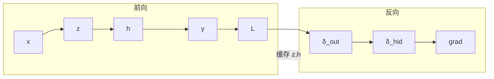

# 学习指南整合规范

> **版本**：v1（2026-06-10）  
> **配套规则**：`.cursor/rules/ai-notebooklm-learning.mdc`  
> **标杆产出**：`guides/AI-Week1-2-学习指南.md`  
> **标杆流程**：`notebooklm-raw/week3-4/knowledge-graph.md`（整合前置知识图谱）

---

## 1. 整合工作流（六阶段）


| 阶段 | 输入 | 输出 | 禁止跳过 |
|------|------|------|---------|
| **1.5 通读** | `runs/<ts>/*.answer.md` 全部 | `notebooklm-raw/<module>/knowledge-graph.md` | ✅ 必须 |
| **2 撰写** | 知识图谱 + raw | `guides/AI-Week*-学习指南.md` 初稿 | — |
| **3 叙事** | 初稿 | 补齐衔接、mermaid、追问块 | ✅ 必须 |

**Phase 1.5 必做三件事**：

1. **通读**该模块全部 `*.answer.md`（不是只看摘要或 Agent 记忆）
2. **审计**：与课纲/14 周索引对照，标注 NotebookLM 偏差
3. **产出知识图谱**：认知阶梯、节点→raw 映射、叙事承接表、mermaid 草图

未完成 Phase 1.5 **不得**开始写指南正文。

---

## 2. 认知编排原则

### 2.1 先「学什么」，再「怎么学」

每个大模块（如 BP、CNN）正文开始前，必须有**全景节**：

| 要素 | 要求 |
|------|------|
| 模块解决什么问题 | 一句话 + 与上周衔接 |
| 学完能做什么 | 3–5 条可检验能力（闭卷推公式 / 写代码 / 面试答什么） |
| 内部结构预告 | 问题链或 mermaid，让读者看见路线 |
| 自检问题 | 「读完本节你应该能回答…」 |

**反例**：直接进入泰勒公式，读者不知道 BP 整体在干什么。  
**正例**：先 §A「BP 全景：两趟车」，再 §B 梯度下降、§C z/h…

### 2.2 认知阶梯（由浅入深）

```
L0 定位与动机（我要学什么、为什么学）
  ↓
L1 全景地图（模块内问题链，无公式或仅一行）
  ↓
L2 符号与概念（术语落地，对比表）
  ↓
L3 推导与机制（公式 + 物理意义 + 代码直觉）
  ↓
L4 数值验证（手算例子）
  ↓
L5 工程流程（训练循环、PJ1 落地）
  ↓
L6 串联（前后周、Project、易错点）
```

整合顺序按**读者认知阶梯**，不是 manifest 采集顺序。

### 2.3 三层叙事（每章必查）

**（1）章级叙事线**——大节开头：

```markdown
> **本节叙事线**：
> A. [能做什么？] → B. [硬边界？] → C. [方案] → …
```

**（2）节级「要回答」**——每子节首行：

```markdown
> **本节要回答**：[一个具体、可检验的问题]
```

**（3）节间衔接**——每节末尾：

```markdown
**A 节小结**（≤3 条）→ 抛出追问「…？」

---

#### B. [下节]
> **承接 A 节**：[A 留下了什么未解决问题；B 为何必要]
```

---

## 3. 语言风格

### 3.1 基调

| 做 | 不做 |
|----|------|
| 完整句、口语化但准确 | 电报式罗列、标题堆砌 |
| 生活类比 + 物理/数学意义 | 只有公式没有「所以 what」 |
| 「你」称呼读者；主动语态 | 「该算法被用于…」被动堆砌 |
| 先直觉后公式 | 先公式后补一句解释 |

### 3.2 固定块格式

| 块类型 | 语法 | 何时用 |
|--------|------|--------|
| **追问** | `> **追问：…**` + 空行 + 解答 | 读者自然会问的「为什么」 |
| **直观理解** | `> **直观理解：…**` | 公式/矩阵/链式法则不直观时 |
| **对比表** | Markdown 表格 | 易混概念对（≥2 组/模块） |
| **代码直觉** |  fenced `python` 片段 | BP、训练循环等与 PJ 相关处 |

### 3.3 来源标注

- 节末或表后：`（来源：Week N 记录、课件 08、PJ1 文档）`
- NotebookLM 与课纲冲突：`> **课纲注**：[说明以 FiCS 记录为准]`
- Agent 补充的桥接内容：不冒充课件，可写「与 Week 2 衔接」

### 3.4 详细程度基准

| 类型 | 深度 |
|------|------|
| **核心**（BP δ、隐层传递、CNN 动机） | 完整推导或分步摘要 + 类比 + 数值例 + 追问 |
| **重要**（训练循环、ReLU、卷积参数） | 机制讲清 + 表 + 一句代码/PJ 对应 |
| **了解**（DL 史、特征层级） | 1–2 段 + 标「了解即可」 |

以 Week 1–2 指南同类型章节为字数与深度参照。

---

## 4. 可视化（Mermaid）规范

### 4.1 何时必须用图

每个模块指南至少包含：

| 图类型 | 用途 | 示例 |
|--------|------|------|
| `flowchart TB/LR` | 认知阶梯、模块衔接、BP 前向/反向 | 知识图谱 §1 |
| `mindmap` | 一章内子主题总览 | 知识图谱 §2 |
| 叙事链（ASCII 或 mermaid） | 章级问题链 | Week 1–2 §2.2 |

### 4.2 作图原则

- **节点文字简短**（≤15 字），细节放正文
- **箭头标注关系**（「缓存 z,h」「误差回传」）
- 同一张图只表达一个层次（不要 BP+CNN+PJ1 挤在一张）
- 指南中的图可从 `knowledge-graph.md` 精炼迁入，保持与正文一致

### 4.3 推荐模板

**BP 两趟车**：



**易混概念**：优先用**对比表**；关系复杂时用 `flowchart` 而非 mindmap。

---

## 5. 文档结构（固定）

```markdown
# Week X–Y 学习指南：[主题]

> 元信息：课程、周次、原始 run 路径、版本日期

## 0. 术语表（大白话 + 类比，🔗）

## 1. 知识地图（L0）
   - 从上周走来 / 本周解决什么
   - mermaid 总览（可选）
   - 子主题清单

## 2. 核心知识
   > **本节叙事线**
   ### 2.1 [模块 A]
   #### A. [全景节 — 必须有]
   #### B. …
   ### 2.2 [模块 B]

## 3. 重难点与易错点（表 + 必要时展开）

## 4. 知识串联（L4）：衔接 / PJ 映射 / 复习优先级

## 5. 资料索引（本地 + raw run）

## 6. Step 4 补充采集说明
```

---

## 6. 从 raw 选取与 Agent 补写

| 动作 | 规则 |
|------|------|
| **选取** | 按 `knowledge-graph.md` 节点映射；核心节点保留 raw 推导步骤 |
| **压缩** | `priority: normal`、L0 重复内容合并去重 |
| **补写** | 全景节、承接句、追问、与前后周桥接——raw 通常没有 |
| **禁止** | 未读 raw 编造公式；粘贴 raw 无叙事；整段 `[1][2]` 引用号进指南 |

---

## 7. 质量 Checklist（整合完成前）

### 流程

- [ ] Phase 1.5 知识图谱已产出且通读 20/20 raw
- [ ] 指南章节与知识图谱节点一一可追溯

### 认知与叙事

- [ ] 每个大模块有**全景节**（BP、CNN 各至少 1 个）
- [ ] 章级叙事线 + 每节「要回答」+ 小结→承接
- [ ] 读者能说出「为什么要学下一节」

### 内容与风格

- [ ] 核心公式有符号表；术语 🔗 术语表
- [ ] ≥2 组易混概念对比表
- [ ] ≥3 处追问/直观理解块
- [ ] ≥3 张 mermaid（或 2 mermaid + 1 ASCII 叙事链）

### 技术

- [ ] 课纲偏差已标注
- [ ] PJ1 映射表完整
- [ ] 资料索引含 raw run 路径

---

## 8. 文件约定

| 文件 | 位置 |
|------|------|
| 知识图谱 | `notebooklm-raw/<module>/knowledge-graph.md` |
| 学习指南 | `guides/AI-Week*-学习指南.md` |
| 采集 manifest | `notebooklm-raw/manifests/<module>.json` |
| 原始回答 | `notebooklm-raw/<module>/runs/<timestamp>/` |

---

*本规范随 Week 5+ 整合经验持续更新。*
