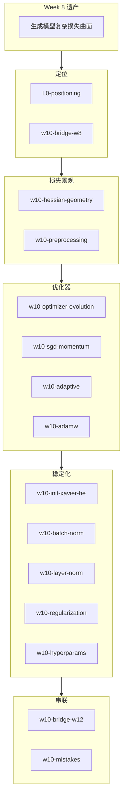
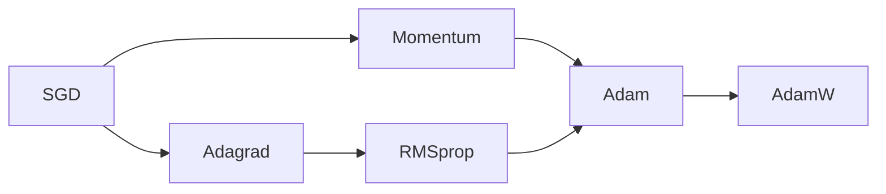

# Week 10 知识图谱（神经网络优化技术）

> **Canonical run**：`runs/20260616-130229/`（16/16）  
> **指南目标**：`guides/AI-Week10-学习指南.md`  
> **生成日期**：2026-06-16

---

## 0. 通读审计摘要

| 项 | 结论 |
|----|------|
| 原始 batch 数 | **16/16** |
| 与课纲一致性 | SGD→AdamW、条件数/海森、白化/标准化、Xavier/He、BN/LN、L2/Dropout/早停、LR 衰减——**全覆盖** |
| 课纲偏差 | `w10-study-order`：课纲原定 Week10 为符号主义/专家系统，**实际为优化综述**（符号主义推后 Week15） |
| 必读 batch | `w10-optimizer-evolution`、`w10-adaptive`、`w10-hessian-geometry`、`w10-init-xavier-he`、`w10-batch-norm`、`w10-layer-norm`、`w10-regularization` |

---

## 1. 读者认知阶梯

**整合铁律**：先海森/条件数建立「为何难优化」，再进优化器；LN 紧接 BN 并引出 W12。

---

## 2. 节点清单

| 节点 ID | 认知目标 | batch | Agent 须补充 |
|---------|---------|-------|-------------|
| `hessian-geometry` | 鞍点/病态峡谷 | `w10-hessian-geometry` | 与 SGD 局限衔接 |
| `optimizer-evolution` | SGD→AdamW 脉络 | `w10-optimizer-evolution` | **7 行总览表** |
| `init-xavier-he` | 方差公式 | `w10-init-xavier-he` | 与 Week4 ReLU 衔接 |
| `batch-norm` | ICS；训练/推理差异 | `w10-batch-norm` | 训练/推理分支图 |
| `layer-norm` | BN vs LN | `w10-layer-norm` | **完整对比表**；Transformer 理由 |
| `regularization` | L2/Dropout/早停 | `w10-regularization` | 三项机制 |

---

## 3. 叙事承接表

| 指南章节 | 要回答 | 承接 | 引出 | raw |
|----------|--------|------|------|-----|
| 损失曲面 | Hessian/鞍点？ | W8 训练难 | 预处理 | `w10-hessian-geometry` |
| 优化器总览 | SGD→AdamW？ | 景观已建立 | SGD 细节 | `w10-optimizer-evolution` |
| Batch Norm | ICS？ | 初始化 | LN | `w10-batch-norm` |
| Layer Norm | 为何 Transformer 用 LN？ | BN 原理 | 正则化 | `w10-layer-norm` |
| 与 W12 前瞻 | Transformer 依赖什么？ | 工具箱齐全 | 易错点 | `w10-bridge-w12` |

---

## 4. batch 映射

| batch | 指南位置 | 深度 |
|-------|---------|------|
| `w10-optimizer-evolution.answer.md` | §2 总览 | **完整 7 行表** |
| `w10-layer-norm.answer.md` | §3.3 | **完整对比表** |
| `w10-mistakes.answer.md` | §6 | **5 组表** |
| `w10-adamw.answer.md` | §2.3 | 进阶 |

---

## 5. 课纲审计

| 课纲条目 | raw | 备注 |
|---------|-----|------|
| 优化器/BN/LN/正则/超参 | ✅ | 完整 |
| 矩阵正交化 | ✅ `w10-adamw` | 进阶 |
| 符号主义排 Week10 | ⚠️ | **以课堂为准** |

**跨周链**：W8↔W10 双向（`w8-bridge-w10` + `w10-bridge-w8`）

---

*下一步：撰写 `guides/AI-Week10-学习指南.md`*
