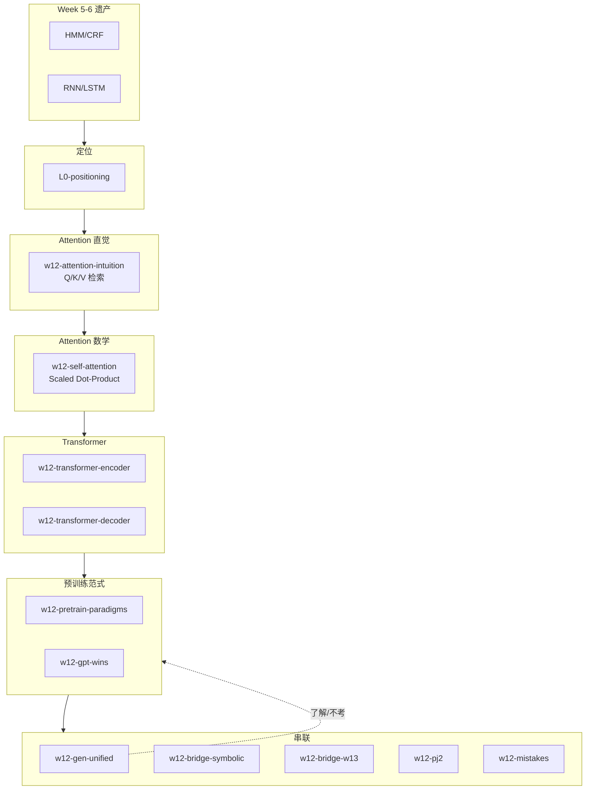

# Week 12 知识图谱（Transformer 与大语言模型）

> **Canonical run**：`runs/20260616-131709/`（14/14）  
> **指南目标**：`guides/AI-Week12-学习指南.md`  
> **生成日期**：2026-06-16

---

## 0. 通读审计摘要

| 项 | 结论 |
|----|------|
| 原始 batch 数 | **14/14** |
| 与课纲一致性 | Q/K/V、Enc/Dec、三预训练范式、GPT 胜出四因、生成统一视角、符号铺垫——**高度一致** |
| 素材缺口 | `w12-bridge-w56` raw 末尾 LSTM 段截断——LSTM 细节回查 Week6 raw |
| 期末关联 | Week12 **非期末主战场**；深度生成模型章节**不考**（Week13 考试说明） |
| 必读 batch | `w12-attention-intuition`、`w12-self-attention`、`w12-transformer-encoder/decoder`、`w12-pretrain-paradigms`、`w12-gpt-wins`、`w12-bridge-w13` |

---

## 1. 读者认知阶梯

**整合铁律**：Q/K/V 直觉在公式前；Enc 双向 vs Dec 因果掩码是 P0 核心。

---

## 2. 节点清单

| 节点 ID | 认知目标 | batch | Agent 须补充 |
|---------|---------|-------|-------------|
| `attn-intuition` | Q/K/V 三步检索 | `w12-attention-intuition` | 图书馆类比 mermaid |
| `self-attention` | softmax(QK^T/√d)V | `w12-self-attention` | **符号表** |
| `enc-layer` | 双向 MHAttn+FFN+残差+LN | `w12-transformer-encoder` | Add&Norm 顺序 |
| `dec-layer` | 因果 Mask+Cross-Attn | `w12-transformer-decoder` | 与 Enc 对比表 |
| `pretrain-3way` | T5/BERT/GPT 差异 | `w12-pretrain-paradigms` | **6 行对比表** |
| `gpt-wins` | KV 缓存/零样本/范式一致 | `w12-gpt-wins` | 四因 bullet |
| `gen-unified` | 流匹配→扩散→VAE | `w12-gen-unified` | **标了解/不考** |
| `bridge-w13` | DL 黑箱 vs 符号 | `w12-bridge-w13` | 课程转折段 |
| `pj2-map` | PJ2 组件与 GPU | `w12-pj2` | 实践节 |

---

## 3. 叙事承接表

| 指南章节 | 要回答 | 承接 | 引出 | raw |
|----------|--------|------|------|-----|
| Attention 直觉 | Q/K/V 各干什么？ | RNN 瓶颈 | 公式 | `w12-attention-intuition` |
| Self-Attention | 五步计算？ | 直觉 | Enc/Dec | `w12-self-attention` |
| Encoder | 双向为何可行？ | 公式 | Decoder | `w12-transformer-encoder` |
| 预训练范式 | T5/BERT/GPT？ | 结构 | GPT 胜出 | `w12-pretrain-paradigms` |
| 符号铺垫 | 语义网络/框架？ | DL 巅峰 | Week13 | `w12-bridge-symbolic` |

---

## 4. batch 映射

| batch | 指南位置 | 深度 |
|-------|---------|------|
| `w12-pretrain-paradigms.answer.md` | §2.3 | **完整 6 行表** |
| `w12-mistakes.answer.md` | §3 | **5 组表** |
| `w12-gen-unified.answer.md` | §2.4 脚注 | 压缩；不考 |
| `w12-pj2.answer.md` | §5 实践 | 完整 |

---

## 5. 课纲审计

| 课纲条目 | raw | 期末 |
|---------|-----|------|
| Transformer/Attention/BERT/GPT | ✅ | 概念/PJ2 |
| 生成统一视角 | ✅ | **不考** |
| 符号铺垫 | ✅ | 为 W13–14 服务 |

---

*下一步：撰写 `guides/AI-Week12-学习指南.md`*
