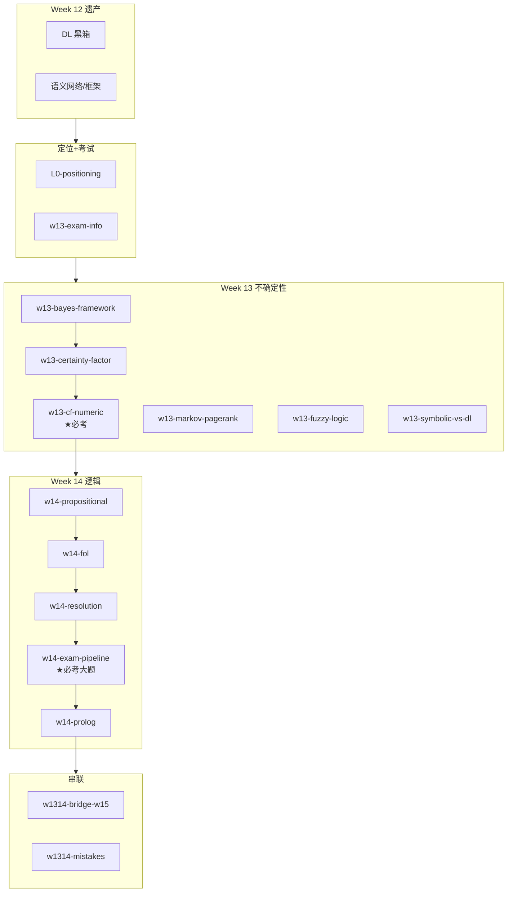

# Week 13–14 知识图谱（不确定性推理 + 逻辑/消解）

> **Canonical run**：`runs/20260616-132939/`（19/19）  
> **指南目标**：`guides/AI-Week13-14-学习指南.md`  
> **生成日期**：2026-06-16

---

## 0. 通读审计摘要

| 项 | 结论 |
|----|------|
| 原始 batch 数 | **19/19** |
| 与课纲一致性 | **高度一致**；两必考点均有独立 batch + 数值/流程 |
| 考试信息 | **开卷、英文**；**CF 计算必考**；**消解大题必考**（NL→FOL→CNF→Resolution）；**深度生成模型不考** |
| 必读 batch | `w13-certainty-factor`、`w13-cf-numeric`、`w14-resolution`、`w14-exam-pipeline`、`w14-prolog`、`w1314-mistakes`、`w1314-study-order` |

---

## 1. 读者认知阶梯

**整合铁律**：`w13-exam-info` 在 Week13 章首；CF 公式→手算→命题逻辑→FOL→CNF 9 步→消解。

---

## 2. 节点清单

### Week 13

| 节点 ID | 认知目标 | batch | 期末 |
|---------|---------|-------|------|
| `exam-info` | 开卷/两必考/不考范围 | `w13-exam-info` | 章首 |
| `cf-theory` | CF(E,e) vs CF(H,E)；AND/OR/NOT | `w13-certainty-factor` | **★必考** |
| `cf-numeric` | 多规则合成手算 | `w13-cf-numeric` | **★必考数值** |
| `bayes-framework` | 先验→后验；L2=高斯先验 | `w13-bayes-framework` | 概念 |
| `symbolic-vs-dl` | 五维对比 | `w13-symbolic-vs-dl` | 概念 |

### Week 14

| 节点 ID | 认知目标 | batch | 期末 |
|---------|---------|-------|------|
| `prop-logic` | 连接词/真值表/局限 | `w14-propositional` | 基础 |
| `fol` | 量词/合一/三段论 | `w14-fol` | 大题前置 |
| `resolution` | CNF 9 步；消解规则 | `w14-resolution` | **★必考** |
| `exam-pipeline` | NL→FOL→CNF→证明 | `w14-exam-pipeline` | **★必考 checklist** |
| `prolog` | 霍恩子句/反向推理 | `w14-prolog` | 概念；W15 对照 |

---

## 3. 叙事承接表

| 指南章节 | 要回答 | 承接 | 引出 | raw |
|----------|--------|------|------|-----|
| 考试须知 | 怎么考？考什么？ | W12 转折 | 贝叶斯/CF | `w13-exam-info` |
| 确定性因子 | 如何合成？ | 贝叶斯太复杂 | **必考手算** | `w13-certainty-factor` |
| CF 手算 | 数值 walkthrough？ | 公式 | PageRank | `w13-cf-numeric` |
| 命题逻辑 | 连接词/局限？ | 符号入门 | FOL | `w14-propositional` |
| 消解原理 | CNF 9 步？ | FOL | **期末大题** | `w14-resolution` |
| 期末流水线 | 三阶段？ | 消解 | Prolog | `w14-exam-pipeline` |
| 通向 W15 | Prolog vs CLIPS？ | 反向推理 | 前向推理 | `w1314-bridge-w15` |

---

## 4. batch 映射

| batch | 指南位置 | 深度 |
|-------|---------|------|
| `w13-exam-info.answer.md` | §1 考试须知 | **章首完整** |
| `w13-cf-numeric.answer.md` | §2.1-D | **★完整数值** |
| `w14-resolution.answer.md` | §2.2-K | **9 步+规则** |
| `w14-exam-pipeline.answer.md` | §2.2-L | **★checklist** |
| `w1314-mistakes.answer.md` | §3 | **5 组表** |

---

## 5. 课纲审计（期末必考）

| 考核点 | raw | 权重 |
|--------|-----|------|
| **确定性因子计算** | `certainty-factor` + `cf-numeric` | ★★★ 必考 |
| **消解证明大题** | `resolution` + `exam-pipeline` | ★★★ 必考 |
| 深度生成模型 | — | **不考** |
| PageRank/模糊逻辑 | ✅ | 概念/选择 |

---

*下一步：撰写 `guides/AI-Week13-14-学习指南.md`*
