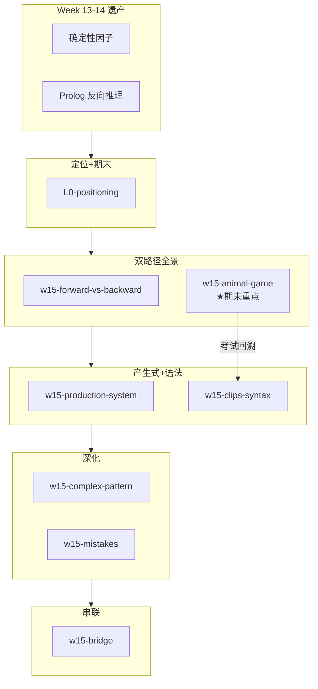
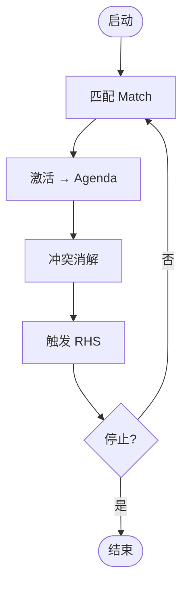

# Week 15 知识图谱（前向推理与 CLIPS）

> **Canonical run**：`runs/20260616-134937/`（8/8）  
> **指南目标**：`guides/AI-Week15-学习指南.md`  
> **生成日期**：2026-06-16

---

## 0. 通读审计摘要

| 项 | 结论 |
|----|------|
| 原始 batch 数 | **8/8** |
| 与课纲一致性 | **高度一致**：期末说明、双路径、产生式三部件、CLIPS 语法、复杂模式、猜动物示例 |
| 素材补充 | `w15-mistakes` 含 Rete 算法——课纲未单列但课件 03 有 |
| 必读 batch | `L0-positioning`、`w15-forward-vs-backward`、`w15-production-system`、`w15-clips-syntax`、`w15-animal-game`（**期末重点**） |

---

## 1. 读者认知阶梯

**整合铁律**：前向 vs 反向对比表在 CLIPS 语法前；猜动物在语法后以综合应用回归。

---

## 2. 节点清单

| 节点 ID | 认知目标 | batch | Agent 须补充 |
|---------|---------|-------|-------------|
| `final-exam-info` | 开卷/英文/PPT/CLIPS 考核 | `L0-positioning` | 与猜动物交叉引用 |
| `forward-vs-backward` | CLIPS vs Prolog 对比 | `w15-forward-vs-backward` | **完整对比表** |
| `production-arch` | 三部件+Agenda | `w15-production-system` | Recognize-Act mermaid |
| `clips-syntax` | 类型/deftemplate/defrule | `w15-clips-syntax` | **语法表+示例** |
| `complex-pattern` | $? / And-Or-Not-Exists | `w15-complex-pattern` | 眼/发色完整规则 |
| `animal-game` | 决策树→事实→交互→学习 | `w15-animal-game` | **★期末核心** |
| `bridge-w1314` | CF+Prolog+符号主义定位 | `w15-bridge` | 全学期回顾 |
| `mistakes` | 4 组易混+Rete | `w15-mistakes` | **对比表** |

---

## 3. 叙事承接表

| 指南章节 | 要回答 | 承接 | 引出 | raw |
|----------|--------|------|------|-----|
| 模块定位 | 收官位置？期末考什么？ | W14 Prolog | 双路径 | `L0-positioning` |
| 双路径对比 | 前向 vs 反向？ | W14 | 产生式架构 | `w15-forward-vs-backward` |
| 产生式架构 | 三部件？Agenda？ | 前向=产生式 | CLIPS 语法 | `w15-production-system` |
| CLIPS 语法 | deftemplate/defrule？ | 架构 | 复杂模式 | `w15-clips-syntax` |
| 猜动物示例 | 交互+学习如何实现？ | 语法齐全 | 为何必考 | `w15-animal-game` |
| 与 W13-14 衔接 | CF/Prolog 如何结合？ | 本周技术 | 全学期回顾 | `w15-bridge` |

---

## 4. batch 映射

| batch | 指南位置 | 深度 |
|-------|---------|------|
| `L0-positioning.answer.md` | §0+期末 | 摘要+考试框 |
| `w15-forward-vs-backward.answer.md` | §1 | **完整对比表** |
| `w15-clips-syntax.answer.md` | §3 | **语法表+代码** |
| `w15-animal-game.answer.md` | §5 ★ | **完整流程+defrule** |
| `w15-mistakes.answer.md` | §7 | **4 组表** |

---

## 5. 课纲审计（期末 CLIPS）

| 考核点 | raw | 优先级 |
|--------|-----|--------|
| 开卷/英文/PPT | `L0-positioning` | P0 |
| 前向 vs 反向 | `w15-forward-vs-backward` | P0 |
| 产生式三部件+循环 | `w15-production-system` | P0 |
| **猜动物**读代码/简答 | `w15-animal-game` | **P0** |
| deftemplate 五约束 | `w15-clips-syntax` | P1 |
| 激活 vs 触发 | `w15-mistakes` | P1 |

---

*下一步：撰写 `guides/AI-Week15-学习指南.md`*
