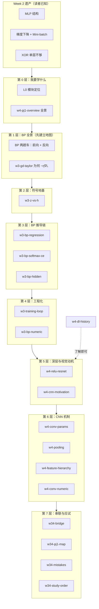
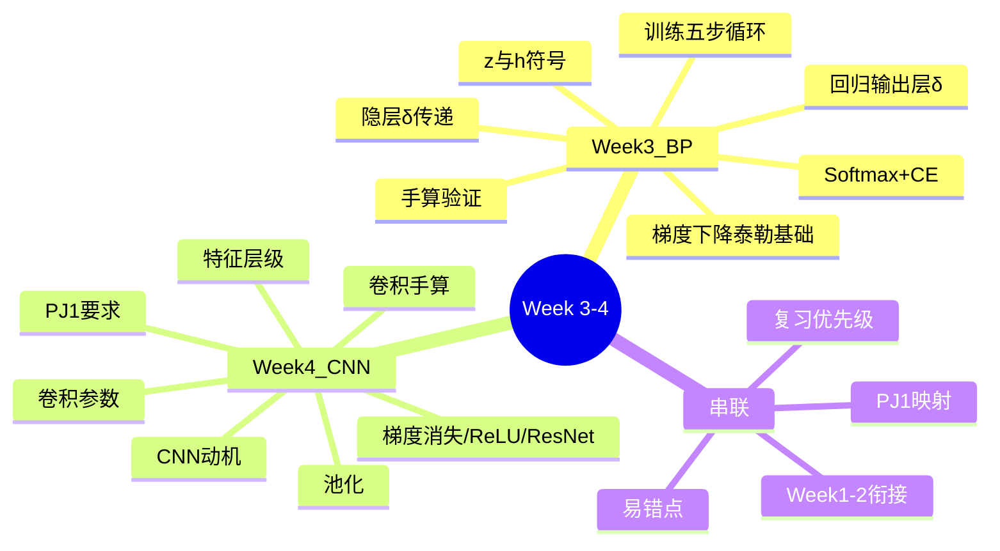
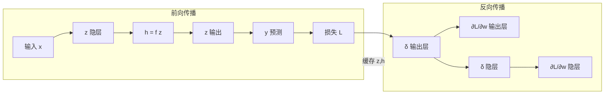
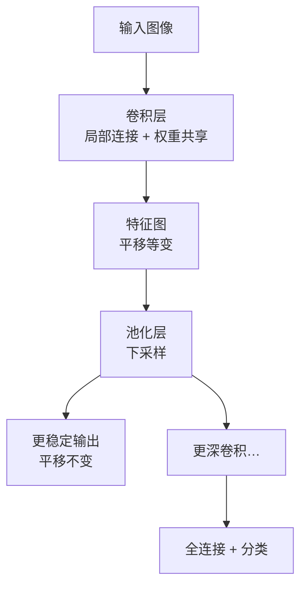
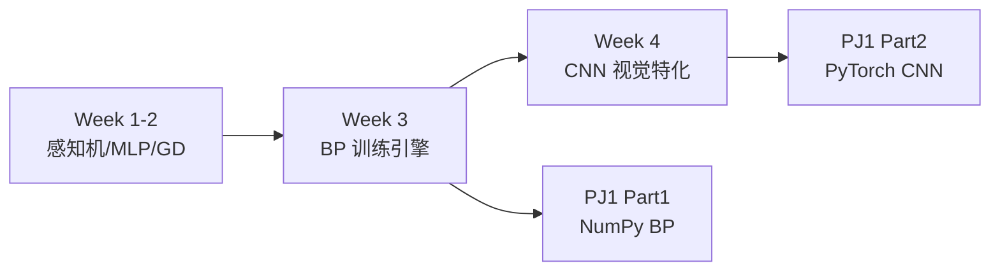

# Week 3–4 知识图谱（整合前置）

> **用途**：Agent 在撰写 `guides/AI-Week3-4-学习指南.md` **之前**必须先通读本文件 + 全部 `runs/20260610-150251/*.answer.md`。  
> **原则**：先建立逐步认知的整体框架，再按节点从原始材料选取、补充衔接与追问。  
> **原始 run**：`notebooklm-raw/week3-4/runs/20260610-150251/`（20 批）  
> **生成日期**：2026-06-10

---

## 0. 通读审计摘要

| 项 | 结论 |
|----|------|
| 原始 batch 数 | 20/20 完成 |
| 与课纲一致性 | `L0-positioning` 将 Week 4 延伸为 HMM/CRF——**以 FiCS 课程记录为准**，Week 4 本模块聚焦 DL 史 + CNN + PJ1；HMM/CRF 属 Week 5+，整合时标注或不展开 |
| 素材覆盖缺口 | 无致命缺口；`w4-dl-history` 深度一般，指南中压缩为「了解即可」 |
| 必读 batch（整合权重） | `w3-bp-*` 全系列、`w3-bp-numeric`、`w4-cnn-motivation`、`w4-conv-*`、`w34-bridge`、`w34-mistakes`、`w34-pj1-map` |

---

## 1. 读者认知阶梯（整合顺序 ≠ 采集顺序）

整合时必须按**读者心智顺序**编排，而非 manifest 时间顺序：

**整合铁律**：第 1 层（BP 全景）必须出现在任何 BP 公式之前；第 0 层（PJ1 全景）建议在 Week 4 章节开头或 Week 3 末尾预告。

---

## 2. 模块总览图

---

## 3. 节点清单（引用原始材料）

每个节点：**认知目标** → **原始 batch** → **关键素材** → **Agent 须补充**

### 3.1 Week 3：反向传播

| 节点 ID | 认知目标（读者学完能…） | 原始 batch | 关键素材摘录 | Agent 补充 |
|---------|------------------------|------------|-------------|-----------|
| `bp-panorama` | 说出 BP 解决什么问题、前向/反向各干什么 | *无独立 batch* | 综合 `w3-bp-hidden`、`w34-bridge` | **必写**：两趟车类比、与 Week2 梯度下降关系；**mermaid 前向/反向图** |
| `gd-taylor` | 解释为何 $\Delta\theta=-\eta\nabla L$、学习率不能太大 | `w3-gd-taylor` | 浓雾下山；病态条件 | 与 Week2 鞍点/Mini-batch 一句衔接 |
| `z-vs-h` | 区分 z/h；解释回归为何恒等激活 | `w3-z-vs-h` | 符号表；缓存 z 的原因；Sigmoid 挤压陷阱 | 追问块：只存 h 会怎样 |
| `bp-reg` | 手推 MSE+恒等输出的 δ 和 ∂L/∂w | `w3-bp-regression` | δ=y−t；∂L/∂w=δ·h | 与 Week2 Delta 规则对比表 |
| `bp-ce` | 理解 Softmax+CE 为何化简为 y−t | `w3-bp-softmax-ce` | 分情况求导四步 | **完整推导或分步摘要**；锁与钥匙直观块 |
| `bp-hidden` | 手推并解释隐层 δ 公式 | `w3-bp-hidden` | δⱼ=f'(zⱼ)Σδₖwₖⱼ；中层主管类比 | mermaid 误差回传示意图 |
| `train-loop` | 列出五步循环 + 早停理由 | `w3-training-loop` | zero_grad→采样→前向→反向→更新 | 与 PyTorch API 对应一行 |
| `bp-numeric` | 用数字走通一遍 BP | `w3-bp-numeric` | 2-1-1 网络完整数值 | 追问：δ 正负的物理意义 |

#### BP 数据流（整合必用图）

---

### 3.2 Week 4：CNN 与 PJ1

| 节点 ID | 认知目标 | 原始 batch | 关键素材 | Agent 补充 |
|---------|---------|------------|---------|-----------|
| `pj1-overview` | 说出 Part1/2 分值、禁止事项、面试重点 | `w4-pj1-overview` | 60/40 表；禁 PyTorch Part1；Bonus | 学习动机：先知道考什么 |
| `dl-history` | 了解预训练为何被 BP 取代 | `w4-dl-history` | Hopfield→RBM→预训练；ReLU/GPU 取代 | 标「了解即可」 |
| `relu-resnet` | 解释梯度消失及 ReLU/ResNet 如何缓解 | `w4-relu-resnet` | Sigmoid≤0.25 连乘；ReLU 导数=1；y=x+F(x) | 与 Week3 隐层 f' 衔接 |
| `cnn-why` | 说明 FCN 两大缺陷 + CNN 两招 | `w4-cnn-motivation` | 参数爆炸；展平丢空间；局部连接/共享 | 拼图/放大镜类比 |
| `conv-params` | 会用 O 公式；理解 K/S/P/通道 | `w4-conv-params` | 公式与四项直觉 | same padding 追问 |
| `pooling` | 池化作用 + 赢者通吃梯度 | `w4-pooling` | 平移不变；与平均池化对比表 | |
| `feat-hier` | 描述浅→深特征抽象 | `w4-feature-hierarchy` | 边缘→纹理→语义；LeNet-5 | |
| `conv-numeric` | 手算一次卷积 | `w4-conv-numeric` | 3×3 输入 2×2 核 → 2×2 输出 | 指南 §2.2 可补入或链到 raw |

#### CNN 结构直觉（整合必用图）

---

### 3.3 串联层（L4）

| 节点 ID | 认知目标 | 原始 batch | 要点 |
|---------|---------|------------|------|
| `bridge` | 叙述 Week1-2→3-4 五条衔接 | `w34-bridge` | XOR→BP；GD→BP；Sigmoid→ReLU；FC→CNN；Mini-batch→PJ1 |
| `pj1-map` | 知识点落到 Part1/2/Bonus | `w34-pj1-map` | 12 行映射表——指南 §4.2 应完整收录 |
| `mistakes` | 掌握 5 组易混概念 | `w34-mistakes` | z/h、δ/梯度、等变/不变、通道/特征图、池化梯度 |
| `study-order` | 按优先级复习 | `w34-study-order` | BP>循环>CNN 动机>ReLU>池化>DL史 |

---

## 4. 叙事链与承接表（整合时逐节对照）

| 指南章节 | 本节要回答 | 承接上节 | 引出下节 | 主要 raw 来源 |
|----------|-----------|---------|---------|--------------|
| BP 全景 | BP 解决什么？两趟车？ | Week2 隐层梯度缺口 | 为何 −η∇L | Agent + `w34-bridge` |
| 梯度下降 | 更新方向从哪来？ | BP 需要梯度 | z/h 符号 | `w3-gd-taylor` |
| z vs h | 为何分两个存？ | 符号不统一无法推 | 从回归输出层入手 | `w3-z-vs-h` |
| 回归 BP | 最简单 δ 怎么推？ | 符号已清 | 分类为何同形 | `w3-bp-regression` |
| 分类 BP | Softmax+CE 为何 y−t？ | 回归已会 | 隐层怎么接 | `w3-bp-softmax-ce` |
| 隐层 δ | 误差怎么往回传？ | 输出层 δ 已有 | 怎么变成代码循环 | `w3-bp-hidden` |
| 训练循环 | 一个 iteration 几步？ | 公式齐了 | 数字验证 | `w3-training-loop` |
| 手算 BP | 数字走一遍 | 全流程 | Week4 图像问题 | `w3-bp-numeric` |
| PJ1 全景 | 考什么、禁什么？ | Week3 能训练了 | 深层为何难训 | `w4-pj1-overview` |
| ReLU/ResNet | 梯度消失怎么破？ | Sigmoid 来自 Week2 | 为何不用 FCN 看图 | `w4-relu-resnet` |
| CNN 动机 | 为何卷积？ | 参数/空间两大痛 | 参数怎么设 | `w4-cnn-motivation` |
| 卷积参数 | O 公式怎么用？ | 动机已建立 | 池化干什么 | `w4-conv-params` |
| 池化 | 赢者通吃？ | 卷积等变 | 特征层级 | `w4-pooling` |
| 特征层级 | 浅到深抽象？ | CNN 机制齐 | 串联/PJ1 | `w4-feature-hierarchy` |

---

## 5. 原始材料 → 指南章节映射

| batch 文件 | 建议指南位置 | 整合深度 |
|------------|-------------|---------|
| `L0-positioning.answer.md` | §1 知识地图 | 摘要；HMM/CRF 标注偏差 |
| `w3-gd-taylor.answer.md` | §2.1-B | 标准 |
| `w3-z-vs-h.answer.md` | §2.1-C | 标准 + 追问 |
| `w3-bp-regression.answer.md` | §2.1-D | 完整推导 |
| `w3-bp-softmax-ce.answer.md` | §2.1-E | 完整推导或分步 |
| `w3-bp-hidden.answer.md` | §2.1-F | 标准 + mermaid |
| `w3-training-loop.answer.md` | §2.1-G | 标准 |
| `w3-bp-numeric.answer.md` | §2.1-H | 完整数值 |
| `w4-pj1-overview.answer.md` | §2.2-I | 完整表格 |
| `w4-dl-history.answer.md` | §2.2 脚注/了解 | 压缩 |
| `w4-relu-resnet.answer.md` | §2.2-J | 标准 + 类比 |
| `w4-cnn-motivation.answer.md` | §2.2-K | 标准 + 对比表 |
| `w4-conv-params.answer.md` | §2.2-L | 公式 + 追问 |
| `w4-pooling.answer.md` | §2.2-M | 标准 + 对比表 |
| `w4-feature-hierarchy.answer.md` | §2.2-N | 压缩 |
| `w4-conv-numeric.answer.md` | §2.2 附录或追问 | 可选展开 |
| `w34-bridge.answer.md` | §4.1 | 完整 |
| `w34-pj1-map.answer.md` | §4.2 | 完整 12 行 |
| `w34-mistakes.answer.md` | §3 | 完整 5 组 |
| `w34-study-order.answer.md` | §4.3 | 完整 |

---

## 6. 整合自检（知识图谱层）

- [ ] 已通读 20 个 `*.answer.md`
- [ ] 认知阶梯图与叙事链无矛盾
- [ ] 每个指南章节能追溯到 ≥1 个 batch
- [ ] NotebookLM 与课纲偏差已标注（HMM/CRF）
- [ ] 确认 BP 全景、CNN 动机在公式前的位置
- [ ] mermaid 图 ≥3（总览、BP 流、CNN 流）

---

*下一步：按 `.cursor/skills/ai-course-notebooklm/docs/integration-guide.md` 撰写/迭代 `guides/AI-Week3-4-学习指南.md`*
