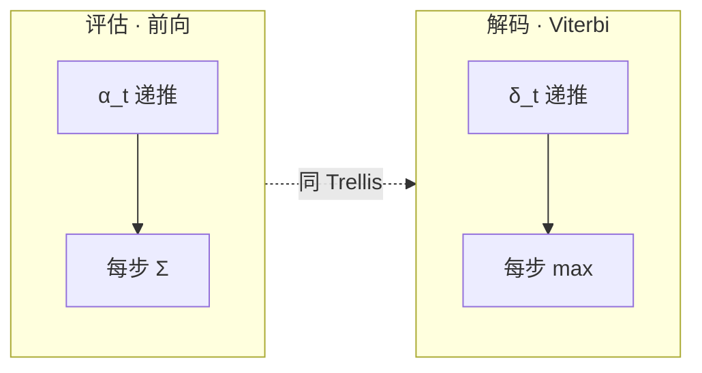

# Week 5–6 知识图谱（整合前置）

> **用途**：Agent 在撰写 `guides/AI-Week5-6-学习指南.md` **之前**必须先通读本文件 + 全部 `runs/latest/*.answer.md`。  
> **原始 run**：`notebooklm-raw/week5-6/runs/20260610-170247/`（22 批）  
> **生成日期**：2026-06-16

---

## 0. 通读审计摘要

| 项 | 结论 |
|----|------|
| 原始 batch 数 | **22/22 完成** |
| 与课纲一致性 | Week 5=HMM 五元组/三问题/前向→后向→Viterbi→Baum-Welch；Week 6=CRF/词嵌入/窗口 DL。**L0 将 Label Bias/CRF 写入 Week5 核心问题——整合时以课纲周次为准** |
| 素材覆盖缺口 | 无 Viterbi 手算 batch；`w56-study-order` 提及 CRF 结构化感知机增量学习但无独立 batch；`w6-to-rnn` 延伸至 Transformer——标「了解/预告」 |
| 必读 batch | `w5-hmm-five-tuple`、`w5-hmm-three-problems`、`w5-forward-algo`、`w5-viterbi`、`w5-baum-welch`、`w5-forward-numeric`、`w6-crf-intro`、`w6-hmm-vs-crf`、`w56-project`、`w56-mistakes` |

---

## 1. 读者认知阶梯（整合顺序 ≠ 采集顺序）

```mermaid
flowchart TB
    subgraph W34["Week 3-4 遗产"]
        BP[BP / Softmax+CE]
        CNN[CNN 自动特征]
    end

    subgraph L0["第 0 层：定位"]
        POS[L0-positioning]
        BR0[w56-bridge-w34]
    end

    subgraph L1["第 1 层：序列建模动机"]
        CHAL[w5-seq-challenges]
    end

    subgraph L2["第 2 层：HMM 形式化"]
        MK[w5-markov-hmm-intro]
        FT[w5-hmm-five-tuple]
        TP[w5-hmm-three-problems]
    end

    subgraph L3["第 3 层：HMM 三算法"]
        FWD[w5-forward-algo]
        BWD[w5-backward-algo]
        VIT[w5-viterbi]
        BW[w5-baum-welch]
    end

    subgraph L4["第 4 层：手算验证"]
        NUM[w5-forward-numeric]
    end

    subgraph L5["第 5 层：HMM→CRF"]
        GEN[w6-hmm-generative]
        CRFI[w6-crf-intro]
        FEAT[w6-crf-features]
        VS[w6-hmm-vs-crf]
    end

    subgraph L6["第 6 层：早期序列 DL"]
        EMB[w6-word-embedding]
        WIN[w6-window-network]
        LIM[w6-early-dl-limits]
    end

    subgraph L7["第 7 层：串联与应试"]
        RNN[w6-to-rnn]
        PJ[w56-project]
        MIST[w56-mistakes]
        ORDER[w56-study-order]
    end

    W34 --> L0 --> L1 --> L2 --> L3 --> L4 --> L5 --> L6 --> L7
```

**整合铁律**：三问题全景必须在任一算法公式之前；Label Bias 必须在 CRF 公式之前。

---

## 2. 节点清单

### 2.1 Week 5：HMM

| 节点 ID | 认知目标 | 原始 batch | Agent 须补充 |
|---------|---------|------------|-------------|
| `seq-challenges` | 列举序列三大难点 | `w5-seq-challenges` | 与静态分类对比 |
| `hmm-five-tuple` | 写出 λ=(S,O,π,A,B) | `w5-hmm-five-tuple` | 符号表 |
| `hmm-three-problems` | 评估/解码/学习对照 | `w5-hmm-three-problems` | **三问题核心表** |
| `forward-algo` | 手推 α 递推 O(N²T) | `w5-forward-algo` | Trellis 图 |
| `viterbi` | 手推 δ/ψ 回溯 | `w5-viterbi` | **指南须自补 tiny Viterbi 手算** |
| `baum-welch` | E/M 步直觉 | `w5-baum-welch` | γ=αβ 预告 |
| `forward-numeric` | 数字走通前向 | `w5-forward-numeric` | P(O\|λ)=0.132 完整表 |

### 2.2 Week 6：CRF 与早期 DL

| 节点 ID | 认知目标 | 原始 batch | Agent 须补充 |
|---------|---------|------------|-------------|
| `crf-intro` | P(Y\|X) 与全局归一化 | `w6-crf-intro` | 与 Softmax 类比 |
| `hmm-vs-crf` | 六维对比 | `w6-hmm-vs-crf` | **完整对比表** |
| `word-embedding` | one-hot→分布式 | `w6-word-embedding` | Word2Vec 直觉 |
| `window-network` | 窗口→FC→Softmax | `w6-window-network` | 与 Week3 BP 对照 |
| `early-dl-limits` | 三局限 | `w6-early-dl-limits` | 引出 RNN |

### 2.3 串联层

| 节点 ID | 认知目标 | 原始 batch |
|---------|---------|------------|
| `bridge-w34` | BP/CNN→序列五条衔接 | `w56-bridge-w34` |
| `project` | 手写 HMM/CRF/DL 要求 | `w56-project` |
| `mistakes` | 5 组易混 | `w56-mistakes` |
| `study-order` | 复习优先级 | `w56-study-order` |

---

## 3. 叙事承接表

| 指南章节 | 本节要回答 | 承接上节 | 引出下节 | raw |
|----------|-----------|---------|---------|-----|
| 模块定位 | Week5-6 干什么？ | Week3-4 | 序列三大难点 | `L0-positioning` |
| HMM 三问题 | 评估/解码/学习？ | 五元组 | 前向算法 | `w5-hmm-three-problems` |
| 前向算法 | P(O\|λ) 怎么算？ | 评估问题 | 后向/Viterbi | `w5-forward-algo` |
| Viterbi | 最优路径？ | Σ vs max | Baum-Welch | `w5-viterbi` |
| CRF 入门 | P(Y\|X) 怎么建？ | Label Bias | 特征函数 | `w6-crf-intro` |
| 词嵌入 | 分布式表征？ | CRF 特征工程痛 | 窗口网络 | `w6-word-embedding` |
| Project | 手写什么？ | 全模块 | 复习优先级 | `w56-project` |

---

## 4. batch → 指南映射

| batch | 建议指南位置 | 整合深度 |
|-------|-------------|---------|
| `w5-hmm-three-problems.answer.md` | §2.1-D | **完整对照表** |
| `w5-forward-numeric.answer.md` | §2.1-I 附录 | **完整数值** |
| `w6-hmm-vs-crf.answer.md` | §2.2-M | **完整 6 行表** |
| `w56-mistakes.answer.md` | §易错点 | **完整 5 组** |

---

## 5. 课纲审计

| 偏差项 | 整合建议 |
|--------|---------|
| L0 将 CRF 归入 Week5 | 以课纲 Week6 为准 |
| 无 Viterbi 手算 batch | Agent 自补 tiny 例 |
| `w6-to-rnn` 详述 Transformer | 标「了解/预告」 |

---

*下一步：撰写 `guides/AI-Week5-6-学习指南.md`*
