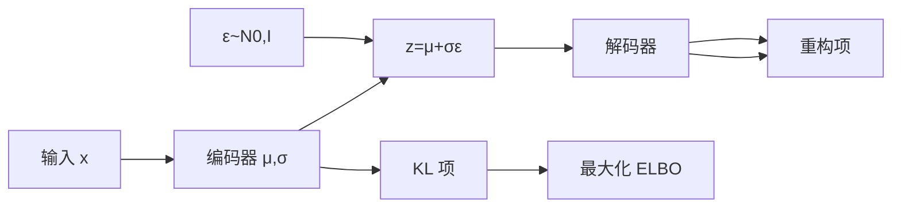

# Week 8 知识图谱（深度生成模型）

> **Canonical run**：`runs/20260616-124852/`（13/13）  
> **指南目标**：`guides/AI-Week8-学习指南.md`  
> **生成日期**：2026-06-16

---

## 0. 通读审计摘要

| 项 | 结论 |
|----|------|
| 原始 batch 数 | **13/13** |
| 与课纲一致性 | VAE/ELBO/重参数化/扩散/流匹配/GAN 全覆盖；**课堂以 VAE+ELBO 为轴** |
| 课纲偏差 | `w8-study-order`：课纲曾将「知识表示/不确定性」排 Week8，**实际授课为生成模型**（该块推后 Week13） |
| 必读 batch | `w8-generative-goal`、`w8-vae-elbo`、`w8-reparameterization`、`w8-diffusion`、`w8-gan`、`w8-model-compare` |

---

## 1. 读者认知阶梯

```mermaid
flowchart TB
    subgraph W67["Week 6-7 遗产"]
        DISC[判别式 P Y|X]
        CNN[CNN 特征提取]
    end

    subgraph L0["定位"]
        POS[L0-positioning]
        BR67[w8-bridge-w67]
    end

    subgraph L1["生成全景"]
        GOAL[w8-generative-goal<br/>P X / Z 紧致+可生成]
    end

    subgraph L2["VAE 核心链"]
        ELBO[w8-vae-elbo]
        COMP[w8-vae-compactness]
        REPARAM[w8-reparameterization]
    end

    subgraph L3["其他范式"]
        DIFF[w8-diffusion]
        FLOW[w8-flow-matching]
        GAN[w8-gan]
    end

    subgraph L4["串联"]
        CMP[w8-model-compare]
        MIST[w8-mistakes]
        BR10[w8-bridge-w10]
    end

    W67 --> L0 --> L1 --> L2 --> L3 --> L4
```



**整合铁律**：先 `generative-goal` 建立 P(X)/Z 双性质，再进 ELBO；扩散/GAN 在 VAE 链之后。

---

## 2. 节点清单

| 节点 ID | 认知目标 | batch | Agent 须补充 |
|---------|---------|-------|-------------|
| `gen-goal` | 为何学 P(X)；Z 紧致/可生成 | `w8-generative-goal` | 两性质互制约追问 |
| `vae-elbo` | ELBO 分解 | `w8-vae-elbo` | **符号表+推导摘要** |
| `reparam` | Z=μ+σε 可 BP | `w8-reparameterization` | 与 Week3 BP 衔接 |
| `diffusion` | 前向/反向去噪 | `w8-diffusion` | 分而治之 mermaid |
| `gan` | G/D 博弈 | `w8-gan` | 模式坍缩预警 |
| `model-compare` | 四模型对比 | `w8-model-compare` | **完整表格** |

---

## 3. 叙事承接表

| 指南章节 | 要回答 | 承接 | 引出 | raw |
|----------|--------|------|------|-----|
| 生成目标 | 为何 P(X)？ | W6-7 判别 | VAE 形式化 | `w8-generative-goal` |
| ELBO | 如何分解？ | Z 需可优化 | KL 必要性 | `w8-vae-elbo` |
| 重参数化 | 采样为何可导？ | ELBO 需采样 | 其他范式 | `w8-reparameterization` |
| 四模型对比 | 何时选哪种？ | 四范式已学 | W10 优化 | `w8-model-compare` |

---

## 4. batch 映射

| batch | 指南位置 | 深度 |
|-------|---------|------|
| `w8-vae-elbo.answer.md` | §2 VAE | **完整** |
| `w8-model-compare.answer.md` | §3.4 | **完整表** |
| `w8-mistakes.answer.md` | §5 | **5 组表** |
| `w8-flow-matching.answer.md` | §3.2 | 压缩；了解即可 |

---

## 5. 课纲审计

| 课纲条目 | raw | 备注 |
|---------|-----|------|
| VAE/ELBO/重参数化 | ✅ | 核心轴 |
| 扩散/流匹配/GAN | ✅ | 谱系扩展 |
| 知识表示排 Week8 | ⚠️ | **以课堂为准**，推后 Week13 |

---

*下一步：撰写 `guides/AI-Week8-学习指南.md`*
